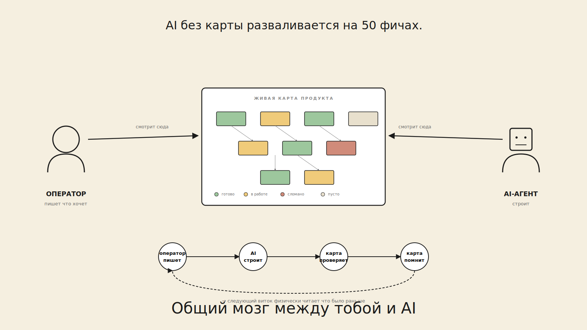

# Sima Atlas

> **Визуальная контракт-ориентированная разработка для AI-агентов.**
> Граф контрактов между тобой и Claude Code / Cursor / Codex — чтобы AI собирал именно то, что ты имел в виду; ты видишь что строится; дрейф ловится; уроки накапливаются между проектами.

[](https://github.com/neskuchny/sima_atlas/actions/workflows/verify.yml)
[](LICENSE)
[](https://github.com/neskuchny/sima_atlas/releases)
[](https://github.com/neskuchny/sima_atlas/stargazers)
[](https://claude.com/claude-code)

English: [README.md](README.md).

---

## Питч за 30 секунд

AI-агенты прекрасно работают на 5 файлах и разваливаются на 50 — галлюцинируют, дрейфуют, переделывают и жгут токены, потому что **у них нет контракта** на то, что должна делать каждая часть, и **нет графа** того, как части связаны. Sima Atlas — это **визуальный control plane**, который даёт им и то и другое: каждая фича — директория MD-контрактов, на канвасе видны связи, агенты получают context-pack под один блок, acceptance loop проверяет каждый запуск детерминистически — `pass / fail / inconclusive`, без silent false-pass.


## Демо

Два способа увидеть Sima в деле без установки:

- **Концептуальная картинка за 30 секунд** — что система делает, визуально:
  <a href="docs/hero-mockup.png"></a>
- **Живой UI** (скриншот выше) — `npm run dev` открывает в браузере на `http://localhost:8000/atlas_design/?client=example` с заполненным демо-клиентом, тыкаешь без написания единой строки контракта.
- **Press kit** с логотипом / hero-вариантами / слоганами / цифрами — [`docs/press/`](docs/press/).

## Vision — куда идём

**Где мы сейчас (v0.1):** ты пишешь контракты на канвасе, жмёшь `Claude Code`, агент читает контекст, пишет код, верификатор прогоняет, ты видишь verdict.

**Куда идём (v1.x → v2):**

- 🔄 **Двусторонняя синхронизация Sima ↔ агент** — канвас собирается *из* переписок Claude Code и обратно *в* них. Болтаешь с Claude в IDE про продукт; Sima вытаскивает блоки, заполняет mission, предлагает acceptance. Принял на канвасе — Claude в следующей задаче уже понимает контракт.
- 🤖 **Автономный кодинг-цикл** — когда контракты заполнены, Sima идёт по графу, спавнит агентов на `todo` блоки ночью, прогоняет acceptance, маркирует pass/rollback. Утром смотришь канвас — видно что собрано и где застряло.
- 🔍 **Live drift detection** — каждый запуск проверяется: остался в scope блока? Конфликтует с соседями? Нарушил `tech_stack.md` или `dont_use.json`? Drift получает цветной маркер на канвасе **до** commit'а.
- 💰 **Экономика токенов** — счётчики на сессию / блок / проект; cost vs. acceptance-rate; явный ROI «оплатил ли контракт сам себя».
- 🧠 **Память между проектами** — фреймворки, ссылки на код, архитектурные решения, выбор LLM, do-not-use баны накапливаются в `lessons.json`. Следующий проект auto-предлагает: «ты использовал Postgres + Prisma + zod последние 3 раза — продолжаем?» — никакого cold-start.
- 🎨 **Визуальный кодинг даже для vibe-кодеров** — можешь vibe-кодить, но *видишь сборку* живьём: какие блоки тронуты, какие edges сработали, где накапливается drift. Видимость не тормозит — она даёт делегировать уверенно.

Это не сейчас. Это траектория ближайших 12 месяцев. Полный аудит «что заявлено vs. что реально в коде» — в [Приложении А статьи](docs/article.ru.md).

## Quickstart (60 секунд)

```bash
git clone https://github.com/neskuchny/sima_atlas
cd sima_atlas
npm install
npm run dev
# → API на :8787 · UI на http://localhost:8000 · открывается demo
```

Откроется на `?client=example` — заполненный 5-блочный habit-tracker, чтобы canvas был живой. Переключайся через `?client=<your-id>`; Sima создаст `atlas/clients/<your-id>/` сама.

Клик по блоку → DetailPanel → редактируй `mission.md`, поставь acceptance, жми **Claude Code** — агент стартует. Или **✦ Sima → заполни всё по этой переписке**, вставь любой кусок диалога, прими предложенные блоки.

Подключение к твоему AI-агенту: см. [`docs/integrations.md`](docs/integrations.md). Claude Code подхватит `.mcp.json` автоматически; остальные — 5 строк конфига.

## С чем мы столкнулись пока строили — и как это решено

Это конкретные failure modes, на которые мы напоролись отгружая собственный продукт (Tessent) с AI-агентами. Каждый запустил отдельную фазу в этом репо. Они и есть причина существования Симы.

| Боль | Решение которое легло в код |
|---|---|
| **«Сказал агенту считать sentiment через LLM. Он написал regex. В следующей сессии вообще забыл указание.»** Архитектурное решение испаряется между диалогами потому что нет места его зафиксировать. | **Защита в три слоя** (R-7.76 → R-7.85). Project-level `architecture_decisions.md` (append-only, авто-инжектится в каждый prompt). Block-level `dont_use.json` / `always_use.json` с `severity:hard`. Post-run `scan_run_for_drift.mjs` сканирует реально изменённые файлы и **проваливает run** если hard-правило нарушено. Три слоя — потому что одного оказалось мало. |
| **«Агент третий раз переписал тот же парсер потому что не знал что он уже есть.»** Нет памяти о прошлых runs, нет нарратива «что пробовали / что сработало». | **Per-block memory layer** (R-7.76 → R-7.80). Каждый run дописывает в `narrative.md` (читаемое: *что пробовал / что сработало / что упало и почему / какие решения принял*) и `decisions.log` (структурный TSV). Оба грузятся в следующий prompt под «## ⚠ Block memory» — агент читает до того как трогать код. |
| **«Правишь блок А. Через 8 часов ночной sweep говорит что блок B сломан потому что от A зависел.»** Поломка распространяется молча часами. | **Cascade verify on edit** (R-7.84, S-8). После успешного run блока X — обход reverse-deps, перезапуск acceptance верификатора на каждом зависимом. Что сломалось получает `status: desync` на канвасе сразу + stack-trace-style запись в `narrative.md`. Оператор видит цепочку inline, не в 06:00. |
| **«Context-pack 12K токенов на однострочный UI-фикс.»** One-size-fits-all packs жгут бюджет и размывают signal-to-noise. | **Профили под тип задачи** (R-7.86, S-4). `design` (~5–15K, full pack) · `backend-fix` (~2–4K) · `ui-fix` (~1.5–3K, без deps) · `acceptance-only` (~0.5–1.5K, только верификатор). Architecture decisions всегда внутри, независимо от профиля. На `b.docs`: 5809 → 3701 → 2763 → 1846 токенов. |
| **«Гоняю агентов часами и не вижу куда уходят токены.»** Нет видимости какой `op` жрёт больше всего, нет «shadow bill» когда работаем на Claude.ai подписке. | **Token economics roll-up** (R-7.87, S-9). `atlas/llm_traces/*.json` агрегируется per block / op / provider / day. Две колонки cost: `cost_usd_actual` (что реально списано — 0 на `claude_cli`/`ollama`/`mock`) и `cost_usd_equivalent` (Anthropic Haiku 4.5 list price — стабильный shadow bill между провайдерами). Виден как Token Spend widget в Overview каждого блока + CLI roll-up. |
| **«Я заполнил блок или только mission? Надо тыкать пять вкладок чтобы понять.»** Нет at-a-glance fill-state по блоку. | **Implementation Status panel** (R-7.86). Overview tab открывается с 8-row dashboard: Mission · KPIs · Acceptance · Tasks · Files alive · Decisions logged · Run history · Block status. Каждая строка с маркером ✓ / ~ / ✗ / · — contract-vs-reality прогресс виден без кликов. |
| **«Агент молча упал в mock и отрапортовал успех.»** Inconclusive runs трактовались как pass. | **Tri-state acceptance** (`pass` / `fail` / `inconclusive`) с пятью evidence collectors (`exit_code`, `fs_glob`, `file_diff`, `log_grep`, `selftest_run`) + `llm_judge` как last resort. Inconclusive при отсутствии API key → никогда не silent green. |
| **«Новый контрибьютор склонировал, запустил `npm run dev`, увидел пустой UI потому что operator-profile JSON-ов не было.»** Bootstrap зависел от ручных шагов. | **Auto-seed at startup** (R-7.81). `dev_server.mjs` идемпотентно создаёт `operator_profile/{lessons,dont_use,always_use}.json` и `architecture_decisions.md` при первом запуске. У новых пользователей ноль ручной настройки. |

Паттерн: **каждый фикс закрывает реально вылезшую проблему**, не воображаемую. Если упёрся в одну из них и не видишь подходящего решения — [открой issue](https://github.com/neskuchny/sima_atlas/issues), так и приоритизируется следующая фаза.

## Jobs to be done — за чем нанимают Симу

Шесть джоб. Каждая называет failure mode который заменяет, и фичу которая её закрывает.

### Job 1 — «Хочу делегировать AI уверенно»

**Когда** строю продукт из > 10 фич
**Хочу** показать агенту одну фичу и уйти
**Чтобы** делегирование реально экономило время, а не создавало новый дебаг

- **Заменяет:** AI галлюцинирует / дрейфует / переделывает / молча врёт что готово
- **Sima даёт:** контракт на каждую фичу (mission + KPI + acceptance) · tri-state верификатор (`pass / fail / inconclusive` — никогда «молча зелёный») · drift scanner который проваливает run при hard-нарушении · cascade verify что метит сломанных соседей сразу

### Job 2 — «Хочу чтобы продукт жил вне моей головы»

**Когда** координирую AI-агентов (и возможно команду)
**Хочу** один общий вид что продукт делает и как фичи связаны
**Чтобы** все — я, AI, новый контрибьютор — стартовали с одного места

- **Заменяет:** продукт живёт в разрозненных чатах + устаревших `CLAUDE.md` + у меня в голове
- **Sima даёт:** визуальный канвас с live-контрактами · drill-down в подсистемы · мульти-проект `?client=<id>` · авто-WIKI / ТЗ / туториалы всегда в синке

### Job 3 — «Хочу чтобы архитектурные решения держались»

**Когда** говорю агенту «используй LLM а не regex», «Postgres а не Mongo», «JWT 15min refresh 30day»
**Хочу** чтобы это решение было в **каждом** будущем prompt-е по **каждой** фиче
**Чтобы** агент физически не мог его молча отменить

- **Заменяет:** AI забывает за сессию и переделывает уже отвергнутое
- **Sima даёт:** project-level append-only архитектурные решения авто-инжектятся в каждый prompt · per-block locked rules (severity:hard|soft) · post-run drift scanner который проваливает run при нарушении

### Job 4 — «Хочу видеть куда уходят время и деньги»

**Когда** гоняю агентов часами
**Хочу** видеть какая фича жрёт токены и сколько обошлось бы у каждого провайдера
**Чтобы** знать где оптимизировать и окупается ли делегирование

- **Заменяет:** черный ящик делегирования
- **Sima даёт:** Token Spend widget в каждом блоке · roll-up по фиче / op / провайдеру / дню · `cost_usd_actual` + `cost_usd_equivalent` (Anthropic shadow bill) · селектор окна

### Job 5 — «Хочу документацию как побочный продукт»

**Когда** отгружаю быстро
**Хочу** документацию которая остаётся актуальной без ручной поддержки
**Чтобы** новые контрибьюторы / агенты / future-я не читали устаревшее враньё

- **Заменяет:** документация дрейфует; либо я перестаю её писать, либо торможусь
- **Sima даёт:** auto-WIKI · auto-ТЗ по модулям · per-block end-user туториалы · architecture review modal — всё генерируется из той же карты на которой живёт код

### Job 6 — «Хочу учиться на прошлых ошибках без повторения»

**Когда** агент упал на фиче
**Хочу** этот урок в prompt-е следующей сессии
**Чтобы** каждая итерация была быстрее предыдущей

- **Заменяет:** холодный старт каждой сессии; один и тот же баг попробован 3 раза
- **Sima даёт:** per-block run history (что пробовал / что сработало / что упало / какие решения) авто-инжектится · operator-level lessons с накоплением evidence · code map перегенерируется per run

### Job 7 — «Хочу видеть какие файлы живые / мёртвые / мусор — и чтобы система предлагала чистку»

**Когда** проект растёт месяцами и файлы переименовываются / удаляются / забываются
**Хочу** явный per-feature манифест какие файлы реально используются + ночные предложения что архивировать
**Чтобы** код не зарастал мусором, агенты не читали устаревшие пути — но я ничего не терял из того что может пригодиться для будущих ТЗ

- **Заменяет:** «не помню что было в этой папке полгода назад»; агенты читающие orphaned файлы; устаревшие ссылки в WIKI; ручная уборка которую никто не делает
- **Sima даёт:** per-block file manifest с маркерами `[alive]` / `[dead]` / `[archived]` / `[pending]` · валидатор **проваливает CI** при пропавшем `[alive]` · счётчик «Files alive» в Implementation Status · file-state попадает в каждый context-pack · **ночной housekeeping sweeper** (R-7.88) предлагает чистки (stale-alive · stale-dead/archived · orphan code) — только предлагает, никогда не удаляет автоматически; apply tool **переносит в `archive/` с breadcrumb**, никаких `rm`; защищает все ТЗ / референсы / docs / блоки не в статусе `done` by design

## Обещали vs сделано — feature manifest


Каждый пункт исходной концепции — мэп на текущее состояние кода.

| функция | статус | как сделано |
|---|---|---|
| Визуальное конструирование схемы продукта | ✅ | React канвас · depth control (1/2/∞) · drill-down · anchor-edge · layer-aware блоки |
| Визуальная оценка состояния (статусы · связи · что готово / что нет) | ✅ | Implementation Status panel (8-row dashboard ✓/~/✗/·) · status-coded блоки · cascade `desync` маркеры · Token Spend widget |
| Схема + база для AI чтобы не забывал | ✅ | per-block memory layer (`narrative` + `decisions` авто-инжект) · project-level architecture decisions в каждый prompt по каждому блоку |
| Снижение токенов за счёт структуры | ✅ | 4 context-pack профиля (verified `5809 → 1846` токенов в зависимости от типа задачи) · skip-list учит агентов игнорить шум-директории |
| Принципы оператора → переиспользуемая библиотека | ✅ + 🟡 | per-project `lessons` + `dont_use` + `always_use` отгружены; cross-project transfer (W-1) в roadmap |
| Замкнутая автоматизация (схема + проверки + KPI + условия) | ✅ | acceptance loop · cascade verify on edit · drift scanner post-run · nightly прогоняет все валидаторы |
| Вызов разных инструментов (Claude / Cursor / Codex) — API + CLI | ✅ | 5-провайдерный LLM cascade · 3 agent-CLI dispatch · print-only fallback когда CLI отсутствует |
| Логи удач и провалов (чтобы не повторять) | ✅ | per-block `checks.log` + `narrative` + `decisions` · каждый LLM-вызов трейсится в `atlas/llm_traces/` с provider + token + cost (gitignored — копится по мере использования) |
| Без хаоса в коде / меньше галлюцинаций / не забывать главное | ✅ | защита в три слоя: arch decisions авто-инжект + drift scanner + cascade verify |
| Авто-WIKI по всему проекту | ✅ | `generate_wiki.mjs` · mermaid-граф · секции по слоям · HTML рендер |
| Авто-ТЗ по отдельным модулям | ✅ | `generate_tz_from_atlas.mjs` (перегенерён 2026-05-09) — берёт mission + tasks по каждому блоку |
| Авто-туториалы (как пользоваться, возможности, ограничения) | 🟡 | `generate_user_docs.mjs` plumbing работает; качество вывода зависит от LLM-провайдера — `claude_cli` headless иногда путается, для production-качества рекомендуется Anthropic API |
| Внешнечитаемая документация (чтобы другие поняли проект) | ✅ | README EN+RU · 7 user-facing docs (architecture · getting-started · troubleshooting · integrations · article · agent-navigation) |
| Vibe-coding инструменты (consultations + синхронизация) | ✅ | ✦ Sima fill-from-chat · ✏ Rewrite · ✨ Expand · Architecture review modal · Claude advice кнопка |
| Чистка кода — схема alive / dead / archived **+ ночные предложения** | ✅ | per-block `files.md` · `validate_files_registry.mjs` (фейлит CI на пропавший `[alive]`) · file-state в context-pack и Implementation Status · **R-7.88 housekeeping sweeper предлагает (никогда не применяет) чистки; apply tool переносит в архив с breadcrumb, не удаляет; safety rails защищают ТЗ / refs / non-`done` блоки** · текущий счёт: file states tracked per block (alive · archived · dead · pending) |

**Итог: 14 ✅ полностью отгружено · 1 🟡 частично (качество авто-туториалов) · 1 ✅+🟡 частично (cross-project библиотека — локально работает, transfer запланирован).**

## Что меняется на практике

- **Меньше переделок.** Агент видит контракт, идёт сразу куда надо. Переделки стоят 2–4× первого запроса; контракт-first их режет.
- **Меньше галлюцинаций.** Когда модель знает что должна делать — пространство «правдоподобных, но неверных» ответов резко сужается. Acceptance loop ловит просочившееся.
- **Путь к автономной разработке.** Граф + контракты + acceptance + lessons — фундамент для любого уровня автономии (от «спрашивай человека на гейте» до «работай ночью сам»).
- **Документация — побочный продукт.** WIKI / ТЗ / туториалы / маркетинг-копи генерируются из того же графа.
- **Память между проектами.** Архитектурные решения и lessons из одного проекта — стартовый набор для следующего.

## Roadmap

Маркеры: ✅ done, 🟡 partial, ⬜ planned.

### Сейчас — фундамент (v0.1, отгружено)
- ✅ **R-1..R-7** — visual canvas, contract loading, MCP tools, 5-провайдерный LLM cascade, sima-fill-from-chat orchestrator, chat watcher, layer-aware blocks, real submodule hierarchy, depth-control canvas, agent-navigation skill, EN-first i18n, Overview с live contract data, auto-arrange по слоям
- ✅ **R-7.76..R-7.81** — per-block memory layer end-to-end (`narrative.md` + `decisions.log` + operator-locked `dont_use`/`always_use`/`lessons.json`, авто-инжект в каждый prompt, auto-seed при старте)
- ✅ **R-7.82 (S-3)** — runtime content drift scanner: сканирует изменённые файлы post-run против `dont_use`; hard-нарушения проваливают run
- ✅ **R-7.83** — agent-navigation skill / Cursor rule / AGENTS.md обновлены, обучают новый memory layer
- ✅ **R-7.84 (S-8)** — cross-block break detection on edit: `cascade_verify` обходит reverse-deps после успешного run, авто-помечает сломанные `status: desync` со stack-trace-style записями в narrative
- ✅ **R-7.85 (S-6)** — `architecture_decisions.md` append-only project lock-in, авто-инжектится в каждый prompt по всем блокам
- ✅ **R-7.86 (S-4)** — context-pack профили (`design` / `backend-fix` / `ui-fix` / `acceptance-only`) + Implementation Status dashboard в Overview
- ✅ **R-7.87 (S-9)** — token economics aggregator: actual cost + Anthropic Haiku 4.5 «shadow bill» equivalent + per-op / per-provider / daily breakdown, как MCP tool + Token Spend widget

### Следующее — закрываем цикл (v0.5 → v0.9, Q4 2026)
- ✅ **S-1** — шаблоны блоков (auth / payments / search / ingestion / billing): drop-in production-shaped стартовые контракты (mission + KPI + acceptance + depends_on + provides + tasks). Применяются через `apply_block_template` (MCP/CLI). Acceptance стартует КРАСНЫМ — verifiable definition of done (R-7.90)
- ✅ **S-10** — селектор context-pack профиля при старте run-а, прямо под кнопками агентов (design / backend-fix / ui-fix / acceptance-only) (R-7.90)
- ✅ **S-11** — cross-block roll-up в Implementation Status: бар «Subsystem progress» + разбивка по статусам + кликабельные дочерние блоки когда у блока есть дети (R-7.90)
- 🟡 **S-7** — транзакционные change-set'ы для cross-cutting изменений (REST→GraphQL, переименование capability, миграция БД): **MVP отгружен (R-7.92)** — `scripts/change_set.mjs` + MCP `change_set_create/status/commit/list`. Группирует блоки одного изменения; acceptance трактуется как ЕДИНИЦА; `commit` запрещён пока все члены не зелёные (нет half-migrated torn-состояния); `rollback` аннотирует narrative каждого члена. Follow-up: UI-бейдж «N блоков затронуто транзакцией T» на канвасе.
- ✅ **S-9.1** — global Token Economics tab в System Docs модале: project-wide totals, sparkline дневных расходов, top ops / top blocks / by-provider, селектор окна. `cost_usd_equivalent` shadow bill (R-7.92)
- 🟡 **S-12** — housekeeping sweeper: **MVP отгружен (R-7.88)** — предлагает чистки stale-alive / stale-dead / stale-archived / orphan-code в nightly. Follow-ups: import-graph детектор мёртвого кода (файл лежит, никто не импортирует), time-based архивные подсказки (нет коммитов 90 дней → soft hint в архив), вкладка Cleanup в UI для one-click apply

### Среднесрок — collaboration + локальные модели (v0.6 → v0.9, Q4 2026)
- ⬜ **T-1** — multi-operator collaboration с CRDT-merge контрактов
- 🟡 **U-1** — локальные модели (Ollama есть с R-7.60; vLLM / LM Studio — open issues)
- ⬜ **U-2** — `Sima Shell` — лёгкий MCP-клиент под локальные модели
- ⬜ **U-3** — Continue / Aider / Zed-AI MCP интеграции

### Vision — автономный цикл + накопительная память (v1.x → v2, 2027+)
- 🟡 **V-1** — **agent-loop daemon**: **MVP отгружен (R-7.91)** — `scripts/agent_loop_daemon.mjs` обходит граф, берёт следующий runnable-блок (deps done · реальная mission · ≥1 детерминированный acceptance), спавнит свежего агента, верифицирует, и продвигает на один gated-шаг ТОЛЬКО если verifier pass И ни один ранее-зелёный `done` блок не регрессировал (`verify_done_blocks_still_green`). Ralph-loop форма: прогресс на диске, каждый блок — свежий агент. Guards: по умолчанию `print-only` (планирует+верифицирует, без реального агента пока не `--agent claude`), budget cap, circuit breaker, `--dry-run`, max-iterations. Пишет Autonomous Run отчёт. Follow-ups: Canvas-виджет очереди, auto-rollback-on-red (revert через `history/`), ночной триггер по расписанию.
- ⬜ **V-2** — one-click deploy с тем же acceptance в проде
- ⬜ **V-3** — **production-monitor**: ловит unknown-unknowns в проде и поднимает их обратно в граф как новые acceptance assertions
- ⬜ **W-1** — **cross-project pattern transfer**: lessons из одного проекта обогащают следующий
- ⬜ **W-2** — batch mode: 10 проектов параллельно под одним dashboard
- ⬜ **W-3** — community archetypes: shared operator profiles (vibe-coding novice / mid-stage startup / enterprise)

### Не будем чинить
- ❌ Hard lifecycle gates по умолчанию — сломали бы draft-итерацию. Оставлены soft с явными подсказками.

## Для кого

Лучший тест чем «подходит ли мне» — **«упёрся ли я хоть в одну из этих стен?»**:

- **Solo-разработчики с продуктом из > 10 фич.** Упёрся в потолок где агент забывает что собрал на прошлой неделе, переписывает существующее, прожигает сессии дебаггингом собственного дрейфа. → Memory layer + cascade verify + Implementation Status сообщают тебе и агенту что уже есть.
- **Vibe-кодеры которые хотят *видеть* что AI строит.** Любишь делегировать но хочется канвас, не console flood. → Visual canvas + Overview + Token Spend widget без процессного бремени.
- **AI-coding команды (2+ человека + агенты).** Отгружаете быстрее чем держите контракты в голове; коллегам не понятно что агенту разрешено трогать в их зоне. → Общий `architecture_decisions.md` + per-block `dont_use` + sync-check останавливают cross-team спотыкания.
- **Multi-product операторы / агентства.** Несколько продуктов параллельно; хотите одну ментальную модель «жив ли каждый проект» без открытия 5 IDE. → Multi-tenant `atlas/clients/<id>/` + auto-generated WIKI/Roadmap на клиента.
- **Исследователи AI-coding эффективности.** Нужны сравнимые runs между провайдерами и моделями с детерминистическим evidence pass/fail. → Token traces + tri-state acceptance + `cost_usd_equivalent` shadow-bill делают A/B сравнимым между `claude_cli` / `anthropic` / `google` / `ollama`.

**Кому это пока НЕ подходит:**

- Single-file скрипты — overhead контракта не окупается ниже ~5 блоков.
- Mission-critical коммерческие deployments — early but live; используем ежедневно для своих продуктов, не рекомендуем для систем «которые не должны падать».
- Команды которым нужны hard lifecycle gates по умолчанию — Sima держит gates *soft* с явными visible hints чтобы сохранить скорость draft-итерации (см. Article Appendix B.2).

## Полная методология

[docs/article.ru.md](docs/article.ru.md) — 11 частей + 2 приложения, включая self-audit каждого утверждения против кода.

## Документация

| Файл | Что это |
|---|---|
| [`docs/getting-started.ru.md`](docs/getting-started.ru.md) | Onboarding — от клона до первого агентского run-а за 15 минут |
| [`docs/architecture.md`](docs/architecture.md) | Системная диаграмма, HTTP API, MCP-tools, run FSM |
| [`docs/agent-navigation.md`](docs/agent-navigation.md) | Как агентам ходить по этому репо (Claude Skills + Cursor Rules + AGENTS.md) |
| [`docs/integrations.md`](docs/integrations.md) | Подключение к Claude Code / Cursor / Codex / Continue / Zed / Windsurf / Antigravity / Ollama |
| [`docs/troubleshooting.md`](docs/troubleshooting.md) | Реальные failure modes из R-7.X дебагов |
| [`CHANGELOG.md`](CHANGELOG.md) | Per-phase change log |
| [`CLAUDE.md`](CLAUDE.md) | Контракт для AI-агентов в этом репо |

## Что мы ждём от сообщества (top-6)

1. **Local-model adapters** — vLLM / LM Studio / llama.cpp (~80 строк, mirror Ollama pattern)
2. **Block templates** — auth / payments / search / ingestion / billing
3. **VS Code extension features** — status badges, inline editing, run-block buttons (0.1 scaffold в [`extensions/vscode/`](extensions/vscode/))
4. **Token-economics dashboard (S-9)** — instrument llm_gateway.mjs + render panel
5. **Evidence collectors** — `http_status`, `json_shape_match`, `snapshot_diff`, `lighthouse_score`
6. **Native MCP клиенты** для IDE которых пока нет

Открывай issue, начинай discussion, шли PR. Обычно отвечаем в течение 48 часов.

---

MIT, [LICENSE](LICENSE). Разработано в **Synlabs**. Maintainer — Anton Kalabukhov + контрибьюторы. Изначально выделено из нашего основного продукта **Tessent**, чтобы *концепция* контракт-first AI-разработки дошла до рынка — независимо от конкретной реализации.
