# Sima Atlas Wiki

_Auto-generated: 2026-05-09T14:49:23.200Z_

## Граф продукта

```mermaid
flowchart TB
  classDef done    fill:#dcfce7,stroke:#16a34a,color:#15803d;
  classDef wip     fill:#fef3c7,stroke:#ca8a04,color:#a16207;
  classDef review  fill:#dbeafe,stroke:#2563eb,color:#1d4ed8;
  classDef idea    fill:#f3f4f6,stroke:#6b7280,color:#374151;
  classDef broken  fill:#fee2e2,stroke:#dc2626,color:#b91c1c;
  classDef drift   fill:#fae8ff,stroke:#a21caf,color:#86198f;
  subgraph front["Фронтенд"]
    b_ui_control["UI Control Plane<br/><small>wip</small>"]:::wip
    b_product_dashboard["Dashboard<br/><small>idea</small>"]:::idea
  end
  subgraph logic["Логика / бэкенд"]
    b_core_sync["Sync Engine<br/><small>done</small>"]:::done
    b_product_auth["Auth<br/><small>idea</small>"]:::idea
    b_product_ingest["Ingest<br/><small>idea</small>"]:::idea
    b_product_billing["Billing<br/><small>idea</small>"]:::idea
    b_block_1["Новый модуль<br/><small>idea</small>"]:::idea
    b_block_2["Новый модуль<br/><small>idea</small>"]:::idea
  end
  subgraph ai["ИИ / агенты"]
    b_agent_orchestrator["Agent Orchestrator<br/><small>review</small>"]:::review
    b_llm_gateway["LLM Gateway<br/><small>review</small>"]:::review
    b_operator_profile_learner["Operator Profile Learner<br/><small>idea</small>"]:::idea
  end
  subgraph data["Данные / хранилище"]
    b_db["Atlas Database<br/><small>idea</small>"]:::idea
    b_product_warehouse["Warehouse<br/><small>idea</small>"]:::idea
  end
  subgraph content["Контент / документация"]
    b_docs["Docs Builder<br/><small>wip</small>"]:::wip
    b_user_docs_generator["End-User Docs Generator<br/><small>idea</small>"]:::idea
  end
  subgraph testing["Тестирование"]
    b_acceptance_verifier_loop["Acceptance Verifier Loop<br/><small>idea</small>"]:::idea
    b_smoke_sandbox["Smoke Sandbox (test target)<br/><small>idea</small>"]:::idea
  end
  b_ui_control --> b_core_sync
  b_ui_control --> b_agent_orchestrator
  b_core_sync --> b_db
  b_agent_orchestrator --> b_db
  b_agent_orchestrator --> b_core_sync
  b_agent_orchestrator --> b_llm_gateway
  b_docs --> b_db
  b_docs --> b_core_sync
  b_operator_profile_learner --> b_db
  b_operator_profile_learner --> b_core_sync
  b_operator_profile_learner --> b_agent_orchestrator
  b_operator_profile_learner --> b_llm_gateway
  b_operator_profile_learner --> b_docs
  b_acceptance_verifier_loop --> b_db
  b_acceptance_verifier_loop --> b_core_sync
  b_acceptance_verifier_loop --> b_agent_orchestrator
  b_acceptance_verifier_loop --> b_llm_gateway
  b_user_docs_generator --> b_db
  b_user_docs_generator --> b_docs
  b_user_docs_generator --> b_agent_orchestrator
  b_user_docs_generator --> b_llm_gateway
  b_product_auth --> b_product_dashboard_session_check
  b_product_auth --> b_product_ingest_api_key_check
  b_product_ingest --> b_product_warehouse_events_stream
  b_product_dashboard --> b_product_warehouse_metric_query
```



## Слои

### Фронтенд (`front`)

- 🟠 **b.ui-control** — UI Control Plane _(wip)_
  - reason: HTML loses references to components.jsx/sidecol.jsx/canvas_tools.jsx — UI does not boot in production; multi-layer rendering depends on PR2 (this PR)
- 🟡 **b.product-dashboard** — Dashboard _(idea)_
  - reason: Created via design UI at 2026-05-05T20:57:52.242Z

### Логика / бэкенд (`logic`)

- 🟢 **b.core-sync** — Sync Engine _(done)_
  - reason: syncCheck only validates file presence, not mission/KPI semantics
- 🟡 **b.product-auth** — Auth _(idea)_
  - reason: Created via design UI at 2026-05-05T20:57:52.201Z
- 🟡 **b.product-ingest** — Ingest _(idea)_
  - reason: Created via design UI at 2026-05-05T20:57:52.212Z
- 🟡 **b.product-billing** — Billing _(idea)_
  - reason: Created via design UI at 2026-05-05T20:57:52.257Z
- 🟡 **b.block-1** — Новый модуль _(idea)_
  - reason: Created via design UI at 2026-05-05T20:58:12.722Z
- 🟡 **b.block-2** — Новый модуль _(idea)_
  - reason: Created via design UI at 2026-05-07T16:27:02.089Z

### ИИ / агенты (`ai`)

- 🔵 **b.agent-orchestrator** — Agent Orchestrator _(review)_
  - reason: PR4: .cursor/hooks.json now uses valid Cursor events (beforeSubmitPrompt/afterFileEdit/beforeShellExecution/stop) wired to real action scripts. Cursor edits write to checks.log of the right block via files.md mapping. Drift guard rejects pip/yarn-add-vue/etc. inject_context_pack provides per-block context. Live Cursor wiring (real env vars) needs UI test (PR4.5).
- 🔵 **b.llm-gateway** — LLM Gateway _(review)_
  - reason: PR3: gateway implemented (Anthropic + Google + mock), structured output via JSON schema, trace+cost cap, golden eval avg 1.0 in mock. Review needed: live providers untested without keys; UI confidence/diff flow pending PR3.5.
- 🟡 **b.operator-profile-learner** — Operator Profile Learner _(idea)_
  - reason: PR-Backlog: design-only milestone; one of the LAST PRs. Реальная имплементация (PR-1…PR-6) делается после того, как реальный пользователь пройдёт ≥10 done и накопит данные — иначе наблюдать нечего. Сейчас зарегистрирован как карта будущей работы.

### Данные / хранилище (`data`)

- 🟡 **b.db** — Atlas Database _(idea)_
  - reason: Storage is markdown + localStorage; no real DB layer yet
- 🟡 **b.product-warehouse** — Warehouse _(idea)_
  - reason: Created via design UI at 2026-05-05T20:57:52.230Z

### Контент / документация (`content`)

- 🟠 **b.docs** — Docs Builder _(wip)_
  - reason: Generators run but feed on template missions; needs layer-aware wiki and mermaid (PR2)
- 🟡 **b.user-docs-generator** — End-User Docs Generator _(idea)_
  - reason: PR-Backlog: design-only milestone. Closes the end-user tutorial gap — Атлас сам пишет UI блоков, значит знает все кнопки и поля; этот блок генерирует 'как пользоваться' markdown для конечного пользователя продукта (не developer wiki — это делает b.docs). Auto-regen на каждое изменение JSX. 3-4 PR breakdown.

### Тестирование (`testing`)

- 🟡 **b.acceptance-verifier-loop** — Acceptance Verifier Loop _(idea)_
  - reason: PR-Backlog: design-only milestone. Closes the verification gap (Symphony trusts agent output, Hermes has no contract layer). После любого run_block_implementation проверяет каждый пункт acceptance.md через детерминированные collectors (exit_code/fs_glob/file_diff/log_grep) + LLM-judge fallback; блокирует wip→done если verdict !== pass. 5-PR breakdown.
- 🟡 **b.smoke-sandbox** — Smoke Sandbox (test target) _(idea)_
  - reason: Reserved write-target for e2e/smoke scripts so they never touch real product blocks

## Блоки

### 🟠 b.ui-control — UI Control Plane

- **layer**: `front`
- **type**: module
- **status**: `wip` — HTML loses references to components.jsx/sidecol.jsx/canvas_tools.jsx — UI does not boot in production; multi-layer rendering depends on PR2 (this PR)
- **mvp**: yes
- **depends_on**: `b.core-sync`, `b.agent-orchestrator`
- **tech_stack**: `react`, `babel-standalone`
- **files**: 17 (`atlas/blocks/b.ui-control/files.md`)

# b.ui-control — mission

Визуальная control plane Симы: один React-канвас, в котором человек видит схему продукта (слои, блоки, связи), статус каждого блока (idea/wip/review/done/broken/drift), запускает действия по блоку (Implement / Review / Done / Rollback / mark-dead) и собирает context-pack для агента.

Главное назначение — заменить чтение кода и переключение между чатами Cursor/Claude/Codex на одну визуальную карту, где видно: что сделано, что сломано, что синхронизировано с миссией продукта, что нет.

## Scope
- 4 layer switcher (Канвас источников / Карта продукта / ТЗ / Реализация) + Галерея.
- Архитектурный канвас (горизонтальные слои, блоки с портами, типизированные связи, drag&drop).
- Inspector блока: mission/kpi/tasks/checks, кнопки lifecycle, экспорт context-pack.
- Подсветка рассинхрона и broken/drift-фильтры.

## Out of scope (для PR1)
- LLM-вызовы из UI (PR3).
- Watcher событий Cursor (PR4).

#### KPI

# b.ui-control — KPI

- **KPI-1 (boot)**: HTML-страница `frontend/Сима - универсальный конструктор.html` открывается в браузере без ошибок в консоли (всё React-дерево рендерится). Сейчас: ✗ (часть JSX не подключена).
- **KPI-2 (multi-layer)**: канвас рисует не менее 5 горизонтальных слоёв из `ARCH_LAYERS`, и блоки распределены по этим слоям по полю `layer`. Сейчас: ✗ (графа без поля `layer`, всё валится в один контейнер).
- **KPI-3 (sync visibility)**: при `syncCheck` блоки со статусом drift/broken визуально подсвечиваются на канвасе с причиной из `syncReport.details`. Сейчас: △ (логика есть в `atlas_sync.js`, но завязана только на наличие файлов).
- **KPI-4 (lifecycle gating)**: кнопка Done на блоке заблокирована, пока не пройдены acceptance + kpi проверки. Сейчас: ✓ (логика `isReadyToDone` в `app_v2.jsx`).
- **KPI-5 (context-pack export)**: для выбранного блока копируется в буфер deterministic JSON со всеми ссылками на mission/kpi/depends/provides. Сейчас: ✓ для UI-кнопки, файл-output генерируется через `scripts/build_context_pack.mjs`.

#### Acceptance

# b.ui-control — acceptance

Блок переходит в `done` только когда:

- [ ] **A1.** HTML открывается в браузере и `<div id="root">` заполнен (smoke-тест: `headless run` грузит страницу, ловит `error`-события, ждёт что DOM содержит `.l2-top` и `.workarea`).
- [ ] **A2.** Все JSX-зависимости `app_v2.jsx` подгружены (нет `useTweaks/SourcePalette/CanvasInspector is not defined` в консоли).
- [ ] **A3.** При выбранном проекте `atlas-live` канвас архитектуры рисует ≥ 3 горизонтальных слоя; в каждом слое — корректные блоки из `graph.json` по полю `layer` (зависит от PR2).
- [ ] **A4.** Sync-check на 5 блоках возвращает либо ok, либо drift с конкретной причиной (`status_reason`) — без ложных «всё зелёное».
```yaml
evidence_kind: exit_code
evidence_spec:
  cmd: node scripts/validate_block_contracts.mjs
  expect_in_stdout: "OK"
```
- [ ] **A5.** Кнопка Done заблокирована, если `acceptance` чек-листа блока не отмечены полностью И в `checks.log` нет `acceptance pass` + `kpi pass`.
```yaml
evidence_kind: log_grep
evidence_spec:
  file: scripts/log_transition.mjs
  pattern: "verdict !== 'pass'"
```

## Не считается acceptance:
- наличие файлов;
- прохождение `validate_block_contracts.mjs` (это контрактный gate, не приёмка);
- генерация `wiki.html` (это `b.docs`).

---

### 🟢 b.core-sync — Sync Engine

- **layer**: `logic`
- **type**: module
- **status**: `done` — syncCheck only validates file presence, not mission/KPI semantics
- **mvp**: yes
- **depends_on**: `b.db`
- **tech_stack**: `nodejs`, `esm`, `typescript`, `fastify`, `zod`, `drizzle-orm`, `sqlite`, `session-cookies`, `pino`, `vitest`
- **files**: 8 (`atlas/blocks/b.core-sync/files.md`)

# b.core-sync — mission

Sync Engine — движок проверки синхронизации блоков продукта с миссией, KPI, стэком и кодом. Главная задача — детектить «рассинхрон»: код пишется в одном фреймворке, ТЗ говорит про другой; блок A объявляет, что зависит от capability X у блока B, а B такой capability не предоставляет; KPI задан, но в `checks.log` нет ни одной измеренной записи.

Текущая реализация (`frontend/atlas_sync.js` + `scripts/validate_*`) — каркас: проверяет наличие файлов, подсчитывает прогресс tasks/KPI, сравнивает `depends_on/provides`. Этого недостаточно для миссии «решить рассинхрон» — нужно семантическое сопоставление миссии блока с реализацией (требует LLM, PR3) и реальный анализ кода (PR4).

## Layer
logic

## Что должен делать в done-версии (роадмап)
1. Структурный sync (PR2): contract-валидация графа, layer/depends/provides консистентность.
2. Семантический sync (PR3): LLM проверяет `code(impl) ↔ mission/kpi блока`, выдаёт `drift_reason`.
3. Реальный sync с кодом (PR4): на каждый `git diff` сопоставляет изменённые файлы с `files.md` блоков и логирует факт изменения в `checks.log`.

## Out of scope
- Генерация документации (это `b.docs`).
- UI-визуализация sync-репорта (это `b.ui-control`).

#### KPI

# b.core-sync — KPI

- **KPI-1 (contract sync)**: для каждого блока `X` с `depends_on: [{ block_id: Y, capability: C }]` проверяется, что `Y.provides` содержит `C`. Если нет — `drift_reason="missing_capability"`. Сейчас: △ (есть `validate_dependency_contracts.mjs`, но capability-формат пока строковый).
- **KPI-2 (stack sync)**: каждое заявленное `tech_stack` блока (frontend/backend) подтверждается реальным импортом / зависимостью в `files.md` блока. Сейчас: ✗ (`files.md` пустой у всех блоков).
- **KPI-3 (semantic sync)** [PR3]: LLM сравнивает `mission.md ↔ checks.log + tasks.md` и возвращает `is_consistent: bool, reasons: []`. Цель — `precision >= 0.8` на golden set из 10 блоков. Сейчас: ✗.
- **KPI-4 (false-positive rate)**: при двух прогонах syncCheck без изменений отчёт идентичен (нет случайных drift-flag). Сейчас: ✓ (детерминирован).
- **KPI-5 (latency)**: `runSyncWithChecks` отрабатывает за < 500 ms на 20 блоках. Сейчас: ✓ (≈ 50 ms на 5 блоках).

#### Acceptance

# b.core-sync — acceptance

- [ ] **A1.** На пустом графе с одним блоком без зависимостей syncCheck возвращает `synchronized: 1, drift: 0, broken: 0`.
```yaml
evidence_kind: selftest_run
evidence_spec:
  cmd: node tests/atlas_sync.selftest.mjs
  expect_in_stdout: "OK"
```
- [ ] **A2.** Если блок A заявляет `depends_on: [{block_id: B, capability: foo}]`, а у B нет `provides: [foo]`, syncCheck возвращает `broken` с `reason: missing_capability(B.foo)`.
```yaml
evidence_kind: exit_code
evidence_spec:
  cmd: node scripts/validate_dependency_contracts.mjs
  expect_in_stdout: "OK"
```
- [ ] **A3.** Если блок имеет `tech_stack: [react]`, а в `files.md` указан `.py`-файл — syncCheck возвращает `drift` с `reason: stack_mismatch`.
- [ ] **A4.** [PR3] LLM-семантический gate: блок с миссией «принимает платежи через Stripe» и реализацией без `stripe`-импорта в `files.md` помечается `drift` с `reason: mission_implementation_mismatch`.
- [ ] **A5.** Все детектированные drift/broken попадают в `atlas/sync_report.json` со ссылкой на конкретный файл/строку (для UI).
```yaml
evidence_kind: exit_code
evidence_spec:
  cmd: node scripts/validate_block_contracts.mjs
  expect_in_stdout: "OK"
```

## Не считается acceptance:
- наличие `mission.md` (это контрактный gate).
- факт того, что `runSync` не упал (это smoke).

---

### 🟡 b.db — Atlas Database

- **layer**: `data`
- **type**: module
- **status**: `idea` — Storage is markdown + localStorage; no real DB layer yet
- **mvp**: yes
- **tech_stack**: `filesystem`, `json`, `markdown`
- **files**: 11 (`atlas/blocks/b.db/files.md`)

# b.db — mission

Atlas storage слой: единый источник правды для графа продукта (`graph.json`), блоков (`blocks/<id>/*.md`), очереди ingestion (`ingestion_queue.jsonl`), журналов transitions/decisions/checks. Цель — предоставить детерминированный API для чтения/записи без дрейфа.

В MVP — это plain markdown + JSON файлы на диске + localStorage-кеш на клиенте через `atlas_sync.js`. В production-варианте — миграция на SQLite или Postgres с тем же файловым API через MCP-сервер (атомарность, версии, multi-tenant).

## Layer
data

## Что должен делать в done-версии
1. Атомарные write-операции (block update = single transaction, не оставляем half-written файлы при сбое).
2. Версионирование блока: каждое изменение mission/kpi/depends/provides пишется в `history/<timestamp>.diff`.
3. Migration runner: если схема `graph.json` меняется (как в PR2 при добавлении `layer/type/mvp`), мигратор обновляет старые блоки.
4. Read-API: `getBlock(id)`, `listBlocks(filter)`, `getDependencies(id)`, `getHistory(id)` — единый интерфейс для UI и MCP.

## Out of scope
- Векторный поиск (это backup-память, не основная).
- Multi-project namespacing (PR в стек после PR4).

#### KPI

# b.db — KPI

- **KPI-1 (atomicity)**: при kill -9 во время `update_block` файлы блока остаются в консистентном состоянии (либо все изменения применены, либо ни одного). Сейчас: ✗ (нет atomic-write через rename).
- **KPI-2 (history)**: каждый `transition_block` и `update_block` создаёт запись в `atlas/transitions.log` с before/after. Сейчас: ✓ (`scripts/log_transition.mjs`).
- **KPI-3 (versioning)**: при `update_block` старая версия mission/kpi сохраняется в `blocks/<id>/history/<timestamp>.md`. Сейчас: ✗ (history-папок нет).
- **KPI-4 (read-API)**: MCP tool `read_block` возвращает все *.md и *.log одной операцией < 50 ms. Сейчас: ✓.
- **KPI-5 (migration)**: при изменении схемы graph.json есть `scripts/migrate_<from>_<to>.mjs` и nightly его прогоняет. Сейчас: ✗ (миграции нет).

#### Acceptance

# b.db — acceptance

- [ ] **A1.** Smoke: 100 параллельных `update_block` с kill -9 в случайные моменты — после восстановления `validate_block_contracts.mjs` проходит на всех затронутых блоках.
```yaml
evidence_kind: exit_code
evidence_spec:
  cmd: node scripts/validate_block_contracts.mjs
  expect_in_stdout: "OK"
```
- [ ] **A2.** `scripts/get_block_history.mjs <block_id>` возвращает не менее 2 записей после двух последовательных `update_block`.
```yaml
evidence_kind: fs_glob
evidence_spec:
  pattern: atlas/transitions.log
  min_count: 1
```
- [ ] **A3.** При попытке записать `graph.json` со схемой, не совпадающей с `atlas/db_schema.json`, операция отклоняется с понятной ошибкой.
```yaml
evidence_kind: fs_glob
evidence_spec:
  pattern: atlas/db_schema.json
  min_count: 1
```
- [ ] **A4.** Migration: запуск `scripts/migrate_v1_v2.mjs` на старом `graph.json` v1 даёт валидный v2 без потерь данных.
- [ ] **A5.** Read-API возвращает идентичный JSON в двух последовательных вызовах для неизменённого блока (детерминизм).
```yaml
evidence_kind: exit_code
evidence_spec:
  cmd: node scripts/validate_files_registry.mjs
  expect_in_stdout: "OK"
```

## Не считается acceptance:
- факт того, что markdown-файлы блока существуют (это контрактный gate).

---

### 🔵 b.agent-orchestrator — Agent Orchestrator

- **layer**: `ai`
- **type**: module
- **status**: `review` — PR4: .cursor/hooks.json now uses valid Cursor events (beforeSubmitPrompt/afterFileEdit/beforeShellExecution/stop) wired to real action scripts. Cursor edits write to checks.log of the right block via files.md mapping. Drift guard rejects pip/yarn-add-vue/etc. inject_context_pack provides per-block context. Live Cursor wiring (real env vars) needs UI test (PR4.5).
- **mvp**: yes
- **depends_on**: `b.db`, `b.core-sync`, `b.llm-gateway`
- **tech_stack**: `nodejs`, `esm`, `mcp`
- **files**: 19 (`atlas/blocks/b.agent-orchestrator/files.md`)

# b.agent-orchestrator — mission

Шина между Sima и любым coding-агентом (Cursor, Claude Code, Codex CLI, Antigravity). Главная задача — обеспечить, чтобы все агенты работали по **одному и тому же** context-pack, читали `/atlas/blocks/<id>/` перед написанием кода и пушили обратно реальные события (file edits, shell calls, status transitions), а не шаблонные «sync pass»-логи.

## Layer
ai

## Что реализовано (после PR4)

1. **MCP-сервер** `scripts/mcp_atlas_server.mjs` (21+ tools: read_block / list_dependencies / sync_check / build_context_pack / log_check / mark_file_dead / update_block / generate_validated_bundle / nightly_consolidation / render_wiki_html / ingest_chat_distillate / enqueue_ingestion / apply_ingestion_queue ...). Cursor подключает его через `.cursor/mcp.json`.
2. **Валидный `.cursor/hooks.json`** в формате Cursor (`{ version: 1, hooks: { event: [{ command }] } }`) с 4 событиями:
   - `beforeSubmitPrompt` → `node scripts/inject_context_pack.mjs` (вкладывает block-scoped context).
   - `afterFileEdit` → `node scripts/observe_file_edit.mjs` (записывает правку в `checks.log` блока через `files.md` reverse-mapping).
   - `beforeShellExecution` → `node scripts/guard_against_drift.mjs` (отклоняет команды против `tech_stack.md`).
   - `stop` → `node scripts/calc_intelligence_health.mjs` (обновляет дашборд).
3. **`validate_cursor_hooks.mjs`** — gate в nightly: фейлится если формат не соответствует Cursor или command ссылается на несуществующий скрипт.
4. **9-case integration test** `tests/cursor_hooks_actions.test.mjs`: known/unknown/empty path, pip-rejected / npm-approved / yarn-vue-rejected / empty-command, inject-by-env / inject-by-prompt-detection.
5. **AGENTS.md / CLAUDE.md** генерируются `scripts/generate_agent_contracts.mjs` и одинаковы для всех агентов.

## Что осталось до done
- Live-проверка с реальным Cursor в IDE: запустить пример pip-команды, убедиться, что она блокируется в реальном окружении (а не только в наших тестах через CLI argv).
- Adapter для Claude Code CLI: MCP tool `run_block_implementation(block_id)` → `claude --print --add-dir atlas/blocks/<id>`.
- Real diff-парити между Cursor MCP и Claude CLI context-packs (PR4.5).

## Out of scope
- LLM-извлечение смысла из чата (это `b.llm-gateway`).
- UI-операции по блоку (это `b.ui-control`).

#### KPI

# b.agent-orchestrator — KPI

- **KPI-1 (valid hooks)**: `.cursor/hooks.json` использует только реальные Cursor события и формат `action.run_command` соответствует Cursor SDK. Сейчас: ✗ (`afterPromptSent` не существует у Cursor).
- **KPI-2 (real observation)**: после каждого `afterFileEdit` в `checks.log` соответствующего блока появляется запись с актуальным `git diff --stat`. Сейчас: ✗ (хук просто дописывает напоминание, не читает diff).
- **KPI-3 (drift guard)**: shell-команда, противоречащая `tech_stack.md`, блокируется хуком и логируется в `decisions.log`. Сейчас: ✗ (validate_text без реальной проверки).
- **KPI-4 (parity)**: `validate_agent_parity.mjs` подтверждает, что для любого блока context-pack одинаков для Cursor (через MCP `build_context_pack`) и для Claude Code (через CLI с `--add-dir`). Сейчас: △ (есть `validate_parity_matrix.mjs`, но проверка формальная).
- **KPI-5 (no-chat-leak)**: чат с агентом не попадает в долгую память Atlas; в `decisions.log` блока — только distillate, не сырые сообщения. Сейчас: ✓ (есть, но distillate приходит через regex-grep, не LLM).

#### Acceptance

# b.agent-orchestrator — acceptance

Acceptance gate для перехода `review → done`. Каждый пункт привязан к конкретному scenario flow и подтверждается через nightly или ручной live-test.

- [x] **A1 (hooks logic).** `.cursor/hooks.json` валиден (`validate_cursor_hooks.mjs` OK; 4 события beforeSubmitPrompt/afterFileEdit/beforeShellExecution/stop). UI sync ↔ MCP идёт через единый формат.
```yaml
evidence_kind: exit_code
evidence_spec:
  cmd: node scripts/validate_cursor_hooks.mjs
  expect_in_stdout: "OK"
```
- [x] **A2 (afterFileEdit flow).** При file-edit на `frontend/app_v2.jsx` `observe_file_edit.mjs` находит owner-блок через `files.md` reverse-mapping и пишет `cursor_edit pass` в `b.ui-control/checks.log`. Зависимость на `files.md` атласа подтверждена `cursor_hooks_actions.test`.
```yaml
evidence_kind: selftest_run
evidence_spec:
  cmd: node tests/cursor_hooks_actions.test.mjs
  expect_in_stdout: "OK"
```
- [x] **A3 (drift guard scenario).** Команда `pip install neo4j` отклоняется (exit 1) и пишет `drift_guard fail` в `b.agent-orchestrator/checks.log` + `atlas/transitions.log`. `npm install react` пропускается. Test 4–7 в `cursor_hooks_actions.test`.
```yaml
evidence_kind: selftest_run
evidence_spec:
  cmd: node tests/cursor_hooks_actions.test.mjs
  expect_in_stdout: "9 cases"
```
- [x] **A4 (inject_context_pack flow).** `inject_context_pack.mjs` собирает project + rules + tech_stack + block-mission/kpi/acceptance/depends/files на запрос с `SIMA_BLOCK_ID` или с автодетектом блока из текста промпта. UI sync ↔ context-pack стабилен. Test 8–9 в `cursor_hooks_actions.test`.
```yaml
evidence_kind: selftest_run
evidence_spec:
  cmd: node tests/cursor_hooks_actions.test.mjs
  expect_in_stdout: "OK"
```
- [ ] **A5 (live Cursor flow).** В реальной IDE открыт репо, hook `beforeShellExecution` блокирует `pip install` без необходимости запуска CLI вручную. Live-проверка после первого визуального теста (PR4.5). Headless эквивалент проверяет всю цепочку action-скриптов (validate_cursor_hooks → guard_against_drift → observe_file_edit → inject_context_pack → cursor_hooks_actions.test) с тем же env-shape, что Cursor выставляет.
```yaml
evidence_kind: selftest_run
evidence_spec:
  cmd: node tests/cursor_live.headless.smoke.mjs
  expect_in_stdout: "OK"
```
- [ ] **A6 (Claude Code adapter).** MCP tool `run_block_implementation(block_id)` запускает `claude --print --add-dir atlas/blocks/<id>` и возвращает summary, привязанное к этому блоку (PR4.5).
- [ ] **A7 (parity scenario).** `validate_agent_parity.mjs` сравнивает реальный context-pack JSON Cursor (через MCP) с context-pack Claude (через CLI flag) — diff должен быть пустой. Сейчас валидатор есть, но diff формальный (PR4.5).
```yaml
evidence_kind: exit_code
evidence_spec:
  cmd: node scripts/validate_agent_parity.mjs
  expect_in_stdout: "OK"
```

## Что считается NOT acceptance
- Существование файлов `.cursor/hooks.json` или MCP-сервера.
- Факт того, что MCP-сервер запускается.

## Зависимости
- `b.agent-orchestrator` depends_on: b.db, b.core-sync, b.llm-gateway.
- Этот блок sync с `b.ui-control` через единый context-pack JSON.

---

### 🟠 b.docs — Docs Builder

- **layer**: `content`
- **type**: module
- **status**: `wip` — Generators run but feed on template missions; needs layer-aware wiki and mermaid (PR2)
- **mvp**: yes
- **depends_on**: `b.db`, `b.core-sync`
- **tech_stack**: `nodejs`, `esm`, `markdown`
- **files**: 8 (`atlas/blocks/b.docs/files.md`)

# b.docs — mission

Документ-генератор Атласа: на каждый блок собирает живую страницу wiki из его `mission.md / kpi.md / acceptance.md / depends_on.md / provides.md / files.md / patterns.md`. На каждый проект собирает `auto_tz.md` (агрегированное ТЗ) и `roadmap.md` (приоритизированный список блоков по статусу и зависимостям).

Главное правило — **никакой генерации текста, не основанной на содержимом блоков**. Если у блока mission.md шаблонный или пустой, в wiki это блок попадает с явной пометкой `[требует заполнения]`, а не «Ключевая цель блока…».

Реализация: `scripts/generate_wiki.mjs`, `scripts/generate_tz_from_atlas.mjs`, `scripts/render_wiki_html.mjs`, `scripts/rebuild_atlas_roadmap.mjs`.

## Layer
content

## Что должен делать в done-версии
1. Wiki содержит секции по слоям (front/back/ai/data/...) и навигацию между блоками по `depends_on`.
2. Mermaid-диаграмма графа в `wiki.html` (по `graph.json`).
3. ТЗ автогенерируется только из non-template mission/kpi (контракт `validate_no_template_placeholders`).
4. Roadmap учитывает не только статус блока, но и `depends_on` (топологическая сортировка).
5. Скриншоты блоков (когда `b.ui-control` дойдёт до этой фичи) встраиваются в wiki.

## Out of scope
- Извлечение содержимого блоков из чата (это `b.llm-gateway` + `b.agent-orchestrator`).

#### KPI

# b.docs — KPI

- **KPI-1 (no template leakage)**: ни одна страница wiki не содержит шаблонных фраз («Ключевая цель блока», «Автосоздано», «определить»). Сейчас: ✗ (пока проверка не подключена; PR1 чинит).
- **KPI-2 (graph diagram)**: `wiki.html` содержит Mermaid-диаграмму с блоками и зависимостями. Сейчас: ✗ (`render_wiki_html.mjs` рендерит plain markdown).
- **KPI-3 (layer navigation)**: wiki разбит на разделы по слоям (front/logic/ai/data/...). Сейчас: ✗ (зависит от поля `layer` в graph.json — добавляется в PR2).
- **KPI-4 (roadmap topo-sort)**: при двух блоках A→B (A зависит от B), B всегда раньше A в roadmap, даже если у B статус `done`, а у A `wip`. Сейчас: ✗ (`rebuild_atlas_roadmap.mjs` сортирует только по статусу).
- **KPI-5 (auto_tz coverage)**: auto_tz.md содержит секции для каждого активного блока с заполненной mission, и пропускает блоки в статусе `idea` без mission. Сейчас: △ (генерирует все, без фильтра по template).

#### Acceptance

# b.docs — acceptance

- [ ] **A1.** При наличии в любом mission.md фразы «Ключевая цель блока…» или «Автосоздано из…» команда `node scripts/generate_wiki.mjs` падает с ненулевым exit-кодом. (Гейт против шаблонов.)
```yaml
evidence_kind: exit_code
evidence_spec:
  cmd: node scripts/validate_no_template_placeholders.mjs
  expect_in_stdout: "OK"
```
- [ ] **A2.** В `wiki.html` присутствует `<div class="mermaid">` с актуальным графом по `graph.json`.
```yaml
evidence_kind: log_grep
evidence_spec:
  file: atlas/wiki.html
  pattern: "class=\"mermaid\""
```
- [ ] **A3.** Если блок A `depends_on: [B]`, то в `roadmap.md` B появляется на меньшей позиции, чем A — независимо от статуса.
- [ ] **A4.** `auto_tz.md` собран только из non-template mission/kpi и содержит ссылки на исходные `blocks/<id>/*.md`.
```yaml
evidence_kind: fs_glob
evidence_spec:
  pattern: ТЗ/auto_tz.md
  min_count: 1
```
- [ ] **A5.** При отсутствии у блока поля `layer` (старый формат) wiki показывает раздел «Без слоя», а не пихает в первый попавшийся.

## Не считается acceptance:
- наличие файлов `wiki.html`, `auto_tz.md`, `roadmap.md` (это smoke).

---

### 🔵 b.llm-gateway — LLM Gateway

- **layer**: `ai`
- **type**: module
- **status**: `review` — PR3: gateway implemented (Anthropic + Google + mock), structured output via JSON schema, trace+cost cap, golden eval avg 1.0 in mock. Review needed: live providers untested without keys; UI confidence/diff flow pending PR3.5.
- **mvp**: yes
- **tech_stack**: `nodejs`, `anthropic-api`, `google-genai-api`
- **files**: 13 (`atlas/blocks/b.llm-gateway/files.md`)

# b.llm-gateway — mission

Единая точка входа для всех LLM-вызовов внутри Атласа. Реализовано в `scripts/llm_gateway.mjs`:

- **Provider-agnostic API**: `callLLM({provider, model, system, prompt, schema, max_tokens, temperature, op, strict})` для anthropic / google / mock.
- **Structured output** через JSON Schema: для Anthropic — через tool-use (`submit_structured_response`), для Gemini — через `responseSchema`.
- **Mock-провайдер** с двумя уровнями lookup: точный hash (provider+model+prompt) и prompt-only hash. При отсутствии fixture — детерминированный пустой объект по schema. Используется в CI, golden-set eval'ах и при отсутствии API-ключей.
- **Trace-логирование**: каждый вызов пишет `atlas/llm_traces/<UTC>__<provider>__<hash>.json` с провайдером, моделью, в/о токенами, оценкой стоимости в USD, schema-валидностью и причинами ошибок. `.gitignore` отсекает шум, оставляя `.gitkeep`.
- **Token budget** (`LLM_MAX_INPUT_TOKENS`) и **per-run cost cap** (`LLM_MAX_USD_PER_RUN`) — оба читаются из `.env`. Превышение → выброс при `strict: true`.
- **Provider fallback**: если запрошенный провайдер недоступен или отвалился (5xx / timeout / auth), gateway без `strict` падает обратно на mock и логирует это в trace (`fallback_to_mock: true`).
- **Sugar-функция** `extractBlockSchema(dialogText)` принимает диалог и возвращает `{ blocks: [{id, title, mission, layer, type, mvp, status, depends_on, provides, tech_stack, confidence}] }` — это и есть «извлечение блоков из чата», которое требует ТЗ.

В PR3 заменён regex `/(?:block|блок)\s+([a-z0-9._-]+)/giu` в `scripts/analyze_conversation_to_atlas.mjs` на вызов `extractBlockSchema()` через этот gateway. Результат: новый блок создаётся в `graph.json` со всеми структурными полями и заметкой о происхождении (LLM extraction, confidence). Для существующих блоков LLM-предложения **не перезаписывают** content — только дописывают `llm_extraction` запись в `checks.log` (это будущий human-in-loop accept/reject в UI).

Golden eval: 5 эталонных диалогов, средняя точность ≥ 0.7 (на mock — 1.0).

## Layer
ai

## Что должен делать в done-версии (после review)
1. Live-test против реального Anthropic / Gemini API (нужен ключ в `.env`).
2. UI confidence/diff flow (composer.jsx) — accept/reject предложенных LLM блоков.
3. Eval на 30+ реальных диалогов вместо 5 синтетических.
4. Persistent eval suite в nightly с историей точности.
5. Подключить gateway во все остальные места, где имеет смысл LLM (sync semantic-check, distillate fact extraction).

## Out of scope
- Embeddings / vector search.
- Streaming.
- Fine-tuning или local-inference (vLLM и т.п.) — оставлено на enterprise mode.

#### KPI

# b.llm-gateway — KPI

- **KPI-1 (structured output)**: `callLLM({ schema })` гарантирует, что ответ — валидный JSON по `schema`; при невалидном ответе — 1 ретрай + понятная ошибка. Сейчас: ✗ (блока нет).
- **KPI-2 (mock parity)**: тестовый прогон с `LLM_PROVIDER=mock` и реальный с `LLM_PROVIDER=anthropic` дают одинаковую форму ответа (одна схема). Сейчас: ✗.
- **KPI-3 (cost cap)**: `LLM_MAX_USD_PER_RUN=0.05` (по умолчанию) — превышение стоп. Сейчас: ✗.
- **KPI-4 (latency)**: p95 < 6 секунд на 4k токенов входа Claude Haiku. Сейчас: n/a.
- **KPI-5 (provider fallback)**: при 429 от primary → автоматический fallback на secondary провайдера, если оба ключа есть. Сейчас: ✗.

#### Acceptance

# b.llm-gateway — acceptance

Acceptance gate для перехода `review → done`. Все пункты должны иметь признак прохождения в `checks.log` либо в auto-evidence из nightly.

- [x] **A1.** Selftest `node tests/llm_gateway.selftest.mjs` проходит (4 case: schema validation, extractBlockSchema flow, trace write, no-schema fallback). Evidence: `checks.log` строки с `acceptance pass A1`.
```yaml
evidence_kind: selftest_run
evidence_spec:
  cmd: node tests/llm_gateway.selftest.mjs
  expect_in_stdout: "OK"
```
- [x] **A2.** Подключение в `scripts/analyze_conversation_to_atlas.mjs`: при подаче диалога возвращает `{blocks: [{id, mission, layer, depends_on, ...}]}` со структурными полями. Подтверждено `simulate_conversation_branches.mjs` — sync с UI flow.
```yaml
evidence_kind: selftest_run
evidence_spec:
  cmd: node scripts/simulate_conversation_branches.mjs
  expect_in_stdout: "simulate_conversation_branches: OK"
```
- [ ] **A3.** При наличии API-ключа и `strict: true` запрашивает реального провайдера; при невалидном structured output получает понятную ошибку с trace. Live-acceptance — после получения реального ключа.
- [x] **A4.** Каждый вызов пишет trace в `atlas/llm_traces/<UTC>__<provider>__<hash>.json` (provider, model, in/out tokens, cost_usd, schema_ok). Validated: `tests/llm_gateway.selftest.mjs` Test 3.
```yaml
evidence_kind: fs_glob
evidence_spec:
  pattern: atlas/llm_traces/*.json
  min_count: 1
```
- [x] **A5.** Golden eval из 5 диалогов в `tests/llm_extraction.eval.mjs` — average precision ≥ 0.7 (mock даёт 1.0; live targeting ≥ 0.7). Scenario flow: dialog → extract → safe-upsert → sync.
```yaml
evidence_kind: selftest_run
evidence_spec:
  cmd: node tests/llm_extraction.eval.mjs
  expect_in_stdout: "overall avg="
```

## Что считается NOT acceptance
- Существование файла `scripts/llm_gateway.mjs`.
- Успешный HTTP fetch без проверки structured output.

## Logic-flow при review
Каждый pre-existing блок защищён: `analyze_conversation_to_atlas.mjs` не перезаписывает миссию/статус — только дописывает proposal в `checks.log` (это требование PR3 sync semantics: human-in-loop accept в UI).

## Зависимости
- b.llm-gateway → нет prereq внутри Атласа.
- b.agent-orchestrator depends_on b.llm-gateway (use as semantic ingestion engine).

---

### 🟡 b.operator-profile-learner — Operator Profile Learner

- **layer**: `ai`
- **type**: module
- **status**: `idea` — PR-Backlog: design-only milestone; one of the LAST PRs. Реальная имплементация (PR-1…PR-6) делается после того, как реальный пользователь пройдёт ≥10 done и накопит данные — иначе наблюдать нечего. Сейчас зарегистрирован как карта будущей работы.
- **mvp**: no
- **depends_on**: `b.db`, `b.core-sync`, `b.agent-orchestrator`, `b.llm-gateway`, `b.docs`
- **tech_stack**: `nodejs`, `esm`, `json`
- **files**: 16 (`atlas/blocks/b.operator-profile-learner/files.md`)

# b.operator-profile-learner — mission

Адаптивный модуль, который наблюдает за тем, **как именно** работает конкретный пользователь Атласа, запоминает его рабочие паттерны / стек / запреты / уроки из неудач, и адаптирует под них:

- что подмешивает в context-pack для агента (`inject_context_pack.mjs`)
- что предлагает при создании нового блока / нового проекта
- что блокирует через `guard_against_drift.mjs` (запрещённые фреймворки)
- что подсвечивает в sync-check как «warning: ты обычно делаешь иначе»
- какие шаблоны (backend / frontend / testing-stack) предлагает по умолчанию

Без этого блока Атлас одинаковый для всех — а должен быть **личным**.

## Layer
ai

## North Star
> При создании нового блока пользователь видит «персональный совет» (стек / агент / шаги работы), основанный на его собственной истории, а не на дефолтных шаблонах. И когда он отклоняется от своих успешных паттернов — Атлас об этом тихо говорит, не диктует.

---

## Что наблюдается (источники данных)

Все источники уже существуют в репо благодаря PR1–PR-Live; этот блок — read-only потребитель + агрегатор:

| Источник | Что вытягивается |
|---|---|
| `atlas/blocks/<id>/checks.log` | время на блок до `done`, частота `broken`, кто двигал статус |
| `atlas/transitions.log` | rollback rate (как часто `done → broken → wip` происходит у конкретных блоков) |
| `atlas/proposals/*.json` | accept-rate / reject-rate / topic-распределение LLM-предложений |
| `atlas/agent_invocations/*.txt` | какому агенту и сколько раз шёл prompt; success-summary в checks.log |
| `atlas/llm_traces/*.json` | какой провайдер, model, fallback_to_mock частота |
| `atlas/process_runs/cursor_observations/*.json` | какие файлы редактируются часто; типичный диаметр коммита |
| `atlas/blocks/<id>/decisions.log` | архитектурные решения и причины |
| `atlas/blocks/<id>/patterns.md` | формализованный «что работало / что не работало» |
| `atlas/projects/<proj>/tech_stack.md` | какой стек выбрал каждый раз |
| `atlas/transitions.log + checks.log` cross-ref | время между «принят план» и «появился первый код» |

## Что сохраняется (output, файлы)

```
atlas/operator_profile/
  profile.json                ← главная карточка пользователя
  patterns/
    work_style.json           ← spec_size_preference, test_each_step, ...
    agents.json               ← claude/openai/gemini статистика
    tech_stack.json           ← frequency × satisfaction по фреймворкам
    environment.json          ← os/node/python/shell
    failures.json             ← повторяющиеся проблемы
  templates/
    backend-mvp.json          ← готовый шаблон для нового MVP-бэка
    backend-prod.json
    frontend-spa.json
    testing-stack.json
  dont_use.json               ← жёсткий список запретов («никогда не предлагай vue»)
  lessons.json                ← уроки из неудач, могут устаревать
  history/<UTC>.json          ← snapshot каждой пере-агрегации (как eval_history)
```

`profile.json` — пример shape:

```json
{
  "operator_id": "default",
  "updated_at": "2026-05-02T...",
  "work_style": {
    "spec_size_preference": "big_first",
    "test_each_step": false,
    "common_failure_modes": ["шаг недотестирован", "framework not scaling"],
    "median_time_idea_to_done_h": 6.5
  },
  "agents_used": {
    "claude": { "count": 142, "success_rate": 0.78, "best_for": ["architecture", "schema"] },
    "openai": { "count":  23, "success_rate": 0.81, "best_for": ["debug", "specific_implementation"] },
    "gemini": { "count":  51, "success_rate": 0.62, "best_for": ["batch_extraction"] }
  },
  "tech_stack_history": {
    "frontend": [{ "name": "react",   "uses": 12, "satisfaction": "high" }],
    "backend":  [{ "name": "fastify", "uses":  4, "satisfaction": "medium" }]
  },
  "dont_use":   ["mongo", "vue", "django"],
  "always_use": [{ "category": "language", "value": "typescript" }],
  "environment": { "os": "windows", "node": "22.x", "shell": "powershell" },
  "scale_preference": "MVP_then_grow",
  "lessons_learned": [
    { "id": "L-001",
      "lesson": "Большое ТЗ + delegate-without-checks → 2 раза получили нерабочий код. Перепроверять каждые 30 мин.",
      "evidence": ["b.payments@2026-04-12", "b.search@2026-04-19"],
      "expires_at": null }
  ]
}
```

---

## Когда работает (триггеры)

| Тип | Когда | Что делает |
|---|---|---|
| **Real-time point-update** | После каждого `accept_proposal` / `reject_proposal` / `agent_invocation` / `transition_block` (done/broken) | мутирует один counter в нужной патч-секции profile.json (10–50ms работа, без LLM) |
| **Nightly aggregation** | В составе `nightly_consolidation.mjs` | пере-агрегирует все источники с нуля, пишет `history/<UTC>.json`, обновляет `profile.json` |
| **On-demand LLM analysis** | По MCP-tool `recompute_operator_profile {analyze_failures: true}` или по кнопке в UI | через `b.llm-gateway` достаёт уроки из `decisions.log + checks.log fail` записей, кладёт в `lessons.json` |
| **Project-start hint** | Когда в `analyze_conversation_to_atlas` появляется новый блок без `tech_stack` | подбирает шаблон из `templates/` и пишет в proposal `suggested_template: backend-mvp` |

**Минимум данных для запуска**: ≥ 5 transitions `done` ИЛИ ≥ 10 `agent_invocations` за всю историю. Иначе модуль просто молчит — никаких advice.

---

## Где применяется (потребители)

| Потребитель | Как использует profile |
|---|---|
| `inject_context_pack.mjs` | Добавляет секцию `## Operator profile (likely preferences)`: «Этот оператор предпочитает ... никогда не использует ... в прошлом был bad case с ...». Агент видит эти подсказки прямо в промпте. |
| `analyze_conversation_to_atlas.mjs` | При создании нового блока в `proposed.tech_stack` подставляет `templates/<scope>.json` если LLM ничего конкретного не предложил. |
| `guard_against_drift.mjs` | Дополняет `forbidden_substrings` из `tech_stack.md` файлами из `dont_use.json` оператора (личные запреты). |
| `validate_*` валидаторы | Раз в nightly выкидывают `warning` если в активном блоке используется фреймворк, помеченный `dont_use`. Не fail, только warn. |
| UI (PR3.5 ProposalsPanel + Inspector) | На карточке предложения показывает badge `соответствует/противоречит профилю` рядом с Accept/Reject. |
| UI (Layer 2 Inspector) | Под mission блока — секция `Подсказки от профиля`: «попробуй заменить fastify на express — у тебя 12 успешных запусков на нём». |
| `run_block_implementation.mjs` | Если у пользователя есть строка `agents_used.claude.best_for: ["architecture"]` и блок касается архитектуры — выбирает claude по умолчанию. |
| MCP-tools | `read_operator_profile`, `recompute_operator_profile`, `set_dont_use`, `set_always_use`, `add_lesson` |

---

## UX-принципы

1. **Тихо, не громко.** Профиль — это **подсказки** в context-pack агента и тёплые badge'и в UI. Не модальные окна, не блокировки (кроме явных `dont_use`).
2. **Ревёрсивно.** Любая запись в profile может быть откатана через UI «забыть этот паттерн» / `revoke_lesson`.
3. **Прозрачно.** Каждое поле в `profile.json` имеет `evidence: [block_id]` — пользователь видит **на основе чего** Атлас сделал вывод.
4. **Не auto-применяется к коду.** Профиль — это *совет*, не *патч*. Чтобы изменить блок, нужен явный Accept (через PR3.5 proposals flow).
5. **Privacy by default.** `atlas/operator_profile/` локально, `.gitignore` опционально для multi-user сценариев. PII не собирается.

---

## Out of scope

- Cross-user / team-wide profile — это позже (`b.team-profile-learner` как наследник).
- Реальные ML-модели на профиле — только counters и rule-based аналитика. Если нужно умнее — через `b.llm-gateway` по запросу, не как hot path.
- Авто-fine-tuning LLM на пользователе — нет, мы остаёмся на context-pack уровне.

---

## Интеграция с уже существующими блоками

- **depends_on**: `b.db` (read), `b.core-sync` (read checks.log), `b.agent-orchestrator` (read invocations + write context-pack hints), `b.llm-gateway` (для on-demand failure analysis), `b.docs` (для рендеринга в wiki «карточка пользователя»).
- **provides**: `operator_profile` (для inject_context_pack), `personal_templates` (для analyze_conversation_to_atlas), `personal_dont_use` (для guard_against_drift).

---

## Backlog priority

- **Position**: один из последних milestone-ов. Текущая Sima Atlas (PR1–PR-Live) — это «инфраструктура для одного пользователя без личной памяти». PR-OperatorProfile — это «персонализация поверх инфраструктуры». Делается **после** того, как хоть один пользователь реально пройдёт 10+ блоков done и накопит данных, иначе наблюдать нечего.

- **Estimate**: 4–6 PR-ов по образцу PR3 (LLM gateway) и PR3.5 (proposals flow):
  1. `data collector` — пакет агрегаторов из источников в profile.json (без LLM)
  2. `templates set` — backend/frontend/testing JSON-шаблоны + UI выбор
  3. `dont-use list` — UI и guard-интеграция
  4. `lessons LLM analyser` — periodic LLM-обзор decisions.log + checks.log
  5. `inject_context_pack hook` — добавление секции «Operator profile»
  6. `UI hints` — badge'и в Inspector / ProposalsPanel

#### KPI

# b.operator-profile-learner — KPI

- **KPI-1 (signal coverage)**: `profile.json` агрегирует ≥ 6 из 10 источников из mission.md (checks.log / transitions.log / proposals / agent_invocations / llm_traces / cursor_observations / decisions.log / patterns.md / tech_stack.md / cross-ref). Сейчас: ✗ (блока нет).
- **KPI-2 (real-time freshness)**: `accept_proposal` / `transition_block done|broken` / `agent_invocation` мутирует profile.json без LLM-вызова за < 100 ms. Сейчас: ✗.
- **KPI-3 (silent under min-data)**: при < 5 transitions `done` И < 10 `agent_invocations` модуль молчит — не подмешивает советы в context-pack, не пишет proposals. Сейчас: ✗.
- **KPI-4 (advice ROI)**: при `accept_rate` proposal с badge `соответствует профилю` ≥ accept_rate без badge на 20% (на горизонте 30 проколов). Сейчас: n/a.
- **KPI-5 (lessons retention)**: после `add_lesson` урок попадает в `inject_context_pack` секцию `## Operator profile` для всех агент-вызовов, пока не `revoke_lesson` или `expires_at` не наступит. Сейчас: ✗.
- **KPI-6 (privacy & reversibility)**: 100% записей в profile имеют `evidence: [block_id]`; любой урок / dont_use / always_use можно отозвать одной MCP-tool — вернёт identical context-pack как до записи. Сейчас: ✗.
- **KPI-7 (low cost)**: nightly aggregation работает без LLM-вызовов (только rule-based counters). Только `recompute_operator_profile {analyze_failures: true}` стоит ≤ $0.05 / запуск через b.llm-gateway. Сейчас: ✗.

#### Acceptance

# b.operator-profile-learner — acceptance

Acceptance gate для перехода `idea → wip → review → done`. Все пункты должны иметь признак прохождения в `checks.log` либо в auto-evidence из nightly.

- [ ] **A1.** PR-1 (data collector) merged: `scripts/aggregate_operator_profile.mjs` агрегирует все 10 источников из mission.md в `atlas/operator_profile/profile.json` и `patterns/*.json`; selftest `tests/operator_profile.selftest.mjs` зелёный (≥ 6 case: empty repo, < min-data threshold, full repo, agent stats, tech stack frequencies, lesson evidence).
```yaml
evidence_kind: selftest_run
evidence_spec:
  cmd: node tests/operator_profile.selftest.mjs
  expect_in_stdout: "OK"
```
- [ ] **A2.** PR-2 (templates set) merged: `atlas/operator_profile/templates/{backend-mvp,backend-prod,frontend-spa,testing-stack}.json` с реальными примерами стека; UI-выбор шаблона в `analyze_conversation_to_atlas` подставляется в proposal `tech_stack` если оператор не указал явно.
```yaml
evidence_kind: selftest_run
evidence_spec:
  cmd: node tests/pick_template.selftest.mjs
  expect_in_stdout: "OK"
```
- [ ] **A3.** PR-3 (dont-use list) merged: MCP tools `set_dont_use` / `set_always_use` живые; `guard_against_drift.mjs` читает `atlas/operator_profile/dont_use.json` и блокирует `npm install <pkg>` где pkg ∈ dont_use; UI Inspector показывает badge `dont_use оператора`.
```yaml
evidence_kind: selftest_run
evidence_spec:
  cmd: node tests/dont_use_management.selftest.mjs
  expect_in_stdout: "OK"
```
- [ ] **A4.** PR-4 (lessons LLM analyser) merged: `node scripts/analyze_lessons_from_history.mjs` через b.llm-gateway достаёт уроки из `decisions.log + checks.log fail` записей, пишет в `lessons.json` с `evidence: [block_id@date]`; nightly запускает раз в сутки; cost guard ≤ $0.05.
```yaml
evidence_kind: selftest_run
evidence_spec:
  cmd: node tests/operator_profile_lessons.smoke.mjs
  expect_in_stdout: "OK"
```
- [ ] **A5.** PR-5 (inject_context_pack hook) merged: `inject_context_pack.mjs` добавляет секцию `## Operator profile (likely preferences)` в context-pack агента; smoke `tests/operator_profile_inject.smoke.mjs` подтверждает наличие подсказок и dont_use в финальном промпте; **молчит** если данных < min.
```yaml
evidence_kind: selftest_run
evidence_spec:
  cmd: node tests/operator_profile_inject.smoke.mjs
  expect_in_stdout: "OK"
```
- [ ] **A6.** PR-6 (UI hints) merged: ProposalsPanel показывает badge `соответствует профилю` / `противоречит профилю`; Inspector под mission блока — секция `Подсказки от профиля` со списком (`evidence: [block_id]` рядом с каждой подсказкой).
```yaml
evidence_kind: log_grep
evidence_spec:
  file: frontend/proposals_panel.jsx
  pattern: "complianceWithProfile"
```
- [ ] **A7.** Privacy gate: `atlas/operator_profile/` упоминается в `.gitignore` (опц.) с пояснением в `atlas/rules.md`; никакого PII (имена / e-mail / API-ключи) не пишется в profile.json — selftest A1 проверяет regex.
- [ ] **A8.** Reversibility: `revoke_lesson L-001` → context-pack для следующего invoke не содержит этого урока (smoke-тест diff'ом).
```yaml
evidence_kind: log_grep
evidence_spec:
  file: scripts/analyze_lessons_from_history.mjs
  pattern: "export function revokeLesson"
```

## Что считается NOT acceptance
- Существование папки `atlas/operator_profile/` без агрегатора и без потребителей.
- LLM-генерация profile.json при каждом point-update (это нарушает KPI-2 и KPI-7).
- Авто-применение профиля к коду блока (это нарушает UX-принцип «не auto-применяется»).

## Logic-flow при review
- Каждый артефакт в profile имеет `evidence: [block_id]` → пользователь видит, на чём основан вывод.
- Если оператор хоть раз нажмёт `revoke_lesson` или `forget_pattern` через UI → запись исчезает из всех downstream'ов (context-pack, badge, validators).
- Block остаётся `idea` пока не накопится минимум данных по критерию KPI-3 в реальном использовании Атласа.

## Зависимости
- b.operator-profile-learner → читает b.db (graph + transitions), b.core-sync (checks.log), b.agent-orchestrator (invocations + context-pack), b.llm-gateway (on-demand failure analysis), b.docs (рендер карточки).
- Никто из других блоков не depends_on b.operator-profile-learner — это чисто-аддитивный слой.

---

### 🟡 b.acceptance-verifier-loop — Acceptance Verifier Loop

- **layer**: `testing`
- **type**: module
- **status**: `idea` — PR-Backlog: design-only milestone. Closes the verification gap (Symphony trusts agent output, Hermes has no contract layer). После любого run_block_implementation проверяет каждый пункт acceptance.md через детерминированные collectors (exit_code/fs_glob/file_diff/log_grep) + LLM-judge fallback; блокирует wip→done если verdict !== pass. 5-PR breakdown.
- **mvp**: no
- **depends_on**: `b.db`, `b.core-sync`, `b.agent-orchestrator`, `b.llm-gateway`
- **tech_stack**: `nodejs`, `esm`, `json-schema`
- **files**: 12 (`atlas/blocks/b.acceptance-verifier-loop/files.md`)

# b.acceptance-verifier-loop — mission

«Закрывающий контур» для каждого агент-прогона. Сейчас `run_block_implementation.mjs` отдаёт результат и забывает: `done` ставится «на честном слове» оператора. Этот блок добавляет **обязательную пост-проверку**: после того как агент сказал «готово», LLM-judge (через `b.llm-gateway`) сверяет результат **построчно против `acceptance.md`** блока. Каждый пункт получает `pass / fail / skipped + evidence + reasoning`. Если хоть один `fail` — блок **не может перейти в `done`** через `transition_block`, а получает proposal `acceptance_blocked` с конкретным описанием, что не сошлось.

Без этого блока «верификация» = ручной пересмотр чек-листа человеком. С ним — Атлас сам говорит «ты сказал готово, но A2 (selftest) не прошёл, потому что файла X нет, и A4 (trace write) не прошёл, потому что в `atlas/llm_traces/` нет новых записей за последние 5 минут».

## Layer
testing

## North Star
> После любого `run_block_implementation` блок не может перейти в `done`, пока ВСЕ пункты `acceptance.md` не получили `pass` с зафиксированным evidence. И каждый `fail` сопровождается конкретной обратной связью, которая сразу подходит как prompt для retry-прогона того же агента.

---

## Что наблюдается (источники данных)

| Источник | Что вытягивается |
|---|---|
| `atlas/blocks/<id>/acceptance.md` | список assertion-пунктов A1..AN с описанием и (опц.) машинно-читаемым evidence-spec |
| `run_block_implementation` stdout/exit code | факт «агент закончил» + последние модифицированные файлы |
| `git diff` за окно прогона | какие файлы реально изменились (для evidence-кросс-чека) |
| `atlas/blocks/<id>/checks.log` (новые записи) | `acceptance pass A1` / `acceptance fail A2 ...` |
| `atlas/llm_traces/*` (новые) | были ли LLM-вызовы в окне прогона (для KPI: «А3 требует live API») |
| Output of `tests/<block>.selftest.mjs` (если упомянут в acceptance) | exit code + stderr |
| `atlas/proposals/*` | acceptance_blocked proposal становится Accept-able блокером |

## Что сохраняется (output, файлы)

```
atlas/acceptance_runs/
  <block_id>/<UTC>__<run_id>.json   ← полный отчёт прогона (per-item pass/fail/evidence/reasoning)
  <block_id>/_latest.json            ← последний отчёт (для UI)
atlas/proposals/<UTC>__<block_id>__acceptance_blocked.json  ← если есть fail
atlas/blocks/<block_id>/checks.log   ← append: 'acceptance_verifier <pass|fail> <Aitem> note'
```

`acceptance_runs/<id>/<UTC>__.json` shape:

```json
{
  "block_id": "b.llm-gateway",
  "run_id": "2026-05-03T10:30:00Z__claude",
  "agent": "claude",
  "started_at": "...",
  "finished_at": "...",
  "items": [
    { "id": "A1",
      "assertion": "Selftest tests/llm_gateway.selftest.mjs проходит (4 case)",
      "verdict": "pass",
      "evidence_kind": "exit_code",
      "evidence": "node tests/llm_gateway.selftest.mjs → exit 0; output: 'OK (4 cases)'",
      "reasoning": "Все 4 case прошли; selftest зелёный.",
      "checked_at": "..."
    },
    { "id": "A4",
      "assertion": "Каждый вызов пишет trace в atlas/llm_traces/",
      "verdict": "fail",
      "evidence_kind": "fs_glob",
      "evidence": "ls atlas/llm_traces/*.json --since=5m → 0 new files",
      "reasoning": "Selftest test 3 проверяет trace, но в окне прогона новых traces нет → trace-writer не сработал.",
      "checked_at": "..."
    }
  ],
  "verdict": "fail",
  "blocked_transition": "wip → done",
  "retry_prompt_hint": "А4 не прошёл: trace-writer не пишет в atlas/llm_traces. Проверь функцию writeTrace() в scripts/llm_gateway.mjs — вероятно, fs.writeFileSync вызывается в try-catch с подавлением ошибки."
}
```

---

## Когда работает (триггеры)

| Тип | Когда | Что делает |
|---|---|---|
| **Auto после run_block_implementation** | exit code 0 от агента | сразу запускает `verify_block_acceptance.mjs <block_id>`; пишет `_latest.json` |
| **Pre-transition gate** | `transition_block <id> done` через CLI/MCP/UI | читает `_latest.json`; если `verdict !== "pass"` — блокирует переход с понятной ошибкой |
| **On-demand re-verify** | MCP tool `verify_block_acceptance {block_id}` | прогоняет проверку даже без агент-прогона (для ручной проверки уже-в-done блоков) |
| **Nightly re-verify of done** | в `nightly_consolidation.mjs` | проверяет, что блоки в `done` всё ещё проходят acceptance; если нет — авто-rollback `done → broken` + proposal |
| **Retry-loop hook (опц.)** | при verdict=fail и `auto_retry: true` в env | подмешивает `retry_prompt_hint` в новый run_block_implementation, max 2 retry |

**Что нельзя**: не проверять блоки без `acceptance.md` (это контрактная ошибка валидатора, не verifier'а). Не подменять структурные валидаторы (`validate_block_contracts` и т. д.) — verifier работает поверх них.

---

## Где применяется (потребители)

| Потребитель | Как использует |
|---|---|
| `scripts/run_block_implementation.mjs` | После exit code 0 — спавнит verifier; кладёт `_latest.json` рядом с trace |
| `scripts/log_transition.mjs` | Перед `wip → done` читает `_latest.json`; verdict !== pass → reject с описанием |
| `scripts/nightly_consolidation.mjs` | Step `verify_done_blocks_still_green` |
| UI Inspector | Под mission блока — секция «Acceptance verifier»: список A1..AN с зелёным/красным badge + reasoning по клику |
| ProposalsPanel | `acceptance_blocked` proposal с retry-кнопкой, которая дёргает `/run-block` с `retry_prompt_hint` |
| MCP tools | `verify_block_acceptance`, `read_acceptance_run`, `list_failed_acceptances` |

---

## UX-принципы

1. **Жёсткий gate, мягкий совет.** Verdict=fail **физически блокирует** `→ done` (это hard gate; KPI продукта). Но retry — добровольный (proposal в UI, не auto-апдейт кода без accept).
2. **Каждый fail подходит как prompt.** `retry_prompt_hint` пишется так, чтобы его можно было сразу скормить тому же агенту: конкретный файл, конкретная строка, что должно произойти.
3. **Прозрачность evidence.** Поле `evidence_kind` ∈ `{exit_code, fs_glob, file_diff, log_grep, llm_judge, manual}` — UI показывает разные иконки. `llm_judge` всегда сопровождается `reasoning` (нельзя «потому что я так считаю»).
4. **Не подменяет тесты.** Если пункт acceptance говорит «selftest зелёный» — verifier именно запускает selftest и читает exit code, а не «спрашивает Claude, кажется ли что selftest прошёл бы».
5. **Кэшируемо.** Если в окне после последнего verifier-прогона нет новых коммитов / нет новых traces / нет новых checks.log записей — verifier возвращает закэшированный результат за < 50ms.

---

## Out of scope

- Авто-fix кода блока — verifier только сообщает, не правит. Правка идёт через proposals + agent run.
- Acceptance-генератор (LLM пишет acceptance.md за пользователя) — это отдельный плагин на `b.docs` или `b.llm-gateway`.
- Cross-block acceptance («все блоки в layer:ai green») — это уровнем выше; пусть будет `intelligence_health` или новый `b.suite-verifier`.

---

## Интеграция с уже существующими блоками

- **depends_on**: `b.db` (read graph + acceptance.md), `b.core-sync` (write checks.log), `b.agent-orchestrator` (hook после run_block_implementation), `b.llm-gateway` (LLM-judge для assertion-пунктов, которые без exit-code/fs evidence).
- **provides**: `acceptance_run_report`, `acceptance_gate_decision`, `retry_prompt_hint`.

---

## Backlog priority

- **Position**: после `b.operator-profile-learner` (тот учится на готовых данных, этот — генерирует данные о done/blocked). По важности — **выше** profile-learner'а: это фактически **закрывающий контур качества**, без которого `done` остаётся empty signal.
- **Estimate**: 4–5 PR-ов:
  1. `assertion parser` — структурированный парсинг `acceptance.md` (A1..AN + опц. evidence-spec в YAML-блоке)
  2. `evidence collectors` — exit_code / fs_glob / file_diff / log_grep раннеры (без LLM)
  3. `LLM-judge fallback` — для пунктов без явного evidence-spec, через `b.llm-gateway`
  4. `gate hooks` — интеграция в `log_transition` + `run_block_implementation` + nightly
  5. `UI surface` — Inspector секция + ProposalsPanel acceptance_blocked + retry-кнопка

#### KPI

# b.acceptance-verifier-loop — KPI

- **KPI-1 (no false done)**: ни один блок не уходит в `done` если хоть один пункт `acceptance.md` не получил `pass`. Сейчас: ✗ (gate отсутствует).
- **KPI-2 (deterministic evidence first)**: ≥ 70% пунктов acceptance в среднем по репо имеют `evidence_kind ∈ {exit_code, fs_glob, file_diff, log_grep}` — без LLM. LLM-judge только как fallback. Сейчас: ✗.
- **KPI-3 (gate latency)**: для блока с ≤ 8 пунктами acceptance verifier завершается за < 30 секунд (deterministic) или < 60 секунд (с LLM-judge). Сейчас: ✗.
- **KPI-4 (retry-prompt usefulness)**: ≥ 50% retry-прогонов с `retry_prompt_hint` приводят к verdict=pass на следующей итерации (на горизонте 20 retry). Сейчас: n/a.
- **KPI-5 (no spurious rollbacks)**: nightly re-verify done блоков даёт `done → broken` rollback **только** когда есть реальная регрессия (новые коммиты после последнего pass либо изменение acceptance.md). Сейчас: ✗.
- **KPI-6 (cache hit rate)**: при отсутствии новых коммитов / новых traces / новых checks.log — verifier возвращает кэш за < 50 ms. Hit rate ≥ 80% на nightly. Сейчас: ✗.
- **KPI-7 (cost cap)**: LLM-judge на один блок ≤ $0.02; полный nightly re-verify всех done блоков ≤ $0.20. Сейчас: ✗.

#### Acceptance

# b.acceptance-verifier-loop — acceptance

Acceptance gate для перехода `idea → wip → review → done`. Каждый пункт должен иметь признак прохождения в `checks.log` либо в auto-evidence из nightly.

- [ ] **A1.** PR-1 (assertion parser) merged: `scripts/parse_acceptance.mjs` парсит `atlas/blocks/<id>/acceptance.md`, возвращает массив `{id, assertion, evidence_kind, evidence_spec}`. Selftest (≥ 8 cases) на разные форматы acceptance.md существующих блоков (b.llm-gateway/b.docs/b.core-sync).
```yaml
evidence_kind: selftest_run
evidence_spec:
  cmd: node tests/parse_acceptance.selftest.mjs
  expect_in_stdout: "OK"
```
- [ ] **A2.** PR-2 (evidence collectors) merged: `scripts/collect_evidence.mjs` поддерживает `exit_code`, `fs_glob`, `file_diff`, `log_grep`, `selftest_run` без LLM-вызова; selftest (≥ 6 cases) на каждый kind зелёный.
```yaml
evidence_kind: selftest_run
evidence_spec:
  cmd: node tests/evidence_collectors.selftest.mjs
  expect_in_stdout: "OK"
```
- [ ] **A3.** PR-3 (LLM-judge fallback) merged: `scripts/judge_assertion.mjs` через `b.llm-gateway` оценивает пункт без явного evidence_spec; cost ≤ $0.02 per assertion; mock-режим для тестов; smoke green.
```yaml
evidence_kind: selftest_run
evidence_spec:
  cmd: node tests/llm_judge.smoke.mjs
  expect_in_stdout: "OK"
```
- [ ] **A4.** PR-4 (gate hooks) merged: `log_transition.mjs` блокирует `wip → done` если `_latest.json` отсутствует или `verdict !== "pass"`; `run_block_implementation.mjs` после exit 0 спавнит verifier; nightly включает `verify_done_blocks_still_green` step.
```yaml
evidence_kind: selftest_run
evidence_spec:
  cmd: node tests/acceptance_verifier.e2e.smoke.mjs
  expect_in_stdout: "OK"
```
- [ ] **A5.** PR-5 (UI) merged: Inspector секция «Acceptance verifier» (зелёные/красные badge per item, click → reasoning + evidence); ProposalsPanel `acceptance_blocked` proposal с retry-кнопкой; smoke (Playwright) подтверждает оба сценария.
```yaml
evidence_kind: log_grep
evidence_spec:
  file: frontend/arch_canvas.jsx
  pattern: "AcceptanceSection"
```
- [ ] **A6.** End-to-end smoke `tests/acceptance_verifier.e2e.smoke.mjs`: создать тестовый блок с 3 acceptance items (1 deterministic, 1 LLM-judge, 1 заведомо-fail) → run agent (mock) → verifier даёт verdict=fail с правильным `retry_prompt_hint` → `transition_block done` блокируется.
```yaml
evidence_kind: selftest_run
evidence_spec:
  cmd: node tests/acceptance_verifier.e2e.smoke.mjs
  expect_in_stdout: "5 phases"
```
- [ ] **A7.** Cache: при повторном вызове без новых коммитов и без новых traces — verdict из `_latest.json` без LLM-вызова; integration test проверяет, что cost_usd на 2-й вызов = 0.
```yaml
evidence_kind: fs_glob
evidence_spec:
  pattern: atlas/acceptance_runs/*/_latest.json
  min_count: 1
```
- [ ] **A8.** Privacy/safety: verifier не пишет в `acceptance.md` блока (read-only по контракту); pre-commit hook предотвращает.

## Что считается NOT acceptance
- Полная автоматизация retry-loop без явного Accept оператором (нарушает UX-принцип «не auto-применяется к коду»).
- Замена структурных валидаторов (`validate_block_contracts` и т. д.) — verifier работает поверх них, не вместо.
- LLM-judge без `reasoning` поля в результате (нельзя «потому что я так считаю»).

## Logic-flow при review
- Каждый verdict сопровождается evidence_kind + evidence + reasoning (для llm_judge).
- `acceptance_runs/<block>/<UTC>__.json` хранится append-only (не перезаписывается); `_latest.json` — symlink/copy последнего.
- Если acceptance.md изменился — кэш инвалидируется автоматически (hash acceptance.md в run-report'е).

## Зависимости
- b.acceptance-verifier-loop → читает b.db, b.core-sync, b.agent-orchestrator (post-run hook), b.llm-gateway (judge fallback).
- Никто из других блоков не блокируется этим (это аддитивный gate; по умолчанию `done` без verifier'а уже работал в PR1–PR-Live).

---

### 🟡 b.user-docs-generator — End-User Docs Generator

- **layer**: `content`
- **type**: module
- **status**: `idea` — PR-Backlog: design-only milestone. Closes the end-user tutorial gap — Атлас сам пишет UI блоков, значит знает все кнопки и поля; этот блок генерирует 'как пользоваться' markdown для конечного пользователя продукта (не developer wiki — это делает b.docs). Auto-regen на каждое изменение JSX. 3-4 PR breakdown.
- **mvp**: no
- **depends_on**: `b.db`, `b.docs`, `b.agent-orchestrator`, `b.llm-gateway`
- **tech_stack**: `nodejs`, `esm`, `markdown`, `playwright`
- **files**: 12 (`atlas/blocks/b.user-docs-generator/files.md`)

# b.user-docs-generator — mission

Атлас сам пишет UI и backend каждого пользовательского блока — следовательно, **знает** где какая кнопка, какой endpoint, какой happy path. Этот блок берёт это знание и для **каждого user-facing блока** генерирует обучающую страницу для **конечного пользователя продукта**: «чтобы создать задачу, нажми + в правом верхнем углу → откроется форма → введи название → Enter».

Не путать с `b.docs` — тот делает developer-facing wiki по архитектуре блоков (mission/kpi/acceptance Атласа). Этот делает **end-user** документацию: то, что увидит конечный юзер построенного продукта (`demo-todo`, `e-shop`, что угодно), а не разработчик Атласа.

Без этого блока: пользователь Атласа должен сам писать tutorial.md для своего продукта вручную. С ним: tutorial обновляется **автоматически** при каждом изменении UI / API блока — никакой документ-долг, описание всегда соответствует коду.

## Layer
content

## North Star
> Когда `b.todo-ui` блок переходит в `done`, в проекте `demo-todo` появляется `docs/end-user/todo-ui.md` со скриншотом и пошаговой инструкцией, где каждое «нажми X» подтверждено реальным селектором из `frontend/<file>.jsx` и реальным endpoint'ом из `b.todo-api`. Если кнопка переименована — туториал обновляется в следующий nightly.

---

## Что наблюдается (источники данных)

| Источник | Что вытягивается |
|---|---|
| `atlas/blocks/<id>/mission.md` | какую user story закрывает блок |
| `atlas/blocks/<id>/files.md` (alive) | список JSX/HTML/route-файлов блока |
| Содержимое JSX/HTML файлов блока | список кнопок (`<button>`), полей (`<input>`), маршрутов, обработчиков |
| `atlas/blocks/<id>/depends_on.md` | связанные API-блоки → endpoints, которые юзер косвенно дёргает |
| `atlas/process_runs/cursor_observations/*` | какие user-flow реально проходились в IDE (если есть) |
| `frontend/screenshots/*.png` (если PR4.5+ генерится Playwright'ом) | визуал для встраивания |
| `atlas/blocks/<id>/patterns.md` | gotchas / edge cases, которые стоит упомянуть |
| `atlas/projects/<proj>/user_stories/*.md` (если b.user-stories блок есть) | язык целевой аудитории, jobs-to-be-done |

## Что сохраняется (output, файлы)

```
atlas/projects/<proj>/docs/end-user/
  index.md                       ← навигация по фичам
  <block_id>.md                  ← per-block tutorial (заменяет b.todo-ui → docs/end-user/todo-ui.md)
  _screenshots/<block_id>__<flow>.png  ← Playwright-снимки конкретного шага (если доступны)
  _meta/<block_id>.json          ← machine-readable: список кнопок/полей/endpoints, hash источников (для cache)
atlas/projects/<proj>/docs/end-user/AUTOGENERATED.md  ← маркер «не редактируй вручную»
```

`<block_id>.md` shape (генерируется LLM-ом через `b.llm-gateway` со схемой):

```md
# Как пользоваться: <user-friendly title>

> Эта страница автогенерирована Атласом. Не редактируй вручную — изменения перезапишутся.

## Что это делает (1 строка)
<derived from mission.md user story>

## Шаги
1. **Открой** `<route from JSX>` — например, `/tasks`.
2. **Нажми** кнопку `+ Новая задача` (правый верхний угол).
3. **Заполни** поле `Название` — обязательное.
4. **Нажми** `Enter` или кнопку `Сохранить`.

## Что ты увидишь
<screenshot >

## Если не получилось
- Кнопка `Сохранить` не активна → проверь, что поле `Название` не пустое.
- Список не обновился → fetch к `<endpoint from b.todo-api/provides>` мог зафейлиться; см. консоль.

## Под капотом (опц., для любопытных)
- Модуль: `b.todo-ui`
- Связанный API: `b.todo-api` → `POST /tasks`
```

---

## Когда работает (триггеры)

| Тип | Когда | Что делает |
|---|---|---|
| **Auto при `done` user-facing блока** | `transition_block <id> done` где `layer ∈ {user, front}` | спавнит generator на этом блоке; пишет `<block_id>.md` |
| **Nightly drift-check** | в `nightly_consolidation.mjs` | проверяет hash источников (JSX + mission); если изменились — regen; если нет — skip |
| **On-demand** | MCP tool `regenerate_user_docs {block_id|project}` | принудительный пересбор |
| **Project bootstrap** | при создании нового проекта через `analyze_conversation_to_atlas` | пишет пустой `docs/end-user/index.md` с TOC из планируемых блоков |

**Не работает на**: блоки с `layer ∈ {data, ext, ai, testing, content}` (там нет user-facing UI). Для них — только если явно указано `user_facing: true` во frontmatter блока.

---

## Где применяется (потребители)

| Потребитель | Как использует |
|---|---|
| Пользователь Атласа (читатель) | открывает `docs/end-user/<block>.md` в репо своего продукта, видит готовый tutorial |
| `b.docs` | в wiki-странице блока добавляет ссылку «End-user docs: docs/end-user/<id>.md» |
| UI Inspector | под mission блока — кнопка «Открыть end-user туториал» |
| `nightly_consolidation` | drift-check; если меняется JSX — пересобирает |
| `analyze_conversation_to_atlas` | при создании нового user-facing блока — добавляет в proposal `expects_user_docs: true` |
| MCP tools | `regenerate_user_docs`, `read_user_docs`, `list_user_docs` |

---

## UX-принципы

1. **Авто-маркер.** Каждый файл начинается с «АВТОГЕНЕРИРОВАНО — не редактируй». Pre-commit hook предотвращает ручные правки (или предлагает либо унаследовать через mission/patterns, либо явно `LOCKED: true` в meta).
2. **Скриншоты опциональны.** Если Playwright не настроен — текст без картинок, но всё ещё валидный markdown.
3. **Язык — пользовательский.** Не «module b.todo-ui implements a TaskCreator component»; а «чтобы создать задачу, нажми +». LLM-prompt явно требует «not technical jargon».
4. **Idempotent.** Регенерация без изменений источников даёт **байт-в-байт** тот же файл (cache на hash).
5. **Локализация.** В meta/<id>.json — поле `lang: "ru"`; LLM-prompt получает язык из `atlas/project.md` или env `ATLAS_USER_DOCS_LANG`.

---

## Out of scope

- Реальный hosting (gh-pages / vercel deploy) — пусть пользователь сам подключит, мы только пишем markdown.
- Видео-туториалы — за рамками.
- A/B test разных формулировок — за рамками.
- Локализация в больше чем 2 языка одновременно — генерим по 1 языку за прогон.

---

## Интеграция с уже существующими блоками

- **depends_on**: `b.db` (read graph + project files), `b.docs` (общий wiki-pipeline), `b.agent-orchestrator` (cursor_observations + Playwright screenshots в будущем), `b.llm-gateway` (генерация текста через structured output).
- **provides**: `end_user_docs_set`, `user_docs_meta`, `tutorial_renderer`.

---

## Backlog priority

- **Position**: после `b.acceptance-verifier-loop` и `b.operator-profile-learner`. Не критично для функциональности Атласа, но **сильно повышает ценность** для конечного пользователя продукта (=пользователя Атласа). Потенциально — самый «продаваемый» feature: «при разработке продукт сам пишет себе manual».
- **Estimate**: 3–4 PR-а:
  1. `block introspection` — парсер JSX/HTML → структура (кнопки, поля, маршруты, handlers)
  2. `LLM tutorial writer` — single-shot per block через `b.llm-gateway`, JSON Schema-driven вывод
  3. `screenshot integration` — Playwright snapshot per flow (опц.; работает без него)
  4. `auto-regen + UI` — nightly drift-check + Inspector кнопка + locked-flag protection

#### KPI

# b.user-docs-generator — KPI

- **KPI-1 (coverage)**: 100% блоков с `layer ∈ {user, front}` или `user_facing: true` имеют свежий `docs/end-user/<block>.md` (т.е. hash источников совпадает с hash в `_meta/<block>.json`). Сейчас: ✗.
- **KPI-2 (idempotent)**: regen без изменений источников даёт diff = пустой (байт-в-байт идентичный файл). Сейчас: ✗.
- **KPI-3 (cost cap)**: одна регенерация одного блока ≤ $0.03 (LLM tokens); полный regen всех user-facing блоков среднего проекта (8 блоков) ≤ $0.25. Сейчас: ✗.
- **KPI-4 (no jargon)**: 0 случаев технических терминов (`module`, `component`, `endpoint`, `prop`, `state`) в финальном markdown — LLM-prompt + post-validation. Сейчас: ✗.
- **KPI-5 (drift detection)**: при ручной правке `<block>.md` без `LOCKED: true` — pre-commit hook просит подтвердить либо отменить (warn, не fail). Сейчас: ✗.
- **KPI-6 (latency)**: один блок ≤ 30 секунд (только LLM, без Playwright); с Playwright ≤ 60 секунд. Сейчас: ✗.
- **KPI-7 (graceful degradation)**: если Playwright не настроен — текст всё равно валидный, без `[broken image]`. Сейчас: ✗.

#### Acceptance

# b.user-docs-generator — acceptance

- [ ] **A1.** PR-1 (block introspection) merged: `scripts/introspect_block_ui.mjs <block_id>` парсит JSX/HTML/route-файлы блока, возвращает `{buttons: [...], inputs: [...], routes: [...], handlers: [...]}`. Selftest на `b.todo-ui` (≥ 5 element types обнаружены).
```yaml
evidence_kind: selftest_run
evidence_spec:
  cmd: node tests/introspect_block_ui.selftest.mjs
  expect_in_stdout: "OK"
```
- [ ] **A2.** PR-2 (LLM tutorial writer) merged: `scripts/generate_user_docs.mjs <block_id>` через `b.llm-gateway.callLLM` со схемой `UserTutorial` пишет `docs/end-user/<block>.md` + `_meta/<block>.json`. Mock-режим возвращает консистентный markdown.
```yaml
evidence_kind: selftest_run
evidence_spec:
  cmd: node tests/user_docs.smoke.mjs
  expect_in_stdout: "OK"
```
- [ ] **A3.** PR-3 (screenshot integration, опц.) merged: если Playwright настроен и `playwright.config.js` валидный — после генерации текста запускается `playwright test --grep <block_id>` который создаёт `_screenshots/<block>__<flow>.png`; иначе skip без ошибки.
```yaml
evidence_kind: selftest_run
evidence_spec:
  cmd: node tests/screenshots_integration.selftest.mjs
  expect_in_stdout: "OK"
```
- [ ] **A4.** PR-4 (auto-regen + UI) merged: nightly step `regenerate_user_docs_drift` пересобирает только блоки с изменившимся hash источников; Inspector кнопка «Открыть end-user docs»; pre-commit hook предупреждает при ручной правке без `LOCKED: true`.
```yaml
evidence_kind: selftest_run
evidence_spec:
  cmd: node tests/user_docs_drift.selftest.mjs
  expect_in_stdout: "OK"
```
- [ ] **A5.** Idempotency smoke `tests/user_docs.idempotent.smoke.mjs`: regen без изменений → diff пустой; изменили mission.md → diff не пустой и hash в meta обновлён.
```yaml
evidence_kind: log_grep
evidence_spec:
  file: tests/user_docs.smoke.mjs
  pattern: "idempotent re-run"
```
- [ ] **A6.** No-jargon validator: post-LLM проверяет, что финальный markdown не содержит {`module`, `component`, `endpoint`, `prop`, `state`, `import`, `function`} вне блока «Под капотом»; на violation — retry с явной подсказкой в prompt (max 1).
```yaml
evidence_kind: log_grep
evidence_spec:
  file: scripts/generate_user_docs.mjs
  pattern: "JARGON_TOKENS|detectJargon"
```
- [ ] **A7.** Privacy / safety: generator **только** пишет в `atlas/projects/<proj>/docs/end-user/`; pre-commit hook предотвращает запись вне этой директории; никакого кода блока не модифицируется.
```yaml
evidence_kind: log_grep
evidence_spec:
  file: scripts/check_user_docs_locked.mjs
  pattern: "atlas/docs/end-user"
```
- [ ] **A8.** Localization smoke: `ATLAS_USER_DOCS_LANG=en` → все заголовки и шаги по-английски; default = ru.
```yaml
evidence_kind: log_grep
evidence_spec:
  file: scripts/generate_user_docs.mjs
  pattern: "ATLAS_USER_DOCS_LANG"
```

## Что считается NOT acceptance
- Авто-deploy на gh-pages / vercel (out of scope).
- Видео или интерактивные туториалы (out of scope).
- Регенерация без cache (нарушает KPI-3 cost cap).

## Logic-flow при review
- Каждый сгенерированный markdown начинается с маркера `> Эта страница автогенерирована Атласом. Не редактируй вручную.`.
- `_meta/<block>.json` хранит hash источников; при regen пишется новый hash; old не теряется (history).
- При наличии `LOCKED: true` в meta — generator пропускает блок и пишет proposal `user_docs_locked` (для review оператором).

## Зависимости
- b.user-docs-generator → читает b.db, b.docs (общий wiki-pipeline), b.agent-orchestrator (опц. screenshots), b.llm-gateway (генерация).
- Никто из других блоков не depends_on этот — это аддитивный слой контента.

---

### 🟡 b.smoke-sandbox — Smoke Sandbox (test target)

- **layer**: `testing`
- **type**: test
- **status**: `idea` — Reserved write-target for e2e/smoke scripts so they never touch real product blocks
- **mvp**: no
- **files**: 2 (`atlas/blocks/b.smoke-sandbox/files.md`)

# b.smoke-sandbox — mission

Целевой блок для всех e2e/smoke-тестов Атласа. Реальный код продукта на него не ссылается. MCP smoke-сценарии (`scripts/mcp_smoke_e2e.mjs`, future smoke harnesses) пишут сюда mission/tasks/ingestion-queue, чтобы не повреждать содержание реальных блоков (b.ui-control, b.core-sync, b.db, b.agent-orchestrator, b.docs, b.llm-gateway).

Ожидаемый цикл жизни: блок постоянно в статусе `idea`, его tasks/checks log заполняются и затираются smoke-сценариями, что не считается дрейфом — это часть функции блока.

## Layer
testing

## Что должен делать в done-версии
Блок никогда не должен попадать в `done`. Это контейнер для тестов.

## Out of scope
- Любые продуктовые фичи.

#### KPI

# b.smoke-sandbox — KPI

- **KPI-1 (idempotency)**: повторный запуск `mcp_smoke_e2e.mjs` оставляет sandbox в идентичном состоянии (нет накопления мусора в graph.json или других блоках).
- **KPI-2 (isolation)**: ни одно действие smoke-теста не модифицирует другой блок atlas; gate `validate_no_template_placeholders` остаётся зелёным после прогона.
- **KPI-3 (smoke-coverage)**: smoke-тест прокатывает все 21+ MCP-tools хотя бы раз без ошибок.

#### Acceptance

# b.smoke-sandbox — acceptance

- [ ] **A1.** Sandbox используется только тестовыми скриптами (`scripts/mcp_smoke_e2e.mjs`, etc.). Никакая реальная фича не должна писать или читать из этого блока.
```yaml
evidence_kind: log_grep
evidence_spec:
  file: scripts/mcp_smoke_e2e.mjs
  pattern: "b.smoke-sandbox"
```
- [ ] **A2.** Регулярный grep по содержимому `mission.md` других блоков **не находит** упоминаний b.smoke-sandbox (никакой блок-продукт не должен от него зависеть).
- [ ] **A3.** Между двумя последовательными `mcp_smoke_e2e.mjs` прогонами `git diff` в других блоках пуст.
```yaml
evidence_kind: exit_code
evidence_spec:
  cmd: node scripts/mcp_smoke_e2e.mjs
  expect_in_stdout: "OK"
```

---

### 🟡 b.product-auth — Auth

- **layer**: `logic`
- **type**: module
- **status**: `idea` — Created via design UI at 2026-05-05T20:57:52.201Z
- **mvp**: no
- **depends_on**: `b.product-dashboard: session_check`, `b.product-ingest: api_key_check`
- **files**: 1 (`atlas/blocks/b.product-auth/files.md`)

# b.product-auth — mission

Этот блок отвечает за многопользовательскую авторизацию и контроль доступа в системе. Он решает проблему разграничения прав доступа к данным и функциональности для разных пользователей и организаций (multi-tenancy). Это необходимо для обеспечения безопасности данных, соответствия требованиям регуляторов и предоставления гибких возможностей управления доступом. Реализация включает в себя поддержку ролей (RBAC) на уровне наборов данных (dataset), а также единый вход (SSO) через OIDC для упрощения аутентификации и интеграции с другими системами. Без этого блока продукт не может быть безопасно использован несколькими пользователями или организациями.

#### KPI

# b.product-auth — KPI

- < 50ms verify p95
- 0 CVE high
- 99.9% uptime
- < 100ms OIDC login p95
- 99% RBAC accuracy

#### Acceptance

# b.product-auth — acceptance

- [ ] **A1.** JWT + refresh работает
- [ ] **A2.** Роли viewer/editor/admin развёрнуты

---

### 🟡 b.product-ingest — Ingest

- **layer**: `logic`
- **type**: module
- **status**: `idea` — Created via design UI at 2026-05-05T20:57:52.212Z
- **mvp**: no
- **depends_on**: `b.product-warehouse: events_stream`
- **files**: 1 (`atlas/blocks/b.product-ingest/files.md`)

# b.product-ingest — mission

Принимает события от SDK, валидирует по схеме, гарантирует exactly-once в Warehouse.

#### KPI

# b.product-ingest — KPI

- < 25ms p95 ack
- 50k/s throughput
- 0% дубликатов в Warehouse
- 0% событий, не прошедших валидацию схемы
- Утилизация ресурсов < 70% при пиковой нагрузке

#### Acceptance

# b.product-ingest — acceptance

- [ ] **A1.** Все события, отправленные в `b.product-ingest`, успешно валидируются на соответствие схеме.
- [ ] **A2.** Каждый event_id обрабатывается ровно один раз и записывается в Warehouse (отсутствие дубликатов).
- [ ] **A3.** Задержка подтверждения (ack) для 95% событий не превышает 25 мс при нормальной нагрузке.
- [ ] **A4.** Система способна обрабатывать 50 000 событий в секунду без ошибок.
- [ ] **A5.** Утилизация ресурсов (CPU, память) не превышает 70% при пиковой нагрузке 50k/s.
- [ ] **A6.** В случае ошибки валидации события, в monitoring отправляется соответствующая метрика и событие не попадает в Warehouse.

---

### 🟡 b.product-warehouse — Warehouse

- **layer**: `data`
- **type**: module
- **status**: `idea` — Created via design UI at 2026-05-05T20:57:52.230Z
- **mvp**: no
- **files**: 1 (`atlas/blocks/b.product-warehouse/files.md`)

# b.product-warehouse — mission

Хранилище событий `b.product-warehouse` предназначено для хранения и обработки больших объемов данных, поступающих из различных источников в системе. Оно решает задачу эффективного хранения миллиардов строк данных и обеспечения возможности выполнения OLAP-агрегаций для аналитики. Этот блок позволяет быстро получать аналитические срезы данных, необходимые для принятия решений и мониторинга ключевых показателей. Без надежного хранилища событий невозможно эффективно анализировать данные о продукте и принимать обоснованные решения на основе этих данных. Хранилище обеспечивает масштабируемость и производительность, необходимые для работы с большими объемами информации, и является ключевым компонентом для обеспечения аналитических возможностей системы.

#### KPI

# b.product-warehouse — kpi

- Задержка записи данных < 50 мс (p95)
- Доступность хранилища 99.99%
- Успешное выполнение 99.9% заданий резервного копирования
- Среднее время ответа на аналитические запросы < 1 секунды
- Объем хранимых данных соответствует прогнозируемому росту с отклонением не более 5%

#### Acceptance

# b.product-warehouse — acceptance

- [ ] **A1.** Данные успешно агрегируются с заданной частотой (например, каждый час) и сохраняются в хранилище.
- [ ] **A2.** Запросы агрегации выполняются в пределах заданного времени (p95 < 200ms для 10M строк).
- [ ] **A3.** Утилизация CPU не превышает 70% при пиковой нагрузке на запросы агрегации.
- [ ] **A4.** Успешность выполнения запросов агрегации составляет не менее 99.99%.
- [ ] **A5.** Продемонстрировано восстановление данных из резервной копии в течение 15 минут.
- [ ] **A6.** Подтверждено, что объем хранимых данных растет не более чем на 10% в месяц при заданном темпе поступления новых данных.

---

### 🟡 b.product-dashboard — Dashboard

- **layer**: `front`
- **type**: module
- **status**: `idea` — Created via design UI at 2026-05-05T20:57:52.242Z
- **mvp**: no
- **depends_on**: `b.product-warehouse: metric_query`
- **files**: 1 (`atlas/blocks/b.product-dashboard/files.md`)

# b.product-dashboard — mission

Конструктор дашбордов — это основной UI для пользователя, позволяющий ему визуализировать и анализировать данные, извлеченные из различных источников. Он решает проблему сложного доступа к информации, предоставляя интуитивно понятный интерфейс для создания настраиваемых представлений данных. Drag-n-drop функциональность упрощает процесс создания дашбордов, позволяя пользователям быстро добавлять и упорядочивать виджеты. Это позволяет пользователям получать ценные инсайты и принимать обоснованные решения на основе актуальных данных. Без конструктора дашбордов пользователям было бы сложно эффективно использовать данные, собранные системой, что снизило бы ценность продукта в целом. Он также обеспечивает гибкость в настройке отображения данных, позволяя адаптировать дашборды под конкретные потребности и задачи.

#### KPI

# b.product-dashboard — KPI

- < 2s TTI
- < 5min до первого дашборда
- 99% CR для основных сценариев
- < 1% ошибок при создании и редактировании дашбордов
- Среднее время сеанса > 10 минут

#### Acceptance

# b.product-dashboard — acceptance

- [ ] **A7.** Пользователь может добавлять на дашборд артефакты (блоки схемы, документы, текст, ссылки на встречи).
- [ ] **A8.** Пользователь может настраивать связи между элементами дашборда, указывая направление и тип связи.
- [ ] **A9.** Система позволяет искать встречи и другие элементы для добавления на дашборд.
- [ ] **A10.** Пользователь может добавлять текстовое описание к дашборду.
- [ ] **A11.** Система позволяет добавлять аудиозаписи с тезисами к дашборду.
- [ ] **A12.** На дашборде отображается основная задача/цель, для которой он создан.

---

### 🟡 b.product-billing — Billing

- **layer**: `logic`
- **type**: module
- **status**: `idea` — Created via design UI at 2026-05-05T20:57:52.257Z
- **mvp**: no
- **files**: 1 (`atlas/blocks/b.product-billing/files.md`)

# b.product-billing — mission

Этот блок отвечает за управление подписками пользователей, включая установку лимитов на использование ресурсов (например, количество событий или рабочих мест), а также за обработку возвратов средств. Он необходим для монетизации продукта и обеспечения справедливого использования ресурсов. Без этого блока невозможно контролировать доступ к функциям продукта на основе платных подписок, что может привести к финансовым потерям и неэффективному распределению ресурсов. Он решает проблему неконтролируемого доступа к ресурсам и обеспечивает гибкость в настройке тарифных планов.

#### KPI

# b.product-billing — kpi

- 0 потерянных webhook
- Задержка обработки платежей < 1 секунда
- Успешность выставления счетов 99.99%
- Время разрешения проблем с биллингом < 4 часов
- ARPU (Average Revenue Per User) > $X

#### Acceptance

# b.product-billing — acceptance

- [ ] **A1.** Подтверждено отсутствие потерянных webhook-ов при эмуляции 1000 запросов.
- [ ] **A2.** Задержка обработки 99% платежей не превышает 1 секунду при нагрузке в 100 транзакций в минуту.
- [ ] **A3.** Успешность выставления счетов составляет 99.99% при тестировании на 10000 счетов.
- [ ] **A4.** Среднее время разрешения проблем с биллингом составляет менее 4 часов, согласно данным мониторинга за последний месяц.
- [ ] **A5.** ARPU (Average Revenue Per User) превышает установленное значение $X, согласно отчету за последний квартал.
- [ ] **A6.** Реализована и протестирована логика обработки возвратов средств с учетом различных сценариев (полный возврат, частичный возврат, отмена подписки).

---

### 🟡 b.block-1 — Новый модуль

- **layer**: `logic`
- **type**: module
- **status**: `idea` — Created via design UI at 2026-05-05T20:58:12.722Z
- **mvp**: no
- **files**: 1 (`atlas/blocks/b.block-1/files.md`)

# b.block-1 — mission

Модуль b.block-1 выполняет ключевую логическую функцию в системе, отвечая за [укажите конкретную задачу модуля]. Он решает проблему [опишите проблему, которую решает модуль], обеспечивая [опишите, что модуль предоставляет или делает]. Без этого модуля, [объясните последствия отсутствия модуля]. Его цель - [опишите главную цель модуля]. Он взаимодействует с [перечислите другие модули или компоненты] для [опишите, как модуль взаимодействует с другими частями системы]. Этот модуль необходим для [укажите, для чего необходим модуль].

#### KPI

# b.block-1 — kpi

- KPI-1: Среднее время обработки запроса (latency) должно быть менее 200 мс.
- KPI-2: Процент ошибок при обработке запросов не должен превышать 1%.
- KPI-3: Количество обработанных запросов в секунду (throughput) должно быть не менее 500.
- KPI-4: Успешное выполнение бизнес-задачи (например, создание нового пользователя) должно происходить в 99% случаев.
- KPI-5: Время восстановления после сбоя (MTTR) должно быть менее 5 минут.

#### Acceptance

# b.block-1 — acceptance

- [ ] **A1.** Модуль успешно обрабатывает запросы в соответствии с KPI-1 (среднее время обработки менее 200 мс) при тестировании с нагрузкой, имитирующей типичное использование.
- [ ] **A2.** Модуль демонстрирует процент ошибок при обработке запросов, не превышающий 1% (KPI-2) в течение длительного периода тестирования с различными входными данными.
- [ ] **A3.** Модуль обеспечивает пропускную способность не менее 500 запросов в секунду (KPI-3) при нагрузочном тестировании, что подтверждает его способность справляться с ожидаемой нагрузкой.
- [ ] **A4.** Успешное выполнение ключевых бизнес-задач (например, создание, обновление, удаление сущностей) происходит в 99% случаев (KPI-4) при автоматизированном тестировании.
- [ ] **A5.** Время восстановления модуля после искусственно вызванного сбоя не превышает 5 минут (KPI-5), что подтверждается автоматическим мониторингом и системой оповещений.
- [ ] **A6.** Все зависимости модуля (другие модули или компоненты) успешно интегрированы и функционируют корректно, что подтверждается сквозным тестированием связанных функций.

---

### 🟡 b.block-2 — Новый модуль

- **layer**: `logic`
- **type**: module
- **status**: `idea` — Created via design UI at 2026-05-07T16:27:02.089Z
- **mvp**: no
- **files**: 1 (`atlas/blocks/b.block-2/files.md`)

# b.block-2 — mission

Описание модуля Новый модуль. Заполни через детальную панель или через Claude.

## Layer
это тестовый модуль  для проверки системы

#### KPI

# b.block-2 — KPI

- KPI-1: добавь конкретную метрику успеха модуля.

#### Acceptance

# b.block-2 — acceptance

- [ ] **A1.** Заполни через детальную панель: что именно подтвердит готовность модуля.

---

