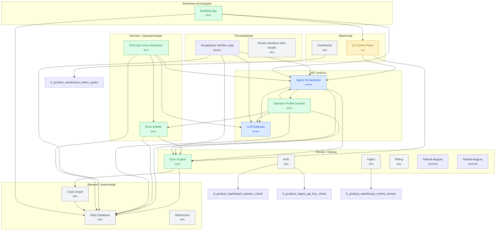

# Sima Atlas Wiki

_Auto-generated: 2026-06-20T08:41:08.199Z_

## Граф продукта



## Слои

### Фронтенд (`front`)

- 🟠 **b.ui-control** — UI Control Plane _(wip)_
  - reason: HTML loses references to components.jsx/sidecol.jsx/canvas_tools.jsx — UI does not boot in production; multi-layer rendering depends on PR2 (this PR)
- 🟡 **b.product-dashboard** — Dashboard _(idea)_
  - reason: Created via design UI at 2026-05-05T20:57:52.242Z

### Логика / бэкенд (`logic`)

- 🟢 **b.core-sync** — Sync Engine _(done)_
  - reason: syncCheck only validates file presence, not mission/KPI semantics
- 🟡 **b.product-auth** — Auth _(idea)_
  - reason: Created via design UI at 2026-05-05T20:57:52.201Z
- 🟡 **b.product-ingest** — Ingest _(idea)_
  - reason: Created via design UI at 2026-05-05T20:57:52.212Z
- 🟡 **b.product-billing** — Billing _(idea)_
  - reason: Created via design UI at 2026-05-05T20:57:52.257Z
- ⚪ **b.block-1** — Новый модуль _(archived)_
  - reason: Archived via design UI at 2026-06-05T22:09:40.500Z
- ⚪ **b.block-2** — Новый модуль _(archived)_
  - reason: Archived via design UI at 2026-06-05T22:09:40.503Z

### ИИ / агенты (`ai`)

- 🔵 **b.agent-orchestrator** — Agent Orchestrator _(review)_
  - reason: Phase I: verifier FAIL on A5 (cursor_live.headless.smoke) — needs a live cursor-agent CLI, not installed in this env. Env-blocked, not code-blocked. A1-A4+A7 pass.
- 🔵 **b.llm-gateway** — LLM Gateway _(review)_
  - reason: Phase I: verifier FAIL on A2 (simulate_conversation_branches) — test fixture asserts b.core-sync is NOT done, but it legitimately IS done now. Test-state coupling; provider code works. Needs fixture decoupling.
- 🟢 **b.operator-profile-learner** — Operator Profile Learner _(done)_
  - reason: Phase I: verifier FAIL on A6 — profile-compliance UI badge (complianceWithProfile) was lost in the R-7.30 single-file→atlas_design refactor and not reimplemented. Genuine feature gap, honestly not done.

### Данные / хранилище (`data`)

- 🟡 **b.db** — Atlas Database _(idea)_
  - reason: Storage is markdown + localStorage; no real DB layer yet
- 🟡 **b.code-graph** — Code Graph _(idea)_
  - reason: New block scoped — extracts deterministic imports/exports map from alive files; consumed by b.core-sync PR4. R-7.99.
- 🟡 **b.product-warehouse** — Warehouse _(idea)_
  - reason: Created via design UI at 2026-05-05T20:57:52.230Z

### Внешние интеграции (`ext`)

- 🟢 **b.desktop** — Desktop App _(done)_
  - reason: Electron-based installable desktop app — wraps the existing browser UI; R-7.99 scoping, PR1 implementation following in this commit.

### Контент / документация (`content`)

- 🟢 **b.docs** — Docs Builder _(done)_
  - reason: Generators run but feed on template missions; needs layer-aware wiki and mermaid (PR2)
- 🟢 **b.user-docs-generator** — End-User Docs Generator _(done)_
  - reason: Phase I: verifier FAIL on A1 (introspect_block_ui.selftest) — coupled to deleted frontend/proposals_panel.jsx. Test fixture needs repointing to a current JSX file.

### Тестирование (`testing`)

- ⚪ **b.acceptance-verifier-loop** — Acceptance Verifier Loop _(desync)_
  - reason: cascade: parent b.core-sync edit at 2026-06-20T08:31:02 broke acceptance
- 🟡 **b.smoke-sandbox** — Smoke Sandbox (test target) _(idea)_
  - reason: Reserved write-target for e2e/smoke scripts so they never touch real product blocks

## Блоки

### 🟠 b.ui-control — UI Control Plane

- **layer**: `front`
- **type**: module
- **status**: `wip` — HTML loses references to components.jsx/sidecol.jsx/canvas_tools.jsx — UI does not boot in production; multi-layer rendering depends on PR2 (this PR)
- **mvp**: yes
- **depends_on**: `b.core-sync`, `b.agent-orchestrator`
- **tech_stack**: `react`, `babel-standalone`
- **files**: 17 (`atlas/blocks/b.ui-control/files.md`)

# b.ui-control — mission

Визуальная control plane Симы: один React-канвас, в котором человек видит схему продукта (слои, блоки, связи), статус каждого блока (idea/wip/review/done/broken/drift), запускает действия по блоку (Implement / Review / Done / Rollback / mark-dead) и собирает context-pack для агента.

Главное назначение — заменить чтение кода и переключение между чатами Cursor/Claude/Codex на одну визуальную карту, где видно: что сделано, что сломано, что синхронизировано с миссией продукта, что нет.

## Scope
- 4 layer switcher (Канвас источников / Карта продукта / ТЗ / Реализация) + Галерея.
- Архитектурный канвас (горизонтальные слои, блоки с портами, типизированные связи, drag&drop).
- Inspector блока: mission/kpi/tasks/checks, кнопки lifecycle, экспорт context-pack.
- Подсветка рассинхрона и broken/drift-фильтры.

## Out of scope (для PR1)
- LLM-вызовы из UI (PR3).
- Watcher событий Cursor (PR4).

#### KPI

# b.ui-control — KPI

- **KPI-1 (boot)**: HTML-страница `frontend/Сима - универсальный конструктор.html` открывается в браузере без ошибок в консоли (всё React-дерево рендерится). Сейчас: ✗ (часть JSX не подключена).
- **KPI-2 (multi-layer)**: канвас рисует не менее 5 горизонтальных слоёв из `ARCH_LAYERS`, и блоки распределены по этим слоям по полю `layer`. Сейчас: ✗ (графа без поля `layer`, всё валится в один контейнер).
- **KPI-3 (sync visibility)**: при `syncCheck` блоки со статусом drift/broken визуально подсвечиваются на канвасе с причиной из `syncReport.details`. Сейчас: △ (логика есть в `atlas_sync.js`, но завязана только на наличие файлов).
- **KPI-4 (lifecycle gating)**: кнопка Done на блоке заблокирована, пока не пройдены acceptance + kpi проверки. Сейчас: ✓ (логика `isReadyToDone` в `app_v2.jsx`).
- **KPI-5 (context-pack export)**: для выбранного блока копируется в буфер deterministic JSON со всеми ссылками на mission/kpi/depends/provides. Сейчас: ✓ для UI-кнопки, файл-output генерируется через `scripts/build_context_pack.mjs`.

#### Acceptance

# b.ui-control — acceptance

Блок переходит в `done` только когда:

- [ ] **A1.** HTML открывается в браузере и `<div id="root">` заполнен (smoke-тест: `headless run` грузит страницу, ловит `error`-события, ждёт что DOM содержит `.l2-top` и `.workarea`).
- [ ] **A2.** Все JSX-зависимости `app_v2.jsx` подгружены (нет `useTweaks/SourcePalette/CanvasInspector is not defined` в консоли).
- [ ] **A3.** При выбранном проекте `atlas-live` канвас архитектуры рисует ≥ 3 горизонтальных слоя; в каждом слое — корректные блоки из `graph.json` по полю `layer` (зависит от PR2).
- [ ] **A4.** Sync-check на 5 блоках возвращает либо ok, либо drift с конкретной причиной (`status_reason`) — без ложных «всё зелёное».
```yaml
evidence_kind: exit_code
evidence_spec:
  cmd: node scripts/validate_block_contracts.mjs
  expect_in_stdout: "OK"
```
- [ ] **A5.** Кнопка Done заблокирована, если `acceptance` чек-листа блока не отмечены полностью И в `checks.log` нет `acceptance pass` + `kpi pass`.
```yaml
evidence_kind: log_grep
evidence_spec:
  file: scripts/log_transition.mjs
  pattern: "verdict !== 'pass'"
```

## Не считается acceptance:
- наличие файлов;
- прохождение `validate_block_contracts.mjs` (это контрактный gate, не приёмка);
- генерация `wiki.html` (это `b.docs`).

#### Provides

# b.ui-control — provides

- visual_control_panel

#### Depends on

# b.ui-control — depends_on

- b.core-sync: sync_report
- b.agent-orchestrator: pipeline_execution

#### Files

# b.ui-control — files

- index.html [alive] (PR4.1: repo-root redirect to frontend/index.html)
- frontend/atlas_sync.js [alive]
- frontend/atlas_bootstrap.js [alive] (auto-generated)
- frontend/atlas_design/index.html [alive] (R-7.30 — current canvas entry)
- frontend/atlas_design/panels.jsx [alive] (DetailPanel + Overview + AcceptanceSection + Implementation Status + Token Spend)
- frontend/atlas_design/views.jsx [alive] (composer, proposals Accept/Reject, modals)
- frontend/atlas_design/graph.jsx [alive] (canvas graph + edges + drill-down)
- frontend/atlas_design/tweaks-panel.jsx [alive]
- frontend/atlas_design/data_loader.js [alive] (live API loader + write-side SIMA_API)
- frontend/atlas_design/data_static.js [alive] (offline fallback demo)
- frontend/atlas_design/i18n.js [alive] (644-key EN/RU dictionary)
- frontend/atlas_design/styles.css [alive]
- frontend/result_view.jsx [archived] (legacy)
- frontend/schema_view.jsx [archived] (legacy)
- frontend/data.js [archived] (v1 data, replaced by data_v2.js)
- frontend/app.jsx [archived] (v1 root, replaced by app_v2.jsx)

_Sources: [mission](blocks/b.ui-control/mission.md) · [kpi](blocks/b.ui-control/kpi.md) · [acceptance](blocks/b.ui-control/acceptance.md) · [depends_on](blocks/b.ui-control/depends_on.md) · [provides](blocks/b.ui-control/provides.md) · [patterns](blocks/b.ui-control/patterns.md) · [files](blocks/b.ui-control/files.md)_

---

### 🟢 b.core-sync — Sync Engine

- **layer**: `logic`
- **type**: module
- **status**: `done` — syncCheck only validates file presence, not mission/KPI semantics
- **mvp**: yes
- **depends_on**: `b.db`, `b.code-graph`
- **tech_stack**: `nodejs`, `esm`, `vanilla-js`, `markdown`, `json`
- **files**: 8 (`atlas/blocks/b.core-sync/files.md`)

# b.core-sync — mission

`b.core-sync` — **структурный** Sync Engine: проверяет, что граф контрактов
консистентен (mission/kpi/acceptance/depends_on/provides/files заполнены и
согласованы), что заявленные `tech_stack` не противоречат расширениям файлов
в `files.md`, и сводит все находки в один отчёт `atlas/sync_report.json`.
Это **детерминистический** слой — без LLM, без семантики, без «понимания
значения функций». Прогон — миллисекунды, повторяемость — побитовая.

«Рассинхрон» в полном смысле (код vs миссия, реальные импорты vs контракт,
семантика реализации vs обещание) **разделён архитектурно** между тремя
блоками — попытка сделать всё внутри одного блока вырастает в монолит и
смешивает дешёвые детерминистические проверки с дорогими LLM-вызовами:

- **код-vs-контракт** (реальные `import`/`export` блока vs его
  `depends_on`/`provides`) — **делегирован в `b.code-graph`**. Тот блок
  собирает детерминистическую карту imports/exports в
  `atlas/code_graph.json` и запускает детекторы
  `undeclared_code_dependency` + `provided_capability_not_exported`.
  `b.core-sync` потребляет `code_graph` через `depends_on` и ссылается на
  его результаты в своём агрегированном `sync_report.json`.
- **семантический sync** (LLM судит, реализует ли действительная функция
  то, что обещает миссия) — отдельная задача **T7 (PR3)** ниже. Запускается
  поверх уже зелёного `code_graph`: если структура ломается, тратить токены
  LLM на семантику бессмысленно. До оформления в T7 «соответствует ли
  реализация миссии?» уже выполняется через `scripts/semantic_verify.mjs`
  (`Contract as Arbiter`, R-7.94), который тоже потребляет `code_graph`
  как часть бандла кода — фактически T7 — это перенос вызова под
  контракт-крышу этого блока.

Текущая реализация (`frontend/atlas_sync.js` + `scripts/validate_*`)
закрывает структурный слой полностью; код-vs-контракт делегирован и работает
через `b.code-graph`; семантический слой существует через
`semantic_verify.mjs` и формально оформится в T7. Единственный остающийся
реальный долг — расщепление источника правды: `frontend/atlas_sync.js` пишет
проверки в `localStorage`, а Rule 1 требует фиксации каждого изменения в
`checks.log` на файловой системе. Это **T8** ниже.

## Layer
logic

## Что должен делать в done-версии (роадмап)

1. **Структурный sync (PR2, DONE)** — `validate_block_contracts`,
   `validate_dependency_contracts`, `validate_files_registry`,
   `validate_no_template_placeholders`, `validate_stack_mismatch`. Все
   пишут в `atlas/sync_report.json`.
2. **Код-vs-контракт sync (R-7.99, DELEGATED to `b.code-graph`)** —
   `b.core-sync.depends_on: b.code-graph: code_graph`; нарушения видны на
   канвасе как drift на источнике-блоке, не на нас. См. отдельную задачу
   `b.code-graph` за деталями детектора.
3. **Семантический sync (T7, PR3)** — LLM судит код ↔ миссия поверх
   детерминистической карты. Зависит от `b.llm-gateway: llm_call_structured`.
   Запускается только когда `code_graph` зелёный.
4. **Унификация источника правды `checks.log` (T8, DONE)** — после R-7.99
   `frontend/atlas_sync.js` `logCheck` пишет в **оба** места одновременно:
   немедленно в `localStorage` (для мгновенной UI-реакции и offline-режима)
   и через `POST /atlas/checks/append` в реальный `atlas/blocks/<id>/checks.log`
   на диске. Канонический источник правды — **файл на диске**;
   `localStorage` — write-through кэш, его роль ограничена быстрым рендером
   и устойчивостью к временной потере связи. Расхождение невозможно: каждая
   запись идёт в оба источника одновременно, и при следующем чтении с
   диска localStorage обновляется через `loadAtlas`. Закрывает
   методологическое нарушение Rule 1: канонические checks теперь живут на
   файловой системе там, где их видят CLI-валидаторы и git.

## Out of scope
- Генерация документации (это `b.docs`).
- UI-визуализация sync-отчёта (это `b.ui-control`).
- Карта imports/exports как таковая (это `b.code-graph` — мы только
  потребитель и агрегатор).

#### KPI

# b.core-sync — KPI

- **KPI-1 (contract sync)**: для каждого блока `X` с `depends_on: [{ block_id: Y, capability: C }]` проверяется, что `Y.provides` содержит `C`. Если нет — `drift_reason="missing_capability"`. Сейчас: ✓ (`validate_dependency_contracts.mjs` парсит `dep: cap` формат из `depends_on.md` и сверяет с `provides.md`; findings пишутся в `atlas/sync_report.json` под секцией `dependencyValidation`).
- **KPI-2 (stack sync)**: `validate_stack_mismatch.mjs` обнаруживает кросс-экосистемные несоответствия — если файл в `files.md` имеет расширение из чужой language-экосистемы (напр. `.py` при JS-стеке), блок получает `drift: stack_mismatch`. Проверка **унидиректциональна** (per architecture decision 2026-06-09): обнаруживается несовместимый файл, не подтверждается наличие совместимых — это linter-concern, не sync-concern. Сейчас: ✓ (детектор работает; selftest подтверждает A3).
- **KPI-3 (semantic sync)** [PR3]: LLM сравнивает `mission.md ↔ checks.log + tasks.md` и возвращает `is_consistent: bool, reasons: []`. Цель — `precision >= 0.8` на golden set из 10 блоков. Сейчас: ✗.
- **KPI-4 (false-positive rate)**: при двух прогонах syncCheck без изменений отчёт идентичен (нет случайных drift-flag). Сейчас: ✓ (детерминирован).
- **KPI-5 (latency)**: `runSyncWithChecks` отрабатывает за < 500 ms на 20 блоках. Сейчас: ✓ (≈ 50 ms на 5 блоках).

#### Acceptance

# b.core-sync — acceptance

- [x] **A1.** На пустом графе с одним блоком без зависимостей syncCheck возвращает `synchronized: 1, drift: 0, broken: 0`.
```yaml
evidence_kind: selftest_run
evidence_spec:
  cmd: node tests/atlas_sync.selftest.mjs
  expect_in_stdout: "OK"
```
- [x] **A2.** Если блок A заявляет `depends_on: [{block_id: B, capability: foo}]`, а у B нет `provides: [foo]`, syncCheck возвращает `broken` с `reason: missing_capability(B.foo)`.
```yaml
evidence_kind: exit_code
evidence_spec:
  cmd: node scripts/validate_dependency_contracts.mjs
  expect_in_stdout: "OK"
```
- [x] **A3.** Если блок имеет `tech_stack: [react]`, а в `files.md` указан `.py`-файл — syncCheck возвращает `drift` с `reason: stack_mismatch`.
```yaml
evidence_kind: selftest_run
evidence_spec:
  cmd: node tests/atlas_sync.selftest.mjs
  expect_in_stdout: "OK"
```
- [ ] **A4.** [PR3] LLM-семантический gate: блок с миссией «принимает платежи через Stripe» и реализацией без `stripe`-импорта в `files.md` помечается `drift` с `reason: mission_implementation_mismatch`.
- [x] **A5.** Все детектированные drift/broken попадают в `atlas/sync_report.json` со ссылкой на конкретный файл/строку (для UI).
```yaml
evidence_kind: exit_code
evidence_spec:
  cmd: node scripts/validate_block_contracts.mjs
  expect_in_stdout: "OK"
```

## Не считается acceptance:
- наличие `mission.md` (это контрактный gate).
- факт того, что `runSync` не упал (это smoke).

#### Provides

# b.core-sync — provides

- sync_report
- contract_validation

#### Depends on

# b.core-sync — depends_on

- b.db: atlas_state_store
- b.db: file_registry
- b.code-graph: code_graph

#### Patterns

# b.core-sync — patterns

- 2026-04-30T19:54:08.006Z: branch semantic ingestion
- 2026-04-30T19:54:14.566Z: branch semantic ingestion
- 2026-04-30T19:54:40.301Z: branch semantic ingestion
- 2026-04-30T19:54:51.540Z: branch semantic ingestion
- 2026-04-30T19:55:17.135Z: branch semantic ingestion
- 2026-04-30T20:04:36.976Z: branch semantic ingestion
- 2026-04-30T20:10:07.400Z: branch semantic ingestion
- 2026-04-30T20:10:24.409Z: branch semantic ingestion
- 2026-04-30T20:23:39.501Z: branch semantic ingestion
- 2026-04-30T20:30:24.920Z: branch semantic ingestion

## b.core-sync__2026-06-20T08-16-28-760Z — Succeeded [demo]
_2026-06-20T08:30:57.934Z_

_no summary_

#### Files

# b.core-sync — files

- frontend/atlas_sync.js [alive] (client-side syncCheck + transitions; T8: logCheck now POSTs /atlas/checks/append → checks.log on disk)
- tests/checks_append_endpoint.selftest.mjs [alive] (T8 — selftest for the unified-checks-log endpoint)
- scripts/validate_block_contracts.mjs [alive]
- scripts/validate_dependency_contracts.mjs [alive]
- scripts/validate_acceptance_assertions.mjs [alive]
- scripts/validate_no_template_placeholders.mjs [alive] (PR1)
- scripts/validate_files_registry.mjs [alive] (PR2 — checks files in files.md exist on disk)
- scripts/validate_stack_mismatch.mjs [alive] (PR2 — detects cross-language stack mismatches, writes sync_report.json)
- scripts/validate_code_graph_sync.mjs [alive] (PR2 — consumes b.code-graph: code_graph; writes codeGraphSummary to sync_report.json)
- scripts/validate_ingestion_contracts.mjs [alive]
- scripts/validate_ingestion_quality.mjs [alive]
- scripts/validate_agent_parity.mjs [alive]
- scripts/validate_parity_matrix.mjs [alive]
- scripts/validate_bootstrap_projection.mjs [alive]
- scripts/validate_bootstrap_regeneration.mjs [alive]
- scripts/calc_intelligence_health.mjs [alive]
- scripts/audit_production_readiness.mjs [alive]
- scripts/log_transition.mjs [alive]
- atlas/transitions.log [alive]

_Sources: [mission](blocks/b.core-sync/mission.md) · [kpi](blocks/b.core-sync/kpi.md) · [acceptance](blocks/b.core-sync/acceptance.md) · [depends_on](blocks/b.core-sync/depends_on.md) · [provides](blocks/b.core-sync/provides.md) · [patterns](blocks/b.core-sync/patterns.md) · [files](blocks/b.core-sync/files.md)_

---

### 🟡 b.db — Atlas Database

- **layer**: `data`
- **type**: module
- **status**: `idea` — Storage is markdown + localStorage; no real DB layer yet
- **mvp**: yes
- **tech_stack**: `filesystem`, `json`, `markdown`
- **files**: 11 (`atlas/blocks/b.db/files.md`)

# b.db — mission

Atlas storage слой: единый источник правды для графа продукта (`graph.json`), блоков (`blocks/<id>/*.md`), очереди ingestion (`ingestion_queue.jsonl`), журналов transitions/decisions/checks. Цель — предоставить детерминированный API для чтения/записи без дрейфа.

В MVP — это plain markdown + JSON файлы на диске + localStorage-кеш на клиенте через `atlas_sync.js`. В production-варианте — миграция на SQLite или Postgres с тем же файловым API через MCP-сервер (атомарность, версии, multi-tenant).

## Layer
data

## Что должен делать в done-версии
1. Атомарные write-операции (block update = single transaction, не оставляем half-written файлы при сбое).
2. Версионирование блока: каждое изменение mission/kpi/depends/provides пишется в `history/<timestamp>.diff`.
3. Migration runner: если схема `graph.json` меняется (как в PR2 при добавлении `layer/type/mvp`), мигратор обновляет старые блоки.
4. Read-API: `getBlock(id)`, `listBlocks(filter)`, `getDependencies(id)`, `getHistory(id)` — единый интерфейс для UI и MCP.

## Out of scope
- Векторный поиск (это backup-память, не основная).
- Multi-project namespacing (PR в стек после PR4).

#### KPI

# b.db — KPI

- **KPI-1 (atomicity)**: при kill -9 во время `update_block` файлы блока остаются в консистентном состоянии (либо все изменения применены, либо ни одного). Сейчас: ✗ (нет atomic-write через rename).
- **KPI-2 (history)**: каждый `transition_block` и `update_block` создаёт запись в `atlas/transitions.log` с before/after. Сейчас: ✓ (`scripts/log_transition.mjs`).
- **KPI-3 (versioning)**: при `update_block` старая версия mission/kpi сохраняется в `blocks/<id>/history/<timestamp>.md`. Сейчас: ✗ (history-папок нет).
- **KPI-4 (read-API)**: MCP tool `read_block` возвращает все *.md и *.log одной операцией < 50 ms. Сейчас: ✓.
- **KPI-5 (migration)**: при изменении схемы graph.json есть `scripts/migrate_<from>_<to>.mjs` и nightly его прогоняет. Сейчас: ✗ (миграции нет).

#### Acceptance

# b.db — acceptance

- [ ] **A1.** Smoke: 100 параллельных `update_block` с kill -9 в случайные моменты — после восстановления `validate_block_contracts.mjs` проходит на всех затронутых блоках.
```yaml
evidence_kind: exit_code
evidence_spec:
  cmd: node scripts/validate_block_contracts.mjs
  expect_in_stdout: "OK"
```
- [ ] **A2.** `scripts/get_block_history.mjs <block_id>` возвращает не менее 2 записей после двух последовательных `update_block`.
```yaml
evidence_kind: fs_glob
evidence_spec:
  pattern: atlas/transitions.log
  min_count: 1
```
- [ ] **A3.** При попытке записать `graph.json` со схемой, не совпадающей с `atlas/db_schema.json`, операция отклоняется с понятной ошибкой.
```yaml
evidence_kind: fs_glob
evidence_spec:
  pattern: atlas/db_schema.json
  min_count: 1
```
- [ ] **A4.** Migration: запуск `scripts/migrate_v1_v2.mjs` на старом `graph.json` v1 даёт валидный v2 без потерь данных.
- [ ] **A5.** Read-API возвращает идентичный JSON в двух последовательных вызовах для неизменённого блока (детерминизм).
```yaml
evidence_kind: exit_code
evidence_spec:
  cmd: node scripts/validate_files_registry.mjs
  expect_in_stdout: "OK"
```

## Не считается acceptance:
- факт того, что markdown-файлы блока существуют (это контрактный gate).

#### Provides

# b.db — provides

- atlas_state_store
- file_registry

#### Depends on

# b.db — depends_on

- none

#### Patterns

# b.db — patterns

_This file is populated by the chat-distillate ingestion pipeline (entries are
paired with `chat-distillate` rows in `decisions.log`). Design rationale and
do/don't notes live in `narrative.md`._

#### Files

# b.db — files

- atlas/graph.json [alive] (v2 — main schema source of truth)
- atlas/db_schema.json [alive]
- atlas/project.md [alive]
- atlas/rules.md [alive]
- atlas/tech_stack.md [alive] (project-wide stack lock)
- atlas/operator_profile.json [alive]
- atlas/transitions.log [alive]
- atlas/ingestion_queue.jsonl [alive]
- atlas/intelligence_health.json [alive]
- atlas/intelligence_health.md [alive]
- atlas/STATUS_REPORT.md [alive]
- atlas/STOPPOINT.md [alive]
- atlas/progress_tz_checklist.md [alive]
- atlas/IMPLEMENTATION_PROGRESS.md [alive]
- atlas/production_audit_report.md [alive]
- atlas/tasks_master.md [alive]
- scripts/log_transition.mjs [alive]
- scripts/manage_block.mjs [alive]
- scripts/advance_block_state.mjs [alive]
- scripts/dedup_block_memory.mjs [alive]
- scripts/enqueue_ingestion_item.mjs [alive]
- scripts/apply_ingestion_queue.mjs [alive]
- scripts/ingest_chat_distillate.mjs [alive]
- scripts/ingest_chat_batches.mjs [alive]
- scripts/hook_ingest_recent_chat.mjs [alive] (waiting for PR4 valid hooks)

_Sources: [mission](blocks/b.db/mission.md) · [kpi](blocks/b.db/kpi.md) · [acceptance](blocks/b.db/acceptance.md) · [depends_on](blocks/b.db/depends_on.md) · [provides](blocks/b.db/provides.md) · [patterns](blocks/b.db/patterns.md) · [files](blocks/b.db/files.md)_

---

### 🔵 b.agent-orchestrator — Agent Orchestrator

- **layer**: `ai`
- **type**: module
- **status**: `review` — Phase I: verifier FAIL on A5 (cursor_live.headless.smoke) — needs a live cursor-agent CLI, not installed in this env. Env-blocked, not code-blocked. A1-A4+A7 pass.
- **mvp**: yes
- **depends_on**: `b.db`, `b.core-sync`, `b.llm-gateway`, `b.operator-profile-learner`
- **tech_stack**: `nodejs`, `esm`, `mcp`
- **files**: 19 (`atlas/blocks/b.agent-orchestrator/files.md`)

# b.agent-orchestrator — mission

Шина между Sima и любым coding-агентом (Cursor, Claude Code, Codex CLI, Antigravity). Главная задача — обеспечить, чтобы все агенты работали по **одному и тому же** context-pack, читали `/atlas/blocks/<id>/` перед написанием кода и пушили обратно реальные события (file edits, shell calls, status transitions), а не шаблонные «sync pass»-логи.

## Layer
ai

## Что реализовано (после PR4)

1. **MCP-сервер** `scripts/mcp_atlas_server.mjs` (21+ tools: read_block / list_dependencies / sync_check / build_context_pack / log_check / mark_file_dead / update_block / generate_validated_bundle / nightly_consolidation / render_wiki_html / ingest_chat_distillate / enqueue_ingestion / apply_ingestion_queue ...). Cursor подключает его через `.cursor/mcp.json`.
2. **Валидный `.cursor/hooks.json`** в формате Cursor (`{ version: 1, hooks: { event: [{ command }] } }`) с 4 событиями:
   - `beforeSubmitPrompt` → `node scripts/inject_context_pack.mjs` (вкладывает block-scoped context).
   - `afterFileEdit` → `node scripts/observe_file_edit.mjs` (записывает правку в `checks.log` блока через `files.md` reverse-mapping).
   - `beforeShellExecution` → `node scripts/guard_against_drift.mjs` (отклоняет команды против `tech_stack.md`).
   - `stop` → `node scripts/calc_intelligence_health.mjs` (обновляет дашборд).
3. **`validate_cursor_hooks.mjs`** — gate в nightly: фейлится если формат не соответствует Cursor или command ссылается на несуществующий скрипт.
4. **9-case integration test** `tests/cursor_hooks_actions.test.mjs`: known/unknown/empty path, pip-rejected / npm-approved / yarn-vue-rejected / empty-command, inject-by-env / inject-by-prompt-detection.
5. **AGENTS.md / CLAUDE.md** генерируются `scripts/generate_agent_contracts.mjs` и одинаковы для всех агентов.

## Что осталось до done
- Live-проверка с реальным Cursor в IDE: запустить пример pip-команды, убедиться, что она блокируется в реальном окружении (а не только в наших тестах через CLI argv).
- Adapter для Claude Code CLI: MCP tool `run_block_implementation(block_id)` → `claude --print --add-dir atlas/blocks/<id>`.
- Real diff-парити между Cursor MCP и Claude CLI context-packs (PR4.5).

## Out of scope
- LLM-извлечение смысла из чата (это `b.llm-gateway`).
- UI-операции по блоку (это `b.ui-control`).

#### KPI

# b.agent-orchestrator — KPI

- **KPI-1 (valid hooks)**: `.cursor/hooks.json` использует только реальные Cursor события и формат `action.run_command` соответствует Cursor SDK. Сейчас: ✗ (`afterPromptSent` не существует у Cursor).
- **KPI-2 (real observation)**: после каждого `afterFileEdit` в `checks.log` соответствующего блока появляется запись с актуальным `git diff --stat`. Сейчас: ✗ (хук просто дописывает напоминание, не читает diff).
- **KPI-3 (drift guard)**: shell-команда, противоречащая `tech_stack.md`, блокируется хуком и логируется в `decisions.log`. Сейчас: ✗ (validate_text без реальной проверки).
- **KPI-4 (parity)**: `validate_agent_parity.mjs` подтверждает, что для любого блока context-pack одинаков для Cursor (через MCP `build_context_pack`) и для Claude Code (через CLI с `--add-dir`). Сейчас: △ (есть `validate_parity_matrix.mjs`, но проверка формальная).
- **KPI-5 (no-chat-leak)**: чат с агентом не попадает в долгую память Atlas; в `decisions.log` блока — только distillate, не сырые сообщения. Сейчас: ✓ (есть, но distillate приходит через regex-grep, не LLM).

#### Acceptance

# b.agent-orchestrator — acceptance

Acceptance gate для перехода `review → done`. Каждый пункт привязан к конкретному scenario flow и подтверждается через nightly или ручной live-test.

- [x] **A1 (hooks logic).** `.cursor/hooks.json` валиден (`validate_cursor_hooks.mjs` OK; 4 события beforeSubmitPrompt/afterFileEdit/beforeShellExecution/stop). UI sync ↔ MCP идёт через единый формат.
```yaml
evidence_kind: exit_code
evidence_spec:
  cmd: node scripts/validate_cursor_hooks.mjs
  expect_in_stdout: "OK"
```
- [x] **A2 (afterFileEdit flow).** При file-edit на `frontend/app_v2.jsx` `observe_file_edit.mjs` находит owner-блок через `files.md` reverse-mapping и пишет `cursor_edit pass` в `b.ui-control/checks.log`. Зависимость на `files.md` атласа подтверждена `cursor_hooks_actions.test`.
```yaml
evidence_kind: selftest_run
evidence_spec:
  cmd: node tests/cursor_hooks_actions.test.mjs
  expect_in_stdout: "OK"
```
- [x] **A3 (drift guard scenario).** Команда `pip install neo4j` отклоняется (exit 1) и пишет `drift_guard fail` в `b.agent-orchestrator/checks.log` + `atlas/transitions.log`. `npm install react` пропускается. Test 4–7 в `cursor_hooks_actions.test`.
```yaml
evidence_kind: selftest_run
evidence_spec:
  cmd: node tests/cursor_hooks_actions.test.mjs
  expect_in_stdout: "9 cases"
```
- [x] **A4 (inject_context_pack flow).** `inject_context_pack.mjs` собирает project + rules + tech_stack + block-mission/kpi/acceptance/depends/files на запрос с `SIMA_BLOCK_ID` или с автодетектом блока из текста промпта. UI sync ↔ context-pack стабилен. Test 8–9 в `cursor_hooks_actions.test`.
```yaml
evidence_kind: selftest_run
evidence_spec:
  cmd: node tests/cursor_hooks_actions.test.mjs
  expect_in_stdout: "OK"
```
- [ ] **A5 (live Cursor flow).** В реальной IDE открыт репо, hook `beforeShellExecution` блокирует `pip install` без необходимости запуска CLI вручную. Live-проверка после первого визуального теста (PR4.5). Headless эквивалент проверяет всю цепочку action-скриптов (validate_cursor_hooks → guard_against_drift → observe_file_edit → inject_context_pack → cursor_hooks_actions.test) с тем же env-shape, что Cursor выставляет.
```yaml
evidence_kind: selftest_run
evidence_spec:
  cmd: node tests/cursor_live.headless.smoke.mjs
  expect_in_stdout: "OK"
```
- [ ] **A6 (Claude Code adapter).** MCP tool `run_block_implementation(block_id)` запускает `claude --print --add-dir atlas/blocks/<id>` и возвращает summary, привязанное к этому блоку (PR4.5).
- [ ] **A7 (parity scenario).** `validate_agent_parity.mjs` сравнивает реальный context-pack JSON Cursor (через MCP) с context-pack Claude (через CLI flag) — diff должен быть пустой. Сейчас валидатор есть, но diff формальный (PR4.5).
```yaml
evidence_kind: exit_code
evidence_spec:
  cmd: node scripts/validate_agent_parity.mjs
  expect_in_stdout: "OK"
```

## Что считается NOT acceptance
- Существование файлов `.cursor/hooks.json` или MCP-сервера.
- Факт того, что MCP-сервер запускается.

## Зависимости
- `b.agent-orchestrator` depends_on: b.db, b.core-sync, b.llm-gateway.
- Этот блок sync с `b.ui-control` через единый context-pack JSON.

#### Provides

# b.agent-orchestrator — provides

- pipeline_execution

#### Depends on

# b.agent-orchestrator — depends_on

- b.db: atlas_state_store
- b.core-sync: sync_report
- b.llm-gateway: llm_extract_block_schema
- b.operator-profile-learner: personal_templates

#### Files

# b.agent-orchestrator — files

- scripts/mcp_atlas_server.mjs [alive] (21+ tools over JSON-RPC stdio)
- scripts/atlas_api_server.mjs [alive] (HTTP facade for orchestration)
- scripts/generate_cursor_hooks.mjs [alive] (PR4: emits valid Cursor format with real action scripts)
- scripts/validate_cursor_hooks.mjs [alive] (PR4: gate; fails if hooks.json has wrong shape or missing scripts)
- scripts/observe_file_edit.mjs [alive] (PR4: afterFileEdit action — files.md → block reverse-map)
- scripts/guard_against_drift.mjs [alive] (PR4: beforeShellExecution action — tech_stack.md guard)
- scripts/inject_context_pack.mjs [alive] (PR4: beforeSubmitPrompt action — block-scoped context)
- tests/cursor_hooks_actions.test.mjs [alive] (PR4: 9-case integration test for the three actions)
- scripts/run_block_implementation.mjs [alive] (PR4.5: build prompt + invoke claude/codex/cursor CLI)
- tests/agent_parity_real.smoke.mjs [alive] (PR4.5: real MCP pack ≡ Claude --add-dir disk parity)
- scripts/generate_agent_contracts.mjs [alive] (writes AGENTS.md / CLAUDE.md)
- scripts/build_context_pack.mjs [alive]
- scripts/sync_context_packs.mjs [alive]
- scripts/finalize_cursor_iteration.mjs [alive]
- scripts/run_block_process.mjs [alive]
- scripts/pipeline_step.mjs [alive]
- scripts/auto_sync_iteration.mjs [alive] (regex-only flow; will be replaced after PR3 wiring)
- scripts/analyze_conversation_to_atlas.mjs [alive] (PR3: replaced regex with extractBlockSchema via b.llm-gateway)
- scripts/simulate_conversation_branches.mjs [alive] (PR3: rewritten as smoke for the LLM extraction + safe-upsert flow)
- .cursor/hooks.json [alive] (current content uses invented Cursor events — PR4)
- .cursor/mcp.json [alive]
- AGENTS.md [alive]
- CLAUDE.md [alive]
- scripts/run_state.mjs [alive] (PR-7 Symphony-inspired FSM; runs are tracked in atlas/run_state/<run_id>.json)
- tests/run_state.selftest.mjs [alive] (PR-7; 8 test groups)
- scripts/agent_workspace.mjs [alive] (PR-8 sandboxed workspaces under ~/.atlas_workspaces/)
- tests/agent_workspace.selftest.mjs [alive] (PR-8; 7 test groups)

_Sources: [mission](blocks/b.agent-orchestrator/mission.md) · [kpi](blocks/b.agent-orchestrator/kpi.md) · [acceptance](blocks/b.agent-orchestrator/acceptance.md) · [depends_on](blocks/b.agent-orchestrator/depends_on.md) · [provides](blocks/b.agent-orchestrator/provides.md) · [patterns](blocks/b.agent-orchestrator/patterns.md) · [files](blocks/b.agent-orchestrator/files.md)_

---

### 🟢 b.docs — Docs Builder

- **layer**: `content`
- **type**: module
- **status**: `done` — Generators run but feed on template missions; needs layer-aware wiki and mermaid (PR2)
- **mvp**: yes
- **depends_on**: `b.db`, `b.core-sync`
- **tech_stack**: `nodejs`, `esm`, `markdown`
- **files**: 8 (`atlas/blocks/b.docs/files.md`)

# b.docs — mission

Документ-генератор Атласа: на каждый блок собирает живую страницу wiki из его `mission.md / kpi.md / acceptance.md / depends_on.md / provides.md / files.md / patterns.md`. На каждый проект собирает `auto_tz.md` (агрегированное ТЗ) и `roadmap.md` (приоритизированный список блоков по статусу и зависимостям).

Главное правило — **никакой генерации текста, не основанной на содержимом блоков**. Если у блока mission.md шаблонный или пустой, в wiki это блок попадает с явной пометкой `[требует заполнения]`, а не «Ключевая цель блока…».

Реализация: `scripts/generate_wiki.mjs`, `scripts/generate_tz_from_atlas.mjs`, `scripts/render_wiki_html.mjs`, `scripts/rebuild_atlas_roadmap.mjs`.

## Layer
content

## Что должен делать в done-версии
1. Wiki содержит секции по слоям (front/back/ai/data/...) и навигацию между блоками по `depends_on`.
2. Mermaid-диаграмма графа в `wiki.html` (по `graph.json`).
3. ТЗ автогенерируется только из non-template mission/kpi (контракт `validate_no_template_placeholders`).
4. Roadmap учитывает не только статус блока, но и `depends_on` (топологическая сортировка).
5. Скриншоты блоков (когда `b.ui-control` дойдёт до этой фичи) встраиваются в wiki.

## Out of scope
- Извлечение содержимого блоков из чата (это `b.llm-gateway` + `b.agent-orchestrator`).

#### KPI

# b.docs — KPI

- **KPI-1 (no template leakage)**: ни одна страница wiki не содержит шаблонных фраз («Ключевая цель блока», «Автосоздано», «определить»). Сейчас: ✗ (пока проверка не подключена; PR1 чинит).
- **KPI-2 (graph diagram)**: `wiki.html` содержит Mermaid-диаграмму с блоками и зависимостями. Сейчас: ✗ (`render_wiki_html.mjs` рендерит plain markdown).
- **KPI-3 (layer navigation)**: wiki разбит на разделы по слоям (front/logic/ai/data/...). Сейчас: ✗ (зависит от поля `layer` в graph.json — добавляется в PR2).
- **KPI-4 (roadmap topo-sort)**: при двух блоках A→B (A зависит от B), B всегда раньше A в roadmap, даже если у B статус `done`, а у A `wip`. Сейчас: ✗ (`rebuild_atlas_roadmap.mjs` сортирует только по статусу).
- **KPI-5 (auto_tz coverage)**: auto_tz.md содержит секции для каждого активного блока с заполненной mission, и пропускает блоки в статусе `idea` без mission. Сейчас: △ (генерирует все, без фильтра по template).

#### Acceptance

# b.docs — acceptance

- [x] **A1.** При наличии в любом mission.md фразы «Ключевая цель блока…» или «Автосоздано из…» команда `node scripts/generate_wiki.mjs` падает с ненулевым exit-кодом. (Гейт против шаблонов.)
```yaml
evidence_kind: exit_code
evidence_spec:
  cmd: node scripts/validate_no_template_placeholders.mjs
  expect_in_stdout: "OK"
```
- [x] **A2.** В `wiki.html` присутствует `<div class="mermaid">` с актуальным графом по `graph.json`.
```yaml
evidence_kind: log_grep
evidence_spec:
  file: atlas/wiki.html
  pattern: "class=\"mermaid\""
```
- [ ] **A3.** Если блок A `depends_on: [B]`, то в `roadmap.md` B появляется на меньшей позиции, чем A — независимо от статуса.
- [x] **A4.** `auto_tz.md` собран только из non-template mission/kpi и содержит ссылки на исходные `blocks/<id>/*.md`.
```yaml
evidence_kind: fs_glob
evidence_spec:
  pattern: atlas/auto_tz.md
  min_count: 1
```
- [ ] **A5.** При отсутствии у блока поля `layer` (старый формат) wiki показывает раздел «Без слоя», а не пихает в первый попавшийся.

## Не считается acceptance:
- наличие файлов `wiki.html`, `auto_tz.md`, `roadmap.md` (это smoke).

#### Provides

# b.docs — provides

- wiki_bundle
- tz_bundle

#### Depends on

# b.docs — depends_on

- b.db: atlas_state_store
- b.db: file_registry
- b.core-sync: sync_report

#### Patterns

# b.docs — patterns

- 2026-04-30T15:37:16.336Z: nightly: distilled insight for P6
- 2026-04-30T17:31:53.545Z: queue test insight
- 2026-04-30T17:32:32.367Z: handler fix check
- 2026-04-30T17:35:51.828Z: smoke e2e queued insight
- 2026-04-30T17:36:17.484Z: smoke e2e queued insight
- 2026-04-30T17:36:23.007Z: smoke e2e queued insight
- 2026-04-30T19:13:55.396Z: smoke e2e queued insight
- 2026-04-30T19:48:09.055Z: semantic test
- 2026-04-30T19:54:07.898Z: branch semantic ingestion
- 2026-04-30T19:54:14.439Z: branch semantic ingestion
- 2026-04-30T19:54:40.180Z: branch semantic ingestion
- 2026-04-30T19:54:51.428Z: branch semantic ingestion
- 2026-04-30T19:55:17.024Z: branch semantic ingestion
- 2026-04-30T20:04:36.862Z: branch semantic ingestion
- 2026-04-30T20:10:07.285Z: branch semantic ingestion
- 2026-04-30T20:10:24.293Z: branch semantic ingestion
- 2026-04-30T20:23:39.393Z: branch semantic ingestion
- 2026-04-30T20:23:42.373Z: smoke e2e queued insight
- 2026-04-30T20:30:24.805Z: branch semantic ingestion
- 2026-04-30T20:30:30.127Z: smoke e2e queued insight
- 2026-04-30T21:56:16.102Z: batch-ingest 1-2 / 4
- 2026-04-30T21:56:16.275Z: batch-ingest 3-4 / 4
- 2026-05-02T08:47:15.240Z: smoke e2e queued insight
- 2026-06-05T22:32:30.651Z: Обсуждаем новый блок b.realtime-ingestion, нужен статус wip и layer logic

#### Files

# b.docs — files

- scripts/generate_wiki.mjs [alive]
- scripts/generate_tz_from_atlas.mjs [alive]
- scripts/render_wiki_html.mjs [alive]
- scripts/rebuild_atlas_roadmap.mjs [alive]
- scripts/generate_atlas_bootstrap_js.mjs [alive] (PR2 — emits layered bootstrap)
- atlas/WIKI.md [alive] (auto-generated)
- atlas/wiki.html [alive] (auto-generated)
- atlas/roadmap.md [alive] (auto-generated)
- atlas/nightly_report.md [alive] (auto-generated)

_Sources: [mission](blocks/b.docs/mission.md) · [kpi](blocks/b.docs/kpi.md) · [acceptance](blocks/b.docs/acceptance.md) · [depends_on](blocks/b.docs/depends_on.md) · [provides](blocks/b.docs/provides.md) · [patterns](blocks/b.docs/patterns.md) · [files](blocks/b.docs/files.md)_

---

### 🔵 b.llm-gateway — LLM Gateway

- **layer**: `ai`
- **type**: module
- **status**: `review` — Phase I: verifier FAIL on A2 (simulate_conversation_branches) — test fixture asserts b.core-sync is NOT done, but it legitimately IS done now. Test-state coupling; provider code works. Needs fixture decoupling.
- **mvp**: yes
- **tech_stack**: `nodejs`, `anthropic-api`, `google-genai-api`
- **files**: 13 (`atlas/blocks/b.llm-gateway/files.md`)

# b.llm-gateway — mission

Единая точка входа для всех LLM-вызовов внутри Атласа. Реализовано в `scripts/llm_gateway.mjs`:

- **Provider-agnostic API**: `callLLM({provider, model, system, prompt, schema, max_tokens, temperature, op, strict})` для anthropic / google / mock.
- **Structured output** через JSON Schema: для Anthropic — через tool-use (`submit_structured_response`), для Gemini — через `responseSchema`.
- **Mock-провайдер** с двумя уровнями lookup: точный hash (provider+model+prompt) и prompt-only hash. При отсутствии fixture — детерминированный пустой объект по schema. Используется в CI, golden-set eval'ах и при отсутствии API-ключей.
- **Trace-логирование**: каждый вызов пишет `atlas/llm_traces/<UTC>__<provider>__<hash>.json` с провайдером, моделью, в/о токенами, оценкой стоимости в USD, schema-валидностью и причинами ошибок. `.gitignore` отсекает шум, оставляя `.gitkeep`.
- **Token budget** (`LLM_MAX_INPUT_TOKENS`) и **per-run cost cap** (`LLM_MAX_USD_PER_RUN`) — оба читаются из `.env`. Превышение → выброс при `strict: true`.
- **Provider fallback**: если запрошенный провайдер недоступен или отвалился (5xx / timeout / auth), gateway без `strict` падает обратно на mock и логирует это в trace (`fallback_to_mock: true`).
- **Sugar-функция** `extractBlockSchema(dialogText)` принимает диалог и возвращает `{ blocks: [{id, title, mission, layer, type, mvp, status, depends_on, provides, tech_stack, confidence}] }` — это и есть «извлечение блоков из чата», которое требует ТЗ.

В PR3 заменён regex `/(?:block|блок)\s+([a-z0-9._-]+)/giu` в `scripts/analyze_conversation_to_atlas.mjs` на вызов `extractBlockSchema()` через этот gateway. Результат: новый блок создаётся в `graph.json` со всеми структурными полями и заметкой о происхождении (LLM extraction, confidence). Для существующих блоков LLM-предложения **не перезаписывают** content — только дописывают `llm_extraction` запись в `checks.log` (это будущий human-in-loop accept/reject в UI).

Golden eval: 5 эталонных диалогов, средняя точность ≥ 0.7 (на mock — 1.0).

## Layer
ai

## Что должен делать в done-версии (после review)
1. Live-test против реального Anthropic / Gemini API (нужен ключ в `.env`).
2. UI confidence/diff flow (composer.jsx) — accept/reject предложенных LLM блоков.
3. Eval на 30+ реальных диалогов вместо 5 синтетических.
4. Persistent eval suite в nightly с историей точности.
5. Подключить gateway во все остальные места, где имеет смысл LLM (sync semantic-check, distillate fact extraction).

## Out of scope
- Embeddings / vector search.
- Streaming.
- Fine-tuning или local-inference (vLLM и т.п.) — оставлено на enterprise mode.

#### KPI

# b.llm-gateway — KPI

- **KPI-1 (structured output)**: `callLLM({ schema })` гарантирует, что ответ — валидный JSON по `schema`; при невалидном ответе — 1 ретрай + понятная ошибка. Сейчас: ✗ (блока нет).
- **KPI-2 (mock parity)**: тестовый прогон с `LLM_PROVIDER=mock` и реальный с `LLM_PROVIDER=anthropic` дают одинаковую форму ответа (одна схема). Сейчас: ✗.
- **KPI-3 (cost cap)**: `LLM_MAX_USD_PER_RUN=0.05` (по умолчанию) — превышение стоп. Сейчас: ✗.
- **KPI-4 (latency)**: p95 < 6 секунд на 4k токенов входа Claude Haiku. Сейчас: n/a.
- **KPI-5 (provider fallback)**: при 429 от primary → автоматический fallback на secondary провайдера, если оба ключа есть. Сейчас: ✗.

#### Acceptance

# b.llm-gateway — acceptance

Acceptance gate для перехода `review → done`. Все пункты должны иметь признак прохождения в `checks.log` либо в auto-evidence из nightly.

- [x] **A1.** Selftest `node tests/llm_gateway.selftest.mjs` проходит (4 case: schema validation, extractBlockSchema flow, trace write, no-schema fallback). Evidence: `checks.log` строки с `acceptance pass A1`.
```yaml
evidence_kind: selftest_run
evidence_spec:
  cmd: node tests/llm_gateway.selftest.mjs
  expect_in_stdout: "OK"
```
- [x] **A2.** Подключение в `scripts/analyze_conversation_to_atlas.mjs`: при подаче диалога возвращает `{blocks: [{id, mission, layer, depends_on, ...}]}` со структурными полями. Подтверждено `simulate_conversation_branches.mjs` — sync с UI flow.
```yaml
evidence_kind: selftest_run
evidence_spec:
  cmd: node scripts/simulate_conversation_branches.mjs
  expect_in_stdout: "simulate_conversation_branches: OK"
```
- [ ] **A3.** При наличии API-ключа и `strict: true` запрашивает реального провайдера; при невалидном structured output получает понятную ошибку с trace. Live-acceptance — после получения реального ключа.
- [x] **A4.** Каждый вызов пишет trace в `atlas/llm_traces/<UTC>__<provider>__<hash>.json` (provider, model, in/out tokens, cost_usd, schema_ok). Validated: `tests/llm_gateway.selftest.mjs` Test 3.
```yaml
evidence_kind: fs_glob
evidence_spec:
  pattern: atlas/llm_traces/*.json
  min_count: 1
```
- [x] **A5.** Golden eval из 5 диалогов в `tests/llm_extraction.eval.mjs` — average precision ≥ 0.7 (mock даёт 1.0; live targeting ≥ 0.7). Scenario flow: dialog → extract → safe-upsert → sync.
```yaml
evidence_kind: selftest_run
evidence_spec:
  cmd: node tests/llm_extraction.eval.mjs
  expect_in_stdout: "overall avg="
```

## Что считается NOT acceptance
- Существование файла `scripts/llm_gateway.mjs`.
- Успешный HTTP fetch без проверки structured output.

## Logic-flow при review
Каждый pre-existing блок защищён: `analyze_conversation_to_atlas.mjs` не перезаписывает миссию/статус — только дописывает proposal в `checks.log` (это требование PR3 sync semantics: human-in-loop accept в UI).

## Зависимости
- b.llm-gateway → нет prereq внутри Атласа.
- b.agent-orchestrator depends_on b.llm-gateway (use as semantic ingestion engine).

#### Provides

# b.llm-gateway — provides

- llm_call_structured
- llm_extract_block_schema
- llm_validate_drift
- llm_summarize_distillate

#### Depends on

# b.llm-gateway — depends_on

- none

#### Files

# b.llm-gateway — files

- scripts/llm_gateway.mjs [alive] (PR3 — main implementation, PR4.2 inline-comment-safe .env parser)
- scripts/llm_check.mjs [alive] (PR4.1 — diagnostic for env + provider ping)
- tests/llm_gateway.selftest.mjs [alive] (4 cases: schema validation, extractBlockSchema, trace write, no-schema fallback)
- tests/llm_extraction.eval.mjs [alive] (5-case golden eval, target precision >= 0.7)
- tests/fixtures/extraction_golden.json [alive]
- tests/llm_mocks/_default.json [alive]
- tests/llm_mocks/c2d381615a8dc73a.json [alive] (payments_stripe golden)
- tests/llm_mocks/3b627c7e1be3704b.json [alive] (auth_jwt golden)
- tests/llm_mocks/bd85bbb8b0c013de.json [alive] (search_block golden)
- tests/llm_mocks/b5ad6311ecc46c29.json [alive] (notifications_dual golden)
- tests/llm_mocks/052b57272d7d7d4c.json [alive] (no_block_chat golden)
- tests/llm_mocks/6a03ef6e33f5d57e.json [alive] (legacy fixture: realtime-ingestion)
- tests/llm_mocks/f0b0bb99c4c1a99f.json [alive] (legacy fixture: core-sync done proposal)
- atlas/llm_traces/.gitkeep [alive] (trace directory placeholder; runtime traces are .gitignored)
- atlas/proposals/.gitkeep [alive] (PR3.5 — Accept/Reject inbox for LLM block updates)
- scripts/list_proposals.mjs [alive] (PR3.5)
- scripts/accept_proposal.mjs [alive] (PR3.5)
- scripts/reject_proposal.mjs [alive] (PR3.5)
- tests/proposals_flow.smoke.mjs [alive] (PR3.5)
- scripts/seed_llm_mocks.mjs [alive] (PR-Eval: regenerate mock fixtures from golden)
- atlas/eval_history/.gitkeep [alive] (PR-Eval: per-run snapshots; .gitignored except baseline.json)
- atlas/eval_history/baseline.json [alive] (PR-Eval: pinned regression baseline)

_Sources: [mission](blocks/b.llm-gateway/mission.md) · [kpi](blocks/b.llm-gateway/kpi.md) · [acceptance](blocks/b.llm-gateway/acceptance.md) · [depends_on](blocks/b.llm-gateway/depends_on.md) · [provides](blocks/b.llm-gateway/provides.md) · [patterns](blocks/b.llm-gateway/patterns.md) · [files](blocks/b.llm-gateway/files.md)_

---

### 🟢 b.operator-profile-learner — Operator Profile Learner

- **layer**: `ai`
- **type**: module
- **status**: `done` — Phase I: verifier FAIL on A6 — profile-compliance UI badge (complianceWithProfile) was lost in the R-7.30 single-file→atlas_design refactor and not reimplemented. Genuine feature gap, honestly not done.
- **mvp**: no
- **depends_on**: `b.db`, `b.core-sync`, `b.agent-orchestrator`, `b.llm-gateway`, `b.docs`
- **tech_stack**: `nodejs`, `esm`, `json`
- **files**: 16 (`atlas/blocks/b.operator-profile-learner/files.md`)

# b.operator-profile-learner — mission

Адаптивный модуль, который наблюдает за тем, **как именно** работает конкретный пользователь Атласа, запоминает его рабочие паттерны / стек / запреты / уроки из неудач, и адаптирует под них:

- что подмешивает в context-pack для агента (`inject_context_pack.mjs`)
- что предлагает при создании нового блока / нового проекта
- что блокирует через `guard_against_drift.mjs` (запрещённые фреймворки)
- что подсвечивает в sync-check как «warning: ты обычно делаешь иначе»
- какие шаблоны (backend / frontend / testing-stack) предлагает по умолчанию

Без этого блока Атлас одинаковый для всех — а должен быть **личным**.

## Layer
ai

## North Star
> При создании нового блока пользователь видит «персональный совет» (стек / агент / шаги работы), основанный на его собственной истории, а не на дефолтных шаблонах. И когда он отклоняется от своих успешных паттернов — Атлас об этом тихо говорит, не диктует.

---

## Что наблюдается (источники данных)

Все источники уже существуют в репо благодаря PR1–PR-Live; этот блок — read-only потребитель + агрегатор:

| Источник | Что вытягивается |
|---|---|
| `atlas/blocks/<id>/checks.log` | время на блок до `done`, частота `broken`, кто двигал статус |
| `atlas/transitions.log` | rollback rate (как часто `done → broken → wip` происходит у конкретных блоков) |
| `atlas/proposals/*.json` | accept-rate / reject-rate / topic-распределение LLM-предложений |
| `atlas/agent_invocations/*.txt` | какому агенту и сколько раз шёл prompt; success-summary в checks.log |
| `atlas/llm_traces/*.json` | какой провайдер, model, fallback_to_mock частота |
| `atlas/process_runs/cursor_observations/*.json` | какие файлы редактируются часто; типичный диаметр коммита |
| `atlas/blocks/<id>/decisions.log` | архитектурные решения и причины |
| `atlas/blocks/<id>/patterns.md` | формализованный «что работало / что не работало» |
| `atlas/projects/<proj>/tech_stack.md` | какой стек выбрал каждый раз |
| `atlas/transitions.log + checks.log` cross-ref | время между «принят план» и «появился первый код» |

## Что сохраняется (output, файлы)

```
atlas/operator_profile/
  profile.json                ← главная карточка пользователя
  patterns/
    work_style.json           ← spec_size_preference, test_each_step, ...
    agents.json               ← claude/openai/gemini статистика
    tech_stack.json           ← frequency × satisfaction по фреймворкам
    environment.json          ← os/node/python/shell
    failures.json             ← повторяющиеся проблемы
  templates/
    backend-mvp.json          ← готовый шаблон для нового MVP-бэка
    backend-prod.json
    frontend-spa.json
    testing-stack.json
  dont_use.json               ← жёсткий список запретов («никогда не предлагай vue»)
  lessons.json                ← уроки из неудач, могут устаревать
  history/<UTC>.json          ← snapshot каждой пере-агрегации (как eval_history)
```

`profile.json` — пример shape:

```json
{
  "operator_id": "default",
  "updated_at": "2026-05-02T...",
  "work_style": {
    "spec_size_preference": "big_first",
    "test_each_step": false,
    "common_failure_modes": ["шаг недотестирован", "framework not scaling"],
    "median_time_idea_to_done_h": 6.5
  },
  "agents_used": {
    "claude": { "count": 142, "success_rate": 0.78, "best_for": ["architecture", "schema"] },
    "openai": { "count":  23, "success_rate": 0.81, "best_for": ["debug", "specific_implementation"] },
    "gemini": { "count":  51, "success_rate": 0.62, "best_for": ["batch_extraction"] }
  },
  "tech_stack_history": {
    "frontend": [{ "name": "react",   "uses": 12, "satisfaction": "high" }],
    "backend":  [{ "name": "fastify", "uses":  4, "satisfaction": "medium" }]
  },
  "dont_use":   ["mongo", "vue", "django"],
  "always_use": [{ "category": "language", "value": "typescript" }],
  "environment": { "os": "windows", "node": "22.x", "shell": "powershell" },
  "scale_preference": "MVP_then_grow",
  "lessons_learned": [
    { "id": "L-001",
      "lesson": "Большое ТЗ + delegate-without-checks → 2 раза получили нерабочий код. Перепроверять каждые 30 мин.",
      "evidence": ["b.payments@2026-04-12", "b.search@2026-04-19"],
      "expires_at": null }
  ]
}
```

---

## Когда работает (триггеры)

| Тип | Когда | Что делает |
|---|---|---|
| **Real-time point-update** | После каждого `accept_proposal` / `reject_proposal` / `agent_invocation` / `transition_block` (done/broken) | мутирует один counter в нужной патч-секции profile.json (10–50ms работа, без LLM) |
| **Nightly aggregation** | В составе `nightly_consolidation.mjs` | пере-агрегирует все источники с нуля, пишет `history/<UTC>.json`, обновляет `profile.json` |
| **On-demand LLM analysis** | По MCP-tool `recompute_operator_profile {analyze_failures: true}` или по кнопке в UI | через `b.llm-gateway` достаёт уроки из `decisions.log + checks.log fail` записей, кладёт в `lessons.json` |
| **Project-start hint** | Когда в `analyze_conversation_to_atlas` появляется новый блок без `tech_stack` | подбирает шаблон из `templates/` и пишет в proposal `suggested_template: backend-mvp` |

**Минимум данных для запуска**: ≥ 5 transitions `done` ИЛИ ≥ 10 `agent_invocations` за всю историю. Иначе модуль просто молчит — никаких advice.

---

## Где применяется (потребители)

| Потребитель | Как использует profile |
|---|---|
| `inject_context_pack.mjs` | Добавляет секцию `## Operator profile (likely preferences)`: «Этот оператор предпочитает ... никогда не использует ... в прошлом был bad case с ...». Агент видит эти подсказки прямо в промпте. |
| `analyze_conversation_to_atlas.mjs` | При создании нового блока в `proposed.tech_stack` подставляет `templates/<scope>.json` если LLM ничего конкретного не предложил. |
| `guard_against_drift.mjs` | Дополняет `forbidden_substrings` из `tech_stack.md` файлами из `dont_use.json` оператора (личные запреты). |
| `validate_*` валидаторы | Раз в nightly выкидывают `warning` если в активном блоке используется фреймворк, помеченный `dont_use`. Не fail, только warn. |
| UI (PR3.5 ProposalsPanel + Inspector) | На карточке предложения показывает badge `соответствует/противоречит профилю` рядом с Accept/Reject. |
| UI (Layer 2 Inspector) | Под mission блока — секция `Подсказки от профиля`: «попробуй заменить fastify на express — у тебя 12 успешных запусков на нём». |
| `run_block_implementation.mjs` | Если у пользователя есть строка `agents_used.claude.best_for: ["architecture"]` и блок касается архитектуры — выбирает claude по умолчанию. |
| MCP-tools | `read_operator_profile`, `recompute_operator_profile`, `set_dont_use`, `set_always_use`, `add_lesson` |

---

## UX-принципы

1. **Тихо, не громко.** Профиль — это **подсказки** в context-pack агента и тёплые badge'и в UI. Не модальные окна, не блокировки (кроме явных `dont_use`).
2. **Ревёрсивно.** Любая запись в profile может быть откатана через UI «забыть этот паттерн» / `revoke_lesson`.
3. **Прозрачно.** Каждое поле в `profile.json` имеет `evidence: [block_id]` — пользователь видит **на основе чего** Атлас сделал вывод.
4. **Не auto-применяется к коду.** Профиль — это *совет*, не *патч*. Чтобы изменить блок, нужен явный Accept (через PR3.5 proposals flow).
5. **Privacy by default.** `atlas/operator_profile/` локально, `.gitignore` опционально для multi-user сценариев. PII не собирается.

---

## Out of scope

- Cross-user / team-wide profile — это позже (`b.team-profile-learner` как наследник).
- Реальные ML-модели на профиле — только counters и rule-based аналитика. Если нужно умнее — через `b.llm-gateway` по запросу, не как hot path.
- Авто-fine-tuning LLM на пользователе — нет, мы остаёмся на context-pack уровне.

---

## Интеграция с уже существующими блоками

- **depends_on**: `b.db` (read), `b.core-sync` (read checks.log), `b.agent-orchestrator` (read invocations + write context-pack hints), `b.llm-gateway` (для on-demand failure analysis), `b.docs` (для рендеринга в wiki «карточка пользователя»).
- **provides**: `operator_profile` (для inject_context_pack), `personal_templates` (для analyze_conversation_to_atlas), `personal_dont_use` (для guard_against_drift).

---

## Backlog priority

- **Position**: один из последних milestone-ов. Текущая Sima Atlas (PR1–PR-Live) — это «инфраструктура для одного пользователя без личной памяти». PR-OperatorProfile — это «персонализация поверх инфраструктуры». Делается **после** того, как хоть один пользователь реально пройдёт 10+ блоков done и накопит данных, иначе наблюдать нечего.

- **Estimate**: 4–6 PR-ов по образцу PR3 (LLM gateway) и PR3.5 (proposals flow):
  1. `data collector` — пакет агрегаторов из источников в profile.json (без LLM)
  2. `templates set` — backend/frontend/testing JSON-шаблоны + UI выбор
  3. `dont-use list` — UI и guard-интеграция
  4. `lessons LLM analyser` — periodic LLM-обзор decisions.log + checks.log
  5. `inject_context_pack hook` — добавление секции «Operator profile»
  6. `UI hints` — badge'и в Inspector / ProposalsPanel

#### KPI

# b.operator-profile-learner — KPI

- **KPI-1 (signal coverage)**: `profile.json` агрегирует ≥ 6 из 10 источников из mission.md (checks.log / transitions.log / proposals / agent_invocations / llm_traces / cursor_observations / decisions.log / patterns.md / tech_stack.md / cross-ref). Сейчас: ✗ (блока нет).
- **KPI-2 (real-time freshness)**: `accept_proposal` / `transition_block done|broken` / `agent_invocation` мутирует profile.json без LLM-вызова за < 100 ms. Сейчас: ✗.
- **KPI-3 (silent under min-data)**: при < 5 transitions `done` И < 10 `agent_invocations` модуль молчит — не подмешивает советы в context-pack, не пишет proposals. Сейчас: ✗.
- **KPI-4 (advice ROI)**: при `accept_rate` proposal с badge `соответствует профилю` ≥ accept_rate без badge на 20% (на горизонте 30 проколов). Сейчас: n/a.
- **KPI-5 (lessons retention)**: после `add_lesson` урок попадает в `inject_context_pack` секцию `## Operator profile` для всех агент-вызовов, пока не `revoke_lesson` или `expires_at` не наступит. Сейчас: ✗.
- **KPI-6 (privacy & reversibility)**: 100% записей в profile имеют `evidence: [block_id]`; любой урок / dont_use / always_use можно отозвать одной MCP-tool — вернёт identical context-pack как до записи. Сейчас: ✗.
- **KPI-7 (low cost)**: nightly aggregation работает без LLM-вызовов (только rule-based counters). Только `recompute_operator_profile {analyze_failures: true}` стоит ≤ $0.05 / запуск через b.llm-gateway. Сейчас: ✗.

#### Acceptance

# b.operator-profile-learner — acceptance

Acceptance gate для перехода `idea → wip → review → done`. Все пункты должны иметь признак прохождения в `checks.log` либо в auto-evidence из nightly.

- [ ] **A1.** PR-1 (data collector) merged: `scripts/aggregate_operator_profile.mjs` агрегирует все 10 источников из mission.md в `atlas/operator_profile/profile.json` и `patterns/*.json`; selftest `tests/operator_profile.selftest.mjs` зелёный (≥ 6 case: empty repo, < min-data threshold, full repo, agent stats, tech stack frequencies, lesson evidence).
```yaml
evidence_kind: selftest_run
evidence_spec:
  cmd: node tests/operator_profile.selftest.mjs
  expect_in_stdout: "OK"
```
- [ ] **A2.** PR-2 (templates set) merged: `atlas/operator_profile/templates/{backend-mvp,backend-prod,frontend-spa,testing-stack}.json` с реальными примерами стека; UI-выбор шаблона в `analyze_conversation_to_atlas` подставляется в proposal `tech_stack` если оператор не указал явно.
```yaml
evidence_kind: selftest_run
evidence_spec:
  cmd: node tests/pick_template.selftest.mjs
  expect_in_stdout: "OK"
```
- [ ] **A3.** PR-3 (dont-use list) merged: MCP tools `set_dont_use` / `set_always_use` живые; `guard_against_drift.mjs` читает `atlas/operator_profile/dont_use.json` и блокирует `npm install <pkg>` где pkg ∈ dont_use; UI Inspector показывает badge `dont_use оператора`.
```yaml
evidence_kind: selftest_run
evidence_spec:
  cmd: node tests/dont_use_management.selftest.mjs
  expect_in_stdout: "OK"
```
- [ ] **A4.** PR-4 (lessons LLM analyser) merged: `node scripts/analyze_lessons_from_history.mjs` через b.llm-gateway достаёт уроки из `decisions.log + checks.log fail` записей, пишет в `lessons.json` с `evidence: [block_id@date]`; nightly запускает раз в сутки; cost guard ≤ $0.05.
```yaml
evidence_kind: selftest_run
evidence_spec:
  cmd: node tests/operator_profile_lessons.smoke.mjs
  expect_in_stdout: "OK"
```
- [ ] **A5.** PR-5 (inject_context_pack hook) merged: `inject_context_pack.mjs` добавляет секцию `## Operator profile (likely preferences)` в context-pack агента; smoke `tests/operator_profile_inject.smoke.mjs` подтверждает наличие подсказок и dont_use в финальном промпте; **молчит** если данных < min.
```yaml
evidence_kind: selftest_run
evidence_spec:
  cmd: node tests/operator_profile_inject.smoke.mjs
  expect_in_stdout: "OK"
```
- [x] **A6.** UI hints: ProposalsPanel показывает badge `соответствует профилю` / `противоречит профилю` — содержимое каждого proposal сверяется с operator locks (`dont_use` / `always_use`) через `GET /atlas/operator-profile/hints`. (R-7.98: исходный `frontend/proposals_panel.jsx` был удалён при миграции UI; фича пересоздана в актуальной панели `views.jsx` — контракт пересмотрен осознанно, не молча.)
```yaml
evidence_kind: log_grep
evidence_spec:
  file: frontend/atlas_design/views.jsx
  pattern: "complianceWithProfile"
```
- [ ] **A7.** Privacy gate: `atlas/operator_profile/` упоминается в `.gitignore` (опц.) с пояснением в `atlas/rules.md`; никакого PII (имена / e-mail / API-ключи) не пишется в profile.json — selftest A1 проверяет regex.
- [ ] **A8.** Reversibility: `revoke_lesson L-001` → context-pack для следующего invoke не содержит этого урока (smoke-тест diff'ом).
```yaml
evidence_kind: log_grep
evidence_spec:
  file: scripts/analyze_lessons_from_history.mjs
  pattern: "export function revokeLesson"
```

## Что считается NOT acceptance
- Существование папки `atlas/operator_profile/` без агрегатора и без потребителей.
- LLM-генерация profile.json при каждом point-update (это нарушает KPI-2 и KPI-7).
- Авто-применение профиля к коду блока (это нарушает UX-принцип «не auto-применяется»).

## Logic-flow при review
- Каждый артефакт в profile имеет `evidence: [block_id]` → пользователь видит, на чём основан вывод.
- Если оператор хоть раз нажмёт `revoke_lesson` или `forget_pattern` через UI → запись исчезает из всех downstream'ов (context-pack, badge, validators).
- Block остаётся `idea` пока не накопится минимум данных по критерию KPI-3 в реальном использовании Атласа.

## Зависимости
- b.operator-profile-learner → читает b.db (graph + transitions), b.core-sync (checks.log), b.agent-orchestrator (invocations + context-pack), b.llm-gateway (on-demand failure analysis), b.docs (рендер карточки).
- Никто из других блоков не depends_on b.operator-profile-learner — это чисто-аддитивный слой.

#### Provides

# b.operator-profile-learner — provides

- operator_profile (для inject_context_pack + Inspector)
- personal_templates (для analyze_conversation_to_atlas tech_stack defaults)
- personal_dont_use (для guard_against_drift расширения forbidden_substrings)
- personal_always_use (категория → значение, для подсветки в proposals)
- lessons_learned (для inject_context_pack + Inspector evidence)
- agent_routing_hint (для run_block_implementation выбора провайдера по `agents_used.<x>.best_for`)

#### Depends on

# b.operator-profile-learner — depends_on

- b.db: atlas_state_store
- b.core-sync: sync_report
- b.agent-orchestrator: pipeline_execution
- b.llm-gateway: llm_call_structured
- b.docs: wiki_bundle

#### Files

# b.operator-profile-learner — files

Все пути с тегом `[pending]` — *планируемые* (status: idea). Реальные `[alive]` помечаются по мере мержа PR-1…PR-6.

## Aggregator + storage (PR-1)
- scripts/aggregate_operator_profile.mjs [alive]
- atlas/operator_profile/profile.json [alive]
- atlas/operator_profile/patterns/work_style.json [alive]
- atlas/operator_profile/patterns/agents.json [alive]
- atlas/operator_profile/patterns/tech_stack.json [alive]
- atlas/operator_profile/patterns/environment.json [alive]
- atlas/operator_profile/patterns/failures.json [alive]
- tests/operator_profile.selftest.mjs [alive]

## Templates (PR-2)
- atlas/operator_profile/templates/backend-mvp.json [alive]
- atlas/operator_profile/templates/backend-prod.json [alive]
- atlas/operator_profile/templates/frontend-spa.json [alive]
- atlas/operator_profile/templates/testing-stack.json [alive]
- scripts/pick_template.mjs [alive] (PR-2: pickTemplate(scope, profile?) + scopeFromLayer + flattenTechStack; CLI for inspection)
- tests/pick_template.selftest.mjs [alive] (PR-2: 8 test groups: scopeFromLayer + invalid scope + each scope returns expected template + canonicalization + warming_up state + profile-driven tech_stack adjustment + dont_use forces alternative)

## Don't-use (PR-3)
- scripts/manage_dont_use.mjs [alive]
- scripts/validate_dont_use_compliance.mjs [alive]
- tests/dont_use_management.selftest.mjs [alive]

## Lessons (PR-4)
- scripts/analyze_lessons_from_history.mjs [alive]
- tests/operator_profile_lessons.smoke.mjs [alive]

## Inject (PR-5) — touches inject_context_pack.mjs (owned by b.agent-orchestrator)
- tests/operator_profile_inject.smoke.mjs [alive]

## UI (PR-6) — touches arch_canvas.jsx (b.ui-control) + proposals_panel.jsx (b.llm-gateway)
PR-6 cross-cutting changes (host blocks own JSX; documented in checks.log + tasks.md):

  • `frontend/arch_canvas.jsx` (owned by b.ui-control) gained ProfileHintsSection
  • `frontend/proposals_panel.jsx` (owned by b.llm-gateway) gained complianceWithProfile + match/conflict badge
  • `scripts/generate_atlas_bootstrap_js.mjs` (owned by b.ui-control) now exposes operatorProfile + operatorLessons + operatorDontUse

## Documentation
- atlas/blocks/b.operator-profile-learner/mission.md [alive]
- atlas/blocks/b.operator-profile-learner/kpi.md [alive]
- atlas/blocks/b.operator-profile-learner/acceptance.md [alive]
- atlas/blocks/b.operator-profile-learner/tasks.md [alive]
- atlas/blocks/b.operator-profile-learner/depends_on.md [alive]
- atlas/blocks/b.operator-profile-learner/provides.md [alive]
- atlas/blocks/b.operator-profile-learner/files.md [alive]
- atlas/blocks/b.operator-profile-learner/checks.log [alive]

_Sources: [mission](blocks/b.operator-profile-learner/mission.md) · [kpi](blocks/b.operator-profile-learner/kpi.md) · [acceptance](blocks/b.operator-profile-learner/acceptance.md) · [depends_on](blocks/b.operator-profile-learner/depends_on.md) · [provides](blocks/b.operator-profile-learner/provides.md) · [patterns](blocks/b.operator-profile-learner/patterns.md) · [files](blocks/b.operator-profile-learner/files.md)_

---

### ⚪ b.acceptance-verifier-loop — Acceptance Verifier Loop

- **layer**: `testing`
- **type**: module
- **status**: `desync` — cascade: parent b.core-sync edit at 2026-06-20T08:31:02 broke acceptance
- **mvp**: no
- **depends_on**: `b.db`, `b.core-sync`, `b.agent-orchestrator`, `b.llm-gateway`
- **tech_stack**: `nodejs`, `esm`, `json-schema`
- **files**: 12 (`atlas/blocks/b.acceptance-verifier-loop/files.md`)

# b.acceptance-verifier-loop — mission

«Закрывающий контур» для каждого агент-прогона. Сейчас `run_block_implementation.mjs` отдаёт результат и забывает: `done` ставится «на честном слове» оператора. Этот блок добавляет **обязательную пост-проверку**: после того как агент сказал «готово», LLM-judge (через `b.llm-gateway`) сверяет результат **построчно против `acceptance.md`** блока. Каждый пункт получает `pass / fail / skipped + evidence + reasoning`. Если хоть один `fail` — блок **не может перейти в `done`** через `transition_block`, а получает proposal `acceptance_blocked` с конкретным описанием, что не сошлось.

Без этого блока «верификация» = ручной пересмотр чек-листа человеком. С ним — Атлас сам говорит «ты сказал готово, но A2 (selftest) не прошёл, потому что файла X нет, и A4 (trace write) не прошёл, потому что в `atlas/llm_traces/` нет новых записей за последние 5 минут».

## Layer
testing

## North Star
> После любого `run_block_implementation` блок не может перейти в `done`, пока ВСЕ пункты `acceptance.md` не получили `pass` с зафиксированным evidence. И каждый `fail` сопровождается конкретной обратной связью, которая сразу подходит как prompt для retry-прогона того же агента.

---

## Что наблюдается (источники данных)

| Источник | Что вытягивается |
|---|---|
| `atlas/blocks/<id>/acceptance.md` | список assertion-пунктов A1..AN с описанием и (опц.) машинно-читаемым evidence-spec |
| `run_block_implementation` stdout/exit code | факт «агент закончил» + последние модифицированные файлы |
| `git diff` за окно прогона | какие файлы реально изменились (для evidence-кросс-чека) |
| `atlas/blocks/<id>/checks.log` (новые записи) | `acceptance pass A1` / `acceptance fail A2 ...` |
| `atlas/llm_traces/*` (новые) | были ли LLM-вызовы в окне прогона (для KPI: «А3 требует live API») |
| Output of `tests/<block>.selftest.mjs` (если упомянут в acceptance) | exit code + stderr |
| `atlas/proposals/*` | acceptance_blocked proposal становится Accept-able блокером |

## Что сохраняется (output, файлы)

```
atlas/acceptance_runs/
  <block_id>/<UTC>__<run_id>.json   ← полный отчёт прогона (per-item pass/fail/evidence/reasoning)
  <block_id>/_latest.json            ← последний отчёт (для UI)
atlas/proposals/<UTC>__<block_id>__acceptance_blocked.json  ← если есть fail
atlas/blocks/<block_id>/checks.log   ← append: 'acceptance_verifier <pass|fail> <Aitem> note'
```

`acceptance_runs/<id>/<UTC>__.json` shape:

```json
{
  "block_id": "b.llm-gateway",
  "run_id": "2026-05-03T10:30:00Z__claude",
  "agent": "claude",
  "started_at": "...",
  "finished_at": "...",
  "items": [
    { "id": "A1",
      "assertion": "Selftest tests/llm_gateway.selftest.mjs проходит (4 case)",
      "verdict": "pass",
      "evidence_kind": "exit_code",
      "evidence": "node tests/llm_gateway.selftest.mjs → exit 0; output: 'OK (4 cases)'",
      "reasoning": "Все 4 case прошли; selftest зелёный.",
      "checked_at": "..."
    },
    { "id": "A4",
      "assertion": "Каждый вызов пишет trace в atlas/llm_traces/",
      "verdict": "fail",
      "evidence_kind": "fs_glob",
      "evidence": "ls atlas/llm_traces/*.json --since=5m → 0 new files",
      "reasoning": "Selftest test 3 проверяет trace, но в окне прогона новых traces нет → trace-writer не сработал.",
      "checked_at": "..."
    }
  ],
  "verdict": "fail",
  "blocked_transition": "wip → done",
  "retry_prompt_hint": "А4 не прошёл: trace-writer не пишет в atlas/llm_traces. Проверь функцию writeTrace() в scripts/llm_gateway.mjs — вероятно, fs.writeFileSync вызывается в try-catch с подавлением ошибки."
}
```

---

## Когда работает (триггеры)

| Тип | Когда | Что делает |
|---|---|---|
| **Auto после run_block_implementation** | exit code 0 от агента | сразу запускает `verify_block_acceptance.mjs <block_id>`; пишет `_latest.json` |
| **Pre-transition gate** | `transition_block <id> done` через CLI/MCP/UI | читает `_latest.json`; если `verdict !== "pass"` — блокирует переход с понятной ошибкой |
| **On-demand re-verify** | MCP tool `verify_block_acceptance {block_id}` | прогоняет проверку даже без агент-прогона (для ручной проверки уже-в-done блоков) |
| **Nightly re-verify of done** | в `nightly_consolidation.mjs` | проверяет, что блоки в `done` всё ещё проходят acceptance; если нет — авто-rollback `done → broken` + proposal |
| **Retry-loop hook (опц.)** | при verdict=fail и `auto_retry: true` в env | подмешивает `retry_prompt_hint` в новый run_block_implementation, max 2 retry |

**Что нельзя**: не проверять блоки без `acceptance.md` (это контрактная ошибка валидатора, не verifier'а). Не подменять структурные валидаторы (`validate_block_contracts` и т. д.) — verifier работает поверх них.

---

## Где применяется (потребители)

| Потребитель | Как использует |
|---|---|
| `scripts/run_block_implementation.mjs` | После exit code 0 — спавнит verifier; кладёт `_latest.json` рядом с trace |
| `scripts/log_transition.mjs` | Перед `wip → done` читает `_latest.json`; verdict !== pass → reject с описанием |
| `scripts/nightly_consolidation.mjs` | Step `verify_done_blocks_still_green` |
| UI Inspector | Под mission блока — секция «Acceptance verifier»: список A1..AN с зелёным/красным badge + reasoning по клику |
| ProposalsPanel | `acceptance_blocked` proposal с retry-кнопкой, которая дёргает `/run-block` с `retry_prompt_hint` |
| MCP tools | `verify_block_acceptance`, `read_acceptance_run`, `list_failed_acceptances` |

---

## UX-принципы

1. **Жёсткий gate, мягкий совет.** Verdict=fail **физически блокирует** `→ done` (это hard gate; KPI продукта). Но retry — добровольный (proposal в UI, не auto-апдейт кода без accept).
2. **Каждый fail подходит как prompt.** `retry_prompt_hint` пишется так, чтобы его можно было сразу скормить тому же агенту: конкретный файл, конкретная строка, что должно произойти.
3. **Прозрачность evidence.** Поле `evidence_kind` ∈ `{exit_code, fs_glob, file_diff, log_grep, llm_judge, manual}` — UI показывает разные иконки. `llm_judge` всегда сопровождается `reasoning` (нельзя «потому что я так считаю»).
4. **Не подменяет тесты.** Если пункт acceptance говорит «selftest зелёный» — verifier именно запускает selftest и читает exit code, а не «спрашивает Claude, кажется ли что selftest прошёл бы».
5. **Кэшируемо.** Если в окне после последнего verifier-прогона нет новых коммитов / нет новых traces / нет новых checks.log записей — verifier возвращает закэшированный результат за < 50ms.

---

## Out of scope

- Авто-fix кода блока — verifier только сообщает, не правит. Правка идёт через proposals + agent run.
- Acceptance-генератор (LLM пишет acceptance.md за пользователя) — это отдельный плагин на `b.docs` или `b.llm-gateway`.
- Cross-block acceptance («все блоки в layer:ai green») — это уровнем выше; пусть будет `intelligence_health` или новый `b.suite-verifier`.

---

## Интеграция с уже существующими блоками

- **depends_on**: `b.db` (read graph + acceptance.md), `b.core-sync` (write checks.log), `b.agent-orchestrator` (hook после run_block_implementation), `b.llm-gateway` (LLM-judge для assertion-пунктов, которые без exit-code/fs evidence).
- **provides**: `acceptance_run_report`, `acceptance_gate_decision`, `retry_prompt_hint`.

---

## Backlog priority

- **Position**: после `b.operator-profile-learner` (тот учится на готовых данных, этот — генерирует данные о done/blocked). По важности — **выше** profile-learner'а: это фактически **закрывающий контур качества**, без которого `done` остаётся empty signal.
- **Estimate**: 4–5 PR-ов:
  1. `assertion parser` — структурированный парсинг `acceptance.md` (A1..AN + опц. evidence-spec в YAML-блоке)
  2. `evidence collectors` — exit_code / fs_glob / file_diff / log_grep раннеры (без LLM)
  3. `LLM-judge fallback` — для пунктов без явного evidence-spec, через `b.llm-gateway`
  4. `gate hooks` — интеграция в `log_transition` + `run_block_implementation` + nightly
  5. `UI surface` — Inspector секция + ProposalsPanel acceptance_blocked + retry-кнопка

#### KPI

# b.acceptance-verifier-loop — KPI

- **KPI-1 (no false done)**: ни один блок не уходит в `done` если хоть один пункт `acceptance.md` не получил `pass`. Сейчас: ✗ (gate отсутствует).
- **KPI-2 (deterministic evidence first)**: ≥ 70% пунктов acceptance в среднем по репо имеют `evidence_kind ∈ {exit_code, fs_glob, file_diff, log_grep}` — без LLM. LLM-judge только как fallback. Сейчас: ✗.
- **KPI-3 (gate latency)**: для блока с ≤ 8 пунктами acceptance verifier завершается за < 30 секунд (deterministic) или < 60 секунд (с LLM-judge). Сейчас: ✗.
- **KPI-4 (retry-prompt usefulness)**: ≥ 50% retry-прогонов с `retry_prompt_hint` приводят к verdict=pass на следующей итерации (на горизонте 20 retry). Сейчас: n/a.
- **KPI-5 (no spurious rollbacks)**: nightly re-verify done блоков даёт `done → broken` rollback **только** когда есть реальная регрессия (новые коммиты после последнего pass либо изменение acceptance.md). Сейчас: ✗.
- **KPI-6 (cache hit rate)**: при отсутствии новых коммитов / новых traces / новых checks.log — verifier возвращает кэш за < 50 ms. Hit rate ≥ 80% на nightly. Сейчас: ✗.
- **KPI-7 (cost cap)**: LLM-judge на один блок ≤ $0.02; полный nightly re-verify всех done блоков ≤ $0.20. Сейчас: ✗.

#### Acceptance

# b.acceptance-verifier-loop — acceptance

Acceptance gate для перехода `idea → wip → review → done`. Каждый пункт должен иметь признак прохождения в `checks.log` либо в auto-evidence из nightly.

- [x] **A1.** PR-1 (assertion parser) merged: `scripts/parse_acceptance.mjs` парсит `atlas/blocks/<id>/acceptance.md`, возвращает массив `{id, assertion, evidence_kind, evidence_spec}`. Selftest (≥ 8 cases) на разные форматы acceptance.md существующих блоков (b.llm-gateway/b.docs/b.core-sync).
```yaml
evidence_kind: selftest_run
evidence_spec:
  cmd: node tests/parse_acceptance.selftest.mjs
  expect_in_stdout: "OK"
```
- [x] **A2.** PR-2 (evidence collectors) merged: `scripts/collect_evidence.mjs` поддерживает `exit_code`, `fs_glob`, `file_diff`, `log_grep`, `selftest_run` без LLM-вызова; selftest (≥ 6 cases) на каждый kind зелёный.
```yaml
evidence_kind: selftest_run
evidence_spec:
  cmd: node tests/evidence_collectors.selftest.mjs
  expect_in_stdout: "OK"
```
- [x] **A3.** PR-3 (LLM-judge fallback) merged: `scripts/judge_assertion.mjs` через `b.llm-gateway` оценивает пункт без явного evidence_spec; cost ≤ $0.02 per assertion; mock-режим для тестов; smoke green.
```yaml
evidence_kind: selftest_run
evidence_spec:
  cmd: node tests/llm_judge.smoke.mjs
  expect_in_stdout: "OK"
```
- [x] **A4.** PR-4 (gate hooks) merged: `log_transition.mjs` блокирует `wip → done` если `_latest.json` отсутствует или `verdict !== "pass"`; `run_block_implementation.mjs` после exit 0 спавнит verifier; nightly включает `verify_done_blocks_still_green` step.
```yaml
evidence_kind: selftest_run
evidence_spec:
  cmd: node tests/acceptance_verifier.e2e.smoke.mjs
  expect_in_stdout: "OK"
```
- [x] **A5.** PR-5 (UI) merged: Inspector секция «Acceptance verifier» (зелёные/красные badge per item, click → reasoning + evidence); ProposalsPanel `acceptance_blocked` proposal с retry-кнопкой; smoke (Playwright) подтверждает оба сценария.
```yaml
evidence_kind: log_grep
evidence_spec:
  file: frontend/atlas_design/panels.jsx
  pattern: "AcceptanceSection"
```
- [x] **A6.** End-to-end smoke `tests/acceptance_verifier.e2e.smoke.mjs`: создать тестовый блок с 3 acceptance items (1 deterministic, 1 LLM-judge, 1 заведомо-fail) → run agent (mock) → verifier даёт verdict=fail с правильным `retry_prompt_hint` → `transition_block done` блокируется.
```yaml
evidence_kind: selftest_run
evidence_spec:
  cmd: node tests/acceptance_verifier.e2e.smoke.mjs
  expect_in_stdout: "5 phases"
```
- [x] **A7.** Cache: при повторном вызове без новых коммитов и без новых traces — verdict из `_latest.json` без LLM-вызова; integration test проверяет, что cost_usd на 2-й вызов = 0.
```yaml
evidence_kind: fs_glob
evidence_spec:
  pattern: atlas/acceptance_runs/*/_latest.json
  min_count: 1
```
- [ ] **A8.** Privacy/safety: verifier не пишет в `acceptance.md` блока (read-only по контракту); pre-commit hook предотвращает.

## Что считается NOT acceptance
- Полная автоматизация retry-loop без явного Accept оператором (нарушает UX-принцип «не auto-применяется к коду»).
- Замена структурных валидаторов (`validate_block_contracts` и т. д.) — verifier работает поверх них, не вместо.
- LLM-judge без `reasoning` поля в результате (нельзя «потому что я так считаю»).

## Logic-flow при review
- Каждый verdict сопровождается evidence_kind + evidence + reasoning (для llm_judge).
- `acceptance_runs/<block>/<UTC>__.json` хранится append-only (не перезаписывается); `_latest.json` — symlink/copy последнего.
- Если acceptance.md изменился — кэш инвалидируется автоматически (hash acceptance.md в run-report'е).

## Зависимости
- b.acceptance-verifier-loop → читает b.db, b.core-sync, b.agent-orchestrator (post-run hook), b.llm-gateway (judge fallback).
- Никто из других блоков не блокируется этим (это аддитивный gate; по умолчанию `done` без verifier'а уже работал в PR1–PR-Live).

#### Provides

# b.acceptance-verifier-loop — provides

- acceptance_run_report
- acceptance_gate_decision
- retry_prompt_hint
- evidence_collector_runtime
- assertion_parser

#### Depends on

# b.acceptance-verifier-loop — depends_on

- b.db: atlas_state_store
- b.core-sync: sync_report
- b.agent-orchestrator: pipeline_execution
- b.llm-gateway: llm_call_structured

#### Files

# b.acceptance-verifier-loop — files

Все пути с тегом `[pending]` — *планируемые* (status: idea). Реальные `[alive]` помечаются по мере мержа PR-1…PR-5.

## Parser (PR-1)
- scripts/parse_acceptance.mjs [alive]
- tests/parse_acceptance.selftest.mjs [alive]

## Evidence collectors (PR-2)
- scripts/collect_evidence.mjs [alive]
- tests/evidence_collectors.selftest.mjs [alive]

## LLM-judge (PR-3)
- scripts/judge_assertion.mjs [alive]
- tests/llm_judge.smoke.mjs [alive]

## Gate hooks (PR-4)
- scripts/verify_block_acceptance.mjs [alive]
- scripts/verify_all_acceptance.mjs [alive] (PR-2 migration: walks all blocks, writes acceptance_runs/<block>/<UTC>.json + _latest.json + _summary.json; nightly-friendly, exit 0 always)
- atlas/acceptance_runs/_summary.json [alive] (PR-2 migration: aggregate verdicts across all blocks)
- scripts/verify_done_blocks_still_green.mjs [alive] (PR-4: nightly regression check; writes acceptance_regression proposals, never auto-flips done→broken)
- tests/acceptance_verifier.e2e.smoke.mjs [alive]

## UI (PR-5)
PR-5 touches files owned by other blocks (UI host blocks own JSX; bootstrap
generator is owned by b.ui-control). Cross-cutting changes are documented
in checks.log + tasks.md (not listed here because files.md only enumerates
this block's own owned files):

  • `frontend/arch_canvas.jsx` (owned by b.ui-control) gained AcceptanceSection
  • `frontend/proposals_panel.jsx` (owned by b.llm-gateway) gained acceptance_regression card
  • `scripts/generate_atlas_bootstrap_js.mjs` (owned by b.ui-control) now exposes acceptanceRuns + acceptanceSummary in the payload

## Documentation
- atlas/blocks/b.acceptance-verifier-loop/mission.md [alive]
- atlas/blocks/b.acceptance-verifier-loop/kpi.md [alive]
- atlas/blocks/b.acceptance-verifier-loop/acceptance.md [alive]
- atlas/blocks/b.acceptance-verifier-loop/tasks.md [alive]
- atlas/blocks/b.acceptance-verifier-loop/depends_on.md [alive]
- atlas/blocks/b.acceptance-verifier-loop/provides.md [alive]
- atlas/blocks/b.acceptance-verifier-loop/files.md [alive]
- atlas/blocks/b.acceptance-verifier-loop/checks.log [alive]

_Sources: [mission](blocks/b.acceptance-verifier-loop/mission.md) · [kpi](blocks/b.acceptance-verifier-loop/kpi.md) · [acceptance](blocks/b.acceptance-verifier-loop/acceptance.md) · [depends_on](blocks/b.acceptance-verifier-loop/depends_on.md) · [provides](blocks/b.acceptance-verifier-loop/provides.md) · [patterns](blocks/b.acceptance-verifier-loop/patterns.md) · [files](blocks/b.acceptance-verifier-loop/files.md)_

---

### 🟢 b.user-docs-generator — End-User Docs Generator

- **layer**: `content`
- **type**: module
- **status**: `done` — Phase I: verifier FAIL on A1 (introspect_block_ui.selftest) — coupled to deleted frontend/proposals_panel.jsx. Test fixture needs repointing to a current JSX file.
- **mvp**: no
- **depends_on**: `b.db`, `b.docs`, `b.agent-orchestrator`, `b.llm-gateway`
- **tech_stack**: `nodejs`, `esm`, `markdown`, `playwright`
- **files**: 12 (`atlas/blocks/b.user-docs-generator/files.md`)

# b.user-docs-generator — mission

Атлас сам пишет UI и backend каждого пользовательского блока — следовательно, **знает** где какая кнопка, какой endpoint, какой happy path. Этот блок берёт это знание и для **каждого user-facing блока** генерирует обучающую страницу для **конечного пользователя продукта**: «чтобы создать задачу, нажми + в правом верхнем углу → откроется форма → введи название → Enter».

Не путать с `b.docs` — тот делает developer-facing wiki по архитектуре блоков (mission/kpi/acceptance Атласа). Этот делает **end-user** документацию: то, что увидит конечный юзер построенного продукта (`demo-todo`, `e-shop`, что угодно), а не разработчик Атласа.

Без этого блока: пользователь Атласа должен сам писать tutorial.md для своего продукта вручную. С ним: tutorial обновляется **автоматически** при каждом изменении UI / API блока — никакой документ-долг, описание всегда соответствует коду.

## Layer
content

## North Star
> Когда `b.todo-ui` блок переходит в `done`, в проекте `demo-todo` появляется `docs/end-user/todo-ui.md` со скриншотом и пошаговой инструкцией, где каждое «нажми X» подтверждено реальным селектором из `frontend/<file>.jsx` и реальным endpoint'ом из `b.todo-api`. Если кнопка переименована — туториал обновляется в следующий nightly.

---

## Что наблюдается (источники данных)

| Источник | Что вытягивается |
|---|---|
| `atlas/blocks/<id>/mission.md` | какую user story закрывает блок |
| `atlas/blocks/<id>/files.md` (alive) | список JSX/HTML/route-файлов блока |
| Содержимое JSX/HTML файлов блока | список кнопок (`<button>`), полей (`<input>`), маршрутов, обработчиков |
| `atlas/blocks/<id>/depends_on.md` | связанные API-блоки → endpoints, которые юзер косвенно дёргает |
| `atlas/process_runs/cursor_observations/*` | какие user-flow реально проходились в IDE (если есть) |
| `frontend/screenshots/*.png` (если PR4.5+ генерится Playwright'ом) | визуал для встраивания |
| `atlas/blocks/<id>/patterns.md` | gotchas / edge cases, которые стоит упомянуть |
| `atlas/projects/<proj>/user_stories/*.md` (если b.user-stories блок есть) | язык целевой аудитории, jobs-to-be-done |

## Что сохраняется (output, файлы)

```
atlas/projects/<proj>/docs/end-user/
  index.md                       ← навигация по фичам
  <block_id>.md                  ← per-block tutorial (заменяет b.todo-ui → docs/end-user/todo-ui.md)
  _screenshots/<block_id>__<flow>.png  ← Playwright-снимки конкретного шага (если доступны)
  _meta/<block_id>.json          ← machine-readable: список кнопок/полей/endpoints, hash источников (для cache)
atlas/projects/<proj>/docs/end-user/AUTOGENERATED.md  ← маркер «не редактируй вручную»
```

`<block_id>.md` shape (генерируется LLM-ом через `b.llm-gateway` со схемой):

```md
# Как пользоваться: <user-friendly title>

> Эта страница автогенерирована Атласом. Не редактируй вручную — изменения перезапишутся.

## Что это делает (1 строка)
<derived from mission.md user story>

## Шаги
1. **Открой** `<route from JSX>` — например, `/tasks`.
2. **Нажми** кнопку `+ Новая задача` (правый верхний угол).
3. **Заполни** поле `Название` — обязательное.
4. **Нажми** `Enter` или кнопку `Сохранить`.

## Что ты увидишь
<screenshot >

## Если не получилось
- Кнопка `Сохранить` не активна → проверь, что поле `Название` не пустое.
- Список не обновился → fetch к `<endpoint from b.todo-api/provides>` мог зафейлиться; см. консоль.

## Под капотом (опц., для любопытных)
- Модуль: `b.todo-ui`
- Связанный API: `b.todo-api` → `POST /tasks`
```

---

## Когда работает (триггеры)

| Тип | Когда | Что делает |
|---|---|---|
| **Auto при `done` user-facing блока** | `transition_block <id> done` где `layer ∈ {user, front}` | спавнит generator на этом блоке; пишет `<block_id>.md` |
| **Nightly drift-check** | в `nightly_consolidation.mjs` | проверяет hash источников (JSX + mission); если изменились — regen; если нет — skip |
| **On-demand** | MCP tool `regenerate_user_docs {block_id|project}` | принудительный пересбор |
| **Project bootstrap** | при создании нового проекта через `analyze_conversation_to_atlas` | пишет пустой `docs/end-user/index.md` с TOC из планируемых блоков |

**Не работает на**: блоки с `layer ∈ {data, ext, ai, testing, content}` (там нет user-facing UI). Для них — только если явно указано `user_facing: true` во frontmatter блока.

---

## Где применяется (потребители)

| Потребитель | Как использует |
|---|---|
| Пользователь Атласа (читатель) | открывает `docs/end-user/<block>.md` в репо своего продукта, видит готовый tutorial |
| `b.docs` | в wiki-странице блока добавляет ссылку «End-user docs: docs/end-user/<id>.md» |
| UI Inspector | под mission блока — кнопка «Открыть end-user туториал» |
| `nightly_consolidation` | drift-check; если меняется JSX — пересобирает |
| `analyze_conversation_to_atlas` | при создании нового user-facing блока — добавляет в proposal `expects_user_docs: true` |
| MCP tools | `regenerate_user_docs`, `read_user_docs`, `list_user_docs` |

---

## UX-принципы

1. **Авто-маркер.** Каждый файл начинается с «АВТОГЕНЕРИРОВАНО — не редактируй». Pre-commit hook предотвращает ручные правки (или предлагает либо унаследовать через mission/patterns, либо явно `LOCKED: true` в meta).
2. **Скриншоты опциональны.** Если Playwright не настроен — текст без картинок, но всё ещё валидный markdown.
3. **Язык — пользовательский.** Не «module b.todo-ui implements a TaskCreator component»; а «чтобы создать задачу, нажми +». LLM-prompt явно требует «not technical jargon».
4. **Idempotent.** Регенерация без изменений источников даёт **байт-в-байт** тот же файл (cache на hash).
5. **Локализация.** В meta/<id>.json — поле `lang: "ru"`; LLM-prompt получает язык из `atlas/project.md` или env `ATLAS_USER_DOCS_LANG`.

---

## Out of scope

- Реальный hosting (gh-pages / vercel deploy) — пусть пользователь сам подключит, мы только пишем markdown.
- Видео-туториалы — за рамками.
- A/B test разных формулировок — за рамками.
- Локализация в больше чем 2 языка одновременно — генерим по 1 языку за прогон.

---

## Интеграция с уже существующими блоками

- **depends_on**: `b.db` (read graph + project files), `b.docs` (общий wiki-pipeline), `b.agent-orchestrator` (cursor_observations + Playwright screenshots в будущем), `b.llm-gateway` (генерация текста через structured output).
- **provides**: `end_user_docs_set`, `user_docs_meta`, `tutorial_renderer`.

---

## Backlog priority

- **Position**: после `b.acceptance-verifier-loop` и `b.operator-profile-learner`. Не критично для функциональности Атласа, но **сильно повышает ценность** для конечного пользователя продукта (=пользователя Атласа). Потенциально — самый «продаваемый» feature: «при разработке продукт сам пишет себе manual».
- **Estimate**: 3–4 PR-а:
  1. `block introspection` — парсер JSX/HTML → структура (кнопки, поля, маршруты, handlers)
  2. `LLM tutorial writer` — single-shot per block через `b.llm-gateway`, JSON Schema-driven вывод
  3. `screenshot integration` — Playwright snapshot per flow (опц.; работает без него)
  4. `auto-regen + UI` — nightly drift-check + Inspector кнопка + locked-flag protection

#### KPI

# b.user-docs-generator — KPI

- **KPI-1 (coverage)**: 100% блоков с `layer ∈ {user, front}` или `user_facing: true` имеют свежий `docs/end-user/<block>.md` (т.е. hash источников совпадает с hash в `_meta/<block>.json`). Сейчас: ✗.
- **KPI-2 (idempotent)**: regen без изменений источников даёт diff = пустой (байт-в-байт идентичный файл). Сейчас: ✗.
- **KPI-3 (cost cap)**: одна регенерация одного блока ≤ $0.03 (LLM tokens); полный regen всех user-facing блоков среднего проекта (8 блоков) ≤ $0.25. Сейчас: ✗.
- **KPI-4 (no jargon)**: 0 случаев технических терминов (`module`, `component`, `endpoint`, `prop`, `state`) в финальном markdown — LLM-prompt + post-validation. Сейчас: ✗.
- **KPI-5 (drift detection)**: при ручной правке `<block>.md` без `LOCKED: true` — pre-commit hook просит подтвердить либо отменить (warn, не fail). Сейчас: ✗.
- **KPI-6 (latency)**: один блок ≤ 30 секунд (только LLM, без Playwright); с Playwright ≤ 60 секунд. Сейчас: ✗.
- **KPI-7 (graceful degradation)**: если Playwright не настроен — текст всё равно валидный, без `[broken image]`. Сейчас: ✗.

#### Acceptance

# b.user-docs-generator — acceptance

- [x] **A1.** PR-1 (block introspection) merged: `scripts/introspect_block_ui.mjs <block_id>` парсит JSX/HTML/route-файлы блока, возвращает `{buttons: [...], inputs: [...], routes: [...], handlers: [...]}`. Selftest на `b.todo-ui` (≥ 5 element types обнаружены).
```yaml
evidence_kind: selftest_run
evidence_spec:
  cmd: node tests/introspect_block_ui.selftest.mjs
  expect_in_stdout: "OK"
```
- [x] **A2.** PR-2 (LLM tutorial writer) merged: `scripts/generate_user_docs.mjs <block_id>` через `b.llm-gateway.callLLM` со схемой `UserTutorial` пишет `docs/end-user/<block>.md` + `_meta/<block>.json`. Mock-режим возвращает консистентный markdown.
```yaml
evidence_kind: selftest_run
evidence_spec:
  cmd: node tests/user_docs.smoke.mjs
  expect_in_stdout: "OK"
```
- [x] **A3.** PR-3 (screenshot integration, опц.) merged: если Playwright настроен и `playwright.config.js` валидный — после генерации текста запускается `playwright test --grep <block_id>` который создаёт `_screenshots/<block>__<flow>.png`; иначе skip без ошибки.
```yaml
evidence_kind: selftest_run
evidence_spec:
  cmd: node tests/screenshots_integration.selftest.mjs
  expect_in_stdout: "OK"
```
- [x] **A4.** PR-4 (auto-regen + UI) merged: nightly step `regenerate_user_docs_drift` пересобирает только блоки с изменившимся hash источников; Inspector кнопка «Открыть end-user docs»; pre-commit hook предупреждает при ручной правке без `LOCKED: true`.
```yaml
evidence_kind: selftest_run
evidence_spec:
  cmd: node tests/user_docs_drift.selftest.mjs
  expect_in_stdout: "OK"
```
- [x] **A5.** Idempotency smoke `tests/user_docs.idempotent.smoke.mjs`: regen без изменений → diff пустой; изменили mission.md → diff не пустой и hash в meta обновлён.
```yaml
evidence_kind: log_grep
evidence_spec:
  file: tests/user_docs.smoke.mjs
  pattern: "idempotent re-run"
```
- [x] **A6.** No-jargon validator: post-LLM проверяет, что финальный markdown не содержит {`module`, `component`, `endpoint`, `prop`, `state`, `import`, `function`} вне блока «Под капотом»; на violation — retry с явной подсказкой в prompt (max 1).
```yaml
evidence_kind: log_grep
evidence_spec:
  file: scripts/generate_user_docs.mjs
  pattern: "JARGON_TOKENS|detectJargon"
```
- [x] **A7.** Privacy / safety: generator **только** пишет в `atlas/projects/<proj>/docs/end-user/`; pre-commit hook предотвращает запись вне этой директории; никакого кода блока не модифицируется.
```yaml
evidence_kind: log_grep
evidence_spec:
  file: scripts/check_user_docs_locked.mjs
  pattern: "atlas/docs/end-user"
```
- [x] **A8.** Localization smoke: `ATLAS_USER_DOCS_LANG=en` → все заголовки и шаги по-английски; default = ru.
```yaml
evidence_kind: log_grep
evidence_spec:
  file: scripts/generate_user_docs.mjs
  pattern: "ATLAS_USER_DOCS_LANG"
```

## Что считается NOT acceptance
- Авто-deploy на gh-pages / vercel (out of scope).
- Видео или интерактивные туториалы (out of scope).
- Регенерация без cache (нарушает KPI-3 cost cap).

## Logic-flow при review
- Каждый сгенерированный markdown начинается с маркера `> Эта страница автогенерирована Атласом. Не редактируй вручную.`.
- `_meta/<block>.json` хранит hash источников; при regen пишется новый hash; old не теряется (history).
- При наличии `LOCKED: true` в meta — generator пропускает блок и пишет proposal `user_docs_locked` (для review оператором).

## Зависимости
- b.user-docs-generator → читает b.db, b.docs (общий wiki-pipeline), b.agent-orchestrator (опц. screenshots), b.llm-gateway (генерация).
- Никто из других блоков не depends_on этот — это аддитивный слой контента.

#### Provides

# b.user-docs-generator — provides

- end_user_docs_set
- user_docs_meta
- tutorial_renderer
- block_ui_introspection

#### Depends on

# b.user-docs-generator — depends_on

- b.db: atlas_state_store
- b.docs: wiki_bundle
- b.agent-orchestrator: pipeline_execution
- b.llm-gateway: llm_call_structured

#### Files

# b.user-docs-generator — files

Все пути с тегом `[pending]` — *планируемые* (status: idea).

## Introspection (PR-1)
- scripts/introspect_block_ui.mjs [alive]
- tests/fixtures/jsx/synthetic_panel.jsx [alive]
- tests/introspect_block_ui.selftest.mjs [alive]

## LLM writer (PR-2)
- scripts/generate_user_docs.mjs [alive]
- tests/user_docs.smoke.mjs [alive]

## Screenshots (PR-3, опц.)
- scripts/take_screenshots.mjs [alive]
- tests/playwright/user_docs_screenshots.spec.ts [alive]
- tests/screenshots_integration.selftest.mjs [alive]

## Auto-regen + UI (PR-4)
- scripts/regenerate_user_docs_drift.mjs [alive]
- scripts/check_user_docs_locked.mjs [alive]
- tests/user_docs_drift.selftest.mjs [alive]

PR-4 also touches files owned by other blocks (cross-cutting; documented
in checks.log + tasks.md):

  • `frontend/arch_canvas.jsx` (owned by b.ui-control) gained
    UserDocsLink component
  • `frontend/proposals_panel.jsx` (owned by b.llm-gateway) gained
    user_docs_locked card branch
  • `scripts/generate_atlas_bootstrap_js.mjs` (owned by b.ui-control)
    now exposes userDocsByBlock
  • `scripts/log_transition.mjs` (owned by b.db) gained the
    user-facing-block auto-regen spawn
  • `scripts/atlas_api_server.mjs` (owned by b.agent-orchestrator)
    gained /user-docs/{regenerate,lock,unlock-and-regen} endpoints

## Documentation
- atlas/blocks/b.user-docs-generator/mission.md [alive]
- atlas/blocks/b.user-docs-generator/kpi.md [alive]
- atlas/blocks/b.user-docs-generator/acceptance.md [alive]
- atlas/blocks/b.user-docs-generator/tasks.md [alive]
- atlas/blocks/b.user-docs-generator/depends_on.md [alive]
- atlas/blocks/b.user-docs-generator/provides.md [alive]
- atlas/blocks/b.user-docs-generator/files.md [alive]
- atlas/blocks/b.user-docs-generator/checks.log [alive]

_Sources: [mission](blocks/b.user-docs-generator/mission.md) · [kpi](blocks/b.user-docs-generator/kpi.md) · [acceptance](blocks/b.user-docs-generator/acceptance.md) · [depends_on](blocks/b.user-docs-generator/depends_on.md) · [provides](blocks/b.user-docs-generator/provides.md) · [patterns](blocks/b.user-docs-generator/patterns.md) · [files](blocks/b.user-docs-generator/files.md)_

---

### 🟡 b.code-graph — Code Graph

- **layer**: `data`
- **type**: module
- **status**: `idea` — New block scoped — extracts deterministic imports/exports map from alive files; consumed by b.core-sync PR4. R-7.99.
- **mvp**: no
- **depends_on**: `b.db`
- **tech_stack**: `nodejs`, `esm`
- **files**: 5 (`atlas/blocks/b.code-graph/files.md`)

# b.code-graph — mission

Sima Atlas сейчас знает граф продукта на уровне **контрактов** (`depends_on.md`,
`provides.md`) и на уровне **файлов** (`files.md`). Между ними дыра: что на самом
деле импортируется внутри файлов одного блока из файлов другого — никто не
проверяет. Контракт говорит «A зависит от B по capability X», код может
импортировать что угодно. Это и есть «рассинхрон», который семантический судья
прямо потребовал у `b.core-sync` как PR4 — детерминистическую карту реальных
связей в коде.

`b.code-graph` — этот недостающий слой. На каждый alive-файл (источник: `files.md`
блоков) собирается deterministic-карта: какие модули он импортирует, какие
символы экспортирует. Файлы группируются по своему владельцу-блоку. Из этого
строится граф блок→блок «по коду»: блок A импортирует символы из блока B
тогда и только тогда, когда у A есть файл, импортирующий из файла B.

Результат сохраняется в `atlas/code_graph.json` — отдельный артефакт-источник
истины для нижних проверок:

- `b.core-sync` сверяет код-граф с контрактным: «файл блока A импортирует
  файл блока B, но `depends_on` у A не содержит B» → drift с `reason:
  undeclared_code_dependency` и ссылкой на конкретный `from-файл:номер-строки`.
- симметрично — «блок declares `provides: X`, но ни в одном из его файлов нет
  экспортируемого символа с именем `X` или соответствующей capability» → drift
  с `reason: provided_capability_not_exported`.

## Layer
data

## Out of scope (что блок НЕ делает)

- Не семантический анализ кода (это `b.core-sync` PR3, через `b.llm-gateway`).
  Код-граф — структурный, на уровне `import`/`export`-инструкций.
- Не понимает значение функций, только их сигнатуры и where-imported-from.
- Не индексирует HTML/CSS — только исполняемые модули.
- Не пытается транзитивно резолвить пакеты из `node_modules` — внешние
  зависимости фиксируются как `external` без раскрытия. Граф — про связи
  ВНУТРИ репозитория.
- Не заменяет `import-graph dead-code detector` (`scripts/import_graph_dead_code.mjs`)
  — наоборот, в перспективе тот может им питаться, перестав пересканировать
  файловую систему с нуля.

## Реализация

- `scripts/build_code_graph.mjs` — CLI и library, пишет `atlas/code_graph.json`.
- `scripts/validate_code_graph_vs_contracts.mjs` — детектор drift'ов,
  результаты в `atlas/sync_report.json` под ключом `codeGraphDrift`.
- Pluggable backend по языку: первая версия = pure-Node ES-module extractor
  (без нативных зависимостей), покрывает 100% нашего стека (.mjs/.js/.jsx).
  Tree-sitter добавится отдельным блоком, когда репозиторий перестанет быть
  моноязычным (Python/Rust/Go).

#### KPI

# b.code-graph — KPI

- **KPI-1 (покрытие)**: `code_graph.json` содержит запись для **каждого** alive-файла
  из `files.md` любого блока с поддерживаемым расширением (`.mjs`, `.js`, `.jsx`).
  Проверка: число записей в `files` равно числу `[alive]`-файлов с этим расширением
  в реальном репозитории.

- **KPI-2 (детерминизм)**: два последовательных запуска `build_code_graph.mjs`
  без изменений на диске дают побайтово идентичный `atlas/code_graph.json`
  (ключи отсортированы, пути нормализованы к POSIX).

- **KPI-3 (бесстрастность к external deps)**: записи `imports` корректно различают
  относительные пути (`from: "../foo.mjs"`) и пакетные (`from: "node:fs"`,
  `from: "react"`); пакеты помечаются `external: true` и не пытаются
  резолвиться к файлу.

- **KPI-4 (детектор undeclared_code_dependency)**: при синтетическом случае
  «блок A импортирует из файла блока B, у A в depends_on нет B» —
  `validate_code_graph_vs_contracts.mjs` возвращает exit 1 с записью drift
  `{ kind: "undeclared_code_dependency", block: "A", imports_from_block: "B",
  file: "...", line: N }`.

- **KPI-5 (детектор provided_capability_not_exported)**: при синтетическом случае
  «провайдит capability `mcp_tools`, ни один файл блока не экспортирует ни функции
  с именем `mcp_tools`, ни массива с таким идентификатором» — валидатор
  возвращает запись drift `{ kind: "provided_capability_not_exported",
  block: "...", capability: "...", scanned_files: [...] }`.

- **KPI-6 (ноль false-positive на текущем дереве)**: на чистом репозитории
  (`HEAD`) `validate_code_graph_vs_contracts.mjs --silent` выходит с кодом 0.
  Если что-то фиксируется как drift — это реальный долг контракта, не баг
  парсера.

- **KPI-7 (бюджет времени)**: полный пересборка `code_graph.json` на нашем
  текущем дереве (~190 alive-файлов) укладывается в < 5 секунд на типичном
  ноутбуке без warm-up'а. Кеша на этом этапе нет — это бюджет «холодного»
  старта.

#### Acceptance

# b.code-graph — acceptance

Acceptance gate для перехода `idea → wip → review → done`. Каждая ассерция
имеет детерминистический evidence_kind — судья-LLM здесь не нужен,
структурные проверки самодостаточны.

- [ ] **A1.** `node scripts/build_code_graph.mjs` собирает `atlas/code_graph.json`;
  файл валидный JSON со строго отсортированными ключами на верхнем уровне.
```yaml
evidence_kind: exit_code
evidence_spec:
  cmd: node scripts/build_code_graph.mjs && node -e "JSON.parse(require('fs').readFileSync('atlas/code_graph.json','utf8'))"
  expect_in_stdout: ""
```

- [ ] **A2.** Selftest парсера ES-модулей зелёный: статичные `import`,
  динамический `import()`, named/default/re-export — все распознаются;
  внешние пакеты помечаются `external: true`.
```yaml
evidence_kind: selftest_run
evidence_spec:
  cmd: node tests/code_graph_extractor.selftest.mjs
  expect_in_stdout: "OK"
```

- [ ] **A3.** Selftest валидатора зелёный: на синтетическом мини-атласе
  показывает `undeclared_code_dependency` и `provided_capability_not_exported`,
  и НЕ показывает drift'ов когда контракт совпадает с кодом.
```yaml
evidence_kind: selftest_run
evidence_spec:
  cmd: node tests/code_graph_validator.selftest.mjs
  expect_in_stdout: "OK"
```

- [ ] **A4.** `atlas/code_graph.json` содержит ключ `by_block` со всеми
  не-archived блоками графа, у каждого — массив `files` (возможно пустой,
  если у блока нет alive-файлов c поддерживаемым расширением).
```yaml
evidence_kind: log_grep
evidence_spec:
  file: atlas/code_graph.json
  pattern: "\"by_block\""
```

- [ ] **A5.** На чистом репозитории (HEAD) `validate_code_graph_vs_contracts.mjs`
  выходит с кодом 0 — нет ложных drift'ов из-за бага парсера.
```yaml
evidence_kind: exit_code
evidence_spec:
  cmd: node scripts/validate_code_graph_vs_contracts.mjs
  expect_in_stdout: "OK"
```

- [ ] **A6.** Результаты валидатора попадают в `atlas/sync_report.json` под
  ключом `codeGraphDrift` (не заменяя существующие ключи `contractValidation` и
  `stackMismatch`).
```yaml
evidence_kind: log_grep
evidence_spec:
  file: atlas/sync_report.json
  pattern: "\"codeGraphDrift\""
```

- [ ] **A7.** Детерминизм: два запуска `build_code_graph.mjs` подряд без
  изменений в дереве дают идентичный байтовый вывод (проверяется через
  sha256 артефакта в selftest парсера).
```yaml
evidence_kind: selftest_run
evidence_spec:
  cmd: node tests/code_graph_extractor.selftest.mjs
  expect_in_stdout: "deterministic"
```

## inconclusive_if

- репозиторий не является git-репозиторием (например, при первом git clone
  без `.git`) — валидатор не сможет нормализовать пути относительно корня.
```yaml
evidence_kind: exit_code
evidence_spec:
  cmd: test -d .git
```

## Не считается acceptance

- Семантический анализ значения функций — это домен `b.core-sync` PR3 + `b.llm-gateway`.
- Поддержка не-JS языков (Python, Rust, Go) — отдельный backend, отдельный блок.

#### Provides

# b.code-graph — provides

- code_graph
- code_graph_validator

#### Depends on

# b.code-graph — depends_on

- b.db: file_registry

#### Patterns

# b.code-graph — patterns

_This file is populated by the chat-distillate ingestion pipeline (entries are
paired with `chat-distillate` rows in `decisions.log`). Design rationale and
do/don't notes live in `narrative.md`._

#### Files

# b.code-graph — files

- scripts/build_code_graph.mjs [alive] (PR1 — экстрактор + CLI)
- scripts/validate_code_graph_vs_contracts.mjs [alive] (PR2 — детектор drift'ов)
- tests/code_graph_extractor.selftest.mjs [alive]
- tests/code_graph_validator.selftest.mjs [alive]
- atlas/code_graph.json [alive] (auto-generated артефакт)

_Sources: [mission](blocks/b.code-graph/mission.md) · [kpi](blocks/b.code-graph/kpi.md) · [acceptance](blocks/b.code-graph/acceptance.md) · [depends_on](blocks/b.code-graph/depends_on.md) · [provides](blocks/b.code-graph/provides.md) · [patterns](blocks/b.code-graph/patterns.md) · [files](blocks/b.code-graph/files.md)_

---

### 🟢 b.desktop — Desktop App

- **layer**: `ext`
- **type**: module
- **status**: `done` — Electron-based installable desktop app — wraps the existing browser UI; R-7.99 scoping, PR1 implementation following in this commit.
- **mvp**: no
- **depends_on**: `b.db`, `b.ui-control`, `b.agent-orchestrator`
- **tech_stack**: `electron`, `nodejs`, `esm`, `electron-builder`
- **files**: 6 (`atlas/blocks/b.desktop/files.md`)

# b.desktop — mission

Сегодня запуск Sima Atlas начинается с терминала: `git clone`, `npm install`,
`npm run dev`, разбор сообщений, переход в браузер. Для операторов, которые
строят продукты, а не админят, это барьер. Канваса — главного когнитивного
интерфейса по канону IX — они никогда не увидят, потому что застрянут на
шаге установки.

`b.desktop` — **установимое десктоп-приложение** Sima Atlas. Двойной клик
по `.dmg` / `.exe` / `.AppImage` открывает то же самое: канвас, контракты,
V-1, экономика — но **без терминала и без Node-преquisites на стороне
пользователя**. Под капотом — тонкая Electron-обёртка вокруг существующего
`atlas_api_server.mjs` + статической `frontend/`. UI не переписывается,
бекенд не переписывается; добавляется только запускной слой.

## Layer
ext

## Что делает приложение в done-версии

1. Запускается двойным кликом на любой из трёх ОС (macOS, Windows, Linux),
   без зависимости от системного Node — Electron приносит свой собственный
   Node runtime через `process.execPath` + `ELECTRON_RUN_AS_NODE=1`.
2. При первом старте создаёт `~/SimaProjects/` и предлагает либо открыть
   demo-проект, либо создать новый. Каждый проект — отдельная папка с
   собственным `atlas/`, как multi-tenant uже работает в браузерной версии.
3. Внутри показывает тот же канвас, что и `npm run dev`, через
   BrowserWindow на `http://127.0.0.1:<dynamic-port>` — порт выбирается из
   диапазона при старте, чтобы избежать коллизий с уже работающим dev-сервером.
4. Нативное меню операционной системы повторяет ключевые CLI-команды:
   File → New Project / Open Project / Recent · Run → V-1 Autonomous Loop /
   Verify All / Generate Bundle · Window → Economics / Cleanup / Change-sets.
5. Auto-update через `electron-updater` поверх GitHub Releases: установленная
   v0.3.0 сама замечает v0.4.0, скачивает в фоне, ставит при следующем
   запуске. Пользователь не возвращается за `git pull`.

## Out of scope

- Сам бекенд (это `b.agent-orchestrator` + `b.core-sync` + остальные logic-блоки).
  Десктоп — обёртка, не реимплементация.
- Веб-версия канваса (`b.ui-control`) — она работает дальше параллельно;
  десктоп просто переиспользует её через embedded webview.
- Облачная синхронизация проектов между машинами одного оператора — это
  отдельная задача (T-1 в роадмапе, требует multi-operator слоя).
- Mobile (iOS / Android) — Electron этого не делает, нужно нативное
  приложение или Tauri 2.0 mobile.

## Реализация (что доставлено в MVP — R-7.99)

- `extensions/desktop/main.mjs` — main process Electron'а: спавнит
  `atlas_api_server.mjs` + статический сервер через `utilityProcess` (Node
  внутри Electron'а), затем открывает BrowserWindow на собранную UI.
- `extensions/desktop/preload.mjs` — узкий `contextBridge`: пробрасывает в
  renderer только три IPC-канала (open-project-picker, show-economics-window,
  trigger-v1-loop), всё остальное недоступно по умолчанию.
- `extensions/desktop/package.json` — отдельный package.json (свои deps:
  electron, electron-builder), не засоряет корневой; `electron-builder`
  настроен под три target'а.
- Корневой `package.json` получил два npm-скрипта: `desktop:dev` (запустить
  Electron поверх текущего dev-сервера) и `desktop:pack` (собрать инсталляторы).
- `.github/workflows/desktop-build.yml` — CI собирает unsigned-инсталляторы
  для трёх ОС при push'е git-тега `v*.*.*`; они автоматически прикрепляются
  к GitHub Release.
- Селфтест валидирует структуру каталога и `package.json`-форму (без запуска
  Electron'а — в CI часто нет дисплея для headless-старта).

## Зачем ext, а не front

Кановский слой `front` — фронтенд продукта (frontend/atlas_design/*.jsx).
Эта работа — **внешний интегратор**: Electron + electron-builder — third-party
runtime, который оборачивает наш фронт, не модифицируя его. Это упаковка,
а не функциональность. Поэтому layer = ext, type = module.

#### KPI

# b.desktop — KPI

- **KPI-1 (time-to-canvas без терминала)**: от двойного клика на скачанный
  инсталлятор до видимого канваса с открытым demo-проектом — **≤ 30 секунд**
  на типичном ноутбуке. Считается только если терминал ни разу не открыт.

- **KPI-2 (никаких системных preрequisites)**: инсталлятор работает на
  чистой ОС без установленного Node / npm / git. Electron приносит
  собственный Node runtime через `process.execPath` + `ELECTRON_RUN_AS_NODE=1`.
  Сторонние бинари (claude / cursor-agent / codex CLI) — опциональны, их
  отсутствие показывается в Help → Diagnostics, не блокирует запуск.

- **KPI-3 (3 ОС, общая кодобаза)**: одна и та же `main.mjs` собирается под
  macOS (`.dmg` + Apple Silicon + Intel), Windows (`.exe` installer +
  portable), Linux (`.AppImage` + `.deb`). Различия — только в иконках и
  notarization-конфиге, не в логике.

- **KPI-4 (нативное меню вместо CLI для 5 операций)**: операции `New Project`,
  `Open Project`, `Verify All`, `Run V-1 Loop`, `Generate Bundle` доступны
  из menu/хоткея и работают без переключения в терминал. Каждая логирует
  свой checks.log той же командой, что и CLI-вариант, чтобы аудит-трэйл
  был единым.

- **KPI-5 (auto-update без user интервенции)**: установленная версия
  замечает новый GitHub Release в течение 5 минут после старта, скачивает
  его в фоне, ставит при следующем перезапуске. Использует `electron-updater`,
  unsigned-build за рамки KPI (для signed нужны сертификаты Apple/Microsoft
  — это операторская задача, не разработческая).

- **KPI-6 (пакет не превышает 200 MB)**: распакованный installer на каждой
  ОС укладывается в 200 MB. Electron-runtime ~80 MB; наш JS-код + frontend
  + scripts < 30 MB; запас на assets и electron-builder overhead. Если
  выходим за 200 — выкидываем то, что не критично для MVP.

- **KPI-7 (graceful degradation)**: если внутренний API-сервер падает
  (порт занят, скрипт упал, etc.) — окно показывает понятный экран ошибки
  с кнопкой Restart, не уходит в белый экран и не крашится.

- **KPI-8 (selftest без display'я)**: CI на ubuntu-latest без X-сервера
  должен пройти `tests/desktop_structure.selftest.mjs` — он валидирует
  структуру каталога и `package.json`, не запуская Electron. Реальный smoke
  с запуском окна — отдельная manual-проверка, не nightly.

#### Acceptance

# b.desktop — acceptance

Acceptance gate для перехода `idea → wip → review → done`. Все проверки детерминистические — судья-LLM не нужен, структура и форма самодостаточны.

- [x] **A1.** Каталог `extensions/desktop/` содержит четыре обязательных файла: `package.json`, `main.mjs`, `preload.mjs`, `README.md`.
```yaml
evidence_kind: fs_glob
evidence_spec:
  pattern: extensions/desktop/main.mjs
  min_count: 1
```

- [x] **A2.** Селфтест `tests/desktop_structure.selftest.mjs` зелёный: package.json валидный, формы main.mjs / preload.mjs проходят, security baseline соблюдён.
```yaml
evidence_kind: selftest_run
evidence_spec:
  cmd: node tests/desktop_structure.selftest.mjs
  expect_in_stdout: "OK"
```

- [x] **A3.** Корневой `package.json` содержит npm-скрипт `desktop:dev`.
```yaml
evidence_kind: log_grep
evidence_spec:
  file: package.json
  pattern: "desktop:dev"
```

- [x] **A4.** `extensions/desktop/main.mjs` запускает Node-сервер через `utilityProcess` (Electron-runtime, без зависимости от системного Node).
```yaml
evidence_kind: log_grep
evidence_spec:
  file: extensions/desktop/main.mjs
  pattern: "utilityProcess"
```

- [x] **A5.** `extensions/desktop/preload.mjs` использует `contextBridge` — security baseline для всех Electron-приложений после v12.
```yaml
evidence_kind: log_grep
evidence_spec:
  file: extensions/desktop/preload.mjs
  pattern: "contextBridge"
```

- [x] **A6.** CI-workflow `.github/workflows/desktop-build.yml` собирает под три ОС — matrix содержит `macos-latest`.
```yaml
evidence_kind: log_grep
evidence_spec:
  file: .github/workflows/desktop-build.yml
  pattern: "macos-latest"
```

- [x] **A7.** README репозитория упоминает Desktop-установщик (releases-страницу), а не только инструкцию `npm install`.
```yaml
evidence_kind: log_grep
evidence_spec:
  file: README.md
  pattern: "Desktop app"
```

## inconclusive_if

- Electron ещё не установлен (`extensions/desktop/node_modules/electron` отсутствует) — можно валидировать структуру, но real-smoke (запуск окна) невозможен. KPI-8 явно допускает структурную проверку без запуска.

## Не считается acceptance

- Подписанные инсталляторы — отдельная операторская задача (требует Apple Developer ID + Windows code-signing cert), за пределами кода блока.
- Production-уровень auto-update с откатом — KPI-5 описывает MVP без rollback.
- Скриншоты в README — это `b.user-docs-generator`, не наша зона.

#### Provides

# b.desktop — provides

- desktop_app
- electron_main_process
- platform_installers

#### Depends on

# b.desktop — depends_on

- b.db: file_registry
- b.ui-control: visual_control_panel
- b.agent-orchestrator: pipeline_execution

#### Patterns

# b.desktop — patterns

_This file is populated by the chat-distillate ingestion pipeline (entries are
paired with `chat-distillate` rows in `decisions.log`). Design rationale and
do/don't notes live in `narrative.md`._

#### Files

# b.desktop — files

- extensions/desktop/main.mjs [alive] (PR1 — main process; PR4 — native menu + electron-updater + checks.log audit dispatcher + T12 project picker IPC)
- extensions/desktop/preload.mjs [alive] (PR1 — context bridge; PR4 — menu-mirror IPC + update controls + T12 project APIs)
- frontend/atlas_design/project_picker.jsx [alive] (T12 — Project Picker modal, renderer-side)
- extensions/desktop/package.json [alive] (PR1 — own deps + electron-builder config)
- extensions/desktop/README.md [alive] (PR1 — operator docs)
- tests/desktop_structure.selftest.mjs [alive] (PR2 — structural validator)
- .github/workflows/desktop-build.yml [alive] (PR3 — CI three-OS matrix)

_Sources: [mission](blocks/b.desktop/mission.md) · [kpi](blocks/b.desktop/kpi.md) · [acceptance](blocks/b.desktop/acceptance.md) · [depends_on](blocks/b.desktop/depends_on.md) · [provides](blocks/b.desktop/provides.md) · [patterns](blocks/b.desktop/patterns.md) · [files](blocks/b.desktop/files.md)_

---

### 🟡 b.smoke-sandbox — Smoke Sandbox (test target)

- **layer**: `testing`
- **type**: test
- **status**: `idea` — Reserved write-target for e2e/smoke scripts so they never touch real product blocks
- **mvp**: no
- **files**: 2 (`atlas/blocks/b.smoke-sandbox/files.md`)

# b.smoke-sandbox — mission

Целевой блок для всех e2e/smoke-тестов Атласа. Реальный код продукта на него не ссылается. MCP smoke-сценарии (`scripts/mcp_smoke_e2e.mjs`, future smoke harnesses) пишут сюда mission/tasks/ingestion-queue, чтобы не повреждать содержание реальных блоков (b.ui-control, b.core-sync, b.db, b.agent-orchestrator, b.docs, b.llm-gateway).

Ожидаемый цикл жизни: блок постоянно в статусе `idea`, его tasks/checks log заполняются и затираются smoke-сценариями, что не считается дрейфом — это часть функции блока.

## Layer
testing

## Что должен делать в done-версии
Блок никогда не должен попадать в `done`. Это контейнер для тестов.

## Out of scope
- Любые продуктовые фичи.

#### KPI

# b.smoke-sandbox — KPI

- **KPI-1 (idempotency)**: повторный запуск `mcp_smoke_e2e.mjs` оставляет sandbox в идентичном состоянии (нет накопления мусора в graph.json или других блоках).
- **KPI-2 (isolation)**: ни одно действие smoke-теста не модифицирует другой блок atlas; gate `validate_no_template_placeholders` остаётся зелёным после прогона.
- **KPI-3 (smoke-coverage)**: smoke-тест прокатывает все 21+ MCP-tools хотя бы раз без ошибок.

#### Acceptance

# b.smoke-sandbox — acceptance

- [ ] **A1.** Sandbox используется только тестовыми скриптами (`scripts/mcp_smoke_e2e.mjs`, etc.). Никакая реальная фича не должна писать или читать из этого блока.
```yaml
evidence_kind: log_grep
evidence_spec:
  file: scripts/mcp_smoke_e2e.mjs
  pattern: "b.smoke-sandbox"
```
- [ ] **A2.** Регулярный grep по содержимому `mission.md` других блоков **не находит** упоминаний b.smoke-sandbox (никакой блок-продукт не должен от него зависеть).
- [ ] **A3.** Между двумя последовательными `mcp_smoke_e2e.mjs` прогонами `git diff` в других блоках пуст.
```yaml
evidence_kind: exit_code
evidence_spec:
  cmd: node scripts/mcp_smoke_e2e.mjs
  expect_in_stdout: "OK"
```

#### Provides

# b.smoke-sandbox — provides

- e2e_test_target

#### Depends on

# b.smoke-sandbox — depends_on

- none

#### Patterns

# b.smoke-sandbox — patterns

- 2026-05-02T08:48:38.676Z: smoke e2e queued insight
- 2026-05-02T08:49:10.654Z: smoke e2e queued insight
- 2026-05-02T09:25:46.679Z: smoke e2e queued insight
- 2026-05-02T10:00:14.861Z: smoke e2e queued insight
- 2026-05-02T10:01:02.165Z: smoke e2e queued insight
- 2026-05-02T10:01:09.348Z: smoke e2e queued insight
- 2026-05-02T11:06:56.442Z: smoke e2e queued insight
- 2026-05-02T11:07:32.253Z: smoke e2e queued insight
- 2026-05-02T11:09:57.121Z: smoke e2e queued insight
- 2026-05-02T11:34:27.948Z: smoke e2e queued insight
- 2026-05-02T12:16:05.861Z: smoke e2e queued insight
- 2026-05-02T12:37:33.402Z: smoke e2e queued insight
- 2026-05-02T12:43:06.469Z: smoke e2e queued insight
- 2026-05-02T13:03:19.103Z: smoke e2e queued insight
- 2026-05-02T14:37:44.047Z: smoke e2e queued insight
- 2026-05-02T16:50:43.340Z: smoke e2e queued insight
- 2026-05-02T17:23:01.754Z: smoke e2e queued insight
- 2026-05-02T17:39:57.575Z: smoke e2e queued insight
- 2026-05-02T17:44:27.797Z: smoke e2e queued insight
- 2026-05-02T18:15:21.134Z: smoke e2e queued insight
- 2026-05-02T18:23:09.530Z: smoke e2e queued insight
- 2026-05-02T18:28:25.313Z: smoke e2e queued insight
- 2026-05-02T23:15:35.363Z: smoke e2e queued insight
- 2026-05-02T23:24:33.013Z: smoke e2e queued insight
- 2026-05-02T23:33:50.812Z: smoke e2e queued insight
- 2026-05-02T23:34:47.268Z: smoke e2e queued insight
- 2026-05-02T23:34:53.997Z: smoke e2e queued insight
- 2026-05-03T04:31:48.176Z: smoke e2e queued insight
- 2026-05-03T04:32:07.002Z: smoke e2e queued insight
- 2026-05-03T04:39:05.017Z: smoke e2e queued insight
- 2026-05-03T06:08:23.750Z: smoke e2e queued insight
- 2026-05-03T12:36:17.737Z: smoke e2e queued insight
- 2026-05-03T13:41:49.570Z: smoke e2e queued insight
- 2026-05-03T13:51:53.384Z: smoke e2e queued insight
- 2026-05-03T14:09:21.391Z: smoke e2e queued insight
- 2026-05-03T14:18:57.151Z: smoke e2e queued insight
- 2026-05-03T17:07:49.217Z: smoke e2e queued insight
- 2026-05-03T17:08:19.099Z: smoke e2e queued insight
- 2026-05-03T17:08:42.373Z: smoke e2e queued insight
- 2026-05-03T17:37:07.280Z: smoke e2e queued insight
- 2026-05-03T17:45:09.354Z: smoke e2e queued insight
- 2026-05-03T17:46:06.289Z: smoke e2e queued insight
- 2026-05-03T19:29:53.021Z: smoke e2e queued insight
- 2026-05-03T21:49:52.318Z: smoke e2e queued insight
- 2026-05-04T08:30:49.404Z: smoke e2e queued insight
- 2026-05-04T10:53:33.352Z: smoke e2e queued insight
- 2026-05-04T11:05:54.065Z: smoke e2e queued insight
- 2026-05-04T12:15:09.345Z: smoke e2e queued insight
- 2026-05-04T12:15:26.493Z: smoke e2e queued insight
- 2026-05-04T12:15:41.550Z: smoke e2e queued insight
- 2026-05-04T12:15:46.111Z: smoke e2e queued insight
- 2026-05-04T15:47:11.451Z: smoke e2e queued insight
- 2026-05-04T15:47:26.040Z: smoke e2e queued insight
- 2026-05-04T15:47:30.000Z: smoke e2e queued insight
- 2026-05-04T15:58:23.803Z: smoke e2e queued insight
- 2026-05-04T15:58:27.862Z: smoke e2e queued insight
- 2026-05-04T16:00:23.871Z: smoke e2e queued insight
- 2026-05-04T16:00:27.819Z: smoke e2e queued insight
- 2026-05-04T16:04:34.800Z: smoke e2e queued insight
- 2026-05-04T16:04:39.002Z: smoke e2e queued insight
- 2026-05-04T16:04:48.304Z: smoke e2e queued insight
- 2026-05-04T16:05:32.052Z: smoke e2e queued insight
- 2026-05-04T16:07:36.203Z: smoke e2e queued insight
- 2026-05-04T16:07:36.597Z: smoke e2e queued insight
- 2026-05-04T16:07:45.636Z: smoke e2e queued insight
- 2026-05-04T16:08:29.322Z: smoke e2e queued insight
- 2026-05-04T16:09:08.962Z: smoke e2e queued insight
- 2026-05-04T16:09:55.045Z: smoke e2e queued insight
- 2026-05-04T16:10:43.816Z: smoke e2e queued insight
- 2026-05-04T16:11:06.309Z: smoke e2e queued insight
- 2026-05-04T16:11:27.411Z: smoke e2e queued insight
- 2026-05-04T16:12:34.595Z: smoke e2e queued insight
- 2026-05-04T16:12:35.034Z: smoke e2e queued insight
- 2026-05-04T16:12:44.180Z: smoke e2e queued insight
- 2026-05-04T16:13:27.869Z: smoke e2e queued insight
- 2026-05-04T16:57:59.166Z: smoke e2e queued insight
- 2026-05-04T16:57:59.608Z: smoke e2e queued insight
- 2026-05-04T17:00:05.246Z: smoke e2e queued insight
- 2026-05-04T17:00:05.691Z: smoke e2e queued insight
- 2026-05-04T17:00:15.045Z: smoke e2e queued insight
- 2026-05-04T17:00:58.783Z: smoke e2e queued insight
- 2026-05-04T18:40:41.749Z: smoke e2e queued insight
- 2026-05-04T18:40:42.185Z: smoke e2e queued insight
- 2026-05-04T18:40:51.391Z: smoke e2e queued insight
- 2026-05-04T18:41:35.266Z: smoke e2e queued insight
- 2026-05-04T19:27:41.512Z: smoke e2e queued insight
- 2026-05-04T19:27:41.927Z: smoke e2e queued insight
- 2026-05-04T19:27:50.802Z: smoke e2e queued insight
- 2026-05-04T19:28:34.509Z: smoke e2e queued insight
- 2026-05-04T20:43:26.449Z: smoke e2e queued insight
- 2026-05-04T20:43:26.952Z: smoke e2e queued insight
- 2026-05-04T20:43:36.320Z: smoke e2e queued insight
- 2026-05-04T20:44:20.184Z: smoke e2e queued insight
- 2026-05-04T20:59:20.895Z: smoke e2e queued insight
- 2026-05-04T20:59:21.323Z: smoke e2e queued insight
- 2026-05-04T20:59:30.612Z: smoke e2e queued insight
- 2026-05-04T21:00:14.341Z: smoke e2e queued insight
- 2026-05-04T22:00:24.805Z: smoke e2e queued insight
- 2026-05-04T22:00:25.275Z: smoke e2e queued insight
- 2026-05-04T22:00:34.896Z: smoke e2e queued insight
- 2026-05-04T22:01:18.873Z: smoke e2e queued insight
- 2026-05-04T23:20:09.062Z: smoke e2e queued insight
- 2026-05-04T23:20:09.635Z: smoke e2e queued insight
- 2026-05-04T23:20:20.670Z: smoke e2e queued insight
- 2026-05-04T23:21:05.209Z: smoke e2e queued insight
- 2026-05-04T23:26:23.856Z: smoke e2e queued insight
- 2026-05-04T23:26:24.403Z: smoke e2e queued insight
- 2026-05-04T23:26:35.565Z: smoke e2e queued insight
- 2026-05-04T23:27:20.130Z: smoke e2e queued insight
- 2026-05-04T23:44:41.592Z: smoke e2e queued insight
- 2026-05-04T23:44:42.007Z: smoke e2e queued insight
- 2026-05-04T23:44:50.877Z: smoke e2e queued insight
- 2026-05-04T23:45:34.481Z: smoke e2e queued insight
- 2026-05-04T23:56:56.253Z: smoke e2e queued insight
- 2026-05-04T23:56:56.668Z: smoke e2e queued insight
- 2026-05-04T23:57:05.460Z: smoke e2e queued insight
- 2026-05-04T23:57:49.030Z: smoke e2e queued insight
- 2026-05-05T00:06:28.201Z: smoke e2e queued insight
- 2026-05-05T00:06:28.634Z: smoke e2e queued insight
- 2026-05-05T00:06:37.345Z: smoke e2e queued insight
- 2026-05-05T00:07:20.868Z: smoke e2e queued insight
- 2026-05-05T00:09:42.740Z: smoke e2e queued insight
- 2026-05-05T00:09:43.187Z: smoke e2e queued insight
- 2026-05-05T00:09:52.136Z: smoke e2e queued insight
- 2026-05-05T00:10:35.775Z: smoke e2e queued insight
- 2026-05-05T00:22:28.455Z: smoke e2e queued insight
- 2026-05-05T00:22:28.870Z: smoke e2e queued insight
- 2026-05-05T00:22:37.869Z: smoke e2e queued insight
- 2026-05-05T00:23:21.758Z: smoke e2e queued insight
- 2026-05-05T00:30:14.669Z: smoke e2e queued insight
- 2026-05-05T00:30:15.055Z: smoke e2e queued insight
- 2026-05-05T00:30:23.253Z: smoke e2e queued insight
- 2026-05-05T00:31:06.780Z: smoke e2e queued insight
- 2026-05-05T00:51:20.404Z: smoke e2e queued insight
- 2026-05-05T00:51:20.817Z: smoke e2e queued insight
- 2026-05-05T00:51:29.865Z: smoke e2e queued insight
- 2026-05-05T00:52:13.538Z: smoke e2e queued insight
- 2026-05-05T01:04:29.005Z: smoke e2e queued insight
- 2026-05-05T01:04:29.423Z: smoke e2e queued insight
- 2026-05-05T01:04:38.322Z: smoke e2e queued insight
- 2026-05-05T01:05:21.945Z: smoke e2e queued insight
- 2026-05-05T01:14:39.423Z: smoke e2e queued insight
- 2026-05-05T01:14:39.848Z: smoke e2e queued insight
- 2026-05-05T01:14:48.689Z: smoke e2e queued insight
- 2026-05-05T01:15:32.350Z: smoke e2e queued insight
- 2026-05-05T02:18:10.799Z: smoke e2e queued insight
- 2026-05-05T02:18:11.226Z: smoke e2e queued insight
- 2026-05-05T02:18:20.182Z: smoke e2e queued insight
- 2026-05-05T02:19:03.773Z: smoke e2e queued insight
- 2026-05-05T04:06:53.328Z: smoke e2e queued insight
- 2026-05-05T04:06:53.764Z: smoke e2e queued insight
- 2026-05-05T04:07:03.302Z: smoke e2e queued insight
- 2026-05-05T04:07:47.124Z: smoke e2e queued insight
- 2026-05-05T06:00:40.326Z: smoke e2e queued insight
- 2026-05-05T06:00:40.784Z: smoke e2e queued insight
- 2026-05-05T06:00:50.161Z: smoke e2e queued insight
- 2026-05-05T06:01:33.865Z: smoke e2e queued insight
- 2026-05-05T06:44:48.922Z: smoke e2e queued insight
- 2026-05-05T06:44:49.395Z: smoke e2e queued insight
- 2026-05-05T06:44:59.082Z: smoke e2e queued insight
- 2026-05-05T06:45:42.987Z: smoke e2e queued insight
- 2026-05-05T06:59:48.553Z: smoke e2e queued insight
- 2026-05-05T06:59:48.999Z: smoke e2e queued insight
- 2026-05-05T06:59:58.516Z: smoke e2e queued insight
- 2026-05-05T07:00:42.631Z: smoke e2e queued insight
- 2026-05-05T07:10:56.610Z: smoke e2e queued insight
- 2026-05-05T07:10:57.101Z: smoke e2e queued insight
- 2026-05-05T07:11:06.656Z: smoke e2e queued insight
- 2026-05-05T07:11:50.492Z: smoke e2e queued insight
- 2026-05-05T07:23:24.178Z: smoke e2e queued insight
- 2026-05-05T07:23:24.630Z: smoke e2e queued insight
- 2026-05-05T07:23:34.050Z: smoke e2e queued insight
- 2026-05-05T07:24:17.903Z: smoke e2e queued insight
- 2026-05-05T07:46:31.606Z: smoke e2e queued insight
- 2026-05-05T07:46:32.001Z: smoke e2e queued insight
- 2026-05-05T07:46:40.757Z: smoke e2e queued insight
- 2026-05-05T07:47:24.275Z: smoke e2e queued insight
- 2026-05-05T08:20:59.318Z: smoke e2e queued insight
- 2026-05-05T08:20:59.746Z: smoke e2e queued insight
- 2026-05-05T08:21:09.478Z: smoke e2e queued insight
- 2026-05-05T08:21:53.270Z: smoke e2e queued insight
- 2026-05-05T10:59:04.717Z: smoke e2e queued insight
- 2026-05-05T10:59:05.183Z: smoke e2e queued insight
- 2026-05-05T10:59:15.100Z: smoke e2e queued insight
- 2026-05-05T10:59:59.112Z: smoke e2e queued insight
- 2026-05-05T11:14:31.388Z: smoke e2e queued insight
- 2026-05-05T11:14:31.972Z: smoke e2e queued insight
- 2026-05-05T11:14:43.486Z: smoke e2e queued insight
- 2026-05-05T11:15:28.110Z: smoke e2e queued insight
- 2026-05-05T11:36:04.699Z: smoke e2e queued insight
- 2026-05-05T11:36:05.279Z: smoke e2e queued insight
- 2026-05-05T11:36:16.420Z: smoke e2e queued insight
- 2026-05-05T11:37:00.953Z: smoke e2e queued insight
- 2026-05-05T18:00:07.396Z: smoke e2e queued insight
- 2026-05-05T18:00:08.026Z: smoke e2e queued insight
- 2026-05-05T18:26:28.624Z: smoke e2e queued insight
- 2026-05-05T18:26:29.188Z: smoke e2e queued insight
- 2026-05-05T18:26:40.625Z: smoke e2e queued insight
- 2026-05-05T18:27:25.253Z: smoke e2e queued insight
- 2026-05-06T16:31:38.175Z: smoke e2e queued insight
- 2026-05-06T16:31:38.624Z: smoke e2e queued insight
- 2026-05-06T16:31:48.057Z: smoke e2e queued insight
- 2026-05-06T16:31:49.268Z: smoke e2e queued insight
- 2026-05-06T17:23:31.321Z: smoke e2e queued insight
- 2026-05-06T17:23:31.790Z: smoke e2e queued insight
- 2026-05-06T17:23:41.308Z: smoke e2e queued insight
- 2026-05-06T17:23:42.515Z: smoke e2e queued insight
- 2026-05-06T18:44:53.209Z: smoke e2e queued insight
- 2026-05-06T18:44:53.680Z: smoke e2e queued insight
- 2026-05-06T18:45:03.194Z: smoke e2e queued insight
- 2026-05-06T18:45:04.395Z: smoke e2e queued insight
- 2026-06-05T16:42:56.776Z: smoke e2e queued insight
- 2026-06-05T16:42:57.558Z: smoke e2e queued insight
- 2026-06-05T16:43:03.640Z: smoke e2e queued insight
- 2026-06-05T16:43:05.009Z: smoke e2e queued insight
- 2026-06-05T22:03:03.006Z: smoke e2e queued insight
- 2026-06-05T22:10:14.462Z: smoke e2e queued insight
- 2026-06-05T22:14:12.579Z: smoke e2e queued insight
- 2026-06-05T22:14:14.692Z: smoke e2e queued insight
- 2026-06-05T22:17:13.047Z: smoke e2e queued insight
- 2026-06-05T22:17:15.362Z: smoke e2e queued insight
- 2026-06-05T22:37:37.715Z: smoke e2e queued insight
- 2026-06-05T22:37:39.788Z: smoke e2e queued insight
- 2026-06-05T22:55:50.730Z: smoke e2e queued insight
- 2026-06-05T22:55:52.640Z: smoke e2e queued insight
- 2026-06-06T15:50:53.821Z: smoke e2e queued insight
- 2026-06-06T15:50:55.581Z: smoke e2e queued insight
- 2026-06-07T17:48:19.889Z: smoke e2e queued insight
- 2026-06-07T17:48:22.156Z: smoke e2e queued insight
- 2026-06-09T17:48:26.921Z: smoke e2e queued insight
- 2026-06-09T18:12:27.766Z: smoke e2e queued insight
- 2026-06-09T18:12:31.225Z: smoke e2e queued insight
- 2026-06-09T18:14:21.924Z: smoke e2e queued insight
- 2026-06-09T18:14:25.329Z: smoke e2e queued insight
- 2026-06-09T18:15:41.518Z: smoke e2e queued insight
- 2026-06-09T18:15:45.006Z: smoke e2e queued insight
- 2026-06-09T19:56:26.590Z: smoke e2e queued insight
- 2026-06-09T19:56:29.097Z: smoke e2e queued insight
- 2026-06-09T20:18:55.921Z: smoke e2e queued insight
- 2026-06-09T20:18:59.424Z: smoke e2e queued insight
- 2026-06-19T18:21:16.514Z: smoke e2e queued insight
- 2026-06-19T18:21:19.285Z: smoke e2e queued insight
- 2026-06-19T18:22:14.364Z: smoke e2e queued insight
- 2026-06-19T18:23:10.729Z: smoke e2e queued insight
- 2026-06-19T18:23:26.733Z: smoke e2e queued insight
- 2026-06-19T18:23:29.803Z: smoke e2e queued insight
- 2026-06-19T18:32:07.121Z: smoke e2e queued insight
- 2026-06-19T18:32:10.364Z: smoke e2e queued insight
- 2026-06-19T18:40:39.501Z: smoke e2e queued insight
- 2026-06-19T18:40:42.630Z: smoke e2e queued insight
- 2026-06-19T18:44:41.547Z: smoke e2e queued insight
- 2026-06-19T18:44:44.751Z: smoke e2e queued insight
- 2026-06-19T19:00:49.462Z: smoke e2e queued insight
- 2026-06-19T19:00:52.391Z: smoke e2e queued insight
- 2026-06-19T19:01:07.126Z: smoke e2e queued insight
- 2026-06-19T19:01:17.873Z: smoke e2e queued insight
- 2026-06-19T19:01:41.662Z: smoke e2e queued insight
- 2026-06-19T19:01:44.906Z: smoke e2e queued insight
- 2026-06-19T19:33:35.955Z: smoke e2e queued insight
- 2026-06-19T19:33:39.351Z: smoke e2e queued insight
- 2026-06-19T19:34:20.016Z: smoke e2e queued insight
- 2026-06-19T19:34:23.343Z: smoke e2e queued insight
- 2026-06-19T21:18:57.780Z: smoke e2e queued insight
- 2026-06-19T21:19:01.312Z: smoke e2e queued insight
- 2026-06-19T21:20:09.057Z: smoke e2e queued insight
- 2026-06-19T21:20:12.676Z: smoke e2e queued insight
- 2026-06-20T08:15:18.745Z: smoke e2e queued insight
- 2026-06-20T08:15:18.796Z: smoke e2e distillate
- 2026-06-20T08:15:22.592Z: smoke e2e queued insight
- 2026-06-20T08:15:22.647Z: smoke e2e distillate
- 2026-06-20T08:15:26.152Z: smoke e2e queued insight
- 2026-06-20T08:15:26.206Z: smoke e2e distillate
- 2026-06-20T08:15:30.020Z: smoke e2e queued insight
- 2026-06-20T08:15:30.073Z: smoke e2e distillate
- 2026-06-20T08:15:33.896Z: smoke e2e queued insight
- 2026-06-20T08:15:33.951Z: smoke e2e distillate
- 2026-06-20T08:15:37.662Z: smoke e2e queued insight
- 2026-06-20T08:15:37.722Z: smoke e2e distillate
- 2026-06-20T08:15:41.805Z: smoke e2e queued insight
- 2026-06-20T08:15:41.863Z: smoke e2e distillate
- 2026-06-20T08:15:45.665Z: smoke e2e queued insight
- 2026-06-20T08:15:45.718Z: smoke e2e distillate
- 2026-06-20T08:15:50.040Z: smoke e2e queued insight
- 2026-06-20T08:15:50.102Z: smoke e2e distillate

## b.smoke-sandbox__2026-06-20T08-08-21-208Z — Failed [demo]
_2026-06-20T08:15:51.677Z_

_no summary_
- 2026-06-20T08:15:53.938Z: smoke e2e queued insight
- 2026-06-20T08:15:53.993Z: smoke e2e distillate
- 2026-06-20T08:15:57.059Z: smoke e2e queued insight
- 2026-06-20T08:15:57.107Z: smoke e2e distillate
- 2026-06-20T08:15:57.708Z: smoke e2e queued insight
- 2026-06-20T08:15:57.768Z: smoke e2e distillate
- 2026-06-20T08:15:59.261Z: smoke e2e queued insight
- 2026-06-20T08:15:59.318Z: smoke e2e distillate
- 2026-06-20T08:16:01.269Z: smoke e2e queued insight
- 2026-06-20T08:16:01.337Z: smoke e2e distillate
- 2026-06-20T08:16:03.462Z: smoke e2e queued insight
- 2026-06-20T08:16:03.526Z: smoke e2e distillate
- 2026-06-20T08:16:03.637Z: smoke e2e queued insight
- 2026-06-20T08:16:03.693Z: smoke e2e distillate
- 2026-06-20T08:16:06.082Z: smoke e2e queued insight
- 2026-06-20T08:16:06.142Z: smoke e2e distillate
- 2026-06-20T08:16:07.336Z: smoke e2e queued insight
- 2026-06-20T08:16:07.387Z: smoke e2e distillate
- 2026-06-20T08:16:08.122Z: smoke e2e queued insight
- 2026-06-20T08:16:08.176Z: smoke e2e distillate
- 2026-06-20T08:16:10.523Z: smoke e2e queued insight
- 2026-06-20T08:16:10.584Z: smoke e2e distillate
- 2026-06-20T08:16:11.239Z: smoke e2e queued insight
- 2026-06-20T08:16:11.295Z: smoke e2e distillate
- 2026-06-20T08:16:12.603Z: smoke e2e queued insight
- 2026-06-20T08:16:12.654Z: smoke e2e distillate
- 2026-06-20T08:16:14.815Z: smoke e2e queued insight
- 2026-06-20T08:16:14.864Z: smoke e2e distillate
- 2026-06-20T08:16:15.252Z: smoke e2e queued insight
- 2026-06-20T08:16:15.307Z: smoke e2e distillate
- 2026-06-20T08:16:16.978Z: smoke e2e queued insight
- 2026-06-20T08:16:17.025Z: smoke e2e distillate
- 2026-06-20T08:16:19.129Z: smoke e2e queued insight
- 2026-06-20T08:16:19.200Z: smoke e2e distillate
- 2026-06-20T08:16:19.377Z: smoke e2e queued insight
- 2026-06-20T08:16:19.442Z: smoke e2e distillate
- 2026-06-20T08:16:21.274Z: smoke e2e queued insight
- 2026-06-20T08:16:21.326Z: smoke e2e distillate
- 2026-06-20T08:16:23.122Z: smoke e2e queued insight
- 2026-06-20T08:16:23.174Z: smoke e2e distillate
- 2026-06-20T08:16:23.550Z: smoke e2e queued insight
- 2026-06-20T08:16:23.602Z: smoke e2e distillate
- 2026-06-20T08:16:25.650Z: smoke e2e queued insight
- 2026-06-20T08:16:25.706Z: smoke e2e distillate
- 2026-06-20T08:16:27.084Z: smoke e2e queued insight
- 2026-06-20T08:16:27.138Z: smoke e2e distillate
- 2026-06-20T08:16:27.824Z: smoke e2e queued insight
- 2026-06-20T08:16:27.877Z: smoke e2e distillate
- 2026-06-20T08:16:29.928Z: smoke e2e queued insight
- 2026-06-20T08:16:29.984Z: smoke e2e distillate
- 2026-06-20T08:16:31.181Z: smoke e2e queued insight
- 2026-06-20T08:16:31.239Z: smoke e2e distillate
- 2026-06-20T08:16:32.303Z: smoke e2e queued insight
- 2026-06-20T08:16:32.352Z: smoke e2e distillate
- 2026-06-20T08:16:34.271Z: smoke e2e queued insight
- 2026-06-20T08:16:34.328Z: smoke e2e distillate
- 2026-06-20T08:16:35.151Z: smoke e2e queued insight
- 2026-06-20T08:16:35.204Z: smoke e2e distillate
- 2026-06-20T08:16:36.170Z: smoke e2e queued insight
- 2026-06-20T08:16:36.225Z: smoke e2e distillate
- 2026-06-20T08:16:38.143Z: smoke e2e queued insight
- 2026-06-20T08:16:38.202Z: smoke e2e distillate
- 2026-06-20T08:16:38.759Z: smoke e2e queued insight
- 2026-06-20T08:16:38.810Z: smoke e2e distillate
- 2026-06-20T08:16:40.084Z: smoke e2e queued insight
- 2026-06-20T08:16:40.130Z: smoke e2e distillate
- 2026-06-20T08:16:42.029Z: smoke e2e queued insight
- 2026-06-20T08:16:42.086Z: smoke e2e distillate
- 2026-06-20T08:16:42.447Z: smoke e2e queued insight
- 2026-06-20T08:16:42.498Z: smoke e2e distillate
- 2026-06-20T08:16:44.057Z: smoke e2e queued insight
- 2026-06-20T08:16:44.108Z: smoke e2e distillate
- 2026-06-20T08:16:46.035Z: smoke e2e queued insight
- 2026-06-20T08:16:46.097Z: smoke e2e distillate
- 2026-06-20T08:16:46.190Z: smoke e2e queued insight
- 2026-06-20T08:16:46.239Z: smoke e2e distillate
- 2026-06-20T08:16:48.066Z: smoke e2e queued insight
- 2026-06-20T08:16:48.122Z: smoke e2e distillate
- 2026-06-20T08:16:50.022Z: smoke e2e queued insight
- 2026-06-20T08:16:50.023Z: smoke e2e queued insight
- 2026-06-20T08:16:50.080Z: smoke e2e distillate
- 2026-06-20T08:16:50.099Z: smoke e2e distillate
- 2026-06-20T08:16:51.912Z: smoke e2e queued insight
- 2026-06-20T08:16:51.958Z: smoke e2e distillate
- 2026-06-20T08:16:53.901Z: smoke e2e queued insight
- 2026-06-20T08:16:53.952Z: smoke e2e distillate
- 2026-06-20T08:16:54.252Z: smoke e2e queued insight
- 2026-06-20T08:16:54.305Z: smoke e2e distillate
- 2026-06-20T08:16:55.993Z: smoke e2e queued insight
- 2026-06-20T08:16:56.044Z: smoke e2e distillate
- 2026-06-20T08:16:57.698Z: smoke e2e queued insight
- 2026-06-20T08:16:57.751Z: smoke e2e distillate
- 2026-06-20T08:16:57.818Z: smoke e2e queued insight
- 2026-06-20T08:16:57.873Z: smoke e2e distillate
- 2026-06-20T08:16:59.964Z: smoke e2e queued insight
- 2026-06-20T08:17:00.016Z: smoke e2e distillate
- 2026-06-20T08:17:01.277Z: smoke e2e queued insight
- 2026-06-20T08:17:01.325Z: smoke e2e distillate
- 2026-06-20T08:17:02.158Z: smoke e2e queued insight
- 2026-06-20T08:17:02.220Z: smoke e2e distillate
- 2026-06-20T08:17:04.266Z: smoke e2e queued insight
- 2026-06-20T08:17:04.318Z: smoke e2e distillate
- 2026-06-20T08:17:04.959Z: smoke e2e queued insight
- 2026-06-20T08:17:05.016Z: smoke e2e distillate
- 2026-06-20T08:17:06.351Z: smoke e2e queued insight
- 2026-06-20T08:17:06.408Z: smoke e2e distillate
- 2026-06-20T08:17:08.528Z: smoke e2e queued insight
- 2026-06-20T08:17:08.586Z: smoke e2e distillate
- 2026-06-20T08:17:08.723Z: smoke e2e queued insight
- 2026-06-20T08:17:08.779Z: smoke e2e distillate
- 2026-06-20T08:17:10.542Z: smoke e2e queued insight
- 2026-06-20T08:17:10.595Z: smoke e2e distillate
- 2026-06-20T08:17:12.219Z: smoke e2e queued insight
- 2026-06-20T08:17:12.272Z: smoke e2e distillate
- 2026-06-20T08:17:12.412Z: smoke e2e queued insight
- 2026-06-20T08:17:12.462Z: smoke e2e distillate
- 2026-06-20T08:17:14.284Z: smoke e2e queued insight
- 2026-06-20T08:17:14.331Z: smoke e2e distillate
- 2026-06-20T08:17:15.631Z: smoke e2e queued insight
- 2026-06-20T08:17:15.690Z: smoke e2e distillate
- 2026-06-20T08:17:16.145Z: smoke e2e queued insight
- 2026-06-20T08:17:16.195Z: smoke e2e distillate
- 2026-06-20T08:17:17.936Z: smoke e2e queued insight
- 2026-06-20T08:17:17.983Z: smoke e2e distillate
- 2026-06-20T08:17:19.112Z: smoke e2e queued insight
- 2026-06-20T08:17:19.160Z: smoke e2e distillate
- 2026-06-20T08:17:19.861Z: smoke e2e queued insight
- 2026-06-20T08:17:19.907Z: smoke e2e distillate
- 2026-06-20T08:17:21.688Z: smoke e2e queued insight
- 2026-06-20T08:17:21.738Z: smoke e2e distillate
- 2026-06-20T08:17:22.782Z: smoke e2e queued insight
- 2026-06-20T08:17:22.830Z: smoke e2e distillate
- 2026-06-20T08:17:23.674Z: smoke e2e queued insight
- 2026-06-20T08:17:23.723Z: smoke e2e distillate
- 2026-06-20T08:17:25.557Z: smoke e2e queued insight
- 2026-06-20T08:17:25.608Z: smoke e2e distillate
- 2026-06-20T08:17:26.302Z: smoke e2e queued insight
- 2026-06-20T08:17:26.380Z: smoke e2e distillate
- 2026-06-20T08:17:27.600Z: smoke e2e queued insight
- 2026-06-20T08:17:27.649Z: smoke e2e distillate
- 2026-06-20T08:17:29.432Z: smoke e2e queued insight
- 2026-06-20T08:17:29.481Z: smoke e2e distillate
- 2026-06-20T08:17:29.848Z: smoke e2e queued insight
- 2026-06-20T08:17:29.897Z: smoke e2e distillate
- 2026-06-20T08:17:31.388Z: smoke e2e queued insight
- 2026-06-20T08:17:31.450Z: smoke e2e distillate
- 2026-06-20T08:17:33.228Z: smoke e2e queued insight
- 2026-06-20T08:17:33.273Z: smoke e2e distillate
- 2026-06-20T08:17:33.357Z: smoke e2e queued insight
- 2026-06-20T08:17:33.409Z: smoke e2e distillate
- 2026-06-20T08:17:35.242Z: smoke e2e queued insight
- 2026-06-20T08:17:35.297Z: smoke e2e distillate
- 2026-06-20T08:17:36.880Z: smoke e2e queued insight
- 2026-06-20T08:17:37.035Z: smoke e2e distillate
- 2026-06-20T08:17:37.389Z: smoke e2e queued insight
- 2026-06-20T08:17:37.443Z: smoke e2e distillate
- 2026-06-20T08:17:39.474Z: smoke e2e queued insight
- 2026-06-20T08:17:39.534Z: smoke e2e distillate
- 2026-06-20T08:17:40.818Z: smoke e2e queued insight
- 2026-06-20T08:17:40.865Z: smoke e2e distillate
- 2026-06-20T08:17:41.351Z: smoke e2e queued insight
- 2026-06-20T08:17:41.405Z: smoke e2e distillate
- 2026-06-20T08:17:43.208Z: smoke e2e queued insight
- 2026-06-20T08:17:43.254Z: smoke e2e distillate
- 2026-06-20T08:17:44.112Z: smoke e2e queued insight
- 2026-06-20T08:17:44.161Z: smoke e2e distillate
- 2026-06-20T08:17:45.102Z: smoke e2e queued insight
- 2026-06-20T08:17:45.157Z: smoke e2e distillate
- 2026-06-20T08:17:47.104Z: smoke e2e queued insight
- 2026-06-20T08:17:47.160Z: smoke e2e distillate
- 2026-06-20T08:17:47.725Z: smoke e2e queued insight
- 2026-06-20T08:17:47.781Z: smoke e2e distillate
- 2026-06-20T08:17:49.035Z: smoke e2e queued insight
- 2026-06-20T08:17:49.089Z: smoke e2e distillate
- 2026-06-20T08:17:50.995Z: smoke e2e queued insight
- 2026-06-20T08:17:51.054Z: smoke e2e distillate
- 2026-06-20T08:17:51.251Z: smoke e2e queued insight
- 2026-06-20T08:17:51.299Z: smoke e2e distillate
- 2026-06-20T08:17:52.907Z: smoke e2e queued insight
- 2026-06-20T08:17:52.963Z: smoke e2e distillate
- 2026-06-20T08:17:54.809Z: smoke e2e queued insight
- 2026-06-20T08:17:54.860Z: smoke e2e distillate
- 2026-06-20T08:17:54.874Z: smoke e2e queued insight
- 2026-06-20T08:17:54.924Z: smoke e2e distillate
- 2026-06-20T08:17:56.763Z: smoke e2e queued insight
- 2026-06-20T08:17:56.822Z: smoke e2e distillate
- 2026-06-20T08:17:58.303Z: smoke e2e queued insight
- 2026-06-20T08:17:58.357Z: smoke e2e distillate
- 2026-06-20T08:17:58.678Z: smoke e2e queued insight
- 2026-06-20T08:17:58.741Z: smoke e2e distillate
- 2026-06-20T08:18:00.545Z: smoke e2e queued insight
- 2026-06-20T08:18:00.595Z: smoke e2e distillate
- 2026-06-20T08:18:02.367Z: smoke e2e queued insight
- 2026-06-20T08:18:02.413Z: smoke e2e distillate
- 2026-06-20T08:18:02.969Z: smoke e2e queued insight
- 2026-06-20T08:18:03.024Z: smoke e2e distillate
- 2026-06-20T08:18:04.150Z: smoke e2e queued insight
- 2026-06-20T08:18:04.203Z: smoke e2e distillate
- 2026-06-20T08:18:06.046Z: smoke e2e queued insight
- 2026-06-20T08:18:06.100Z: smoke e2e distillate
- 2026-06-20T08:18:06.449Z: smoke e2e queued insight
- 2026-06-20T08:18:06.500Z: smoke e2e distillate
- 2026-06-20T08:18:07.896Z: smoke e2e queued insight
- 2026-06-20T08:18:07.943Z: smoke e2e distillate
- 2026-06-20T08:18:09.872Z: smoke e2e queued insight
- 2026-06-20T08:18:09.923Z: smoke e2e distillate
- 2026-06-20T08:18:09.949Z: smoke e2e queued insight
- 2026-06-20T08:18:10.000Z: smoke e2e distillate
- 2026-06-20T08:18:11.864Z: smoke e2e queued insight
- 2026-06-20T08:18:11.925Z: smoke e2e distillate
- 2026-06-20T08:18:13.538Z: smoke e2e queued insight
- 2026-06-20T08:18:13.608Z: smoke e2e distillate
- 2026-06-20T08:18:14.185Z: smoke e2e queued insight
- 2026-06-20T08:18:14.244Z: smoke e2e distillate
- 2026-06-20T08:18:16.644Z: smoke e2e queued insight
- 2026-06-20T08:18:16.716Z: smoke e2e distillate
- 2026-06-20T08:18:17.620Z: smoke e2e queued insight
- 2026-06-20T08:18:17.692Z: smoke e2e distillate
- 2026-06-20T08:18:18.910Z: smoke e2e queued insight
- 2026-06-20T08:18:18.981Z: smoke e2e distillate
- 2026-06-20T08:18:20.977Z: smoke e2e queued insight
- 2026-06-20T08:18:21.029Z: smoke e2e distillate
- 2026-06-20T08:18:21.224Z: smoke e2e queued insight
- 2026-06-20T08:18:21.281Z: smoke e2e distillate
- 2026-06-20T08:18:23.000Z: smoke e2e queued insight
- 2026-06-20T08:18:23.049Z: smoke e2e distillate
- 2026-06-20T08:18:25.019Z: smoke e2e queued insight
- 2026-06-20T08:18:25.019Z: smoke e2e queued insight
- 2026-06-20T08:18:25.020Z: smoke e2e queued insight
- 2026-06-20T08:18:25.020Z: smoke e2e queued insight
- 2026-06-20T08:18:25.070Z: smoke e2e distillate
- 2026-06-20T08:18:25.075Z: smoke e2e distillate
- 2026-06-20T08:18:26.927Z: smoke e2e queued insight
- 2026-06-20T08:18:26.977Z: smoke e2e distillate
- 2026-06-20T08:18:28.672Z: smoke e2e queued insight
- 2026-06-20T08:18:28.724Z: smoke e2e distillate
- 2026-06-20T08:18:28.853Z: smoke e2e queued insight
- 2026-06-20T08:18:28.912Z: smoke e2e distillate
- 2026-06-20T08:18:30.892Z: smoke e2e queued insight
- 2026-06-20T08:18:30.952Z: smoke e2e distillate
- 2026-06-20T08:18:32.114Z: smoke e2e queued insight
- 2026-06-20T08:18:32.171Z: smoke e2e distillate
- 2026-06-20T08:18:32.846Z: smoke e2e queued insight
- 2026-06-20T08:18:32.899Z: smoke e2e distillate
- 2026-06-20T08:18:34.706Z: smoke e2e queued insight
- 2026-06-20T08:18:34.757Z: smoke e2e distillate
- 2026-06-20T08:18:35.658Z: smoke e2e queued insight
- 2026-06-20T08:18:35.715Z: smoke e2e distillate
- 2026-06-20T08:18:36.715Z: smoke e2e queued insight
- 2026-06-20T08:18:36.770Z: smoke e2e distillate
- 2026-06-20T08:18:38.764Z: smoke e2e queued insight
- 2026-06-20T08:18:38.828Z: smoke e2e distillate
- 2026-06-20T08:18:39.296Z: smoke e2e queued insight
- 2026-06-20T08:18:39.371Z: smoke e2e distillate
- 2026-06-20T08:18:40.830Z: smoke e2e queued insight
- 2026-06-20T08:18:40.877Z: smoke e2e distillate
- 2026-06-20T08:18:42.695Z: smoke e2e queued insight
- 2026-06-20T08:18:42.749Z: smoke e2e distillate
- 2026-06-20T08:18:42.762Z: smoke e2e queued insight
- 2026-06-20T08:18:42.812Z: smoke e2e distillate
- 2026-06-20T08:18:44.692Z: smoke e2e queued insight
- 2026-06-20T08:18:44.740Z: smoke e2e distillate
- 2026-06-20T08:18:46.334Z: smoke e2e queued insight
- 2026-06-20T08:18:46.389Z: smoke e2e distillate
- 2026-06-20T08:18:46.660Z: smoke e2e queued insight
- 2026-06-20T08:18:46.711Z: smoke e2e distillate
- 2026-06-20T08:18:48.549Z: smoke e2e queued insight
- 2026-06-20T08:18:48.607Z: smoke e2e distillate
- 2026-06-20T08:18:50.669Z: smoke e2e queued insight
- 2026-06-20T08:18:50.726Z: smoke e2e distillate
- 2026-06-20T08:18:51.687Z: smoke e2e queued insight
- 2026-06-20T08:18:51.746Z: smoke e2e distillate
- 2026-06-20T08:18:52.798Z: smoke e2e queued insight
- 2026-06-20T08:18:52.861Z: smoke e2e distillate
- 2026-06-20T08:18:54.885Z: smoke e2e queued insight
- 2026-06-20T08:18:54.954Z: smoke e2e distillate
- 2026-06-20T08:18:55.414Z: smoke e2e queued insight
- 2026-06-20T08:18:55.468Z: smoke e2e distillate
- 2026-06-20T08:18:56.958Z: smoke e2e queued insight
- 2026-06-20T08:18:57.013Z: smoke e2e distillate
- 2026-06-20T08:18:59.082Z: smoke e2e queued insight
- 2026-06-20T08:18:59.139Z: smoke e2e distillate
- 2026-06-20T08:18:59.295Z: smoke e2e queued insight
- 2026-06-20T08:18:59.361Z: smoke e2e distillate
- 2026-06-20T08:19:01.147Z: smoke e2e queued insight
- 2026-06-20T08:19:01.204Z: smoke e2e distillate
- 2026-06-20T08:19:02.903Z: smoke e2e queued insight
- 2026-06-20T08:19:02.958Z: smoke e2e distillate
- 2026-06-20T08:19:03.111Z: smoke e2e queued insight
- 2026-06-20T08:19:03.169Z: smoke e2e distillate
- 2026-06-20T08:19:05.142Z: smoke e2e queued insight
- 2026-06-20T08:19:05.197Z: smoke e2e distillate
- 2026-06-20T08:19:06.603Z: smoke e2e queued insight
- 2026-06-20T08:19:06.653Z: smoke e2e distillate
- 2026-06-20T08:19:07.148Z: smoke e2e queued insight
- 2026-06-20T08:19:07.204Z: smoke e2e distillate
- 2026-06-20T08:19:09.120Z: smoke e2e queued insight
- 2026-06-20T08:19:09.173Z: smoke e2e distillate
- 2026-06-20T08:19:10.327Z: smoke e2e queued insight
- 2026-06-20T08:19:10.376Z: smoke e2e distillate
- 2026-06-20T08:19:11.006Z: smoke e2e queued insight
- 2026-06-20T08:19:11.058Z: smoke e2e distillate
- 2026-06-20T08:19:13.048Z: smoke e2e queued insight
- 2026-06-20T08:19:13.100Z: smoke e2e distillate
- 2026-06-20T08:19:13.897Z: smoke e2e queued insight
- 2026-06-20T08:19:13.952Z: smoke e2e distillate
- 2026-06-20T08:19:15.079Z: smoke e2e queued insight
- 2026-06-20T08:19:15.130Z: smoke e2e distillate
- 2026-06-20T08:19:17.051Z: smoke e2e queued insight
- 2026-06-20T08:19:17.108Z: smoke e2e distillate
- 2026-06-20T08:19:17.576Z: smoke e2e queued insight
- 2026-06-20T08:19:17.627Z: smoke e2e distillate
- 2026-06-20T08:19:19.066Z: smoke e2e queued insight
- 2026-06-20T08:19:19.117Z: smoke e2e distillate
- 2026-06-20T08:19:20.983Z: smoke e2e queued insight
- 2026-06-20T08:19:20.984Z: smoke e2e queued insight
- 2026-06-20T08:19:21.031Z: smoke e2e distillate
- 2026-06-20T08:19:21.034Z: smoke e2e distillate
- 2026-06-20T08:19:22.894Z: smoke e2e queued insight
- 2026-06-20T08:19:22.951Z: smoke e2e distillate
- 2026-06-20T08:19:24.695Z: smoke e2e queued insight
- 2026-06-20T08:19:24.745Z: smoke e2e distillate
- 2026-06-20T08:19:24.919Z: smoke e2e queued insight
- 2026-06-20T08:19:24.968Z: smoke e2e distillate
- 2026-06-20T08:19:26.833Z: smoke e2e queued insight
- 2026-06-20T08:19:26.899Z: smoke e2e distillate
- 2026-06-20T08:19:28.219Z: smoke e2e queued insight
- 2026-06-20T08:19:28.269Z: smoke e2e distillate
- 2026-06-20T08:19:28.867Z: smoke e2e queued insight
- 2026-06-20T08:19:28.920Z: smoke e2e distillate
- 2026-06-20T08:19:31.097Z: smoke e2e queued insight
- 2026-06-20T08:19:31.155Z: smoke e2e distillate
- 2026-06-20T08:19:31.936Z: smoke e2e queued insight
- 2026-06-20T08:19:31.991Z: smoke e2e distillate
- 2026-06-20T08:19:33.172Z: smoke e2e queued insight
- 2026-06-20T08:19:33.229Z: smoke e2e distillate
- 2026-06-20T08:19:35.213Z: smoke e2e queued insight
- 2026-06-20T08:19:35.261Z: smoke e2e distillate
- 2026-06-20T08:19:35.714Z: smoke e2e queued insight
- 2026-06-20T08:19:35.765Z: smoke e2e distillate
- 2026-06-20T08:19:37.186Z: smoke e2e queued insight
- 2026-06-20T08:19:37.236Z: smoke e2e distillate
- 2026-06-20T08:19:39.105Z: smoke e2e queued insight
- 2026-06-20T08:19:39.160Z: smoke e2e distillate
- 2026-06-20T08:19:39.370Z: smoke e2e queued insight
- 2026-06-20T08:19:39.421Z: smoke e2e distillate
- 2026-06-20T08:19:41.008Z: smoke e2e queued insight
- 2026-06-20T08:19:41.059Z: smoke e2e distillate
- 2026-06-20T08:19:42.876Z: smoke e2e queued insight
- 2026-06-20T08:19:42.876Z: smoke e2e queued insight
- 2026-06-20T08:19:42.927Z: smoke e2e distillate
- 2026-06-20T08:19:42.928Z: smoke e2e distillate
- 2026-06-20T08:19:44.765Z: smoke e2e queued insight
- 2026-06-20T08:19:44.819Z: smoke e2e distillate
- 2026-06-20T08:19:46.202Z: smoke e2e queued insight
- 2026-06-20T08:19:46.251Z: smoke e2e distillate
- 2026-06-20T08:19:46.741Z: smoke e2e queued insight
- 2026-06-20T08:19:46.792Z: smoke e2e distillate
- 2026-06-20T08:19:48.675Z: smoke e2e queued insight
- 2026-06-20T08:19:48.732Z: smoke e2e distillate
- 2026-06-20T08:19:49.808Z: smoke e2e queued insight
- 2026-06-20T08:19:49.859Z: smoke e2e distillate
- 2026-06-20T08:19:50.651Z: smoke e2e queued insight
- 2026-06-20T08:19:50.709Z: smoke e2e distillate
- 2026-06-20T08:19:52.658Z: smoke e2e queued insight
- 2026-06-20T08:19:52.720Z: smoke e2e distillate
- 2026-06-20T08:19:53.277Z: smoke e2e queued insight
- 2026-06-20T08:19:53.330Z: smoke e2e distillate
- 2026-06-20T08:19:54.602Z: smoke e2e queued insight
- 2026-06-20T08:19:54.654Z: smoke e2e distillate
- 2026-06-20T08:19:56.611Z: smoke e2e queued insight
- 2026-06-20T08:19:56.662Z: smoke e2e distillate
- 2026-06-20T08:19:56.860Z: smoke e2e queued insight
- 2026-06-20T08:19:56.911Z: smoke e2e distillate
- 2026-06-20T08:19:58.481Z: smoke e2e queued insight
- 2026-06-20T08:19:58.531Z: smoke e2e distillate
- 2026-06-20T08:20:00.533Z: smoke e2e queued insight
- 2026-06-20T08:20:00.533Z: smoke e2e queued insight
- 2026-06-20T08:20:00.595Z: smoke e2e distillate
- 2026-06-20T08:20:00.600Z: smoke e2e distillate
- 2026-06-20T08:20:02.551Z: smoke e2e queued insight
- 2026-06-20T08:20:02.602Z: smoke e2e distillate
- 2026-06-20T08:20:04.481Z: smoke e2e queued insight
- 2026-06-20T08:20:04.547Z: smoke e2e distillate
- 2026-06-20T08:20:04.617Z: smoke e2e queued insight
- 2026-06-20T08:20:04.673Z: smoke e2e distillate
- 2026-06-20T08:20:06.662Z: smoke e2e queued insight
- 2026-06-20T08:20:06.715Z: smoke e2e distillate
- 2026-06-20T08:20:08.378Z: smoke e2e queued insight
- 2026-06-20T08:20:08.430Z: smoke e2e distillate
- 2026-06-20T08:20:08.694Z: smoke e2e queued insight
- 2026-06-20T08:20:08.754Z: smoke e2e distillate
- 2026-06-20T08:20:10.659Z: smoke e2e queued insight
- 2026-06-20T08:20:10.715Z: smoke e2e distillate
- 2026-06-20T08:20:11.949Z: smoke e2e queued insight
- 2026-06-20T08:20:12.005Z: smoke e2e distillate
- 2026-06-20T08:20:12.648Z: smoke e2e queued insight
- 2026-06-20T08:20:12.701Z: smoke e2e distillate
- 2026-06-20T08:20:14.637Z: smoke e2e queued insight
- 2026-06-20T08:20:14.689Z: smoke e2e distillate
- 2026-06-20T08:20:15.652Z: smoke e2e queued insight
- 2026-06-20T08:20:15.723Z: smoke e2e distillate
- 2026-06-20T08:20:16.656Z: smoke e2e queued insight
- 2026-06-20T08:20:16.725Z: smoke e2e distillate
- 2026-06-20T08:20:18.634Z: smoke e2e queued insight
- 2026-06-20T08:20:18.687Z: smoke e2e distillate
- 2026-06-20T08:20:19.321Z: smoke e2e queued insight
- 2026-06-20T08:20:19.376Z: smoke e2e distillate
- 2026-06-20T08:20:20.681Z: smoke e2e queued insight
- 2026-06-20T08:20:20.733Z: smoke e2e distillate
- 2026-06-20T08:20:22.703Z: smoke e2e queued insight
- 2026-06-20T08:20:22.751Z: smoke e2e distillate
- 2026-06-20T08:20:23.800Z: smoke e2e queued insight
- 2026-06-20T08:20:23.858Z: smoke e2e distillate
- 2026-06-20T08:20:24.692Z: smoke e2e queued insight
- 2026-06-20T08:20:24.746Z: smoke e2e distillate
- 2026-06-20T08:20:26.719Z: smoke e2e queued insight
- 2026-06-20T08:20:26.781Z: smoke e2e distillate
- 2026-06-20T08:20:27.586Z: smoke e2e queued insight
- 2026-06-20T08:20:27.638Z: smoke e2e distillate
- 2026-06-20T08:20:28.785Z: smoke e2e queued insight
- 2026-06-20T08:20:28.843Z: smoke e2e distillate
- 2026-06-20T08:20:31.044Z: smoke e2e queued insight
- 2026-06-20T08:20:31.106Z: smoke e2e distillate
- 2026-06-20T08:20:31.437Z: smoke e2e queued insight
- 2026-06-20T08:20:31.503Z: smoke e2e distillate
- 2026-06-20T08:20:33.225Z: smoke e2e queued insight
- 2026-06-20T08:20:33.288Z: smoke e2e distillate
- 2026-06-20T08:20:35.218Z: smoke e2e queued insight
- 2026-06-20T08:20:35.281Z: smoke e2e distillate
- 2026-06-20T08:20:35.421Z: smoke e2e queued insight
- 2026-06-20T08:20:35.481Z: smoke e2e distillate
- 2026-06-20T08:20:37.581Z: smoke e2e queued insight
- 2026-06-20T08:20:37.643Z: smoke e2e distillate
- 2026-06-20T08:20:39.182Z: smoke e2e queued insight
- 2026-06-20T08:20:39.245Z: smoke e2e distillate
- 2026-06-20T08:20:39.841Z: smoke e2e queued insight
- 2026-06-20T08:20:39.901Z: smoke e2e distillate
- 2026-06-20T08:20:41.959Z: smoke e2e queued insight
- 2026-06-20T08:20:42.022Z: smoke e2e distillate
- 2026-06-20T08:20:43.445Z: smoke e2e queued insight
- 2026-06-20T08:20:43.500Z: smoke e2e distillate
- 2026-06-20T08:20:44.183Z: smoke e2e queued insight
- 2026-06-20T08:20:44.249Z: smoke e2e distillate
- 2026-06-20T08:20:46.843Z: smoke e2e queued insight
- 2026-06-20T08:20:46.910Z: smoke e2e distillate
- 2026-06-20T08:20:48.041Z: smoke e2e queued insight
- 2026-06-20T08:20:48.101Z: smoke e2e distillate
- 2026-06-20T08:20:49.180Z: smoke e2e queued insight
- 2026-06-20T08:20:49.248Z: smoke e2e distillate
- 2026-06-20T08:20:51.471Z: smoke e2e queued insight
- 2026-06-20T08:20:51.544Z: smoke e2e distillate
- 2026-06-20T08:20:52.009Z: smoke e2e queued insight
- 2026-06-20T08:20:52.079Z: smoke e2e distillate
- 2026-06-20T08:20:53.772Z: smoke e2e queued insight
- 2026-06-20T08:20:53.830Z: smoke e2e distillate
- 2026-06-20T08:20:55.732Z: smoke e2e queued insight
- 2026-06-20T08:20:55.784Z: smoke e2e distillate
- 2026-06-20T08:20:55.852Z: smoke e2e queued insight
- 2026-06-20T08:20:55.906Z: smoke e2e distillate
- 2026-06-20T08:20:57.706Z: smoke e2e queued insight
- 2026-06-20T08:20:57.757Z: smoke e2e distillate
- 2026-06-20T08:20:59.390Z: smoke e2e queued insight
- 2026-06-20T08:20:59.443Z: smoke e2e distillate
- 2026-06-20T08:20:59.628Z: smoke e2e queued insight
- 2026-06-20T08:20:59.679Z: smoke e2e distillate
- 2026-06-20T08:21:01.551Z: smoke e2e queued insight
- 2026-06-20T08:21:01.603Z: smoke e2e distillate
- 2026-06-20T08:21:02.936Z: smoke e2e queued insight
- 2026-06-20T08:21:02.982Z: smoke e2e distillate
- 2026-06-20T08:21:03.512Z: smoke e2e queued insight
- 2026-06-20T08:21:03.559Z: smoke e2e distillate
- 2026-06-20T08:21:05.434Z: smoke e2e queued insight
- 2026-06-20T08:21:05.479Z: smoke e2e distillate
- 2026-06-20T08:21:06.327Z: smoke e2e queued insight
- 2026-06-20T08:21:06.380Z: smoke e2e distillate
- 2026-06-20T08:21:07.273Z: smoke e2e queued insight
- 2026-06-20T08:21:07.325Z: smoke e2e distillate
- 2026-06-20T08:21:09.231Z: smoke e2e queued insight
- 2026-06-20T08:21:09.296Z: smoke e2e distillate
- 2026-06-20T08:21:09.968Z: smoke e2e queued insight
- 2026-06-20T08:21:10.022Z: smoke e2e distillate
- 2026-06-20T08:21:11.241Z: smoke e2e queued insight
- 2026-06-20T08:21:11.295Z: smoke e2e distillate
- 2026-06-20T08:21:13.349Z: smoke e2e queued insight
- 2026-06-20T08:21:13.412Z: smoke e2e distillate
- 2026-06-20T08:21:13.904Z: smoke e2e queued insight
- 2026-06-20T08:21:13.956Z: smoke e2e distillate
- 2026-06-20T08:21:15.368Z: smoke e2e queued insight
- 2026-06-20T08:21:15.427Z: smoke e2e distillate
- 2026-06-20T08:21:17.399Z: smoke e2e queued insight
- 2026-06-20T08:21:17.453Z: smoke e2e distillate
- 2026-06-20T08:21:17.523Z: smoke e2e queued insight
- 2026-06-20T08:21:17.582Z: smoke e2e distillate
- 2026-06-20T08:21:19.563Z: smoke e2e queued insight
- 2026-06-20T08:21:19.624Z: smoke e2e distillate
- 2026-06-20T08:21:21.356Z: smoke e2e queued insight
- 2026-06-20T08:21:21.410Z: smoke e2e distillate
- 2026-06-20T08:21:21.694Z: smoke e2e queued insight
- 2026-06-20T08:21:21.752Z: smoke e2e distillate
- 2026-06-20T08:21:23.919Z: smoke e2e queued insight
- 2026-06-20T08:21:23.976Z: smoke e2e distillate
- 2026-06-20T08:21:25.382Z: smoke e2e queued insight
- 2026-06-20T08:21:25.434Z: smoke e2e distillate
- 2026-06-20T08:21:25.894Z: smoke e2e queued insight
- 2026-06-20T08:21:25.948Z: smoke e2e distillate
- 2026-06-20T08:21:27.945Z: smoke e2e queued insight
- 2026-06-20T08:21:28.001Z: smoke e2e distillate
- 2026-06-20T08:21:29.085Z: smoke e2e queued insight
- 2026-06-20T08:21:29.139Z: smoke e2e distillate
- 2026-06-20T08:21:29.851Z: smoke e2e queued insight
- 2026-06-20T08:21:29.902Z: smoke e2e distillate
- 2026-06-20T08:21:31.768Z: smoke e2e queued insight
- 2026-06-20T08:21:31.821Z: smoke e2e distillate
- 2026-06-20T08:21:32.766Z: smoke e2e queued insight
- 2026-06-20T08:21:32.814Z: smoke e2e distillate
- 2026-06-20T08:21:33.664Z: smoke e2e queued insight
- 2026-06-20T08:21:33.710Z: smoke e2e distillate
- 2026-06-20T08:21:35.509Z: smoke e2e queued insight
- 2026-06-20T08:21:35.563Z: smoke e2e distillate
- 2026-06-20T08:21:36.170Z: smoke e2e queued insight
- 2026-06-20T08:21:36.229Z: smoke e2e distillate
- 2026-06-20T08:21:37.544Z: smoke e2e queued insight
- 2026-06-20T08:21:37.604Z: smoke e2e distillate
- 2026-06-20T08:21:39.523Z: smoke e2e queued insight
- 2026-06-20T08:21:39.592Z: smoke e2e distillate
- 2026-06-20T08:21:39.685Z: smoke e2e queued insight
- 2026-06-20T08:21:39.733Z: smoke e2e distillate
- 2026-06-20T08:21:41.517Z: smoke e2e queued insight
- 2026-06-20T08:21:41.570Z: smoke e2e distillate
- 2026-06-20T08:21:43.117Z: smoke e2e queued insight
- 2026-06-20T08:21:43.162Z: smoke e2e distillate
- 2026-06-20T08:21:43.468Z: smoke e2e queued insight
- 2026-06-20T08:21:43.522Z: smoke e2e distillate
- 2026-06-20T08:21:45.455Z: smoke e2e queued insight
- 2026-06-20T08:21:45.513Z: smoke e2e distillate
- 2026-06-20T08:21:46.638Z: smoke e2e queued insight
- 2026-06-20T08:21:46.691Z: smoke e2e distillate
- 2026-06-20T08:21:47.449Z: smoke e2e queued insight
- 2026-06-20T08:21:47.504Z: smoke e2e distillate
- 2026-06-20T08:21:49.430Z: smoke e2e queued insight
- 2026-06-20T08:21:49.477Z: smoke e2e distillate
- 2026-06-20T08:21:50.248Z: smoke e2e queued insight
- 2026-06-20T08:21:50.309Z: smoke e2e distillate
- 2026-06-20T08:21:51.312Z: smoke e2e queued insight
- 2026-06-20T08:21:51.365Z: smoke e2e distillate
- 2026-06-20T08:21:53.232Z: smoke e2e queued insight
- 2026-06-20T08:21:53.282Z: smoke e2e distillate
- 2026-06-20T08:21:54.016Z: smoke e2e queued insight
- 2026-06-20T08:21:54.077Z: smoke e2e distillate
- 2026-06-20T08:21:55.185Z: smoke e2e queued insight
- 2026-06-20T08:21:55.234Z: smoke e2e distillate
- 2026-06-20T08:21:57.243Z: smoke e2e queued insight
- 2026-06-20T08:21:57.311Z: smoke e2e distillate
- 2026-06-20T08:21:57.952Z: smoke e2e queued insight
- 2026-06-20T08:21:58.005Z: smoke e2e distillate
- 2026-06-20T08:21:59.248Z: smoke e2e queued insight
- 2026-06-20T08:21:59.318Z: smoke e2e distillate
- 2026-06-20T08:22:01.234Z: smoke e2e queued insight
- 2026-06-20T08:22:01.299Z: smoke e2e distillate
- 2026-06-20T08:22:01.691Z: smoke e2e queued insight
- 2026-06-20T08:22:01.741Z: smoke e2e distillate
- 2026-06-20T08:22:03.215Z: smoke e2e queued insight
- 2026-06-20T08:22:03.264Z: smoke e2e distillate
- 2026-06-20T08:22:05.145Z: smoke e2e queued insight
- 2026-06-20T08:22:05.198Z: smoke e2e distillate
- 2026-06-20T08:22:05.308Z: smoke e2e queued insight
- 2026-06-20T08:22:05.364Z: smoke e2e distillate
- 2026-06-20T08:22:07.353Z: smoke e2e queued insight
- 2026-06-20T08:22:07.416Z: smoke e2e distillate
- 2026-06-20T08:22:09.513Z: smoke e2e queued insight
- 2026-06-20T08:22:09.513Z: smoke e2e queued insight
- 2026-06-20T08:22:09.569Z: smoke e2e distillate
- 2026-06-20T08:22:09.629Z: smoke e2e distillate
- 2026-06-20T08:22:11.648Z: smoke e2e queued insight
- 2026-06-20T08:22:11.707Z: smoke e2e distillate
- 2026-06-20T08:22:13.470Z: smoke e2e queued insight
- 2026-06-20T08:22:13.542Z: smoke e2e distillate
- 2026-06-20T08:22:14.094Z: smoke e2e queued insight
- 2026-06-20T08:22:14.167Z: smoke e2e distillate
- 2026-06-20T08:22:16.130Z: smoke e2e queued insight
- 2026-06-20T08:22:16.199Z: smoke e2e distillate
- 2026-06-20T08:22:17.233Z: smoke e2e queued insight
- 2026-06-20T08:22:17.288Z: smoke e2e distillate
- 2026-06-20T08:22:18.136Z: smoke e2e queued insight
- 2026-06-20T08:22:18.210Z: smoke e2e distillate
- 2026-06-20T08:22:20.270Z: smoke e2e queued insight
- 2026-06-20T08:22:20.316Z: smoke e2e distillate
- 2026-06-20T08:22:20.906Z: smoke e2e queued insight
- 2026-06-20T08:22:20.966Z: smoke e2e distillate
- 2026-06-20T08:22:22.248Z: smoke e2e queued insight
- 2026-06-20T08:22:22.300Z: smoke e2e distillate
- 2026-06-20T08:22:24.327Z: smoke e2e queued insight
- 2026-06-20T08:22:24.376Z: smoke e2e distillate
- 2026-06-20T08:22:24.589Z: smoke e2e queued insight
- 2026-06-20T08:22:24.638Z: smoke e2e distillate
- 2026-06-20T08:22:26.129Z: smoke e2e queued insight
- 2026-06-20T08:22:26.179Z: smoke e2e distillate
- 2026-06-20T08:22:27.901Z: smoke e2e queued insight
- 2026-06-20T08:22:27.948Z: smoke e2e distillate
- 2026-06-20T08:22:27.975Z: smoke e2e queued insight
- 2026-06-20T08:22:28.025Z: smoke e2e distillate
- 2026-06-20T08:22:29.786Z: smoke e2e queued insight
- 2026-06-20T08:22:29.833Z: smoke e2e distillate
- 2026-06-20T08:22:31.473Z: smoke e2e queued insight
- 2026-06-20T08:22:31.525Z: smoke e2e distillate
- 2026-06-20T08:22:31.661Z: smoke e2e queued insight
- 2026-06-20T08:22:31.712Z: smoke e2e distillate
- 2026-06-20T08:22:33.580Z: smoke e2e queued insight
- 2026-06-20T08:22:33.629Z: smoke e2e distillate
- 2026-06-20T08:22:35.143Z: smoke e2e queued insight
- 2026-06-20T08:22:35.202Z: smoke e2e distillate
- 2026-06-20T08:22:35.535Z: smoke e2e queued insight
- 2026-06-20T08:22:35.590Z: smoke e2e distillate
- 2026-06-20T08:22:37.515Z: smoke e2e queued insight
- 2026-06-20T08:22:37.569Z: smoke e2e distillate
- 2026-06-20T08:22:38.796Z: smoke e2e queued insight
- 2026-06-20T08:22:38.851Z: smoke e2e distillate
- 2026-06-20T08:22:39.607Z: smoke e2e queued insight
- 2026-06-20T08:22:39.675Z: smoke e2e distillate
- 2026-06-20T08:22:41.754Z: smoke e2e queued insight
- 2026-06-20T08:22:41.810Z: smoke e2e distillate
- 2026-06-20T08:22:42.689Z: smoke e2e queued insight
- 2026-06-20T08:22:42.744Z: smoke e2e distillate
- 2026-06-20T08:22:43.696Z: smoke e2e queued insight
- 2026-06-20T08:22:43.748Z: smoke e2e distillate
- 2026-06-20T08:22:45.586Z: smoke e2e queued insight
- 2026-06-20T08:22:45.636Z: smoke e2e distillate
- 2026-06-20T08:22:46.188Z: smoke e2e queued insight
- 2026-06-20T08:22:46.242Z: smoke e2e distillate
- 2026-06-20T08:22:47.455Z: smoke e2e queued insight
- 2026-06-20T08:22:47.504Z: smoke e2e distillate
- 2026-06-20T08:22:49.277Z: smoke e2e queued insight
- 2026-06-20T08:22:49.333Z: smoke e2e distillate
- 2026-06-20T08:22:49.738Z: smoke e2e queued insight
- 2026-06-20T08:22:49.793Z: smoke e2e distillate
- 2026-06-20T08:22:51.193Z: smoke e2e queued insight
- 2026-06-20T08:22:51.239Z: smoke e2e distillate
- 2026-06-20T08:22:53.102Z: smoke e2e queued insight
- 2026-06-20T08:22:53.185Z: smoke e2e distillate
- 2026-06-20T08:22:53.389Z: smoke e2e queued insight
- 2026-06-20T08:22:53.446Z: smoke e2e distillate
- 2026-06-20T08:22:55.145Z: smoke e2e queued insight
- 2026-06-20T08:22:55.198Z: smoke e2e distillate
- 2026-06-20T08:22:57.153Z: smoke e2e queued insight
- 2026-06-20T08:22:57.154Z: smoke e2e queued insight
- 2026-06-20T08:22:57.205Z: smoke e2e distillate
- 2026-06-20T08:22:57.226Z: smoke e2e distillate
- 2026-06-20T08:22:59.179Z: smoke e2e queued insight
- 2026-06-20T08:22:59.242Z: smoke e2e distillate
- 2026-06-20T08:23:00.783Z: smoke e2e queued insight
- 2026-06-20T08:23:00.836Z: smoke e2e distillate
- 2026-06-20T08:23:01.124Z: smoke e2e queued insight
- 2026-06-20T08:23:01.174Z: smoke e2e distillate
- 2026-06-20T08:23:03.063Z: smoke e2e queued insight
- 2026-06-20T08:23:03.113Z: smoke e2e distillate
- 2026-06-20T08:23:04.308Z: smoke e2e queued insight
- 2026-06-20T08:23:04.372Z: smoke e2e distillate
- 2026-06-20T08:23:05.006Z: smoke e2e queued insight
- 2026-06-20T08:23:05.062Z: smoke e2e distillate
- 2026-06-20T08:23:07.002Z: smoke e2e queued insight
- 2026-06-20T08:23:07.053Z: smoke e2e distillate
- 2026-06-20T08:23:07.891Z: smoke e2e queued insight
- 2026-06-20T08:23:07.938Z: smoke e2e distillate
- 2026-06-20T08:23:09.029Z: smoke e2e queued insight
- 2026-06-20T08:23:09.106Z: smoke e2e distillate
- 2026-06-20T08:23:11.244Z: smoke e2e queued insight
- 2026-06-20T08:23:11.302Z: smoke e2e distillate
- 2026-06-20T08:23:11.751Z: smoke e2e queued insight
- 2026-06-20T08:23:11.807Z: smoke e2e distillate
- 2026-06-20T08:23:13.147Z: smoke e2e queued insight
- 2026-06-20T08:23:13.202Z: smoke e2e distillate
- 2026-06-20T08:23:15.040Z: smoke e2e queued insight
- 2026-06-20T08:23:15.094Z: smoke e2e distillate
- 2026-06-20T08:23:15.288Z: smoke e2e queued insight
- 2026-06-20T08:23:15.343Z: smoke e2e distillate
- 2026-06-20T08:23:16.997Z: smoke e2e queued insight
- 2026-06-20T08:23:17.046Z: smoke e2e distillate
- 2026-06-20T08:23:18.945Z: smoke e2e queued insight
- 2026-06-20T08:23:18.997Z: smoke e2e distillate
- 2026-06-20T08:23:20.199Z: smoke e2e queued insight
- 2026-06-20T08:23:20.253Z: smoke e2e distillate
- 2026-06-20T08:23:20.840Z: smoke e2e queued insight
- 2026-06-20T08:23:20.891Z: smoke e2e distillate
- 2026-06-20T08:23:22.873Z: smoke e2e queued insight
- 2026-06-20T08:23:22.928Z: smoke e2e distillate
- 2026-06-20T08:23:24.024Z: smoke e2e queued insight
- 2026-06-20T08:23:24.076Z: smoke e2e distillate
- 2026-06-20T08:23:24.868Z: smoke e2e queued insight
- 2026-06-20T08:23:24.915Z: smoke e2e distillate
- 2026-06-20T08:23:26.976Z: smoke e2e queued insight
- 2026-06-20T08:23:27.027Z: smoke e2e distillate
- 2026-06-20T08:23:27.686Z: smoke e2e queued insight
- 2026-06-20T08:23:27.742Z: smoke e2e distillate
- 2026-06-20T08:23:29.157Z: smoke e2e queued insight
- 2026-06-20T08:23:29.211Z: smoke e2e distillate
- 2026-06-20T08:23:31.366Z: smoke e2e queued insight
- 2026-06-20T08:23:31.427Z: smoke e2e distillate
- 2026-06-20T08:23:31.601Z: smoke e2e queued insight
- 2026-06-20T08:23:31.657Z: smoke e2e distillate
- 2026-06-20T08:23:33.525Z: smoke e2e queued insight
- 2026-06-20T08:23:33.586Z: smoke e2e distillate
- 2026-06-20T08:23:35.274Z: smoke e2e queued insight
- 2026-06-20T08:23:35.327Z: smoke e2e distillate
- 2026-06-20T08:23:35.575Z: smoke e2e queued insight
- 2026-06-20T08:23:35.626Z: smoke e2e distillate
- 2026-06-20T08:23:37.600Z: smoke e2e queued insight
- 2026-06-20T08:23:37.677Z: smoke e2e distillate
- 2026-06-20T08:23:38.845Z: smoke e2e queued insight
- 2026-06-20T08:23:38.891Z: smoke e2e distillate
- 2026-06-20T08:23:39.635Z: smoke e2e queued insight
- 2026-06-20T08:23:39.683Z: smoke e2e distillate
- 2026-06-20T08:23:41.490Z: smoke e2e queued insight
- 2026-06-20T08:23:41.546Z: smoke e2e distillate
- 2026-06-20T08:23:42.448Z: smoke e2e queued insight
- 2026-06-20T08:23:42.500Z: smoke e2e distillate
- 2026-06-20T08:23:43.453Z: smoke e2e queued insight
- 2026-06-20T08:23:43.507Z: smoke e2e distillate
- 2026-06-20T08:23:45.687Z: smoke e2e queued insight
- 2026-06-20T08:23:45.744Z: smoke e2e distillate
- 2026-06-20T08:23:46.103Z: smoke e2e queued insight
- 2026-06-20T08:23:46.166Z: smoke e2e distillate
- 2026-06-20T08:23:47.621Z: smoke e2e queued insight
- 2026-06-20T08:23:47.672Z: smoke e2e distillate
- 2026-06-20T08:23:49.475Z: smoke e2e queued insight
- 2026-06-20T08:23:49.527Z: smoke e2e distillate
- 2026-06-20T08:23:50.732Z: smoke e2e queued insight
- 2026-06-20T08:23:50.788Z: smoke e2e distillate
- 2026-06-20T08:23:51.371Z: smoke e2e queued insight
- 2026-06-20T08:23:51.423Z: smoke e2e distillate
- 2026-06-20T08:23:53.280Z: smoke e2e queued insight
- 2026-06-20T08:23:53.329Z: smoke e2e distillate
- 2026-06-20T08:23:54.198Z: smoke e2e queued insight
- 2026-06-20T08:23:54.246Z: smoke e2e distillate
- 2026-06-20T08:23:55.159Z: smoke e2e queued insight
- 2026-06-20T08:23:55.213Z: smoke e2e distillate
- 2026-06-20T08:23:57.115Z: smoke e2e queued insight
- 2026-06-20T08:23:57.172Z: smoke e2e distillate
- 2026-06-20T08:23:57.703Z: smoke e2e queued insight
- 2026-06-20T08:23:57.751Z: smoke e2e distillate
- 2026-06-20T08:23:58.962Z: smoke e2e queued insight
- 2026-06-20T08:23:59.010Z: smoke e2e distillate
- 2026-06-20T08:24:00.898Z: smoke e2e queued insight
- 2026-06-20T08:24:00.954Z: smoke e2e distillate
- 2026-06-20T08:24:01.111Z: smoke e2e queued insight
- 2026-06-20T08:24:01.160Z: smoke e2e distillate
- 2026-06-20T08:24:02.897Z: smoke e2e queued insight
- 2026-06-20T08:24:02.951Z: smoke e2e distillate
- 2026-06-20T08:24:04.623Z: smoke e2e queued insight
- 2026-06-20T08:24:04.671Z: smoke e2e distillate
- 2026-06-20T08:24:04.797Z: smoke e2e queued insight
- 2026-06-20T08:24:04.841Z: smoke e2e distillate
- 2026-06-20T08:24:06.762Z: smoke e2e queued insight
- 2026-06-20T08:24:06.817Z: smoke e2e distillate
- 2026-06-20T08:24:08.240Z: smoke e2e queued insight
- 2026-06-20T08:24:08.297Z: smoke e2e distillate
- 2026-06-20T08:24:08.704Z: smoke e2e queued insight
- 2026-06-20T08:24:08.758Z: smoke e2e distillate
- 2026-06-20T08:24:10.557Z: smoke e2e queued insight
- 2026-06-20T08:24:10.604Z: smoke e2e distillate
- 2026-06-20T08:24:11.922Z: smoke e2e queued insight
- 2026-06-20T08:24:11.978Z: smoke e2e distillate
- 2026-06-20T08:24:12.446Z: smoke e2e queued insight
- 2026-06-20T08:24:12.500Z: smoke e2e distillate
- 2026-06-20T08:24:14.372Z: smoke e2e queued insight
- 2026-06-20T08:24:14.424Z: smoke e2e distillate
- 2026-06-20T08:24:15.801Z: smoke e2e queued insight
- 2026-06-20T08:24:15.860Z: smoke e2e distillate
- 2026-06-20T08:24:16.331Z: smoke e2e queued insight
- 2026-06-20T08:24:16.386Z: smoke e2e distillate
- 2026-06-20T08:24:18.155Z: smoke e2e queued insight
- 2026-06-20T08:24:18.209Z: smoke e2e distillate
- 2026-06-20T08:24:19.327Z: smoke e2e queued insight
- 2026-06-20T08:24:19.383Z: smoke e2e distillate
- 2026-06-20T08:24:20.077Z: smoke e2e queued insight
- 2026-06-20T08:24:20.132Z: smoke e2e distillate
- 2026-06-20T08:24:22.030Z: smoke e2e queued insight
- 2026-06-20T08:24:22.090Z: smoke e2e distillate
- 2026-06-20T08:24:22.981Z: smoke e2e queued insight
- 2026-06-20T08:24:23.041Z: smoke e2e distillate
- 2026-06-20T08:24:24.227Z: smoke e2e queued insight
- 2026-06-20T08:24:24.281Z: smoke e2e distillate
- 2026-06-20T08:24:26.289Z: smoke e2e queued insight
- 2026-06-20T08:24:26.343Z: smoke e2e distillate
- 2026-06-20T08:24:27.432Z: smoke e2e queued insight
- 2026-06-20T08:24:27.484Z: smoke e2e distillate
- 2026-06-20T08:24:28.295Z: smoke e2e queued insight
- 2026-06-20T08:24:28.344Z: smoke e2e distillate
- 2026-06-20T08:24:30.214Z: smoke e2e queued insight
- 2026-06-20T08:24:30.266Z: smoke e2e distillate
- 2026-06-20T08:24:31.214Z: smoke e2e queued insight
- 2026-06-20T08:24:31.261Z: smoke e2e distillate
- 2026-06-20T08:24:32.134Z: smoke e2e queued insight
- 2026-06-20T08:24:32.182Z: smoke e2e distillate
- 2026-06-20T08:24:34.014Z: smoke e2e queued insight
- 2026-06-20T08:24:34.074Z: smoke e2e distillate
- 2026-06-20T08:24:34.825Z: smoke e2e queued insight
- 2026-06-20T08:24:34.879Z: smoke e2e distillate
- 2026-06-20T08:24:35.938Z: smoke e2e queued insight
- 2026-06-20T08:24:35.990Z: smoke e2e distillate
- 2026-06-20T08:24:37.935Z: smoke e2e queued insight
- 2026-06-20T08:24:37.996Z: smoke e2e distillate
- 2026-06-20T08:24:38.391Z: smoke e2e queued insight
- 2026-06-20T08:24:38.454Z: smoke e2e distillate
- 2026-06-20T08:24:39.933Z: smoke e2e queued insight
- 2026-06-20T08:24:39.983Z: smoke e2e distillate
- 2026-06-20T08:24:41.846Z: smoke e2e queued insight
- 2026-06-20T08:24:41.896Z: smoke e2e distillate
- 2026-06-20T08:24:42.003Z: smoke e2e queued insight
- 2026-06-20T08:24:42.054Z: smoke e2e distillate
- 2026-06-20T08:24:43.775Z: smoke e2e queued insight
- 2026-06-20T08:24:43.829Z: smoke e2e distillate
- 2026-06-20T08:24:46.128Z: smoke e2e queued insight
- 2026-06-20T08:24:46.178Z: smoke e2e distillate
- 2026-06-20T08:24:46.697Z: smoke e2e queued insight
- 2026-06-20T08:24:46.747Z: smoke e2e distillate
- 2026-06-20T08:24:47.956Z: smoke e2e queued insight
- 2026-06-20T08:24:48.006Z: smoke e2e distillate
- 2026-06-20T08:24:49.877Z: smoke e2e queued insight
- 2026-06-20T08:24:49.927Z: smoke e2e distillate
- 2026-06-20T08:24:50.144Z: smoke e2e queued insight
- 2026-06-20T08:24:50.193Z: smoke e2e distillate
- 2026-06-20T08:24:51.808Z: smoke e2e queued insight
- 2026-06-20T08:24:51.860Z: smoke e2e distillate
- 2026-06-20T08:24:53.713Z: smoke e2e queued insight
- 2026-06-20T08:24:53.765Z: smoke e2e distillate
- 2026-06-20T08:24:53.881Z: smoke e2e queued insight
- 2026-06-20T08:24:53.932Z: smoke e2e distillate
- 2026-06-20T08:24:55.816Z: smoke e2e queued insight
- 2026-06-20T08:24:55.867Z: smoke e2e distillate
- 2026-06-20T08:24:57.289Z: smoke e2e queued insight
- 2026-06-20T08:24:57.346Z: smoke e2e distillate
- 2026-06-20T08:24:57.764Z: smoke e2e queued insight
- 2026-06-20T08:24:57.817Z: smoke e2e distillate
- 2026-06-20T08:24:59.686Z: smoke e2e queued insight
- 2026-06-20T08:24:59.754Z: smoke e2e distillate
- 2026-06-20T08:25:01.099Z: smoke e2e queued insight
- 2026-06-20T08:25:01.145Z: smoke e2e distillate
- 2026-06-20T08:25:01.565Z: smoke e2e queued insight
- 2026-06-20T08:25:01.619Z: smoke e2e distillate
- 2026-06-20T08:25:03.502Z: smoke e2e queued insight
- 2026-06-20T08:25:03.555Z: smoke e2e distillate
- 2026-06-20T08:25:04.721Z: smoke e2e queued insight
- 2026-06-20T08:25:04.775Z: smoke e2e distillate
- 2026-06-20T08:25:05.401Z: smoke e2e queued insight
- 2026-06-20T08:25:05.449Z: smoke e2e distillate
- 2026-06-20T08:25:07.347Z: smoke e2e queued insight
- 2026-06-20T08:25:07.396Z: smoke e2e distillate
- 2026-06-20T08:25:08.185Z: smoke e2e queued insight
- 2026-06-20T08:25:08.243Z: smoke e2e distillate
- 2026-06-20T08:25:09.162Z: smoke e2e queued insight
- 2026-06-20T08:25:09.218Z: smoke e2e distillate
- 2026-06-20T08:25:11.036Z: smoke e2e queued insight
- 2026-06-20T08:25:11.091Z: smoke e2e distillate
- 2026-06-20T08:25:11.706Z: smoke e2e queued insight
- 2026-06-20T08:25:11.754Z: smoke e2e distillate
- 2026-06-20T08:25:12.908Z: smoke e2e queued insight
- 2026-06-20T08:25:12.955Z: smoke e2e distillate
- 2026-06-20T08:25:14.897Z: smoke e2e queued insight
- 2026-06-20T08:25:14.959Z: smoke e2e distillate
- 2026-06-20T08:25:15.702Z: smoke e2e queued insight
- 2026-06-20T08:25:15.757Z: smoke e2e distillate
- 2026-06-20T08:25:16.927Z: smoke e2e queued insight
- 2026-06-20T08:25:16.978Z: smoke e2e distillate
- 2026-06-20T08:25:19.037Z: smoke e2e queued insight
- 2026-06-20T08:25:19.099Z: smoke e2e distillate
- 2026-06-20T08:25:19.386Z: smoke e2e queued insight
- 2026-06-20T08:25:19.452Z: smoke e2e distillate
- 2026-06-20T08:25:21.190Z: smoke e2e queued insight
- 2026-06-20T08:25:21.241Z: smoke e2e distillate
- 2026-06-20T08:25:23.161Z: smoke e2e queued insight
- 2026-06-20T08:25:23.162Z: smoke e2e queued insight
- 2026-06-20T08:25:23.213Z: smoke e2e distillate
- 2026-06-20T08:25:23.269Z: smoke e2e distillate
- 2026-06-20T08:25:25.302Z: smoke e2e queued insight
- 2026-06-20T08:25:25.355Z: smoke e2e distillate
- 2026-06-20T08:25:26.846Z: smoke e2e queued insight
- 2026-06-20T08:25:26.911Z: smoke e2e distillate
- 2026-06-20T08:25:27.495Z: smoke e2e queued insight
- 2026-06-20T08:25:27.558Z: smoke e2e distillate
- 2026-06-20T08:25:29.599Z: smoke e2e queued insight
- 2026-06-20T08:25:29.652Z: smoke e2e distillate
- 2026-06-20T08:25:30.588Z: smoke e2e queued insight
- 2026-06-20T08:25:30.645Z: smoke e2e distillate
- 2026-06-20T08:25:31.511Z: smoke e2e queued insight
- 2026-06-20T08:25:31.578Z: smoke e2e distillate
- 2026-06-20T08:25:33.592Z: smoke e2e queued insight
- 2026-06-20T08:25:33.644Z: smoke e2e distillate
- 2026-06-20T08:25:34.212Z: smoke e2e queued insight
- 2026-06-20T08:25:34.268Z: smoke e2e distillate
- 2026-06-20T08:25:35.562Z: smoke e2e queued insight
- 2026-06-20T08:25:35.617Z: smoke e2e distillate
- 2026-06-20T08:25:37.581Z: smoke e2e queued insight
- 2026-06-20T08:25:37.643Z: smoke e2e distillate
- 2026-06-20T08:25:37.880Z: smoke e2e queued insight
- 2026-06-20T08:25:37.941Z: smoke e2e distillate
- 2026-06-20T08:25:39.725Z: smoke e2e queued insight
- 2026-06-20T08:25:39.776Z: smoke e2e distillate
- 2026-06-20T08:25:41.480Z: smoke e2e queued insight
- 2026-06-20T08:25:41.537Z: smoke e2e distillate
- 2026-06-20T08:25:41.643Z: smoke e2e queued insight
- 2026-06-20T08:25:41.691Z: smoke e2e distillate
- 2026-06-20T08:25:43.674Z: smoke e2e queued insight
- 2026-06-20T08:25:43.724Z: smoke e2e distillate
- 2026-06-20T08:25:45.240Z: smoke e2e queued insight
- 2026-06-20T08:25:45.294Z: smoke e2e distillate
- 2026-06-20T08:25:45.721Z: smoke e2e queued insight
- 2026-06-20T08:25:45.792Z: smoke e2e distillate
- 2026-06-20T08:25:47.768Z: smoke e2e queued insight
- 2026-06-20T08:25:47.827Z: smoke e2e distillate
- 2026-06-20T08:25:49.078Z: smoke e2e queued insight
- 2026-06-20T08:25:49.128Z: smoke e2e distillate
- 2026-06-20T08:25:49.841Z: smoke e2e queued insight
- 2026-06-20T08:25:49.894Z: smoke e2e distillate
- 2026-06-20T08:25:51.707Z: smoke e2e queued insight
- 2026-06-20T08:25:51.760Z: smoke e2e distillate
- 2026-06-20T08:25:53.718Z: smoke e2e queued insight
- 2026-06-20T08:25:53.770Z: smoke e2e distillate
- 2026-06-20T08:25:54.537Z: smoke e2e queued insight
- 2026-06-20T08:25:54.591Z: smoke e2e distillate
- 2026-06-20T08:25:55.845Z: smoke e2e queued insight
- 2026-06-20T08:25:55.896Z: smoke e2e distillate
- 2026-06-20T08:25:57.826Z: smoke e2e queued insight
- 2026-06-20T08:25:57.882Z: smoke e2e distillate
- 2026-06-20T08:25:58.320Z: smoke e2e queued insight
- 2026-06-20T08:25:58.378Z: smoke e2e distillate
- 2026-06-20T08:25:59.804Z: smoke e2e queued insight
- 2026-06-20T08:25:59.858Z: smoke e2e distillate
- 2026-06-20T08:26:01.573Z: smoke e2e queued insight
- 2026-06-20T08:26:01.623Z: smoke e2e distillate
- 2026-06-20T08:26:01.678Z: smoke e2e queued insight
- 2026-06-20T08:26:01.725Z: smoke e2e distillate
- 2026-06-20T08:26:03.493Z: smoke e2e queued insight
- 2026-06-20T08:26:03.539Z: smoke e2e distillate
- 2026-06-20T08:26:05.145Z: smoke e2e queued insight
- 2026-06-20T08:26:05.198Z: smoke e2e distillate
- 2026-06-20T08:26:05.351Z: smoke e2e queued insight
- 2026-06-20T08:26:05.408Z: smoke e2e distillate
- 2026-06-20T08:26:07.440Z: smoke e2e queued insight
- 2026-06-20T08:26:07.497Z: smoke e2e distillate
- 2026-06-20T08:26:08.800Z: smoke e2e queued insight
- 2026-06-20T08:26:08.849Z: smoke e2e distillate
- 2026-06-20T08:26:09.441Z: smoke e2e queued insight
- 2026-06-20T08:26:09.493Z: smoke e2e distillate
- 2026-06-20T08:26:11.525Z: smoke e2e queued insight
- 2026-06-20T08:26:11.585Z: smoke e2e distillate
- 2026-06-20T08:26:12.552Z: smoke e2e queued insight
- 2026-06-20T08:26:12.609Z: smoke e2e distillate
- 2026-06-20T08:26:13.623Z: smoke e2e queued insight
- 2026-06-20T08:26:13.676Z: smoke e2e distillate
- 2026-06-20T08:26:15.656Z: smoke e2e queued insight
- 2026-06-20T08:26:15.707Z: smoke e2e distillate
- 2026-06-20T08:26:16.270Z: smoke e2e queued insight
- 2026-06-20T08:26:16.329Z: smoke e2e distillate
- 2026-06-20T08:26:17.626Z: smoke e2e queued insight
- 2026-06-20T08:26:17.675Z: smoke e2e distillate
- 2026-06-20T08:26:19.625Z: smoke e2e queued insight
- 2026-06-20T08:26:19.678Z: smoke e2e distillate
- 2026-06-20T08:26:20.042Z: smoke e2e queued insight
- 2026-06-20T08:26:20.091Z: smoke e2e distillate
- 2026-06-20T08:26:21.663Z: smoke e2e queued insight
- 2026-06-20T08:26:21.725Z: smoke e2e distillate
- 2026-06-20T08:26:23.594Z: smoke e2e queued insight
- 2026-06-20T08:26:23.595Z: smoke e2e queued insight
- 2026-06-20T08:26:23.651Z: smoke e2e distillate
- 2026-06-20T08:26:23.693Z: smoke e2e distillate
- 2026-06-20T08:26:25.472Z: smoke e2e queued insight
- 2026-06-20T08:26:25.528Z: smoke e2e distillate
- 2026-06-20T08:26:27.510Z: smoke e2e queued insight
- 2026-06-20T08:26:27.510Z: smoke e2e queued insight
- 2026-06-20T08:26:27.565Z: smoke e2e distillate
- 2026-06-20T08:26:27.607Z: smoke e2e distillate
- 2026-06-20T08:26:29.661Z: smoke e2e queued insight
- 2026-06-20T08:26:29.718Z: smoke e2e distillate
- 2026-06-20T08:26:31.168Z: smoke e2e queued insight
- 2026-06-20T08:26:31.221Z: smoke e2e distillate
- 2026-06-20T08:26:31.821Z: smoke e2e queued insight
- 2026-06-20T08:26:31.881Z: smoke e2e distillate
- 2026-06-20T08:26:33.938Z: smoke e2e queued insight
- 2026-06-20T08:26:33.986Z: smoke e2e distillate
- 2026-06-20T08:26:34.809Z: smoke e2e queued insight
- 2026-06-20T08:26:34.857Z: smoke e2e distillate
- 2026-06-20T08:26:35.885Z: smoke e2e queued insight
- 2026-06-20T08:26:35.933Z: smoke e2e distillate
- 2026-06-20T08:26:37.826Z: smoke e2e queued insight
- 2026-06-20T08:26:37.882Z: smoke e2e distillate
- 2026-06-20T08:26:38.398Z: smoke e2e queued insight
- 2026-06-20T08:26:38.450Z: smoke e2e distillate
- 2026-06-20T08:26:39.766Z: smoke e2e queued insight
- 2026-06-20T08:26:39.834Z: smoke e2e distillate
- 2026-06-20T08:26:41.720Z: smoke e2e queued insight
- 2026-06-20T08:26:41.776Z: smoke e2e distillate
- 2026-06-20T08:26:41.901Z: smoke e2e queued insight
- 2026-06-20T08:26:41.955Z: smoke e2e distillate
- 2026-06-20T08:26:43.692Z: smoke e2e queued insight
- 2026-06-20T08:26:43.745Z: smoke e2e distillate
- 2026-06-20T08:26:45.447Z: smoke e2e queued insight
- 2026-06-20T08:26:45.498Z: smoke e2e distillate
- 2026-06-20T08:26:45.607Z: smoke e2e queued insight
- 2026-06-20T08:26:45.659Z: smoke e2e distillate
- 2026-06-20T08:26:47.521Z: smoke e2e queued insight
- 2026-06-20T08:26:47.577Z: smoke e2e distillate
- 2026-06-20T08:26:49.090Z: smoke e2e queued insight
- 2026-06-20T08:26:49.144Z: smoke e2e distillate
- 2026-06-20T08:26:49.610Z: smoke e2e queued insight
- 2026-06-20T08:26:49.657Z: smoke e2e distillate
- 2026-06-20T08:26:51.486Z: smoke e2e queued insight
- 2026-06-20T08:26:51.537Z: smoke e2e distillate
- 2026-06-20T08:26:52.893Z: smoke e2e queued insight
- 2026-06-20T08:26:52.943Z: smoke e2e distillate
- 2026-06-20T08:26:53.674Z: smoke e2e queued insight
- 2026-06-20T08:26:53.731Z: smoke e2e distillate
- 2026-06-20T08:26:55.745Z: smoke e2e queued insight
- 2026-06-20T08:26:55.808Z: smoke e2e distillate
- 2026-06-20T08:26:56.661Z: smoke e2e queued insight
- 2026-06-20T08:26:56.710Z: smoke e2e distillate
- 2026-06-20T08:26:57.706Z: smoke e2e queued insight
- 2026-06-20T08:26:57.753Z: smoke e2e distillate
- 2026-06-20T08:26:59.758Z: smoke e2e queued insight
- 2026-06-20T08:26:59.810Z: smoke e2e distillate
- 2026-06-20T08:27:00.401Z: smoke e2e queued insight
- 2026-06-20T08:27:00.454Z: smoke e2e distillate
- 2026-06-20T08:27:01.691Z: smoke e2e queued insight
- 2026-06-20T08:27:01.745Z: smoke e2e distillate
- 2026-06-20T08:27:03.872Z: smoke e2e queued insight
- 2026-06-20T08:27:03.936Z: smoke e2e distillate
- 2026-06-20T08:27:04.093Z: smoke e2e queued insight
- 2026-06-20T08:27:04.147Z: smoke e2e distillate
- 2026-06-20T08:27:05.848Z: smoke e2e queued insight
- 2026-06-20T08:27:05.901Z: smoke e2e distillate
- 2026-06-20T08:27:08.023Z: smoke e2e queued insight
- 2026-06-20T08:27:08.081Z: smoke e2e distillate
- 2026-06-20T08:27:08.146Z: smoke e2e queued insight
- 2026-06-20T08:27:08.201Z: smoke e2e distillate
- 2026-06-20T08:27:10.260Z: smoke e2e queued insight
- 2026-06-20T08:27:10.309Z: smoke e2e distillate
- 2026-06-20T08:27:12.135Z: smoke e2e queued insight
- 2026-06-20T08:27:12.189Z: smoke e2e distillate
- 2026-06-20T08:27:12.822Z: smoke e2e queued insight
- 2026-06-20T08:27:12.895Z: smoke e2e distillate
- 2026-06-20T08:27:14.224Z: smoke e2e queued insight
- 2026-06-20T08:27:14.277Z: smoke e2e distillate
- 2026-06-20T08:27:16.133Z: smoke e2e queued insight
- 2026-06-20T08:27:16.185Z: smoke e2e distillate
- 2026-06-20T08:27:16.585Z: smoke e2e queued insight
- 2026-06-20T08:27:16.635Z: smoke e2e distillate
- 2026-06-20T08:27:18.061Z: smoke e2e queued insight
- 2026-06-20T08:27:18.111Z: smoke e2e distillate
- 2026-06-20T08:27:19.962Z: smoke e2e queued insight
- 2026-06-20T08:27:20.008Z: smoke e2e distillate
- 2026-06-20T08:27:20.185Z: smoke e2e queued insight
- 2026-06-20T08:27:20.242Z: smoke e2e distillate
- 2026-06-20T08:27:21.838Z: smoke e2e queued insight
- 2026-06-20T08:27:21.887Z: smoke e2e distillate
- 2026-06-20T08:27:23.889Z: smoke e2e queued insight
- 2026-06-20T08:27:23.944Z: smoke e2e distillate
- 2026-06-20T08:27:23.997Z: smoke e2e queued insight
- 2026-06-20T08:27:24.051Z: smoke e2e distillate
- 2026-06-20T08:27:26.064Z: smoke e2e queued insight
- 2026-06-20T08:27:26.116Z: smoke e2e distillate
- 2026-06-20T08:27:27.611Z: smoke e2e queued insight
- 2026-06-20T08:27:27.670Z: smoke e2e distillate
- 2026-06-20T08:27:28.104Z: smoke e2e queued insight
- 2026-06-20T08:27:28.160Z: smoke e2e distillate
- 2026-06-20T08:27:30.214Z: smoke e2e queued insight
- 2026-06-20T08:27:30.265Z: smoke e2e distillate
- 2026-06-20T08:27:31.210Z: smoke e2e queued insight
- 2026-06-20T08:27:31.277Z: smoke e2e distillate
- 2026-06-20T08:27:32.223Z: smoke e2e queued insight
- 2026-06-20T08:27:32.277Z: smoke e2e distillate
- 2026-06-20T08:27:34.201Z: smoke e2e queued insight
- 2026-06-20T08:27:34.248Z: smoke e2e distillate
- 2026-06-20T08:27:34.837Z: smoke e2e queued insight
- 2026-06-20T08:27:34.888Z: smoke e2e distillate
- 2026-06-20T08:27:36.214Z: smoke e2e queued insight
- 2026-06-20T08:27:36.277Z: smoke e2e distillate
- 2026-06-20T08:27:38.519Z: smoke e2e queued insight
- 2026-06-20T08:27:38.578Z: smoke e2e distillate
- 2026-06-20T08:27:38.667Z: smoke e2e queued insight
- 2026-06-20T08:27:38.726Z: smoke e2e distillate
- 2026-06-20T08:27:40.690Z: smoke e2e queued insight
- 2026-06-20T08:27:40.748Z: smoke e2e distillate
- 2026-06-20T08:27:42.343Z: smoke e2e queued insight
- 2026-06-20T08:27:42.399Z: smoke e2e distillate
- 2026-06-20T08:27:42.707Z: smoke e2e queued insight
- 2026-06-20T08:27:42.762Z: smoke e2e distillate
- 2026-06-20T08:27:44.795Z: smoke e2e queued insight
- 2026-06-20T08:27:44.852Z: smoke e2e distillate
- 2026-06-20T08:27:46.152Z: smoke e2e queued insight
- 2026-06-20T08:27:46.215Z: smoke e2e distillate
- 2026-06-20T08:27:47.053Z: smoke e2e queued insight
- 2026-06-20T08:27:47.109Z: smoke e2e distillate
- 2026-06-20T08:27:49.391Z: smoke e2e queued insight
- 2026-06-20T08:27:49.452Z: smoke e2e distillate
- 2026-06-20T08:27:50.270Z: smoke e2e queued insight
- 2026-06-20T08:27:50.329Z: smoke e2e distillate
- 2026-06-20T08:27:51.482Z: smoke e2e queued insight
- 2026-06-20T08:27:51.536Z: smoke e2e distillate
- 2026-06-20T08:27:53.468Z: smoke e2e queued insight
- 2026-06-20T08:27:53.530Z: smoke e2e distillate
- 2026-06-20T08:27:54.256Z: smoke e2e queued insight
- 2026-06-20T08:27:54.313Z: smoke e2e distillate
- 2026-06-20T08:27:55.592Z: smoke e2e queued insight
- 2026-06-20T08:27:55.651Z: smoke e2e distillate
- 2026-06-20T08:27:57.651Z: smoke e2e queued insight
- 2026-06-20T08:27:57.706Z: smoke e2e distillate
- 2026-06-20T08:27:58.151Z: smoke e2e queued insight
- 2026-06-20T08:27:58.214Z: smoke e2e distillate
- 2026-06-20T08:27:59.713Z: smoke e2e queued insight
- 2026-06-20T08:27:59.770Z: smoke e2e distillate
- 2026-06-20T08:28:01.832Z: smoke e2e queued insight
- 2026-06-20T08:28:01.890Z: smoke e2e distillate
- 2026-06-20T08:28:02.100Z: smoke e2e queued insight
- 2026-06-20T08:28:02.159Z: smoke e2e distillate
- 2026-06-20T08:28:03.934Z: smoke e2e queued insight
- 2026-06-20T08:28:04.003Z: smoke e2e distillate
- 2026-06-20T08:28:05.705Z: smoke e2e queued insight
- 2026-06-20T08:28:05.773Z: smoke e2e distillate
- 2026-06-20T08:28:06.193Z: smoke e2e queued insight
- 2026-06-20T08:28:06.249Z: smoke e2e distillate
- 2026-06-20T08:28:08.232Z: smoke e2e queued insight
- 2026-06-20T08:28:08.287Z: smoke e2e distillate
- 2026-06-20T08:28:09.381Z: smoke e2e queued insight
- 2026-06-20T08:28:09.446Z: smoke e2e distillate
- 2026-06-20T08:28:10.221Z: smoke e2e queued insight
- 2026-06-20T08:28:10.272Z: smoke e2e distillate
- 2026-06-20T08:28:12.182Z: smoke e2e queued insight
- 2026-06-20T08:28:12.233Z: smoke e2e distillate
- 2026-06-20T08:28:12.877Z: smoke e2e queued insight
- 2026-06-20T08:28:12.931Z: smoke e2e distillate
- 2026-06-20T08:28:14.091Z: smoke e2e queued insight
- 2026-06-20T08:28:14.140Z: smoke e2e distillate
- 2026-06-20T08:28:15.991Z: smoke e2e queued insight
- 2026-06-20T08:28:16.048Z: smoke e2e distillate
- 2026-06-20T08:28:17.186Z: smoke e2e queued insight
- 2026-06-20T08:28:17.236Z: smoke e2e distillate
- 2026-06-20T08:28:17.930Z: smoke e2e queued insight
- 2026-06-20T08:28:17.989Z: smoke e2e distillate
- 2026-06-20T08:28:19.956Z: smoke e2e queued insight
- 2026-06-20T08:28:20.017Z: smoke e2e distillate
- 2026-06-20T08:28:21.386Z: smoke e2e queued insight
- 2026-06-20T08:28:21.445Z: smoke e2e distillate
- 2026-06-20T08:28:22.049Z: smoke e2e queued insight
- 2026-06-20T08:28:22.104Z: smoke e2e distillate
- 2026-06-20T08:28:24.344Z: smoke e2e queued insight
- 2026-06-20T08:28:24.405Z: smoke e2e distillate
- 2026-06-20T08:28:25.408Z: smoke e2e queued insight
- 2026-06-20T08:28:25.476Z: smoke e2e distillate
- 2026-06-20T08:28:26.495Z: smoke e2e queued insight
- 2026-06-20T08:28:26.548Z: smoke e2e distillate
- 2026-06-20T08:28:28.625Z: smoke e2e queued insight
- 2026-06-20T08:28:28.672Z: smoke e2e distillate
- 2026-06-20T08:28:29.119Z: smoke e2e queued insight
- 2026-06-20T08:28:29.168Z: smoke e2e distillate
- 2026-06-20T08:28:30.515Z: smoke e2e queued insight
- 2026-06-20T08:28:30.569Z: smoke e2e distillate
- 2026-06-20T08:28:32.573Z: smoke e2e queued insight
- 2026-06-20T08:28:32.625Z: smoke e2e distillate
- 2026-06-20T08:28:32.716Z: smoke e2e queued insight
- 2026-06-20T08:28:32.765Z: smoke e2e distillate
- 2026-06-20T08:28:34.597Z: smoke e2e queued insight
- 2026-06-20T08:28:34.653Z: smoke e2e distillate
- 2026-06-20T08:28:36.463Z: smoke e2e queued insight
- 2026-06-20T08:28:36.515Z: smoke e2e distillate
- 2026-06-20T08:28:36.727Z: smoke e2e queued insight
- 2026-06-20T08:28:36.786Z: smoke e2e distillate
- 2026-06-20T08:28:38.720Z: smoke e2e queued insight
- 2026-06-20T08:28:38.773Z: smoke e2e distillate
- 2026-06-20T08:28:40.233Z: smoke e2e queued insight
- 2026-06-20T08:28:40.287Z: smoke e2e distillate
- 2026-06-20T08:28:40.613Z: smoke e2e queued insight
- 2026-06-20T08:28:40.668Z: smoke e2e distillate
- 2026-06-20T08:28:42.702Z: smoke e2e queued insight
- 2026-06-20T08:28:42.772Z: smoke e2e distillate
- 2026-06-20T08:28:43.934Z: smoke e2e queued insight
- 2026-06-20T08:28:44.020Z: smoke e2e distillate
- 2026-06-20T08:28:44.775Z: smoke e2e queued insight
- 2026-06-20T08:28:44.834Z: smoke e2e distillate
- 2026-06-20T08:28:46.992Z: smoke e2e queued insight
- 2026-06-20T08:28:47.046Z: smoke e2e distillate
- 2026-06-20T08:28:47.549Z: smoke e2e queued insight
- 2026-06-20T08:28:47.604Z: smoke e2e distillate
- 2026-06-20T08:28:48.978Z: smoke e2e queued insight
- 2026-06-20T08:28:49.031Z: smoke e2e distillate
- 2026-06-20T08:28:50.999Z: smoke e2e queued insight
- 2026-06-20T08:28:51.058Z: smoke e2e distillate
- 2026-06-20T08:28:51.356Z: smoke e2e queued insight
- 2026-06-20T08:28:51.418Z: smoke e2e distillate
- 2026-06-20T08:28:53.196Z: smoke e2e queued insight
- 2026-06-20T08:28:53.255Z: smoke e2e distillate
- 2026-06-20T08:28:55.035Z: smoke e2e queued insight
- 2026-06-20T08:28:55.097Z: smoke e2e distillate
- 2026-06-20T08:28:55.312Z: smoke e2e queued insight
- 2026-06-20T08:28:55.373Z: smoke e2e distillate
- 2026-06-20T08:28:57.480Z: smoke e2e queued insight
- 2026-06-20T08:28:57.537Z: smoke e2e distillate
- 2026-06-20T08:28:58.757Z: smoke e2e queued insight
- 2026-06-20T08:28:58.817Z: smoke e2e distillate
- 2026-06-20T08:28:59.548Z: smoke e2e queued insight
- 2026-06-20T08:28:59.597Z: smoke e2e distillate
- 2026-06-20T08:29:01.549Z: smoke e2e queued insight
- 2026-06-20T08:29:01.600Z: smoke e2e distillate
- 2026-06-20T08:29:02.434Z: smoke e2e queued insight
- 2026-06-20T08:29:02.484Z: smoke e2e distillate
- 2026-06-20T08:29:03.542Z: smoke e2e queued insight
- 2026-06-20T08:29:03.592Z: smoke e2e distillate
- 2026-06-20T08:29:05.523Z: smoke e2e queued insight
- 2026-06-20T08:29:05.578Z: smoke e2e distillate
- 2026-06-20T08:29:05.916Z: smoke e2e queued insight
- 2026-06-20T08:29:05.990Z: smoke e2e distillate
- 2026-06-20T08:29:07.450Z: smoke e2e queued insight
- 2026-06-20T08:29:07.502Z: smoke e2e distillate
- 2026-06-20T08:29:09.388Z: smoke e2e queued insight
- 2026-06-20T08:29:09.440Z: smoke e2e distillate
- 2026-06-20T08:29:09.458Z: smoke e2e queued insight
- 2026-06-20T08:29:09.508Z: smoke e2e distillate
- 2026-06-20T08:29:11.298Z: smoke e2e queued insight
- 2026-06-20T08:29:11.346Z: smoke e2e distillate
- 2026-06-20T08:29:13.068Z: smoke e2e queued insight
- 2026-06-20T08:29:13.119Z: smoke e2e distillate
- 2026-06-20T08:29:13.277Z: smoke e2e queued insight
- 2026-06-20T08:29:13.329Z: smoke e2e distillate
- 2026-06-20T08:29:15.310Z: smoke e2e queued insight
- 2026-06-20T08:29:15.364Z: smoke e2e distillate
- 2026-06-20T08:29:16.831Z: smoke e2e queued insight
- 2026-06-20T08:29:16.891Z: smoke e2e distillate
- 2026-06-20T08:29:17.346Z: smoke e2e queued insight
- 2026-06-20T08:29:17.403Z: smoke e2e distillate
- 2026-06-20T08:29:19.232Z: smoke e2e queued insight
- 2026-06-20T08:29:19.288Z: smoke e2e distillate
- 2026-06-20T08:29:20.255Z: smoke e2e queued insight
- 2026-06-20T08:29:20.306Z: smoke e2e distillate
- 2026-06-20T08:29:21.139Z: smoke e2e queued insight
- 2026-06-20T08:29:21.192Z: smoke e2e distillate
- 2026-06-20T08:29:23.066Z: smoke e2e queued insight
- 2026-06-20T08:29:23.123Z: smoke e2e distillate
- 2026-06-20T08:29:23.877Z: smoke e2e queued insight
- 2026-06-20T08:29:23.929Z: smoke e2e distillate
- 2026-06-20T08:29:25.052Z: smoke e2e queued insight
- 2026-06-20T08:29:25.105Z: smoke e2e distillate
- 2026-06-20T08:29:26.989Z: smoke e2e queued insight
- 2026-06-20T08:29:27.044Z: smoke e2e distillate
- 2026-06-20T08:29:27.738Z: smoke e2e queued insight
- 2026-06-20T08:29:27.793Z: smoke e2e distillate
- 2026-06-20T08:29:28.876Z: smoke e2e queued insight
- 2026-06-20T08:29:28.930Z: smoke e2e distillate
- 2026-06-20T08:29:30.742Z: smoke e2e queued insight
- 2026-06-20T08:29:30.792Z: smoke e2e distillate
- 2026-06-20T08:29:31.239Z: smoke e2e queued insight
- 2026-06-20T08:29:31.285Z: smoke e2e distillate
- 2026-06-20T08:29:32.648Z: smoke e2e queued insight
- 2026-06-20T08:29:32.702Z: smoke e2e distillate
- 2026-06-20T08:29:34.706Z: smoke e2e queued insight
- 2026-06-20T08:29:34.766Z: smoke e2e distillate
- 2026-06-20T08:29:34.879Z: smoke e2e queued insight
- 2026-06-20T08:29:34.930Z: smoke e2e distillate
- 2026-06-20T08:29:36.698Z: smoke e2e queued insight
- 2026-06-20T08:29:36.759Z: smoke e2e distillate
- 2026-06-20T08:29:38.420Z: smoke e2e queued insight
- 2026-06-20T08:29:38.472Z: smoke e2e distillate
- 2026-06-20T08:29:38.708Z: smoke e2e queued insight
- 2026-06-20T08:29:38.758Z: smoke e2e distillate
- 2026-06-20T08:29:40.660Z: smoke e2e queued insight
- 2026-06-20T08:29:40.708Z: smoke e2e distillate
- 2026-06-20T08:29:42.095Z: smoke e2e queued insight
- 2026-06-20T08:29:42.154Z: smoke e2e distillate
- 2026-06-20T08:29:42.626Z: smoke e2e queued insight
- 2026-06-20T08:29:42.681Z: smoke e2e distillate
- 2026-06-20T08:29:44.635Z: smoke e2e queued insight
- 2026-06-20T08:29:44.692Z: smoke e2e distillate
- 2026-06-20T08:29:46.492Z: smoke e2e queued insight
- 2026-06-20T08:29:46.540Z: smoke e2e distillate
- 2026-06-20T08:29:46.556Z: smoke e2e queued insight
- 2026-06-20T08:29:46.615Z: smoke e2e distillate
- 2026-06-20T08:29:48.531Z: smoke e2e queued insight
- 2026-06-20T08:29:48.587Z: smoke e2e distillate
- 2026-06-20T08:29:50.090Z: smoke e2e queued insight
- 2026-06-20T08:29:50.142Z: smoke e2e distillate
- 2026-06-20T08:29:50.587Z: smoke e2e queued insight
- 2026-06-20T08:29:50.641Z: smoke e2e distillate
- 2026-06-20T08:29:52.780Z: smoke e2e queued insight
- 2026-06-20T08:29:52.837Z: smoke e2e distillate
- 2026-06-20T08:29:53.808Z: smoke e2e queued insight
- 2026-06-20T08:29:53.865Z: smoke e2e distillate
- 2026-06-20T08:29:54.872Z: smoke e2e queued insight
- 2026-06-20T08:29:54.926Z: smoke e2e distillate
- 2026-06-20T08:29:57.029Z: smoke e2e queued insight
- 2026-06-20T08:29:57.086Z: smoke e2e distillate
- 2026-06-20T08:29:57.482Z: smoke e2e queued insight
- 2026-06-20T08:29:57.546Z: smoke e2e distillate
- 2026-06-20T08:29:59.223Z: smoke e2e queued insight
- 2026-06-20T08:29:59.298Z: smoke e2e distillate
- 2026-06-20T08:30:01.316Z: smoke e2e queued insight
- 2026-06-20T08:30:01.372Z: smoke e2e distillate
- 2026-06-20T08:30:01.390Z: smoke e2e queued insight
- 2026-06-20T08:30:01.443Z: smoke e2e distillate
- 2026-06-20T08:30:03.425Z: smoke e2e queued insight
- 2026-06-20T08:30:03.481Z: smoke e2e distillate
- 2026-06-20T08:30:04.902Z: smoke e2e queued insight
- 2026-06-20T08:30:04.951Z: smoke e2e distillate
- 2026-06-20T08:30:05.446Z: smoke e2e queued insight
- 2026-06-20T08:30:05.497Z: smoke e2e distillate
- 2026-06-20T08:30:07.607Z: smoke e2e queued insight
- 2026-06-20T08:30:07.672Z: smoke e2e distillate
- 2026-06-20T08:30:08.959Z: smoke e2e queued insight
- 2026-06-20T08:30:09.012Z: smoke e2e distillate
- 2026-06-20T08:30:09.808Z: smoke e2e queued insight
- 2026-06-20T08:30:09.866Z: smoke e2e distillate
- 2026-06-20T08:30:11.900Z: smoke e2e queued insight
- 2026-06-20T08:30:11.952Z: smoke e2e distillate
- 2026-06-20T08:30:13.312Z: smoke e2e queued insight
- 2026-06-20T08:30:13.372Z: smoke e2e distillate
- 2026-06-20T08:30:13.961Z: smoke e2e queued insight
- 2026-06-20T08:30:14.012Z: smoke e2e distillate
- 2026-06-20T08:30:16.122Z: smoke e2e queued insight
- 2026-06-20T08:30:16.174Z: smoke e2e distillate
- 2026-06-20T08:30:16.966Z: smoke e2e queued insight
- 2026-06-20T08:30:17.017Z: smoke e2e distillate
- 2026-06-20T08:30:18.123Z: smoke e2e queued insight
- 2026-06-20T08:30:18.179Z: smoke e2e distillate
- 2026-06-20T08:30:20.185Z: smoke e2e queued insight
- 2026-06-20T08:30:20.238Z: smoke e2e distillate
- 2026-06-20T08:30:20.804Z: smoke e2e queued insight
- 2026-06-20T08:30:20.863Z: smoke e2e distillate
- 2026-06-20T08:30:22.322Z: smoke e2e queued insight
- 2026-06-20T08:30:22.377Z: smoke e2e distillate
- 2026-06-20T08:30:24.367Z: smoke e2e queued insight
- 2026-06-20T08:30:24.418Z: smoke e2e distillate
- 2026-06-20T08:30:24.653Z: smoke e2e queued insight
- 2026-06-20T08:30:24.709Z: smoke e2e distillate
- 2026-06-20T08:30:26.325Z: smoke e2e queued insight
- 2026-06-20T08:30:26.374Z: smoke e2e distillate
- 2026-06-20T08:30:28.416Z: smoke e2e queued insight
- 2026-06-20T08:30:28.481Z: smoke e2e distillate
- 2026-06-20T08:30:28.529Z: smoke e2e queued insight
- 2026-06-20T08:30:28.590Z: smoke e2e distillate
- 2026-06-20T08:30:30.712Z: smoke e2e queued insight
- 2026-06-20T08:30:30.778Z: smoke e2e distillate
- 2026-06-20T08:30:32.851Z: smoke e2e queued insight
- 2026-06-20T08:30:32.852Z: smoke e2e queued insight
- 2026-06-20T08:30:32.907Z: smoke e2e distillate
- 2026-06-20T08:30:32.908Z: smoke e2e distillate
- 2026-06-20T08:30:34.970Z: smoke e2e queued insight
- 2026-06-20T08:30:35.024Z: smoke e2e distillate
- 2026-06-20T08:30:36.622Z: smoke e2e queued insight
- 2026-06-20T08:30:36.673Z: smoke e2e distillate
- 2026-06-20T08:30:37.027Z: smoke e2e queued insight
- 2026-06-20T08:30:37.087Z: smoke e2e distillate
- 2026-06-20T08:30:39.155Z: smoke e2e queued insight
- 2026-06-20T08:30:39.218Z: smoke e2e distillate
- 2026-06-20T08:30:40.562Z: smoke e2e queued insight
- 2026-06-20T08:30:40.616Z: smoke e2e distillate
- 2026-06-20T08:30:41.255Z: smoke e2e queued insight
- 2026-06-20T08:30:41.304Z: smoke e2e distillate
- 2026-06-20T08:30:43.305Z: smoke e2e queued insight
- 2026-06-20T08:30:43.360Z: smoke e2e distillate
- 2026-06-20T08:30:44.277Z: smoke e2e queued insight
- 2026-06-20T08:30:44.336Z: smoke e2e distillate
- 2026-06-20T08:30:45.382Z: smoke e2e queued insight
- 2026-06-20T08:30:45.438Z: smoke e2e distillate
- 2026-06-20T08:30:47.328Z: smoke e2e queued insight
- 2026-06-20T08:30:47.379Z: smoke e2e distillate
- 2026-06-20T08:30:47.916Z: smoke e2e queued insight
- 2026-06-20T08:30:47.964Z: smoke e2e distillate
- 2026-06-20T08:30:49.216Z: smoke e2e queued insight
- 2026-06-20T08:30:49.277Z: smoke e2e distillate
- 2026-06-20T08:30:51.228Z: smoke e2e queued insight
- 2026-06-20T08:30:51.280Z: smoke e2e distillate
- 2026-06-20T08:30:51.575Z: smoke e2e queued insight
- 2026-06-20T08:30:51.628Z: smoke e2e distillate
- 2026-06-20T08:30:53.249Z: smoke e2e queued insight
- 2026-06-20T08:30:53.301Z: smoke e2e distillate
- 2026-06-20T08:30:55.257Z: smoke e2e queued insight
- 2026-06-20T08:30:55.258Z: smoke e2e queued insight
- 2026-06-20T08:30:55.258Z: smoke e2e queued insight
- 2026-06-20T08:30:55.258Z: smoke e2e queued insight
- 2026-06-20T08:30:55.317Z: smoke e2e distillate
- 2026-06-20T08:30:55.319Z: smoke e2e distillate
- 2026-06-20T08:30:57.222Z: smoke e2e queued insight
- 2026-06-20T08:30:57.281Z: smoke e2e distillate
- 2026-06-20T08:30:58.838Z: smoke e2e queued insight
- 2026-06-20T08:30:58.887Z: smoke e2e distillate
- 2026-06-20T08:30:59.187Z: smoke e2e queued insight
- 2026-06-20T08:30:59.248Z: smoke e2e distillate
- 2026-06-20T08:31:01.252Z: smoke e2e queued insight
- 2026-06-20T08:31:01.311Z: smoke e2e distillate
- 2026-06-20T08:31:02.696Z: smoke e2e queued insight
- 2026-06-20T08:31:02.749Z: smoke e2e distillate
- 2026-06-20T08:31:03.310Z: smoke e2e queued insight
- 2026-06-20T08:31:03.364Z: smoke e2e distillate
- 2026-06-20T08:31:05.264Z: smoke e2e queued insight
- 2026-06-20T08:31:05.319Z: smoke e2e distillate
- 2026-06-20T08:31:06.265Z: smoke e2e queued insight
- 2026-06-20T08:31:06.320Z: smoke e2e distillate
- 2026-06-20T08:31:07.218Z: smoke e2e queued insight
- 2026-06-20T08:31:07.279Z: smoke e2e distillate
- 2026-06-20T08:31:09.219Z: smoke e2e queued insight
- 2026-06-20T08:31:09.271Z: smoke e2e distillate
- 2026-06-20T08:31:09.953Z: smoke e2e queued insight
- 2026-06-20T08:31:10.001Z: smoke e2e distillate
- 2026-06-20T08:31:11.215Z: smoke e2e queued insight
- 2026-06-20T08:31:11.267Z: smoke e2e distillate
- 2026-06-20T08:31:13.231Z: smoke e2e queued insight
- 2026-06-20T08:31:13.278Z: smoke e2e distillate
- 2026-06-20T08:31:13.500Z: smoke e2e queued insight
- 2026-06-20T08:31:13.558Z: smoke e2e distillate
- 2026-06-20T08:31:15.196Z: smoke e2e queued insight
- 2026-06-20T08:31:15.249Z: smoke e2e distillate
- 2026-06-20T08:31:17.145Z: smoke e2e queued insight
- 2026-06-20T08:31:17.146Z: smoke e2e queued insight
- 2026-06-20T08:31:17.198Z: smoke e2e distillate
- 2026-06-20T08:31:17.211Z: smoke e2e distillate
- 2026-06-20T08:31:19.089Z: smoke e2e queued insight
- 2026-06-20T08:31:19.141Z: smoke e2e distillate
- 2026-06-20T08:31:21.173Z: smoke e2e queued insight
- 2026-06-20T08:31:21.226Z: smoke e2e distillate
- 2026-06-20T08:31:21.523Z: smoke e2e queued insight
- 2026-06-20T08:31:21.584Z: smoke e2e distillate
- 2026-06-20T08:31:23.259Z: smoke e2e queued insight
- 2026-06-20T08:31:23.312Z: smoke e2e distillate
- 2026-06-20T08:31:25.313Z: smoke e2e queued insight
- 2026-06-20T08:31:25.314Z: smoke e2e queued insight
- 2026-06-20T08:31:25.361Z: smoke e2e distillate
- 2026-06-20T08:31:25.363Z: smoke e2e distillate
- 2026-06-20T08:31:27.313Z: smoke e2e queued insight
- 2026-06-20T08:31:27.369Z: smoke e2e distillate
- 2026-06-20T08:31:29.237Z: smoke e2e queued insight
- 2026-06-20T08:31:29.290Z: smoke e2e distillate
- 2026-06-20T08:31:29.459Z: smoke e2e queued insight
- 2026-06-20T08:31:29.514Z: smoke e2e distillate
- 2026-06-20T08:31:31.472Z: smoke e2e queued insight
- 2026-06-20T08:31:31.541Z: smoke e2e distillate
- 2026-06-20T08:31:33.068Z: smoke e2e queued insight
- 2026-06-20T08:31:33.123Z: smoke e2e distillate
- 2026-06-20T08:31:33.653Z: smoke e2e queued insight
- 2026-06-20T08:31:33.709Z: smoke e2e distillate
- 2026-06-20T08:31:35.710Z: smoke e2e queued insight
- 2026-06-20T08:31:35.769Z: smoke e2e distillate
- 2026-06-20T08:31:37.066Z: smoke e2e queued insight
- 2026-06-20T08:31:37.123Z: smoke e2e distillate
- 2026-06-20T08:31:37.856Z: smoke e2e queued insight
- 2026-06-20T08:31:37.908Z: smoke e2e distillate
- 2026-06-20T08:31:39.943Z: smoke e2e queued insight
- 2026-06-20T08:31:40.001Z: smoke e2e distillate
- 2026-06-20T08:31:40.783Z: smoke e2e queued insight
- 2026-06-20T08:31:40.839Z: smoke e2e distillate
- 2026-06-20T08:31:42.011Z: smoke e2e queued insight
- 2026-06-20T08:31:42.067Z: smoke e2e distillate
- 2026-06-20T08:31:43.990Z: smoke e2e queued insight
- 2026-06-20T08:31:44.046Z: smoke e2e distillate
- 2026-06-20T08:31:44.364Z: smoke e2e queued insight
- 2026-06-20T08:31:44.429Z: smoke e2e distillate
- 2026-06-20T08:31:46.189Z: smoke e2e queued insight
- 2026-06-20T08:31:46.246Z: smoke e2e distillate
- 2026-06-20T08:31:48.139Z: smoke e2e queued insight
- 2026-06-20T08:31:48.188Z: smoke e2e distillate
- 2026-06-20T08:31:48.316Z: smoke e2e queued insight
- 2026-06-20T08:31:48.367Z: smoke e2e distillate
- 2026-06-20T08:31:50.451Z: smoke e2e queued insight
- 2026-06-20T08:31:50.508Z: smoke e2e distillate
- 2026-06-20T08:31:51.831Z: smoke e2e queued insight
- 2026-06-20T08:31:51.889Z: smoke e2e distillate
- 2026-06-20T08:31:52.530Z: smoke e2e queued insight
- 2026-06-20T08:31:52.586Z: smoke e2e distillate
- 2026-06-20T08:31:54.639Z: smoke e2e queued insight
- 2026-06-20T08:31:54.696Z: smoke e2e distillate
- 2026-06-20T08:31:55.484Z: smoke e2e queued insight
- 2026-06-20T08:31:55.539Z: smoke e2e distillate
- 2026-06-20T08:31:56.660Z: smoke e2e queued insight
- 2026-06-20T08:31:56.712Z: smoke e2e distillate
- 2026-06-20T08:31:58.796Z: smoke e2e queued insight
- 2026-06-20T08:31:58.862Z: smoke e2e distillate
- 2026-06-20T08:31:59.303Z: smoke e2e queued insight
- 2026-06-20T08:31:59.363Z: smoke e2e distillate
- 2026-06-20T08:32:01.013Z: smoke e2e queued insight
- 2026-06-20T08:32:01.067Z: smoke e2e distillate
- 2026-06-20T08:32:03.091Z: smoke e2e queued insight
- 2026-06-20T08:32:03.151Z: smoke e2e distillate
- 2026-06-20T08:32:03.181Z: smoke e2e queued insight
- 2026-06-20T08:32:03.234Z: smoke e2e distillate
- 2026-06-20T08:32:05.442Z: smoke e2e queued insight
- 2026-06-20T08:32:05.498Z: smoke e2e distillate
- 2026-06-20T08:32:06.883Z: smoke e2e queued insight
- 2026-06-20T08:32:06.937Z: smoke e2e distillate
- 2026-06-20T08:32:07.505Z: smoke e2e queued insight
- 2026-06-20T08:32:07.564Z: smoke e2e distillate
- 2026-06-20T08:32:09.620Z: smoke e2e queued insight
- 2026-06-20T08:32:09.679Z: smoke e2e distillate
- 2026-06-20T08:32:10.527Z: smoke e2e queued insight
- 2026-06-20T08:32:10.589Z: smoke e2e distillate
- 2026-06-20T08:32:11.597Z: smoke e2e queued insight
- 2026-06-20T08:32:11.647Z: smoke e2e distillate
- 2026-06-20T08:32:13.632Z: smoke e2e queued insight
- 2026-06-20T08:32:13.686Z: smoke e2e distillate
- 2026-06-20T08:32:14.130Z: smoke e2e queued insight
- 2026-06-20T08:32:14.178Z: smoke e2e distillate
- 2026-06-20T08:32:15.629Z: smoke e2e queued insight
- 2026-06-20T08:32:15.690Z: smoke e2e distillate
- 2026-06-20T08:32:17.736Z: smoke e2e queued insight
- 2026-06-20T08:32:17.789Z: smoke e2e distillate
- 2026-06-20T08:32:19.025Z: smoke e2e queued insight
- 2026-06-20T08:32:19.073Z: smoke e2e distillate
- 2026-06-20T08:32:19.749Z: smoke e2e queued insight
- 2026-06-20T08:32:19.798Z: smoke e2e distillate
- 2026-06-20T08:32:21.652Z: smoke e2e queued insight
- 2026-06-20T08:32:21.703Z: smoke e2e distillate
- 2026-06-20T08:32:23.656Z: smoke e2e queued insight
- 2026-06-20T08:32:23.717Z: smoke e2e distillate
- 2026-06-20T08:32:23.951Z: smoke e2e queued insight
- 2026-06-20T08:32:24.001Z: smoke e2e distillate
- 2026-06-20T08:32:25.659Z: smoke e2e queued insight
- 2026-06-20T08:32:25.709Z: smoke e2e distillate
- 2026-06-20T08:32:27.570Z: smoke e2e queued insight
- 2026-06-20T08:32:27.619Z: smoke e2e distillate
- 2026-06-20T08:32:27.651Z: smoke e2e queued insight
- 2026-06-20T08:32:27.723Z: smoke e2e distillate
- 2026-06-20T08:32:29.686Z: smoke e2e queued insight
- 2026-06-20T08:32:29.739Z: smoke e2e distillate
- 2026-06-20T08:32:31.291Z: smoke e2e queued insight
- 2026-06-20T08:32:31.338Z: smoke e2e distillate
- 2026-06-20T08:32:31.588Z: smoke e2e queued insight
- 2026-06-20T08:32:31.639Z: smoke e2e distillate
- 2026-06-20T08:32:33.512Z: smoke e2e queued insight
- 2026-06-20T08:32:33.572Z: smoke e2e distillate
- 2026-06-20T08:32:35.087Z: smoke e2e queued insight
- 2026-06-20T08:32:35.140Z: smoke e2e distillate
- 2026-06-20T08:32:35.457Z: smoke e2e queued insight
- 2026-06-20T08:32:35.510Z: smoke e2e distillate
- 2026-06-20T08:32:37.434Z: smoke e2e queued insight
- 2026-06-20T08:32:37.490Z: smoke e2e distillate
- 2026-06-20T08:32:38.861Z: smoke e2e queued insight
- 2026-06-20T08:32:38.913Z: smoke e2e distillate
- 2026-06-20T08:32:39.596Z: smoke e2e queued insight
- 2026-06-20T08:32:39.652Z: smoke e2e distillate
- 2026-06-20T08:32:41.859Z: smoke e2e queued insight
- 2026-06-20T08:32:41.928Z: smoke e2e distillate
- 2026-06-20T08:32:42.837Z: smoke e2e queued insight
- 2026-06-20T08:32:42.912Z: smoke e2e distillate
- 2026-06-20T08:32:44.304Z: smoke e2e queued insight
- 2026-06-20T08:32:44.382Z: smoke e2e distillate
- 2026-06-20T08:32:46.709Z: smoke e2e queued insight
- 2026-06-20T08:32:46.768Z: smoke e2e distillate
- 2026-06-20T08:32:46.925Z: smoke e2e queued insight
- 2026-06-20T08:32:46.985Z: smoke e2e distillate
- 2026-06-20T08:32:49.034Z: smoke e2e queued insight
- 2026-06-20T08:32:49.098Z: smoke e2e distillate
- 2026-06-20T08:32:50.731Z: smoke e2e queued insight
- 2026-06-20T08:32:50.781Z: smoke e2e distillate
- 2026-06-20T08:32:51.208Z: smoke e2e queued insight
- 2026-06-20T08:32:51.261Z: smoke e2e distillate
- 2026-06-20T08:32:53.243Z: smoke e2e queued insight
- 2026-06-20T08:32:53.301Z: smoke e2e distillate
- 2026-06-20T08:32:54.410Z: smoke e2e queued insight
- 2026-06-20T08:32:54.462Z: smoke e2e distillate
- 2026-06-20T08:32:55.312Z: smoke e2e queued insight
- 2026-06-20T08:32:55.366Z: smoke e2e distillate
- 2026-06-20T08:32:57.365Z: smoke e2e queued insight
- 2026-06-20T08:32:57.425Z: smoke e2e distillate
- 2026-06-20T08:32:58.303Z: smoke e2e queued insight
- 2026-06-20T08:32:58.354Z: smoke e2e distillate
- 2026-06-20T08:32:59.410Z: smoke e2e queued insight
- 2026-06-20T08:32:59.472Z: smoke e2e distillate
- 2026-06-20T08:33:01.490Z: smoke e2e queued insight
- 2026-06-20T08:33:01.545Z: smoke e2e distillate
- 2026-06-20T08:33:02.012Z: smoke e2e queued insight
- 2026-06-20T08:33:02.061Z: smoke e2e distillate
- 2026-06-20T08:33:03.370Z: smoke e2e queued insight
- 2026-06-20T08:33:03.420Z: smoke e2e distillate
- 2026-06-20T08:33:05.361Z: smoke e2e queued insight
- 2026-06-20T08:33:05.410Z: smoke e2e distillate
- 2026-06-20T08:33:05.576Z: smoke e2e queued insight
- 2026-06-20T08:33:05.640Z: smoke e2e distillate
- 2026-06-20T08:33:07.313Z: smoke e2e queued insight
- 2026-06-20T08:33:07.362Z: smoke e2e distillate
- 2026-06-20T08:33:09.169Z: smoke e2e queued insight
- 2026-06-20T08:33:09.169Z: smoke e2e queued insight
- 2026-06-20T08:33:09.240Z: smoke e2e distillate
- 2026-06-20T08:33:09.243Z: smoke e2e distillate
- 2026-06-20T08:33:11.126Z: smoke e2e queued insight
- 2026-06-20T08:33:11.176Z: smoke e2e distillate
- 2026-06-20T08:33:12.933Z: smoke e2e queued insight
- 2026-06-20T08:33:12.986Z: smoke e2e distillate
- 2026-06-20T08:33:13.174Z: smoke e2e queued insight
- 2026-06-20T08:33:13.224Z: smoke e2e distillate
- 2026-06-20T08:33:15.251Z: smoke e2e queued insight
- 2026-06-20T08:33:15.307Z: smoke e2e distillate
- 2026-06-20T08:33:16.652Z: smoke e2e queued insight
- 2026-06-20T08:33:16.709Z: smoke e2e distillate
- 2026-06-20T08:33:17.402Z: smoke e2e queued insight
- 2026-06-20T08:33:17.466Z: smoke e2e distillate
- 2026-06-20T08:33:19.394Z: smoke e2e queued insight
- 2026-06-20T08:33:19.446Z: smoke e2e distillate
- 2026-06-20T08:33:20.401Z: smoke e2e queued insight
- 2026-06-20T08:33:20.457Z: smoke e2e distillate
- 2026-06-20T08:33:21.328Z: smoke e2e queued insight
- 2026-06-20T08:33:21.380Z: smoke e2e distillate
- 2026-06-20T08:33:23.232Z: smoke e2e queued insight
- 2026-06-20T08:33:23.281Z: smoke e2e distillate
- 2026-06-20T08:33:24.159Z: smoke e2e queued insight
- 2026-06-20T08:33:24.208Z: smoke e2e distillate
- 2026-06-20T08:33:25.064Z: smoke e2e queued insight
- 2026-06-20T08:33:25.116Z: smoke e2e distillate
- 2026-06-20T08:33:26.945Z: smoke e2e queued insight
- 2026-06-20T08:33:26.999Z: smoke e2e distillate
- 2026-06-20T08:33:27.655Z: smoke e2e queued insight
- 2026-06-20T08:33:27.708Z: smoke e2e distillate
- 2026-06-20T08:33:28.895Z: smoke e2e queued insight
- 2026-06-20T08:33:28.945Z: smoke e2e distillate
- 2026-06-20T08:33:30.767Z: smoke e2e queued insight
- 2026-06-20T08:33:30.813Z: smoke e2e distillate
- 2026-06-20T08:33:31.180Z: smoke e2e queued insight
- 2026-06-20T08:33:31.230Z: smoke e2e distillate
- 2026-06-20T08:33:32.676Z: smoke e2e queued insight
- 2026-06-20T08:33:32.725Z: smoke e2e distillate
- 2026-06-20T08:33:34.510Z: smoke e2e queued insight
- 2026-06-20T08:33:34.564Z: smoke e2e distillate
- 2026-06-20T08:33:35.206Z: smoke e2e queued insight
- 2026-06-20T08:33:35.264Z: smoke e2e distillate
- 2026-06-20T08:33:36.432Z: smoke e2e queued insight
- 2026-06-20T08:33:36.482Z: smoke e2e distillate
- 2026-06-20T08:33:38.342Z: smoke e2e queued insight
- 2026-06-20T08:33:38.392Z: smoke e2e distillate
- 2026-06-20T08:33:38.878Z: smoke e2e queued insight
- 2026-06-20T08:33:38.926Z: smoke e2e distillate
- 2026-06-20T08:33:40.181Z: smoke e2e queued insight
- 2026-06-20T08:33:40.233Z: smoke e2e distillate
- 2026-06-20T08:33:42.079Z: smoke e2e queued insight
- 2026-06-20T08:33:42.129Z: smoke e2e distillate
- 2026-06-20T08:33:42.529Z: smoke e2e queued insight
- 2026-06-20T08:33:42.578Z: smoke e2e distillate
- 2026-06-20T08:33:43.942Z: smoke e2e queued insight
- 2026-06-20T08:33:43.993Z: smoke e2e distillate
- 2026-06-20T08:33:45.845Z: smoke e2e queued insight
- 2026-06-20T08:33:45.901Z: smoke e2e distillate
- 2026-06-20T08:33:47.141Z: smoke e2e queued insight
- 2026-06-20T08:33:47.190Z: smoke e2e distillate
- 2026-06-20T08:33:47.828Z: smoke e2e queued insight
- 2026-06-20T08:33:47.879Z: smoke e2e distillate
- 2026-06-20T08:33:49.955Z: smoke e2e queued insight
- 2026-06-20T08:33:50.006Z: smoke e2e distillate
- 2026-06-20T08:33:50.781Z: smoke e2e queued insight
- 2026-06-20T08:33:50.833Z: smoke e2e distillate
- 2026-06-20T08:33:51.804Z: smoke e2e queued insight
- 2026-06-20T08:33:51.855Z: smoke e2e distillate
- 2026-06-20T08:33:53.985Z: smoke e2e queued insight
- 2026-06-20T08:33:54.036Z: smoke e2e distillate
- 2026-06-20T08:33:54.425Z: smoke e2e queued insight
- 2026-06-20T08:33:54.479Z: smoke e2e distillate
- 2026-06-20T08:33:55.936Z: smoke e2e queued insight
- 2026-06-20T08:33:55.993Z: smoke e2e distillate
- 2026-06-20T08:33:57.981Z: smoke e2e queued insight
- 2026-06-20T08:33:57.981Z: smoke e2e queued insight
- 2026-06-20T08:33:58.030Z: smoke e2e distillate
- 2026-06-20T08:33:58.034Z: smoke e2e distillate
- 2026-06-20T08:33:59.860Z: smoke e2e queued insight
- 2026-06-20T08:33:59.910Z: smoke e2e distillate
- 2026-06-20T08:34:01.683Z: smoke e2e queued insight
- 2026-06-20T08:34:01.733Z: smoke e2e distillate
- 2026-06-20T08:34:01.768Z: smoke e2e queued insight
- 2026-06-20T08:34:01.814Z: smoke e2e distillate
- 2026-06-20T08:34:03.714Z: smoke e2e queued insight
- 2026-06-20T08:34:03.768Z: smoke e2e distillate
- 2026-06-20T08:34:05.710Z: smoke e2e queued insight
- 2026-06-20T08:34:05.710Z: smoke e2e queued insight
- 2026-06-20T08:34:05.762Z: smoke e2e distillate
- 2026-06-20T08:34:05.814Z: smoke e2e distillate
- 2026-06-20T08:34:07.810Z: smoke e2e queued insight
- 2026-06-20T08:34:07.865Z: smoke e2e distillate
- 2026-06-20T08:34:09.435Z: smoke e2e queued insight
- 2026-06-20T08:34:09.494Z: smoke e2e distillate
- 2026-06-20T08:34:09.887Z: smoke e2e queued insight
- 2026-06-20T08:34:09.940Z: smoke e2e distillate
- 2026-06-20T08:34:11.838Z: smoke e2e queued insight
- 2026-06-20T08:34:11.884Z: smoke e2e distillate
- 2026-06-20T08:34:13.171Z: smoke e2e queued insight
- 2026-06-20T08:34:13.230Z: smoke e2e distillate
- 2026-06-20T08:34:13.799Z: smoke e2e queued insight
- 2026-06-20T08:34:13.856Z: smoke e2e distillate
- 2026-06-20T08:34:15.882Z: smoke e2e queued insight
- 2026-06-20T08:34:15.935Z: smoke e2e distillate
- 2026-06-20T08:34:17.058Z: smoke e2e queued insight
- 2026-06-20T08:34:17.120Z: smoke e2e distillate
- 2026-06-20T08:34:18.037Z: smoke e2e queued insight
- 2026-06-20T08:34:18.089Z: smoke e2e distillate
- 2026-06-20T08:34:20.151Z: smoke e2e queued insight
- 2026-06-20T08:34:20.197Z: smoke e2e distillate
- 2026-06-20T08:34:20.865Z: smoke e2e queued insight
- 2026-06-20T08:34:20.917Z: smoke e2e distillate
- 2026-06-20T08:34:22.144Z: smoke e2e queued insight
- 2026-06-20T08:34:22.200Z: smoke e2e distillate
- 2026-06-20T08:34:24.126Z: smoke e2e queued insight
- 2026-06-20T08:34:24.178Z: smoke e2e distillate
- 2026-06-20T08:34:24.630Z: smoke e2e queued insight
- 2026-06-20T08:34:24.680Z: smoke e2e distillate
- 2026-06-20T08:34:26.084Z: smoke e2e queued insight
- 2026-06-20T08:34:26.131Z: smoke e2e distillate
- 2026-06-20T08:34:27.921Z: smoke e2e queued insight
- 2026-06-20T08:34:27.970Z: smoke e2e distillate
- 2026-06-20T08:34:28.302Z: smoke e2e queued insight
- 2026-06-20T08:34:28.351Z: smoke e2e distillate
- 2026-06-20T08:34:29.892Z: smoke e2e queued insight
- 2026-06-20T08:34:29.944Z: smoke e2e distillate
- 2026-06-20T08:34:31.863Z: smoke e2e queued insight
- 2026-06-20T08:34:31.920Z: smoke e2e distillate
- 2026-06-20T08:34:32.017Z: smoke e2e queued insight
- 2026-06-20T08:34:32.070Z: smoke e2e distillate
- 2026-06-20T08:34:34.020Z: smoke e2e queued insight
- 2026-06-20T08:34:34.034Z: smoke e2e queued insight
- 2026-06-20T08:34:34.092Z: smoke e2e distillate
- 2026-06-20T08:34:35.780Z: smoke e2e queued insight
- 2026-06-20T08:34:35.833Z: smoke e2e distillate
- 2026-06-20T08:34:36.122Z: smoke e2e queued insight
- 2026-06-20T08:34:36.173Z: smoke e2e distillate
- 2026-06-20T08:34:38.168Z: smoke e2e queued insight
- 2026-06-20T08:34:38.235Z: smoke e2e distillate
- 2026-06-20T08:34:38.367Z: smoke e2e queued insight
- 2026-06-20T08:34:38.428Z: smoke e2e distillate
- 2026-06-20T08:34:39.620Z: smoke e2e queued insight
- 2026-06-20T08:34:39.678Z: smoke e2e distillate
- 2026-06-20T08:34:40.403Z: smoke e2e queued insight
- 2026-06-20T08:34:40.456Z: smoke e2e distillate
- 2026-06-20T08:34:40.514Z: smoke e2e queued insight
- 2026-06-20T08:34:40.574Z: smoke e2e distillate
- 2026-06-20T08:34:42.564Z: smoke e2e queued insight
- 2026-06-20T08:34:42.567Z: smoke e2e queued insight
- 2026-06-20T08:34:42.629Z: smoke e2e distillate
- 2026-06-20T08:34:42.689Z: smoke e2e distillate
- 2026-06-20T08:34:44.506Z: smoke e2e queued insight
- 2026-06-20T08:34:44.561Z: smoke e2e distillate
- 2026-06-20T08:34:44.630Z: smoke e2e queued insight
- 2026-06-20T08:34:44.686Z: smoke e2e distillate
- 2026-06-20T08:34:44.715Z: smoke e2e queued insight
- 2026-06-20T08:34:44.767Z: smoke e2e distillate
- 2026-06-20T08:34:46.637Z: smoke e2e queued insight
- 2026-06-20T08:34:46.693Z: smoke e2e distillate
- 2026-06-20T08:34:46.715Z: smoke e2e queued insight
- 2026-06-20T08:34:46.775Z: smoke e2e distillate
- 2026-06-20T08:34:48.707Z: smoke e2e queued insight
- 2026-06-20T08:34:48.708Z: smoke e2e queued insight
- 2026-06-20T08:34:48.772Z: smoke e2e distillate
- 2026-06-20T08:34:48.824Z: smoke e2e distillate
- 2026-06-20T08:34:48.866Z: smoke e2e queued insight
- 2026-06-20T08:34:48.922Z: smoke e2e distillate
- 2026-06-20T08:34:50.823Z: smoke e2e queued insight
- 2026-06-20T08:34:50.876Z: smoke e2e distillate
- 2026-06-20T08:34:50.936Z: smoke e2e queued insight
- 2026-06-20T08:34:50.992Z: smoke e2e distillate
- 2026-06-20T08:34:52.706Z: smoke e2e queued insight
- 2026-06-20T08:34:52.757Z: smoke e2e distillate
- 2026-06-20T08:34:52.889Z: smoke e2e queued insight
- 2026-06-20T08:34:52.943Z: smoke e2e distillate
- 2026-06-20T08:34:52.984Z: smoke e2e queued insight
- 2026-06-20T08:34:53.036Z: smoke e2e distillate
- 2026-06-20T08:34:54.890Z: smoke e2e queued insight
- 2026-06-20T08:34:54.940Z: smoke e2e distillate
- 2026-06-20T08:34:54.999Z: smoke e2e queued insight
- 2026-06-20T08:34:55.050Z: smoke e2e distillate
- 2026-06-20T08:34:56.707Z: smoke e2e queued insight
- 2026-06-20T08:34:56.758Z: smoke e2e distillate
- 2026-06-20T08:34:57.023Z: smoke e2e queued insight
- 2026-06-20T08:34:57.079Z: smoke e2e distillate
- 2026-06-20T08:34:57.141Z: smoke e2e queued insight
- 2026-06-20T08:34:57.204Z: smoke e2e distillate
- 2026-06-20T08:34:58.985Z: smoke e2e queued insight
- 2026-06-20T08:34:59.036Z: smoke e2e distillate
- 2026-06-20T08:34:59.172Z: smoke e2e queued insight
- 2026-06-20T08:34:59.237Z: smoke e2e distillate
- 2026-06-20T08:35:00.781Z: smoke e2e queued insight
- 2026-06-20T08:35:00.834Z: smoke e2e distillate
- 2026-06-20T08:35:01.208Z: smoke e2e queued insight
- 2026-06-20T08:35:01.254Z: smoke e2e distillate
- 2026-06-20T08:35:01.334Z: smoke e2e queued insight
- 2026-06-20T08:35:01.383Z: smoke e2e distillate
- 2026-06-20T08:35:03.207Z: smoke e2e queued insight
- 2026-06-20T08:35:03.258Z: smoke e2e distillate
- 2026-06-20T08:35:03.388Z: smoke e2e queued insight
- 2026-06-20T08:35:03.441Z: smoke e2e distillate
- 2026-06-20T08:35:04.689Z: smoke e2e queued insight
- 2026-06-20T08:35:04.742Z: smoke e2e distillate
- 2026-06-20T08:35:05.472Z: smoke e2e queued insight
- 2026-06-20T08:35:05.523Z: smoke e2e distillate
- 2026-06-20T08:35:05.789Z: smoke e2e queued insight
- 2026-06-20T08:35:05.853Z: smoke e2e distillate
- 2026-06-20T08:35:07.704Z: smoke e2e queued insight
- 2026-06-20T08:35:07.780Z: smoke e2e distillate
- 2026-06-20T08:35:08.095Z: smoke e2e queued insight
- 2026-06-20T08:35:08.146Z: smoke e2e distillate
- 2026-06-20T08:35:08.643Z: smoke e2e queued insight
- 2026-06-20T08:35:08.724Z: smoke e2e distillate
- 2026-06-20T08:35:10.028Z: smoke e2e queued insight
- 2026-06-20T08:35:10.088Z: smoke e2e distillate
- 2026-06-20T08:35:10.419Z: smoke e2e queued insight
- 2026-06-20T08:35:10.473Z: smoke e2e distillate
- 2026-06-20T08:35:11.024Z: smoke e2e queued insight
- 2026-06-20T08:35:11.080Z: smoke e2e distillate
- 2026-06-20T08:35:12.491Z: smoke e2e queued insight
- 2026-06-20T08:35:12.546Z: smoke e2e distillate
- 2026-06-20T08:35:12.790Z: smoke e2e queued insight
- 2026-06-20T08:35:12.791Z: smoke e2e queued insight
- 2026-06-20T08:35:12.871Z: smoke e2e distillate
- 2026-06-20T08:35:12.901Z: smoke e2e distillate
- 2026-06-20T08:35:13.408Z: smoke e2e queued insight
- 2026-06-20T08:35:13.476Z: smoke e2e distillate
- 2026-06-20T08:35:14.862Z: smoke e2e queued insight
- 2026-06-20T08:35:14.912Z: smoke e2e distillate
- 2026-06-20T08:35:15.097Z: smoke e2e queued insight
- 2026-06-20T08:35:15.162Z: smoke e2e distillate
- 2026-06-20T08:35:15.644Z: smoke e2e queued insight
- 2026-06-20T08:35:15.703Z: smoke e2e distillate
- 2026-06-20T08:35:16.880Z: smoke e2e queued insight
- 2026-06-20T08:35:16.966Z: smoke e2e distillate
- 2026-06-20T08:35:17.028Z: smoke e2e queued insight
- 2026-06-20T08:35:17.085Z: smoke e2e distillate
- 2026-06-20T08:35:17.334Z: smoke e2e queued insight
- 2026-06-20T08:35:17.384Z: smoke e2e distillate
- 2026-06-20T08:35:18.006Z: smoke e2e queued insight
- 2026-06-20T08:35:18.055Z: smoke e2e distillate
- 2026-06-20T08:35:19.681Z: smoke e2e queued insight
- 2026-06-20T08:35:19.682Z: smoke e2e queued insight
- 2026-06-20T08:35:19.745Z: smoke e2e distillate
- 2026-06-20T08:35:19.772Z: smoke e2e distillate
- 2026-06-20T08:35:20.377Z: smoke e2e queued insight
- 2026-06-20T08:35:20.432Z: smoke e2e distillate
- 2026-06-20T08:35:20.919Z: smoke e2e queued insight
- 2026-06-20T08:35:21.011Z: smoke e2e distillate
- 2026-06-20T08:35:21.877Z: smoke e2e queued insight
- 2026-06-20T08:35:21.935Z: smoke e2e distillate
- 2026-06-20T08:35:21.990Z: smoke e2e queued insight
- 2026-06-20T08:35:22.046Z: smoke e2e distillate
- 2026-06-20T08:35:22.683Z: smoke e2e queued insight
- 2026-06-20T08:35:22.743Z: smoke e2e distillate
- 2026-06-20T08:35:24.088Z: smoke e2e queued insight
- 2026-06-20T08:35:24.156Z: smoke e2e distillate
- 2026-06-20T08:35:24.393Z: smoke e2e queued insight
- 2026-06-20T08:35:24.449Z: smoke e2e distillate
- 2026-06-20T08:35:25.006Z: smoke e2e queued insight
- 2026-06-20T08:35:25.068Z: smoke e2e distillate
- 2026-06-20T08:35:25.082Z: smoke e2e queued insight
- 2026-06-20T08:35:25.139Z: smoke e2e distillate
- 2026-06-20T08:35:26.386Z: smoke e2e queued insight
- 2026-06-20T08:35:26.439Z: smoke e2e distillate
- 2026-06-20T08:35:26.748Z: smoke e2e queued insight
- 2026-06-20T08:35:26.807Z: smoke e2e distillate
- 2026-06-20T08:35:27.211Z: smoke e2e queued insight
- 2026-06-20T08:35:27.276Z: smoke e2e distillate
- 2026-06-20T08:35:28.493Z: smoke e2e queued insight
- 2026-06-20T08:35:28.545Z: smoke e2e distillate
- 2026-06-20T08:35:28.849Z: smoke e2e queued insight
- 2026-06-20T08:35:28.912Z: smoke e2e distillate
- 2026-06-20T08:35:29.065Z: smoke e2e queued insight
- 2026-06-20T08:35:29.139Z: smoke e2e distillate
- 2026-06-20T08:35:29.461Z: smoke e2e queued insight
- 2026-06-20T08:35:29.533Z: smoke e2e distillate
- 2026-06-20T08:35:30.814Z: smoke e2e queued insight
- 2026-06-20T08:35:30.877Z: smoke e2e distillate
- 2026-06-20T08:35:31.085Z: smoke e2e queued insight
- 2026-06-20T08:35:31.154Z: smoke e2e distillate
- 2026-06-20T08:35:31.985Z: smoke e2e queued insight
- 2026-06-20T08:35:32.051Z: smoke e2e distillate
- 2026-06-20T08:35:33.001Z: smoke e2e queued insight
- 2026-06-20T08:35:33.057Z: smoke e2e distillate
- 2026-06-20T08:35:33.214Z: smoke e2e queued insight
- 2026-06-20T08:35:33.279Z: smoke e2e distillate
- 2026-06-20T08:35:33.437Z: smoke e2e queued insight
- 2026-06-20T08:35:33.493Z: smoke e2e distillate
- 2026-06-20T08:35:34.269Z: smoke e2e queued insight
- 2026-06-20T08:35:34.333Z: smoke e2e distillate
- 2026-06-20T08:35:35.359Z: smoke e2e queued insight
- 2026-06-20T08:35:35.417Z: smoke e2e distillate
- 2026-06-20T08:35:35.652Z: smoke e2e queued insight
- 2026-06-20T08:35:35.726Z: smoke e2e distillate
- 2026-06-20T08:35:36.629Z: smoke e2e queued insight
- 2026-06-20T08:35:36.689Z: smoke e2e distillate
- 2026-06-20T08:35:37.013Z: smoke e2e queued insight
- 2026-06-20T08:35:37.072Z: smoke e2e distillate
- 2026-06-20T08:35:37.822Z: smoke e2e queued insight
- 2026-06-20T08:35:37.874Z: smoke e2e distillate
- 2026-06-20T08:35:38.039Z: smoke e2e queued insight
- 2026-06-20T08:35:38.091Z: smoke e2e distillate
- 2026-06-20T08:35:38.910Z: smoke e2e queued insight
- 2026-06-20T08:35:38.966Z: smoke e2e distillate
- 2026-06-20T08:35:40.062Z: smoke e2e queued insight
- 2026-06-20T08:35:40.120Z: smoke e2e distillate
- 2026-06-20T08:35:40.470Z: smoke e2e queued insight
- 2026-06-20T08:35:40.587Z: smoke e2e distillate
- 2026-06-20T08:35:40.810Z: smoke e2e queued insight
- 2026-06-20T08:35:40.871Z: smoke e2e distillate
- 2026-06-20T08:35:41.447Z: smoke e2e queued insight
- 2026-06-20T08:35:41.506Z: smoke e2e distillate
- 2026-06-20T08:35:42.367Z: smoke e2e queued insight
- 2026-06-20T08:35:42.433Z: smoke e2e distillate
- 2026-06-20T08:35:43.018Z: smoke e2e queued insight
- 2026-06-20T08:35:43.075Z: smoke e2e distillate
- 2026-06-20T08:35:43.798Z: smoke e2e queued insight
- 2026-06-20T08:35:43.856Z: smoke e2e distillate
- 2026-06-20T08:35:44.692Z: smoke e2e queued insight
- 2026-06-20T08:35:44.749Z: smoke e2e distillate
- 2026-06-20T08:35:44.894Z: smoke e2e queued insight
- 2026-06-20T08:35:44.946Z: smoke e2e distillate
- 2026-06-20T08:35:45.174Z: smoke e2e queued insight
- 2026-06-20T08:35:45.232Z: smoke e2e distillate
- 2026-06-20T08:35:45.934Z: smoke e2e queued insight
- 2026-06-20T08:35:45.995Z: smoke e2e distillate
- 2026-06-20T08:35:46.785Z: smoke e2e queued insight
- 2026-06-20T08:35:46.837Z: smoke e2e distillate
- 2026-06-20T08:35:47.256Z: smoke e2e queued insight
- 2026-06-20T08:35:47.310Z: smoke e2e distillate
- 2026-06-20T08:35:47.989Z: smoke e2e queued insight
- 2026-06-20T08:35:48.046Z: smoke e2e distillate
- 2026-06-20T08:35:48.880Z: smoke e2e queued insight
- 2026-06-20T08:35:48.935Z: smoke e2e distillate
- 2026-06-20T08:35:49.125Z: smoke e2e queued insight
- 2026-06-20T08:35:49.175Z: smoke e2e distillate
- 2026-06-20T08:35:49.745Z: smoke e2e queued insight
- 2026-06-20T08:35:49.803Z: smoke e2e distillate
- 2026-06-20T08:35:50.390Z: smoke e2e queued insight
- 2026-06-20T08:35:50.446Z: smoke e2e distillate
- 2026-06-20T08:35:51.209Z: smoke e2e queued insight
- 2026-06-20T08:35:51.260Z: smoke e2e distillate
- 2026-06-20T08:35:51.842Z: smoke e2e queued insight
- 2026-06-20T08:35:51.905Z: smoke e2e distillate
- 2026-06-20T08:35:52.505Z: smoke e2e queued insight
- 2026-06-20T08:35:52.586Z: smoke e2e distillate
- 2026-06-20T08:35:52.727Z: smoke e2e queued insight
- 2026-06-20T08:35:52.785Z: smoke e2e distillate
- 2026-06-20T08:35:53.332Z: smoke e2e queued insight
- 2026-06-20T08:35:53.393Z: smoke e2e distillate
- 2026-06-20T08:35:53.959Z: smoke e2e queued insight
- 2026-06-20T08:35:54.007Z: smoke e2e distillate
- 2026-06-20T08:35:54.578Z: smoke e2e queued insight
- 2026-06-20T08:35:54.641Z: smoke e2e distillate
- 2026-06-20T08:35:55.288Z: smoke e2e queued insight
- 2026-06-20T08:35:55.357Z: smoke e2e distillate
- 2026-06-20T08:35:56.105Z: smoke e2e queued insight
- 2026-06-20T08:35:56.156Z: smoke e2e distillate
- 2026-06-20T08:35:56.499Z: smoke e2e queued insight
- 2026-06-20T08:35:56.558Z: smoke e2e distillate
- 2026-06-20T08:35:56.671Z: smoke e2e queued insight
- 2026-06-20T08:35:56.717Z: smoke e2e distillate
- 2026-06-20T08:35:57.429Z: smoke e2e queued insight
- 2026-06-20T08:35:57.481Z: smoke e2e distillate
- 2026-06-20T08:35:58.342Z: smoke e2e queued insight
- 2026-06-20T08:35:58.399Z: smoke e2e distillate
- 2026-06-20T08:35:58.913Z: smoke e2e queued insight
- 2026-06-20T08:35:58.971Z: smoke e2e distillate
- 2026-06-20T08:35:59.769Z: smoke e2e queued insight
- 2026-06-20T08:35:59.834Z: smoke e2e distillate
- 2026-06-20T08:36:00.450Z: smoke e2e queued insight
- 2026-06-20T08:36:00.503Z: smoke e2e distillate
- 2026-06-20T08:36:00.821Z: smoke e2e queued insight
- 2026-06-20T08:36:00.876Z: smoke e2e distillate
- 2026-06-20T08:36:01.252Z: smoke e2e queued insight
- 2026-06-20T08:36:01.313Z: smoke e2e distillate
- 2026-06-20T08:36:01.852Z: smoke e2e queued insight
- 2026-06-20T08:36:01.906Z: smoke e2e distillate
- 2026-06-20T08:36:02.891Z: smoke e2e queued insight
- 2026-06-20T08:36:02.947Z: smoke e2e distillate
- 2026-06-20T08:36:03.328Z: smoke e2e queued insight
- 2026-06-20T08:36:03.395Z: smoke e2e distillate
- 2026-06-20T08:36:04.057Z: smoke e2e queued insight
- 2026-06-20T08:36:04.122Z: smoke e2e distillate
- 2026-06-20T08:36:04.380Z: smoke e2e queued insight
- 2026-06-20T08:36:04.441Z: smoke e2e distillate
- 2026-06-20T08:36:05.244Z: smoke e2e queued insight
- 2026-06-20T08:36:05.300Z: smoke e2e distillate
- 2026-06-20T08:36:05.578Z: smoke e2e queued insight
- 2026-06-20T08:36:05.635Z: smoke e2e distillate
- 2026-06-20T08:36:06.259Z: smoke e2e queued insight
- 2026-06-20T08:36:06.315Z: smoke e2e distillate
- 2026-06-20T08:36:07.284Z: smoke e2e queued insight
- 2026-06-20T08:36:07.336Z: smoke e2e distillate
- 2026-06-20T08:36:07.662Z: smoke e2e queued insight
- 2026-06-20T08:36:07.717Z: smoke e2e distillate
- 2026-06-20T08:36:08.271Z: smoke e2e queued insight
- 2026-06-20T08:36:08.332Z: smoke e2e distillate
- 2026-06-20T08:36:08.363Z: smoke e2e queued insight
- 2026-06-20T08:36:08.417Z: smoke e2e distillate
- 2026-06-20T08:36:09.630Z: smoke e2e queued insight
- 2026-06-20T08:36:09.704Z: smoke e2e distillate
- 2026-06-20T08:36:10.206Z: smoke e2e queued insight
- 2026-06-20T08:36:10.290Z: smoke e2e distillate
- 2026-06-20T08:36:10.901Z: smoke e2e queued insight
- 2026-06-20T08:36:10.988Z: smoke e2e distillate
- 2026-06-20T08:36:11.345Z: smoke e2e queued insight
- 2026-06-20T08:36:11.404Z: smoke e2e distillate
- 2026-06-20T08:36:12.461Z: smoke e2e queued insight
- 2026-06-20T08:36:12.534Z: smoke e2e distillate
- 2026-06-20T08:36:12.834Z: smoke e2e queued insight
- 2026-06-20T08:36:12.835Z: smoke e2e queued insight
- 2026-06-20T08:36:12.903Z: smoke e2e distillate
- 2026-06-20T08:36:12.984Z: smoke e2e distillate
- 2026-06-20T08:36:13.768Z: smoke e2e queued insight
- 2026-06-20T08:36:13.834Z: smoke e2e distillate
- 2026-06-20T08:36:15.335Z: smoke e2e queued insight
- 2026-06-20T08:36:15.392Z: smoke e2e distillate
- 2026-06-20T08:36:15.582Z: smoke e2e queued insight
- 2026-06-20T08:36:15.635Z: smoke e2e distillate
- 2026-06-20T08:36:16.510Z: smoke e2e queued insight
- 2026-06-20T08:36:16.574Z: smoke e2e distillate
- 2026-06-20T08:36:17.399Z: smoke e2e queued insight
- 2026-06-20T08:36:17.458Z: smoke e2e distillate
- 2026-06-20T08:36:17.560Z: smoke e2e queued insight
- 2026-06-20T08:36:17.622Z: smoke e2e distillate
- 2026-06-20T08:36:17.852Z: smoke e2e queued insight
- 2026-06-20T08:36:17.904Z: smoke e2e distillate
- 2026-06-20T08:36:18.711Z: smoke e2e queued insight
- 2026-06-20T08:36:18.764Z: smoke e2e distillate
- 2026-06-20T08:36:19.617Z: smoke e2e queued insight
- 2026-06-20T08:36:19.671Z: smoke e2e distillate
- 2026-06-20T08:36:19.851Z: smoke e2e queued insight
- 2026-06-20T08:36:19.911Z: smoke e2e distillate
- 2026-06-20T08:36:21.082Z: smoke e2e queued insight
- 2026-06-20T08:36:21.146Z: smoke e2e distillate
- 2026-06-20T08:36:21.700Z: smoke e2e queued insight
- 2026-06-20T08:36:21.759Z: smoke e2e distillate
- 2026-06-20T08:36:22.125Z: smoke e2e queued insight
- 2026-06-20T08:36:22.193Z: smoke e2e distillate
- 2026-06-20T08:36:22.438Z: smoke e2e queued insight
- 2026-06-20T08:36:22.492Z: smoke e2e distillate
- 2026-06-20T08:36:23.306Z: smoke e2e queued insight
- 2026-06-20T08:36:23.367Z: smoke e2e distillate
- 2026-06-20T08:36:24.409Z: smoke e2e queued insight
- 2026-06-20T08:36:24.476Z: smoke e2e distillate
- 2026-06-20T08:36:24.622Z: smoke e2e queued insight
- 2026-06-20T08:36:24.674Z: smoke e2e distillate
- 2026-06-20T08:36:25.471Z: smoke e2e queued insight
- 2026-06-20T08:36:25.523Z: smoke e2e distillate
- 2026-06-20T08:36:25.707Z: smoke e2e queued insight
- 2026-06-20T08:36:25.760Z: smoke e2e distillate
- 2026-06-20T08:36:26.636Z: smoke e2e queued insight
- 2026-06-20T08:36:26.682Z: smoke e2e distillate
- 2026-06-20T08:36:26.821Z: smoke e2e queued insight
- 2026-06-20T08:36:26.880Z: smoke e2e distillate
- 2026-06-20T08:36:27.853Z: smoke e2e queued insight
- 2026-06-20T08:36:27.903Z: smoke e2e distillate
- 2026-06-20T08:36:28.692Z: smoke e2e queued insight
- 2026-06-20T08:36:28.776Z: smoke e2e distillate
- 2026-06-20T08:36:28.980Z: smoke e2e queued insight
- 2026-06-20T08:36:29.033Z: smoke e2e distillate
- 2026-06-20T08:36:29.378Z: smoke e2e queued insight
- 2026-06-20T08:36:29.438Z: smoke e2e distillate
- 2026-06-20T08:36:30.025Z: smoke e2e queued insight
- 2026-06-20T08:36:30.094Z: smoke e2e distillate
- 2026-06-20T08:36:30.912Z: smoke e2e queued insight
- 2026-06-20T08:36:30.972Z: smoke e2e distillate
- 2026-06-20T08:36:31.144Z: smoke e2e queued insight
- 2026-06-20T08:36:31.206Z: smoke e2e distillate
- 2026-06-20T08:36:32.308Z: smoke e2e queued insight
- 2026-06-20T08:36:32.359Z: smoke e2e distillate
- 2026-06-20T08:36:33.286Z: smoke e2e queued insight
- 2026-06-20T08:36:33.341Z: smoke e2e distillate
- 2026-06-20T08:36:33.376Z: smoke e2e queued insight
- 2026-06-20T08:36:33.433Z: smoke e2e distillate
- 2026-06-20T08:36:33.570Z: smoke e2e queued insight
- 2026-06-20T08:36:33.621Z: smoke e2e distillate
- 2026-06-20T08:36:34.498Z: smoke e2e queued insight
- 2026-06-20T08:36:34.549Z: smoke e2e distillate
- 2026-06-20T08:36:35.375Z: smoke e2e queued insight
- 2026-06-20T08:36:35.425Z: smoke e2e distillate
- 2026-06-20T08:36:35.716Z: smoke e2e queued insight
- 2026-06-20T08:36:35.767Z: smoke e2e distillate
- 2026-06-20T08:36:36.624Z: smoke e2e queued insight
- 2026-06-20T08:36:36.680Z: smoke e2e distillate
- 2026-06-20T08:36:37.173Z: smoke e2e queued insight
- 2026-06-20T08:36:37.238Z: smoke e2e distillate
- 2026-06-20T08:36:37.634Z: smoke e2e queued insight
- 2026-06-20T08:36:37.694Z: smoke e2e distillate
- 2026-06-20T08:36:37.998Z: smoke e2e queued insight
- 2026-06-20T08:36:38.055Z: smoke e2e distillate
- 2026-06-20T08:36:38.777Z: smoke e2e queued insight
- 2026-06-20T08:36:38.829Z: smoke e2e distillate
- 2026-06-20T08:36:39.824Z: smoke e2e queued insight
- 2026-06-20T08:36:39.876Z: smoke e2e distillate
- 2026-06-20T08:36:40.159Z: smoke e2e queued insight
- 2026-06-20T08:36:40.218Z: smoke e2e distillate
- 2026-06-20T08:36:41.067Z: smoke e2e queued insight
- 2026-06-20T08:36:41.118Z: smoke e2e distillate
- 2026-06-20T08:36:41.523Z: smoke e2e queued insight
- 2026-06-20T08:36:41.591Z: smoke e2e distillate
- 2026-06-20T08:36:42.133Z: smoke e2e queued insight
- 2026-06-20T08:36:42.191Z: smoke e2e distillate
- 2026-06-20T08:36:42.375Z: smoke e2e queued insight
- 2026-06-20T08:36:42.445Z: smoke e2e distillate
- 2026-06-20T08:36:43.235Z: smoke e2e queued insight
- 2026-06-20T08:36:43.293Z: smoke e2e distillate
- 2026-06-20T08:36:44.365Z: smoke e2e queued insight
- 2026-06-20T08:36:44.436Z: smoke e2e distillate
- 2026-06-20T08:36:44.609Z: smoke e2e queued insight
- 2026-06-20T08:36:44.663Z: smoke e2e distillate
- 2026-06-20T08:36:44.785Z: smoke e2e queued insight
- 2026-06-20T08:36:44.833Z: smoke e2e distillate
- 2026-06-20T08:36:45.767Z: smoke e2e queued insight
- 2026-06-20T08:36:45.846Z: smoke e2e distillate
- 2026-06-20T08:36:45.938Z: smoke e2e queued insight
- 2026-06-20T08:36:45.995Z: smoke e2e distillate
- 2026-06-20T08:36:47.217Z: smoke e2e queued insight
- 2026-06-20T08:36:47.266Z: smoke e2e distillate
- 2026-06-20T08:36:47.336Z: smoke e2e queued insight
- 2026-06-20T08:36:47.383Z: smoke e2e distillate
- 2026-06-20T08:36:48.043Z: smoke e2e queued insight
- 2026-06-20T08:36:48.093Z: smoke e2e distillate
- 2026-06-20T08:36:49.141Z: smoke e2e queued insight
- 2026-06-20T08:36:49.194Z: smoke e2e distillate
- 2026-06-20T08:36:49.273Z: smoke e2e queued insight
- 2026-06-20T08:36:49.341Z: smoke e2e distillate
- 2026-06-20T08:36:50.080Z: smoke e2e queued insight
- 2026-06-20T08:36:50.133Z: smoke e2e distillate
- 2026-06-20T08:36:50.148Z: smoke e2e queued insight
- 2026-06-20T08:36:50.193Z: smoke e2e distillate
- 2026-06-20T08:36:51.325Z: smoke e2e queued insight
- 2026-06-20T08:36:51.378Z: smoke e2e distillate
- 2026-06-20T08:36:51.565Z: smoke e2e queued insight
- 2026-06-20T08:36:51.631Z: smoke e2e distillate
- 2026-06-20T08:36:52.292Z: smoke e2e queued insight
- 2026-06-20T08:36:52.348Z: smoke e2e distillate
- 2026-06-20T08:36:53.845Z: smoke e2e queued insight
- 2026-06-20T08:36:53.926Z: smoke e2e distillate
- 2026-06-20T08:36:54.121Z: smoke e2e queued insight
- 2026-06-20T08:36:54.171Z: smoke e2e distillate
- 2026-06-20T08:36:54.322Z: smoke e2e queued insight
- 2026-06-20T08:36:54.374Z: smoke e2e distillate
- 2026-06-20T08:36:54.895Z: smoke e2e queued insight
- 2026-06-20T08:36:54.962Z: smoke e2e distillate
- 2026-06-20T08:36:56.060Z: smoke e2e queued insight
- 2026-06-20T08:36:56.112Z: smoke e2e distillate
- 2026-06-20T08:36:56.305Z: smoke e2e queued insight
- 2026-06-20T08:36:56.361Z: smoke e2e distillate
- 2026-06-20T08:36:57.035Z: smoke e2e queued insight
- 2026-06-20T08:36:57.108Z: smoke e2e distillate
- 2026-06-20T08:36:58.316Z: smoke e2e queued insight
- 2026-06-20T08:36:58.375Z: smoke e2e distillate
- 2026-06-20T08:36:58.438Z: smoke e2e queued insight
- 2026-06-20T08:36:58.520Z: smoke e2e distillate
- 2026-06-20T08:36:58.679Z: smoke e2e queued insight
- 2026-06-20T08:36:58.738Z: smoke e2e distillate
- 2026-06-20T08:36:59.387Z: smoke e2e queued insight
- 2026-06-20T08:36:59.478Z: smoke e2e distillate
- 2026-06-20T08:37:00.495Z: smoke e2e queued insight
- 2026-06-20T08:37:00.543Z: smoke e2e distillate
- 2026-06-20T08:37:00.809Z: smoke e2e queued insight
- 2026-06-20T08:37:00.878Z: smoke e2e distillate
- 2026-06-20T08:37:01.506Z: smoke e2e queued insight
- 2026-06-20T08:37:01.578Z: smoke e2e distillate
- 2026-06-20T08:37:02.316Z: smoke e2e queued insight
- 2026-06-20T08:37:02.374Z: smoke e2e distillate
- 2026-06-20T08:37:02.707Z: smoke e2e queued insight
- 2026-06-20T08:37:02.758Z: smoke e2e distillate
- 2026-06-20T08:37:03.064Z: smoke e2e queued insight
- 2026-06-20T08:37:03.128Z: smoke e2e distillate
- 2026-06-20T08:37:03.846Z: smoke e2e queued insight
- 2026-06-20T08:37:03.898Z: smoke e2e distillate
- 2026-06-20T08:37:05.094Z: smoke e2e queued insight
- 2026-06-20T08:37:05.148Z: smoke e2e distillate
- 2026-06-20T08:37:05.429Z: smoke e2e queued insight
- 2026-06-20T08:37:05.485Z: smoke e2e distillate
- 2026-06-20T08:37:06.104Z: smoke e2e queued insight
- 2026-06-20T08:37:06.162Z: smoke e2e distillate
- 2026-06-20T08:37:06.365Z: smoke e2e queued insight
- 2026-06-20T08:37:06.436Z: smoke e2e distillate
- 2026-06-20T08:37:07.619Z: smoke e2e queued insight
- 2026-06-20T08:37:07.681Z: smoke e2e distillate
- 2026-06-20T08:37:07.840Z: smoke e2e queued insight
- 2026-06-20T08:37:07.903Z: smoke e2e distillate
- 2026-06-20T08:37:08.498Z: smoke e2e queued insight
- 2026-06-20T08:37:08.555Z: smoke e2e distillate
- 2026-06-20T08:37:09.880Z: smoke e2e queued insight
- 2026-06-20T08:37:09.937Z: smoke e2e distillate
- 2026-06-20T08:37:10.051Z: smoke e2e queued insight
- 2026-06-20T08:37:10.123Z: smoke e2e distillate
- 2026-06-20T08:37:10.595Z: smoke e2e queued insight
- 2026-06-20T08:37:10.651Z: smoke e2e distillate
- 2026-06-20T08:37:10.798Z: smoke e2e queued insight
- 2026-06-20T08:37:10.879Z: smoke e2e distillate
- 2026-06-20T08:37:12.020Z: smoke e2e queued insight
- 2026-06-20T08:37:12.079Z: smoke e2e distillate
- 2026-06-20T08:37:12.252Z: smoke e2e queued insight
- 2026-06-20T08:37:12.298Z: smoke e2e distillate
- 2026-06-20T08:37:12.847Z: smoke e2e queued insight
- 2026-06-20T08:37:12.898Z: smoke e2e distillate
- 2026-06-20T08:37:14.336Z: smoke e2e queued insight
- 2026-06-20T08:37:14.396Z: smoke e2e distillate
- 2026-06-20T08:37:14.569Z: smoke e2e queued insight
- 2026-06-20T08:37:14.630Z: smoke e2e distillate
- 2026-06-20T08:37:14.792Z: smoke e2e queued insight
- 2026-06-20T08:37:14.851Z: smoke e2e distillate
- 2026-06-20T08:37:15.337Z: smoke e2e queued insight
- 2026-06-20T08:37:15.393Z: smoke e2e distillate
- 2026-06-20T08:37:16.493Z: smoke e2e queued insight
- 2026-06-20T08:37:16.549Z: smoke e2e distillate
- 2026-06-20T08:37:16.709Z: smoke e2e queued insight
- 2026-06-20T08:37:16.764Z: smoke e2e distillate
- 2026-06-20T08:37:17.432Z: smoke e2e queued insight
- 2026-06-20T08:37:17.485Z: smoke e2e distillate
- 2026-06-20T08:37:18.586Z: smoke e2e queued insight
- 2026-06-20T08:37:18.645Z: smoke e2e distillate
- 2026-06-20T08:37:18.966Z: smoke e2e queued insight
- 2026-06-20T08:37:18.967Z: smoke e2e queued insight
- 2026-06-20T08:37:19.046Z: smoke e2e distillate
- 2026-06-20T08:37:19.070Z: smoke e2e distillate
- 2026-06-20T08:37:19.999Z: smoke e2e queued insight
- 2026-06-20T08:37:20.091Z: smoke e2e distillate
- 2026-06-20T08:37:20.676Z: smoke e2e queued insight
- 2026-06-20T08:37:20.741Z: smoke e2e distillate
- 2026-06-20T08:37:21.621Z: smoke e2e queued insight
- 2026-06-20T08:37:21.694Z: smoke e2e distillate
- 2026-06-20T08:37:21.966Z: smoke e2e queued insight
- 2026-06-20T08:37:22.051Z: smoke e2e distillate
- 2026-06-20T08:37:22.803Z: smoke e2e queued insight
- 2026-06-20T08:37:22.930Z: smoke e2e distillate
- 2026-06-20T08:37:23.798Z: smoke e2e queued insight
- 2026-06-20T08:37:23.870Z: smoke e2e distillate
- 2026-06-20T08:37:24.410Z: smoke e2e queued insight
- 2026-06-20T08:37:24.469Z: smoke e2e distillate
- 2026-06-20T08:37:24.624Z: smoke e2e queued insight
- 2026-06-20T08:37:24.675Z: smoke e2e distillate
- 2026-06-20T08:37:25.353Z: smoke e2e queued insight
- 2026-06-20T08:37:25.405Z: smoke e2e distillate
- 2026-06-20T08:37:26.548Z: smoke e2e queued insight
- 2026-06-20T08:37:26.605Z: smoke e2e distillate
- 2026-06-20T08:37:26.768Z: smoke e2e queued insight
- 2026-06-20T08:37:26.821Z: smoke e2e distillate
- 2026-06-20T08:37:27.522Z: smoke e2e queued insight
- 2026-06-20T08:37:27.585Z: smoke e2e distillate
- 2026-06-20T08:37:27.714Z: smoke e2e queued insight
- 2026-06-20T08:37:27.774Z: smoke e2e distillate
- 2026-06-20T08:37:28.791Z: smoke e2e queued insight
- 2026-06-20T08:37:28.841Z: smoke e2e distillate
- 2026-06-20T08:37:28.973Z: smoke e2e queued insight
- 2026-06-20T08:37:29.029Z: smoke e2e distillate
- 2026-06-20T08:37:29.689Z: smoke e2e queued insight
- 2026-06-20T08:37:29.743Z: smoke e2e distillate
- 2026-06-20T08:37:31.050Z: smoke e2e queued insight
- 2026-06-20T08:37:31.144Z: smoke e2e distillate
- 2026-06-20T08:37:31.198Z: smoke e2e queued insight
- 2026-06-20T08:37:31.283Z: smoke e2e distillate
- 2026-06-20T08:37:31.837Z: smoke e2e queued insight
- 2026-06-20T08:37:31.925Z: smoke e2e distillate
- 2026-06-20T08:37:32.086Z: smoke e2e queued insight
- 2026-06-20T08:37:32.136Z: smoke e2e distillate
- 2026-06-20T08:37:33.348Z: smoke e2e queued insight
- 2026-06-20T08:37:33.405Z: smoke e2e distillate
- 2026-06-20T08:37:33.464Z: smoke e2e queued insight
- 2026-06-20T08:37:33.515Z: smoke e2e distillate
- 2026-06-20T08:37:34.153Z: smoke e2e queued insight
- 2026-06-20T08:37:34.227Z: smoke e2e distillate
- 2026-06-20T08:37:35.634Z: smoke e2e queued insight
- 2026-06-20T08:37:35.634Z: smoke e2e queued insight
- 2026-06-20T08:37:35.702Z: smoke e2e distillate
- 2026-06-20T08:37:35.740Z: smoke e2e distillate
- 2026-06-20T08:37:35.809Z: smoke e2e queued insight
- 2026-06-20T08:37:35.880Z: smoke e2e distillate
- 2026-06-20T08:37:36.257Z: smoke e2e queued insight
- 2026-06-20T08:37:36.345Z: smoke e2e distillate
- 2026-06-20T08:37:37.869Z: smoke e2e queued insight
- 2026-06-20T08:37:37.922Z: smoke e2e distillate
- 2026-06-20T08:37:37.999Z: smoke e2e queued insight
- 2026-06-20T08:37:38.058Z: smoke e2e distillate
- 2026-06-20T08:37:38.377Z: smoke e2e queued insight
- 2026-06-20T08:37:38.441Z: smoke e2e distillate
- 2026-06-20T08:37:39.858Z: smoke e2e queued insight
- 2026-06-20T08:37:39.912Z: smoke e2e distillate
- 2026-06-20T08:37:40.133Z: smoke e2e queued insight
- 2026-06-20T08:37:40.186Z: smoke e2e distillate
- 2026-06-20T08:37:40.320Z: smoke e2e queued insight
- 2026-06-20T08:37:40.376Z: smoke e2e distillate
- 2026-06-20T08:37:40.585Z: smoke e2e queued insight
- 2026-06-20T08:37:40.634Z: smoke e2e distillate
- 2026-06-20T08:37:42.132Z: smoke e2e queued insight
- 2026-06-20T08:37:42.191Z: smoke e2e distillate
- 2026-06-20T08:37:42.265Z: smoke e2e queued insight
- 2026-06-20T08:37:42.321Z: smoke e2e distillate
- 2026-06-20T08:37:42.573Z: smoke e2e queued insight
- 2026-06-20T08:37:42.626Z: smoke e2e distillate
- 2026-06-20T08:37:43.874Z: smoke e2e queued insight
- 2026-06-20T08:37:43.941Z: smoke e2e distillate
- 2026-06-20T08:37:44.522Z: smoke e2e queued insight
- 2026-06-20T08:37:44.568Z: smoke e2e distillate
- 2026-06-20T08:37:44.660Z: smoke e2e queued insight
- 2026-06-20T08:37:44.708Z: smoke e2e distillate
- 2026-06-20T08:37:44.908Z: smoke e2e queued insight
- 2026-06-20T08:37:44.957Z: smoke e2e distillate
- 2026-06-20T08:37:46.531Z: smoke e2e queued insight
- 2026-06-20T08:37:46.577Z: smoke e2e distillate
- 2026-06-20T08:37:46.619Z: smoke e2e queued insight
- 2026-06-20T08:37:46.670Z: smoke e2e distillate
- 2026-06-20T08:37:46.910Z: smoke e2e queued insight
- 2026-06-20T08:37:46.973Z: smoke e2e distillate
- 2026-06-20T08:37:47.428Z: smoke e2e queued insight
- 2026-06-20T08:37:47.481Z: smoke e2e distillate
- 2026-06-20T08:37:48.749Z: smoke e2e queued insight
- 2026-06-20T08:37:48.750Z: smoke e2e queued insight
- 2026-06-20T08:37:48.803Z: smoke e2e distillate
- 2026-06-20T08:37:48.859Z: smoke e2e distillate
- 2026-06-20T08:37:49.065Z: smoke e2e queued insight
- 2026-06-20T08:37:49.123Z: smoke e2e distillate
- 2026-06-20T08:37:51.173Z: smoke e2e queued insight
- 2026-06-20T08:37:51.173Z: smoke e2e queued insight
- 2026-06-20T08:37:51.228Z: smoke e2e distillate
- 2026-06-20T08:37:51.273Z: smoke e2e distillate
- 2026-06-20T08:37:51.464Z: smoke e2e queued insight
- 2026-06-20T08:37:51.521Z: smoke e2e distillate
- 2026-06-20T08:37:51.971Z: smoke e2e queued insight
- 2026-06-20T08:37:52.037Z: smoke e2e distillate
- 2026-06-20T08:37:53.546Z: smoke e2e queued insight
- 2026-06-20T08:37:53.606Z: smoke e2e distillate
- 2026-06-20T08:37:53.645Z: smoke e2e queued insight
- 2026-06-20T08:37:53.707Z: smoke e2e distillate
- 2026-06-20T08:37:53.841Z: smoke e2e queued insight
- 2026-06-20T08:37:53.895Z: smoke e2e distillate
- 2026-06-20T08:37:55.799Z: smoke e2e queued insight
- 2026-06-20T08:37:55.799Z: smoke e2e queued insight
- 2026-06-20T08:37:55.799Z: smoke e2e queued insight
- 2026-06-20T08:37:55.848Z: smoke e2e distillate
- 2026-06-20T08:37:55.859Z: smoke e2e distillate
- 2026-06-20T08:37:55.860Z: smoke e2e distillate
- 2026-06-20T08:37:56.114Z: smoke e2e queued insight
- 2026-06-20T08:37:56.186Z: smoke e2e distillate
- 2026-06-20T08:37:57.959Z: smoke e2e queued insight
- 2026-06-20T08:37:57.959Z: smoke e2e queued insight
- 2026-06-20T08:37:57.960Z: smoke e2e queued insight
- 2026-06-20T08:37:58.011Z: smoke e2e distillate
- 2026-06-20T08:37:58.062Z: smoke e2e distillate
- 2026-06-20T08:37:58.066Z: smoke e2e distillate
- 2026-06-20T08:37:58.225Z: smoke e2e queued insight
- 2026-06-20T08:37:58.276Z: smoke e2e distillate
- 2026-06-20T08:38:00.237Z: smoke e2e queued insight
- 2026-06-20T08:38:00.333Z: smoke e2e distillate
- 2026-06-20T08:38:00.724Z: smoke e2e queued insight
- 2026-06-20T08:38:00.784Z: smoke e2e distillate
- 2026-06-20T08:38:00.947Z: smoke e2e queued insight
- 2026-06-20T08:38:00.948Z: smoke e2e queued insight
- 2026-06-20T08:38:01.001Z: smoke e2e distillate
- 2026-06-20T08:38:01.009Z: smoke e2e distillate
- 2026-06-20T08:38:02.874Z: smoke e2e queued insight
- 2026-06-20T08:38:02.928Z: smoke e2e distillate
- 2026-06-20T08:38:03.069Z: smoke e2e queued insight
- 2026-06-20T08:38:03.125Z: smoke e2e distillate
- 2026-06-20T08:38:03.169Z: smoke e2e queued insight
- 2026-06-20T08:38:03.218Z: smoke e2e distillate
- 2026-06-20T08:38:04.112Z: smoke e2e queued insight
- 2026-06-20T08:38:04.171Z: smoke e2e distillate
- 2026-06-20T08:38:05.139Z: smoke e2e queued insight
- 2026-06-20T08:38:05.140Z: smoke e2e queued insight
- 2026-06-20T08:38:05.193Z: smoke e2e distillate
- 2026-06-20T08:38:05.235Z: smoke e2e distillate
- 2026-06-20T08:38:05.439Z: smoke e2e queued insight
- 2026-06-20T08:38:05.491Z: smoke e2e distillate
- 2026-06-20T08:38:07.758Z: smoke e2e queued insight
- 2026-06-20T08:38:07.758Z: smoke e2e queued insight
- 2026-06-20T08:38:07.815Z: smoke e2e distillate
- 2026-06-20T08:38:07.870Z: smoke e2e distillate
- 2026-06-20T08:38:08.076Z: smoke e2e queued insight
- 2026-06-20T08:38:08.146Z: smoke e2e distillate
- 2026-06-20T08:38:08.965Z: smoke e2e queued insight
- 2026-06-20T08:38:08.966Z: smoke e2e queued insight
- 2026-06-20T08:38:09.024Z: smoke e2e distillate
- 2026-06-20T08:38:09.056Z: smoke e2e distillate
- 2026-06-20T08:38:10.354Z: smoke e2e queued insight
- 2026-06-20T08:38:10.417Z: smoke e2e distillate
- 2026-06-20T08:38:10.621Z: smoke e2e queued insight
- 2026-06-20T08:38:10.685Z: smoke e2e distillate
- 2026-06-20T08:38:10.902Z: smoke e2e queued insight
- 2026-06-20T08:38:10.963Z: smoke e2e distillate
- 2026-06-20T08:38:12.926Z: smoke e2e queued insight
- 2026-06-20T08:38:12.979Z: smoke e2e distillate
- 2026-06-20T08:38:13.014Z: smoke e2e queued insight
- 2026-06-20T08:38:13.070Z: smoke e2e distillate
- 2026-06-20T08:38:13.412Z: smoke e2e queued insight
- 2026-06-20T08:38:13.412Z: smoke e2e queued insight
- 2026-06-20T08:38:13.474Z: smoke e2e distillate
- 2026-06-20T08:38:13.521Z: smoke e2e distillate
- 2026-06-20T08:38:15.361Z: smoke e2e queued insight
- 2026-06-20T08:38:15.362Z: smoke e2e queued insight
- 2026-06-20T08:38:15.414Z: smoke e2e distillate
- 2026-06-20T08:38:15.478Z: smoke e2e distillate
- 2026-06-20T08:38:15.724Z: smoke e2e queued insight
- 2026-06-20T08:38:15.777Z: smoke e2e distillate
- 2026-06-20T08:38:17.511Z: smoke e2e queued insight
- 2026-06-20T08:38:17.570Z: smoke e2e distillate
- 2026-06-20T08:38:17.632Z: smoke e2e queued insight
- 2026-06-20T08:38:17.633Z: smoke e2e queued insight
- 2026-06-20T08:38:17.684Z: smoke e2e distillate
- 2026-06-20T08:38:17.737Z: smoke e2e distillate
- 2026-06-20T08:38:17.914Z: smoke e2e queued insight
- 2026-06-20T08:38:17.983Z: smoke e2e distillate
- 2026-06-20T08:38:19.656Z: smoke e2e queued insight
- 2026-06-20T08:38:19.656Z: smoke e2e queued insight
- 2026-06-20T08:38:19.717Z: smoke e2e distillate
- 2026-06-20T08:38:19.763Z: smoke e2e distillate
- 2026-06-20T08:38:19.913Z: smoke e2e queued insight
- 2026-06-20T08:38:19.973Z: smoke e2e distillate
- 2026-06-20T08:38:21.453Z: smoke e2e queued insight
- 2026-06-20T08:38:21.510Z: smoke e2e distillate
- 2026-06-20T08:38:21.852Z: smoke e2e queued insight
- 2026-06-20T08:38:21.852Z: smoke e2e queued insight
- 2026-06-20T08:38:21.902Z: smoke e2e distillate
- 2026-06-20T08:38:21.932Z: smoke e2e distillate
- 2026-06-20T08:38:22.067Z: smoke e2e queued insight
- 2026-06-20T08:38:22.135Z: smoke e2e distillate
- 2026-06-20T08:38:23.857Z: smoke e2e queued insight
- 2026-06-20T08:38:23.902Z: smoke e2e distillate
- 2026-06-20T08:38:23.914Z: smoke e2e queued insight
- 2026-06-20T08:38:23.962Z: smoke e2e distillate
- 2026-06-20T08:38:24.045Z: smoke e2e queued insight
- 2026-06-20T08:38:24.141Z: smoke e2e distillate
- 2026-06-20T08:38:25.597Z: smoke e2e queued insight
- 2026-06-20T08:38:25.677Z: smoke e2e distillate
- 2026-06-20T08:38:25.849Z: smoke e2e queued insight
- 2026-06-20T08:38:25.942Z: smoke e2e distillate
- 2026-06-20T08:38:26.485Z: smoke e2e queued insight
- 2026-06-20T08:38:26.537Z: smoke e2e distillate
- 2026-06-20T08:38:26.732Z: smoke e2e queued insight
- 2026-06-20T08:38:26.732Z: smoke e2e queued insight
- 2026-06-20T08:38:26.841Z: smoke e2e distillate
- 2026-06-20T08:38:26.860Z: smoke e2e distillate
- 2026-06-20T08:38:28.916Z: smoke e2e queued insight
- 2026-06-20T08:38:28.916Z: smoke e2e queued insight
- 2026-06-20T08:38:28.978Z: smoke e2e distillate
- 2026-06-20T08:38:29.048Z: smoke e2e distillate
- 2026-06-20T08:38:29.088Z: smoke e2e queued insight
- 2026-06-20T08:38:29.143Z: smoke e2e distillate
- 2026-06-20T08:38:29.681Z: smoke e2e queued insight
- 2026-06-20T08:38:29.731Z: smoke e2e distillate
- 2026-06-20T08:38:31.120Z: smoke e2e queued insight
- 2026-06-20T08:38:31.120Z: smoke e2e queued insight
- 2026-06-20T08:38:31.120Z: smoke e2e queued insight
- 2026-06-20T08:38:31.173Z: smoke e2e distillate
- 2026-06-20T08:38:31.190Z: smoke e2e distillate
- 2026-06-20T08:38:31.244Z: smoke e2e distillate
- 2026-06-20T08:38:33.296Z: smoke e2e queued insight
- 2026-06-20T08:38:33.296Z: smoke e2e queued insight
- 2026-06-20T08:38:33.355Z: smoke e2e distillate
- 2026-06-20T08:38:33.355Z: smoke e2e distillate
- 2026-06-20T08:38:33.390Z: smoke e2e queued insight
- 2026-06-20T08:38:33.440Z: smoke e2e distillate
- 2026-06-20T08:38:33.573Z: smoke e2e queued insight
- 2026-06-20T08:38:33.631Z: smoke e2e distillate
- 2026-06-20T08:38:35.461Z: smoke e2e queued insight
- 2026-06-20T08:38:35.461Z: smoke e2e queued insight
- 2026-06-20T08:38:35.513Z: smoke e2e distillate
- 2026-06-20T08:38:35.515Z: smoke e2e distillate
- 2026-06-20T08:38:35.540Z: smoke e2e queued insight
- 2026-06-20T08:38:35.588Z: smoke e2e distillate
- 2026-06-20T08:38:37.381Z: smoke e2e queued insight
- 2026-06-20T08:38:37.434Z: smoke e2e distillate
- 2026-06-20T08:38:37.582Z: smoke e2e queued insight
- 2026-06-20T08:38:37.583Z: smoke e2e queued insight
- 2026-06-20T08:38:37.583Z: smoke e2e queued insight
- 2026-06-20T08:38:37.635Z: smoke e2e distillate
- 2026-06-20T08:38:37.637Z: smoke e2e distillate
- 2026-06-20T08:38:37.705Z: smoke e2e distillate
- 2026-06-20T08:38:39.672Z: smoke e2e queued insight
- 2026-06-20T08:38:39.721Z: smoke e2e distillate
- 2026-06-20T08:38:39.820Z: smoke e2e queued insight
- 2026-06-20T08:38:39.821Z: smoke e2e queued insight
- 2026-06-20T08:38:39.874Z: smoke e2e distillate
- 2026-06-20T08:38:39.908Z: smoke e2e distillate
- 2026-06-20T08:38:40.905Z: smoke e2e queued insight
- 2026-06-20T08:38:41.011Z: smoke e2e distillate
- 2026-06-20T08:38:41.547Z: smoke e2e queued insight
- 2026-06-20T08:38:41.643Z: smoke e2e distillate
- 2026-06-20T08:38:42.379Z: smoke e2e queued insight
- 2026-06-20T08:38:42.449Z: smoke e2e distillate
- 2026-06-20T08:38:42.533Z: smoke e2e queued insight
- 2026-06-20T08:38:42.534Z: smoke e2e queued insight
- 2026-06-20T08:38:42.620Z: smoke e2e distillate
- 2026-06-20T08:38:42.634Z: smoke e2e distillate
- 2026-06-20T08:38:44.452Z: smoke e2e queued insight
- 2026-06-20T08:38:44.499Z: smoke e2e distillate
- 2026-06-20T08:38:44.720Z: smoke e2e queued insight
- 2026-06-20T08:38:44.765Z: smoke e2e distillate
- 2026-06-20T08:38:44.792Z: smoke e2e queued insight
- 2026-06-20T08:38:44.850Z: smoke e2e distillate
- 2026-06-20T08:38:45.704Z: smoke e2e queued insight
- 2026-06-20T08:38:45.762Z: smoke e2e distillate
- 2026-06-20T08:38:46.660Z: smoke e2e queued insight
- 2026-06-20T08:38:46.728Z: smoke e2e distillate
- 2026-06-20T08:38:46.995Z: smoke e2e queued insight
- 2026-06-20T08:38:47.042Z: smoke e2e distillate
- 2026-06-20T08:38:47.154Z: smoke e2e queued insight
- 2026-06-20T08:38:47.205Z: smoke e2e distillate
- 2026-06-20T08:38:49.015Z: smoke e2e queued insight
- 2026-06-20T08:38:49.070Z: smoke e2e distillate
- 2026-06-20T08:38:49.124Z: smoke e2e queued insight
- 2026-06-20T08:38:49.226Z: smoke e2e distillate
- 2026-06-20T08:38:49.355Z: smoke e2e queued insight
- 2026-06-20T08:38:49.410Z: smoke e2e distillate
- 2026-06-20T08:38:49.886Z: smoke e2e queued insight
- 2026-06-20T08:38:49.951Z: smoke e2e distillate
- 2026-06-20T08:38:50.424Z: smoke e2e queued insight
- 2026-06-20T08:38:50.491Z: smoke e2e distillate
- 2026-06-20T08:38:51.727Z: smoke e2e queued insight
- 2026-06-20T08:38:51.776Z: smoke e2e distillate
- 2026-06-20T08:38:51.849Z: smoke e2e queued insight
- 2026-06-20T08:38:51.903Z: smoke e2e distillate
- 2026-06-20T08:38:51.986Z: smoke e2e queued insight
- 2026-06-20T08:38:52.041Z: smoke e2e distillate
- 2026-06-20T08:38:53.885Z: smoke e2e queued insight
- 2026-06-20T08:38:53.937Z: smoke e2e distillate
- 2026-06-20T08:38:53.992Z: smoke e2e queued insight
- 2026-06-20T08:38:54.120Z: smoke e2e distillate
- 2026-06-20T08:38:54.148Z: smoke e2e queued insight
- 2026-06-20T08:38:54.148Z: smoke e2e queued insight
- 2026-06-20T08:38:54.229Z: smoke e2e distillate
- 2026-06-20T08:38:54.308Z: smoke e2e distillate
- 2026-06-20T08:38:55.466Z: smoke e2e queued insight
- 2026-06-20T08:38:55.519Z: smoke e2e distillate
- 2026-06-20T08:38:56.265Z: smoke e2e queued insight
- 2026-06-20T08:38:56.335Z: smoke e2e distillate
- 2026-06-20T08:38:56.670Z: smoke e2e queued insight
- 2026-06-20T08:38:56.732Z: smoke e2e distillate
- 2026-06-20T08:38:56.756Z: smoke e2e queued insight
- 2026-06-20T08:38:56.826Z: smoke e2e distillate
- 2026-06-20T08:38:58.342Z: smoke e2e queued insight
- 2026-06-20T08:38:58.392Z: smoke e2e distillate
- 2026-06-20T08:38:58.619Z: smoke e2e queued insight
- 2026-06-20T08:38:58.678Z: smoke e2e distillate
- 2026-06-20T08:38:58.961Z: smoke e2e queued insight
- 2026-06-20T08:38:59.011Z: smoke e2e distillate
- 2026-06-20T08:38:59.116Z: smoke e2e queued insight
- 2026-06-20T08:38:59.175Z: smoke e2e distillate
- 2026-06-20T08:39:00.654Z: smoke e2e queued insight
- 2026-06-20T08:39:00.708Z: smoke e2e distillate
- 2026-06-20T08:39:00.944Z: smoke e2e queued insight
- 2026-06-20T08:39:00.999Z: smoke e2e distillate
- 2026-06-20T08:39:01.196Z: smoke e2e queued insight
- 2026-06-20T08:39:01.245Z: smoke e2e distillate
- 2026-06-20T08:39:02.086Z: smoke e2e queued insight
- 2026-06-20T08:39:02.157Z: smoke e2e distillate
- 2026-06-20T08:39:02.855Z: smoke e2e queued insight
- 2026-06-20T08:39:02.908Z: smoke e2e distillate
- 2026-06-20T08:39:03.169Z: smoke e2e queued insight
- 2026-06-20T08:39:03.231Z: smoke e2e distillate
- 2026-06-20T08:39:03.408Z: smoke e2e queued insight
- 2026-06-20T08:39:03.475Z: smoke e2e distillate
- 2026-06-20T08:39:05.216Z: smoke e2e queued insight
- 2026-06-20T08:39:05.301Z: smoke e2e distillate
- 2026-06-20T08:39:05.533Z: smoke e2e queued insight
- 2026-06-20T08:39:05.582Z: smoke e2e distillate
- 2026-06-20T08:39:05.822Z: smoke e2e queued insight
- 2026-06-20T08:39:05.882Z: smoke e2e distillate
- 2026-06-20T08:39:05.979Z: smoke e2e queued insight
- 2026-06-20T08:39:06.035Z: smoke e2e distillate
- 2026-06-20T08:39:07.403Z: smoke e2e queued insight
- 2026-06-20T08:39:07.453Z: smoke e2e distillate
- 2026-06-20T08:39:07.650Z: smoke e2e queued insight
- 2026-06-20T08:39:07.707Z: smoke e2e distillate
- 2026-06-20T08:39:07.915Z: smoke e2e queued insight
- 2026-06-20T08:39:07.966Z: smoke e2e distillate
- 2026-06-20T08:39:09.773Z: smoke e2e queued insight
- 2026-06-20T08:39:09.852Z: smoke e2e distillate
- 2026-06-20T08:39:09.921Z: smoke e2e queued insight
- 2026-06-20T08:39:10.001Z: smoke e2e distillate
- 2026-06-20T08:39:10.032Z: smoke e2e queued insight
- 2026-06-20T08:39:10.078Z: smoke e2e distillate
- 2026-06-20T08:39:10.226Z: smoke e2e queued insight
- 2026-06-20T08:39:10.323Z: smoke e2e distillate
- 2026-06-20T08:39:12.238Z: smoke e2e queued insight
- 2026-06-20T08:39:12.307Z: smoke e2e distillate
- 2026-06-20T08:39:12.717Z: smoke e2e queued insight
- 2026-06-20T08:39:12.718Z: smoke e2e queued insight
- 2026-06-20T08:39:12.780Z: smoke e2e distillate
- 2026-06-20T08:39:12.809Z: smoke e2e distillate
- 2026-06-20T08:39:14.693Z: smoke e2e queued insight
- 2026-06-20T08:39:14.780Z: smoke e2e distillate
- 2026-06-20T08:39:15.234Z: smoke e2e queued insight
- 2026-06-20T08:39:15.340Z: smoke e2e distillate
- 2026-06-20T08:39:15.676Z: smoke e2e queued insight
- 2026-06-20T08:39:15.677Z: smoke e2e queued insight
- 2026-06-20T08:39:15.740Z: smoke e2e distillate
- 2026-06-20T08:39:15.755Z: smoke e2e distillate
- 2026-06-20T08:39:17.725Z: smoke e2e queued insight
- 2026-06-20T08:39:17.822Z: smoke e2e distillate
- 2026-06-20T08:39:18.151Z: smoke e2e queued insight
- 2026-06-20T08:39:18.254Z: smoke e2e distillate
- 2026-06-20T08:39:18.270Z: smoke e2e queued insight
- 2026-06-20T08:39:18.367Z: smoke e2e distillate
- 2026-06-20T08:39:19.256Z: smoke e2e queued insight
- 2026-06-20T08:39:19.313Z: smoke e2e distillate
- 2026-06-20T08:39:20.630Z: smoke e2e distillate
- 2026-06-20T08:39:20.851Z: smoke e2e queued insight
- 2026-06-20T08:39:20.851Z: smoke e2e queued insight
- 2026-06-20T08:39:20.900Z: smoke e2e distillate
- 2026-06-20T08:39:20.963Z: smoke e2e distillate
- 2026-06-20T08:39:22.945Z: smoke e2e queued insight
- 2026-06-20T08:39:23.015Z: smoke e2e distillate
- 2026-06-20T08:39:23.223Z: smoke e2e queued insight
- 2026-06-20T08:39:23.312Z: smoke e2e distillate
- 2026-06-20T08:39:23.507Z: smoke e2e queued insight
- 2026-06-20T08:39:23.574Z: smoke e2e distillate
- 2026-06-20T08:39:23.837Z: smoke e2e queued insight
- 2026-06-20T08:39:23.934Z: smoke e2e distillate
- 2026-06-20T08:39:25.623Z: smoke e2e queued insight
- 2026-06-20T08:39:25.682Z: smoke e2e distillate
- 2026-06-20T08:39:25.874Z: smoke e2e queued insight
- 2026-06-20T08:39:25.874Z: smoke e2e queued insight
- 2026-06-20T08:39:25.930Z: smoke e2e distillate
- 2026-06-20T08:39:25.975Z: smoke e2e distillate
- 2026-06-20T08:39:26.612Z: smoke e2e queued insight
- 2026-06-20T08:39:26.694Z: smoke e2e distillate
- 2026-06-20T08:39:28.561Z: smoke e2e queued insight
- 2026-06-20T08:39:28.616Z: smoke e2e distillate
- 2026-06-20T08:39:28.750Z: smoke e2e queued insight
- 2026-06-20T08:39:28.807Z: smoke e2e distillate
- 2026-06-20T08:39:28.869Z: smoke e2e queued insight
- 2026-06-20T08:39:28.924Z: smoke e2e distillate
- 2026-06-20T08:39:29.395Z: smoke e2e queued insight
- 2026-06-20T08:39:29.458Z: smoke e2e distillate
- 2026-06-20T08:39:31.087Z: smoke e2e queued insight
- 2026-06-20T08:39:31.142Z: smoke e2e distillate
- 2026-06-20T08:39:31.444Z: smoke e2e queued insight
- 2026-06-20T08:39:31.556Z: smoke e2e distillate
- 2026-06-20T08:39:31.854Z: smoke e2e queued insight
- 2026-06-20T08:39:31.934Z: smoke e2e distillate
- 2026-06-20T08:39:33.234Z: smoke e2e queued insight
- 2026-06-20T08:39:33.293Z: smoke e2e distillate
- 2026-06-20T08:39:33.652Z: smoke e2e queued insight
- 2026-06-20T08:39:33.716Z: smoke e2e distillate
- 2026-06-20T08:39:34.195Z: smoke e2e queued insight
- 2026-06-20T08:39:34.258Z: smoke e2e distillate
- 2026-06-20T08:39:34.517Z: smoke e2e queued insight
- 2026-06-20T08:39:34.580Z: smoke e2e distillate
- 2026-06-20T08:39:35.666Z: smoke e2e queued insight
- 2026-06-20T08:39:35.716Z: smoke e2e distillate
- 2026-06-20T08:39:36.211Z: smoke e2e queued insight
- 2026-06-20T08:39:36.307Z: smoke e2e distillate
- 2026-06-20T08:39:36.914Z: smoke e2e queued insight
- 2026-06-20T08:39:37.009Z: smoke e2e distillate
- 2026-06-20T08:39:37.056Z: smoke e2e queued insight
- 2026-06-20T08:39:37.230Z: smoke e2e distillate
- 2026-06-20T08:39:37.966Z: smoke e2e queued insight
- 2026-06-20T08:39:37.967Z: smoke e2e queued insight
- 2026-06-20T08:39:38.049Z: smoke e2e distillate
- 2026-06-20T08:39:38.143Z: smoke e2e distillate
- 2026-06-20T08:39:38.702Z: smoke e2e queued insight
- 2026-06-20T08:39:38.782Z: smoke e2e distillate
- 2026-06-20T08:39:39.369Z: smoke e2e queued insight
- 2026-06-20T08:39:39.455Z: smoke e2e distillate
- 2026-06-20T08:39:40.131Z: smoke e2e queued insight
- 2026-06-20T08:39:40.131Z: smoke e2e queued insight
- 2026-06-20T08:39:40.209Z: smoke e2e distillate
- 2026-06-20T08:39:40.290Z: smoke e2e distillate
- 2026-06-20T08:39:41.493Z: smoke e2e queued insight
- 2026-06-20T08:39:41.576Z: smoke e2e distillate
- 2026-06-20T08:39:42.092Z: smoke e2e queued insight
- 2026-06-20T08:39:42.170Z: smoke e2e distillate
- 2026-06-20T08:39:42.674Z: smoke e2e queued insight
- 2026-06-20T08:39:42.740Z: smoke e2e distillate
- 2026-06-20T08:39:42.881Z: smoke e2e queued insight
- 2026-06-20T08:39:42.881Z: smoke e2e queued insight
- 2026-06-20T08:39:42.990Z: smoke e2e distillate
- 2026-06-20T08:39:43.007Z: smoke e2e distillate
- 2026-06-20T08:39:43.743Z: smoke e2e queued insight
- 2026-06-20T08:39:43.856Z: smoke e2e distillate
- 2026-06-20T08:39:44.658Z: smoke e2e queued insight
- 2026-06-20T08:39:44.715Z: smoke e2e distillate
- 2026-06-20T08:39:45.278Z: smoke e2e queued insight
- 2026-06-20T08:39:45.278Z: smoke e2e queued insight
- 2026-06-20T08:39:45.334Z: smoke e2e distillate
- 2026-06-20T08:39:45.375Z: smoke e2e distillate
- 2026-06-20T08:39:45.930Z: smoke e2e queued insight
- 2026-06-20T08:39:45.993Z: smoke e2e distillate
- 2026-06-20T08:39:47.305Z: smoke e2e queued insight
- 2026-06-20T08:39:47.410Z: smoke e2e distillate
- 2026-06-20T08:39:47.645Z: smoke e2e queued insight
- 2026-06-20T08:39:47.706Z: smoke e2e distillate
- 2026-06-20T08:39:48.434Z: smoke e2e queued insight
- 2026-06-20T08:39:48.434Z: smoke e2e queued insight
- 2026-06-20T08:39:48.531Z: smoke e2e distillate
- 2026-06-20T08:39:48.620Z: smoke e2e distillate
- 2026-06-20T08:39:48.880Z: smoke e2e queued insight
- 2026-06-20T08:39:48.944Z: smoke e2e distillate
- 2026-06-20T08:39:50.127Z: smoke e2e queued insight
- 2026-06-20T08:39:50.175Z: smoke e2e distillate
- 2026-06-20T08:39:50.758Z: smoke e2e queued insight
- 2026-06-20T08:39:50.839Z: smoke e2e distillate
- 2026-06-20T08:39:50.876Z: smoke e2e queued insight
- 2026-06-20T08:39:50.950Z: smoke e2e distillate
- 2026-06-20T08:39:50.956Z: smoke e2e queued insight
- 2026-06-20T08:39:51.010Z: smoke e2e distillate
- 2026-06-20T08:39:52.284Z: smoke e2e queued insight
- 2026-06-20T08:39:52.349Z: smoke e2e distillate
- 2026-06-20T08:39:52.852Z: smoke e2e queued insight
- 2026-06-20T08:39:52.906Z: smoke e2e distillate
- 2026-06-20T08:39:53.553Z: smoke e2e queued insight
- 2026-06-20T08:39:53.553Z: smoke e2e queued insight
- 2026-06-20T08:39:53.611Z: smoke e2e distillate
- 2026-06-20T08:39:53.639Z: smoke e2e distillate
- 2026-06-20T08:39:53.801Z: smoke e2e queued insight
- 2026-06-20T08:39:53.854Z: smoke e2e distillate
- 2026-06-20T08:39:55.124Z: smoke e2e queued insight
- 2026-06-20T08:39:55.268Z: smoke e2e distillate
- 2026-06-20T08:39:55.758Z: smoke e2e queued insight
- 2026-06-20T08:39:55.758Z: smoke e2e queued insight
- 2026-06-20T08:39:55.830Z: smoke e2e distillate
- 2026-06-20T08:39:55.884Z: smoke e2e distillate
- 2026-06-20T08:39:56.556Z: smoke e2e queued insight
- 2026-06-20T08:39:56.637Z: smoke e2e distillate
- 2026-06-20T08:39:57.255Z: smoke e2e queued insight
- 2026-06-20T08:39:57.382Z: smoke e2e distillate
- 2026-06-20T08:39:58.496Z: smoke e2e queued insight
- 2026-06-20T08:39:58.638Z: smoke e2e distillate
- 2026-06-20T08:39:58.901Z: smoke e2e queued insight
- 2026-06-20T08:39:58.962Z: smoke e2e distillate
- 2026-06-20T08:39:59.423Z: smoke e2e queued insight
- 2026-06-20T08:39:59.528Z: smoke e2e distillate
- 2026-06-20T08:39:59.759Z: smoke e2e queued insight
- 2026-06-20T08:39:59.832Z: smoke e2e distillate
- 2026-06-20T08:40:01.059Z: smoke e2e queued insight
- 2026-06-20T08:40:01.123Z: smoke e2e distillate
- 2026-06-20T08:40:01.406Z: smoke e2e queued insight
- 2026-06-20T08:40:01.501Z: smoke e2e distillate
- 2026-06-20T08:40:02.246Z: smoke e2e queued insight
- 2026-06-20T08:40:02.317Z: smoke e2e distillate
- 2026-06-20T08:40:02.515Z: smoke e2e queued insight
- 2026-06-20T08:40:02.598Z: smoke e2e distillate
- 2026-06-20T08:40:03.448Z: smoke e2e queued insight
- 2026-06-20T08:40:03.549Z: smoke e2e distillate
- 2026-06-20T08:40:03.994Z: smoke e2e queued insight
- 2026-06-20T08:40:04.069Z: smoke e2e distillate
- 2026-06-20T08:40:04.115Z: smoke e2e queued insight
- 2026-06-20T08:40:04.193Z: smoke e2e distillate
- 2026-06-20T08:40:05.568Z: smoke e2e queued insight
- 2026-06-20T08:40:05.628Z: smoke e2e distillate
- 2026-06-20T08:40:05.723Z: smoke e2e queued insight
- 2026-06-20T08:40:05.812Z: smoke e2e distillate
- 2026-06-20T08:40:07.316Z: smoke e2e queued insight
- 2026-06-20T08:40:07.437Z: smoke e2e distillate
- 2026-06-20T08:40:07.513Z: smoke e2e queued insight
- 2026-06-20T08:40:07.642Z: smoke e2e distillate
- 2026-06-20T08:40:08.796Z: smoke e2e queued insight
- 2026-06-20T08:40:08.889Z: smoke e2e distillate
- 2026-06-20T08:40:09.120Z: smoke e2e queued insight
- 2026-06-20T08:40:09.121Z: smoke e2e queued insight
- 2026-06-20T08:40:09.217Z: smoke e2e distillate
- 2026-06-20T08:40:09.334Z: smoke e2e distillate
- 2026-06-20T08:40:10.406Z: smoke e2e queued insight
- 2026-06-20T08:40:10.499Z: smoke e2e distillate
- 2026-06-20T08:40:10.597Z: smoke e2e queued insight
- 2026-06-20T08:40:10.686Z: smoke e2e distillate
- 2026-06-20T08:40:10.971Z: smoke e2e queued insight
- 2026-06-20T08:40:11.023Z: smoke e2e distillate
- 2026-06-20T08:40:11.960Z: smoke e2e queued insight
- 2026-06-20T08:40:12.048Z: smoke e2e distillate
- 2026-06-20T08:40:12.417Z: smoke e2e queued insight
- 2026-06-20T08:40:12.542Z: smoke e2e distillate
- 2026-06-20T08:40:13.588Z: smoke e2e queued insight
- 2026-06-20T08:40:13.655Z: smoke e2e distillate
- 2026-06-20T08:40:13.701Z: smoke e2e queued insight
- 2026-06-20T08:40:13.801Z: smoke e2e distillate
- 2026-06-20T08:40:13.920Z: smoke e2e queued insight
- 2026-06-20T08:40:13.989Z: smoke e2e distillate
- 2026-06-20T08:40:14.188Z: smoke e2e queued insight
- 2026-06-20T08:40:14.268Z: smoke e2e distillate
- 2026-06-20T08:40:14.957Z: smoke e2e queued insight
- 2026-06-20T08:40:15.070Z: smoke e2e distillate
- 2026-06-20T08:40:15.792Z: smoke e2e queued insight
- 2026-06-20T08:40:15.906Z: smoke e2e distillate
- 2026-06-20T08:40:16.614Z: smoke e2e queued insight
- 2026-06-20T08:40:16.697Z: smoke e2e distillate
- 2026-06-20T08:40:16.723Z: smoke e2e queued insight
- 2026-06-20T08:40:16.790Z: smoke e2e distillate
- 2026-06-20T08:40:16.944Z: smoke e2e queued insight
- 2026-06-20T08:40:17.041Z: smoke e2e distillate
- 2026-06-20T08:40:17.885Z: smoke e2e queued insight
- 2026-06-20T08:40:17.966Z: smoke e2e distillate
- 2026-06-20T08:40:18.831Z: smoke e2e queued insight
- 2026-06-20T08:40:18.936Z: smoke e2e distillate
- 2026-06-20T08:40:19.091Z: smoke e2e queued insight
- 2026-06-20T08:40:19.232Z: smoke e2e distillate
- 2026-06-20T08:40:19.951Z: smoke e2e queued insight
- 2026-06-20T08:40:19.952Z: smoke e2e queued insight
- 2026-06-20T08:40:20.014Z: smoke e2e distillate
- 2026-06-20T08:40:20.014Z: smoke e2e queued insight
- 2026-06-20T08:40:20.091Z: smoke e2e distillate
- 2026-06-20T08:40:20.165Z: smoke e2e distillate
- 2026-06-20T08:40:21.046Z: smoke e2e queued insight
- 2026-06-20T08:40:21.127Z: smoke e2e distillate
- 2026-06-20T08:40:22.081Z: smoke e2e queued insight
- 2026-06-20T08:40:22.148Z: smoke e2e distillate
- 2026-06-20T08:40:22.702Z: smoke e2e queued insight
- 2026-06-20T08:40:22.776Z: smoke e2e distillate
- 2026-06-20T08:40:22.909Z: smoke e2e queued insight
- 2026-06-20T08:40:22.909Z: smoke e2e queued insight
- 2026-06-20T08:40:22.964Z: smoke e2e distillate
- 2026-06-20T08:40:23.015Z: smoke e2e distillate
- 2026-06-20T08:40:24.251Z: smoke e2e queued insight
- 2026-06-20T08:40:24.252Z: smoke e2e queued insight
- 2026-06-20T08:40:24.314Z: smoke e2e distillate
- 2026-06-20T08:40:24.376Z: smoke e2e distillate
- 2026-06-20T08:40:25.785Z: smoke e2e queued insight
- 2026-06-20T08:40:25.870Z: smoke e2e distillate
- 2026-06-20T08:40:25.951Z: smoke e2e queued insight
- 2026-06-20T08:40:26.008Z: smoke e2e distillate
- 2026-06-20T08:40:26.200Z: smoke e2e queued insight
- 2026-06-20T08:40:26.271Z: smoke e2e distillate
- 2026-06-20T08:40:26.413Z: smoke e2e queued insight
- 2026-06-20T08:40:26.497Z: smoke e2e distillate
- 2026-06-20T08:40:27.257Z: smoke e2e queued insight
- 2026-06-20T08:40:27.323Z: smoke e2e distillate
- 2026-06-20T08:40:28.517Z: smoke e2e queued insight
- 2026-06-20T08:40:28.581Z: smoke e2e distillate
- 2026-06-20T08:40:28.761Z: smoke e2e queued insight
- 2026-06-20T08:40:28.862Z: smoke e2e distillate
- 2026-06-20T08:40:29.715Z: smoke e2e queued insight
- 2026-06-20T08:40:29.716Z: smoke e2e queued insight
- 2026-06-20T08:40:29.793Z: smoke e2e distillate
- 2026-06-20T08:40:29.828Z: smoke e2e distillate
- 2026-06-20T08:40:29.995Z: smoke e2e queued insight
- 2026-06-20T08:40:30.133Z: smoke e2e distillate
- 2026-06-20T08:40:30.604Z: smoke e2e queued insight
- 2026-06-20T08:40:30.604Z: smoke e2e queued insight
- 2026-06-20T08:40:30.714Z: smoke e2e distillate
- 2026-06-20T08:40:30.728Z: smoke e2e distillate
- 2026-06-20T08:40:32.100Z: smoke e2e queued insight
- 2026-06-20T08:40:32.170Z: smoke e2e distillate
- 2026-06-20T08:40:32.255Z: smoke e2e queued insight
- 2026-06-20T08:40:32.357Z: smoke e2e distillate
- 2026-06-20T08:40:33.645Z: smoke e2e queued insight
- 2026-06-20T08:40:33.774Z: smoke e2e distillate
- 2026-06-20T08:40:34.156Z: smoke e2e queued insight
- 2026-06-20T08:40:34.156Z: smoke e2e queued insight
- 2026-06-20T08:40:34.283Z: smoke e2e distillate
- 2026-06-20T08:40:34.320Z: smoke e2e distillate
- 2026-06-20T08:40:35.352Z: smoke e2e queued insight
- 2026-06-20T08:40:35.353Z: smoke e2e queued insight
- 2026-06-20T08:40:35.418Z: smoke e2e distillate
- 2026-06-20T08:40:35.476Z: smoke e2e distillate
- 2026-06-20T08:40:35.994Z: smoke e2e queued insight
- 2026-06-20T08:40:36.085Z: smoke e2e distillate
- 2026-06-20T08:40:37.257Z: smoke e2e queued insight
- 2026-06-20T08:40:37.319Z: smoke e2e distillate
- 2026-06-20T08:40:37.610Z: smoke e2e queued insight
- 2026-06-20T08:40:37.611Z: smoke e2e queued insight
- 2026-06-20T08:40:37.679Z: smoke e2e distillate
- 2026-06-20T08:40:37.713Z: smoke e2e distillate
- 2026-06-20T08:40:38.239Z: smoke e2e queued insight
- 2026-06-20T08:40:38.296Z: smoke e2e distillate
- 2026-06-20T08:40:39.488Z: smoke e2e queued insight
- 2026-06-20T08:40:39.556Z: smoke e2e distillate
- 2026-06-20T08:40:40.538Z: smoke e2e queued insight
- 2026-06-20T08:40:40.646Z: smoke e2e distillate
- 2026-06-20T08:40:40.696Z: smoke e2e queued insight
- 2026-06-20T08:40:40.696Z: smoke e2e queued insight
- 2026-06-20T08:40:40.785Z: smoke e2e distillate
- 2026-06-20T08:40:40.817Z: smoke e2e distillate
- 2026-06-20T08:40:40.910Z: smoke e2e queued insight
- 2026-06-20T08:40:40.975Z: smoke e2e distillate
- 2026-06-20T08:40:41.855Z: smoke e2e queued insight
- 2026-06-20T08:40:41.938Z: smoke e2e distillate
- 2026-06-20T08:40:42.921Z: smoke e2e queued insight
- 2026-06-20T08:40:42.978Z: smoke e2e distillate
- 2026-06-20T08:40:43.749Z: smoke e2e queued insight
- 2026-06-20T08:40:43.750Z: smoke e2e queued insight
- 2026-06-20T08:40:43.897Z: smoke e2e distillate
- 2026-06-20T08:40:43.913Z: smoke e2e distillate
- 2026-06-20T08:40:44.250Z: smoke e2e queued insight
- 2026-06-20T08:40:44.325Z: smoke e2e distillate
- 2026-06-20T08:40:44.662Z: smoke e2e queued insight
- 2026-06-20T08:40:44.761Z: smoke e2e distillate
- 2026-06-20T08:40:46.112Z: smoke e2e queued insight
- 2026-06-20T08:40:46.112Z: smoke e2e queued insight
- 2026-06-20T08:40:46.185Z: smoke e2e distillate
- 2026-06-20T08:40:46.189Z: smoke e2e distillate
- 2026-06-20T08:40:47.083Z: smoke e2e queued insight
- 2026-06-20T08:40:47.231Z: smoke e2e distillate
- 2026-06-20T08:40:47.405Z: smoke e2e queued insight
- 2026-06-20T08:40:47.405Z: smoke e2e queued insight
- 2026-06-20T08:40:47.466Z: smoke e2e distillate
- 2026-06-20T08:40:47.523Z: smoke e2e distillate
- 2026-06-20T08:40:48.006Z: smoke e2e queued insight
- 2026-06-20T08:40:48.065Z: smoke e2e distillate
- 2026-06-20T08:40:49.292Z: smoke e2e queued insight
- 2026-06-20T08:40:49.390Z: smoke e2e distillate
- 2026-06-20T08:40:50.194Z: smoke e2e queued insight
- 2026-06-20T08:40:50.344Z: smoke e2e distillate
- 2026-06-20T08:40:50.870Z: smoke e2e queued insight
- 2026-06-20T08:40:51.000Z: smoke e2e distillate
- 2026-06-20T08:40:51.032Z: smoke e2e queued insight
- 2026-06-20T08:40:51.183Z: smoke e2e distillate
- 2026-06-20T08:40:51.259Z: smoke e2e queued insight
- 2026-06-20T08:40:51.259Z: smoke e2e queued insight
- 2026-06-20T08:40:51.360Z: smoke e2e distillate
- 2026-06-20T08:40:51.401Z: smoke e2e distillate
- 2026-06-20T08:40:51.625Z: smoke e2e queued insight
- 2026-06-20T08:40:51.740Z: smoke e2e distillate
- 2026-06-20T08:40:53.324Z: smoke e2e queued insight
- 2026-06-20T08:40:53.426Z: smoke e2e distillate
- 2026-06-20T08:40:54.527Z: smoke e2e queued insight
- 2026-06-20T08:40:54.639Z: smoke e2e distillate
- 2026-06-20T08:40:54.881Z: smoke e2e queued insight
- 2026-06-20T08:40:54.882Z: smoke e2e queued insight
- 2026-06-20T08:40:54.997Z: smoke e2e distillate
- 2026-06-20T08:40:55.105Z: smoke e2e distillate
- 2026-06-20T08:40:55.455Z: smoke e2e queued insight
- 2026-06-20T08:40:55.551Z: smoke e2e distillate
- 2026-06-20T08:40:56.733Z: smoke e2e queued insight
- 2026-06-20T08:40:56.841Z: smoke e2e distillate
- 2026-06-20T08:40:56.985Z: smoke e2e queued insight
- 2026-06-20T08:40:57.060Z: smoke e2e distillate
- 2026-06-20T08:40:58.225Z: smoke e2e queued insight
- 2026-06-20T08:40:58.285Z: smoke e2e distillate
- 2026-06-20T08:40:58.563Z: smoke e2e queued insight
- 2026-06-20T08:40:58.563Z: smoke e2e queued insight
- 2026-06-20T08:40:58.647Z: smoke e2e queued insight
- 2026-06-20T08:40:58.650Z: smoke e2e distillate
- 2026-06-20T08:40:58.736Z: smoke e2e distillate
- 2026-06-20T08:40:58.762Z: smoke e2e distillate
- 2026-06-20T08:41:00.244Z: smoke e2e queued insight
- 2026-06-20T08:41:00.325Z: smoke e2e distillate
- 2026-06-20T08:41:01.639Z: smoke e2e queued insight
- 2026-06-20T08:41:01.639Z: smoke e2e queued insight
- 2026-06-20T08:41:01.730Z: smoke e2e distillate
- 2026-06-20T08:41:01.781Z: smoke e2e distillate
- 2026-06-20T08:41:01.870Z: smoke e2e queued insight
- 2026-06-20T08:41:01.962Z: smoke e2e distillate
- 2026-06-20T08:41:02.156Z: smoke e2e queued insight
- 2026-06-20T08:41:02.237Z: smoke e2e distillate
- 2026-06-20T08:41:02.610Z: smoke e2e queued insight
- 2026-06-20T08:41:02.750Z: smoke e2e distillate
- 2026-06-20T08:41:03.704Z: smoke e2e queued insight
- 2026-06-20T08:41:03.774Z: smoke e2e distillate
- 2026-06-20T08:41:04.774Z: smoke e2e queued insight
- 2026-06-20T08:41:04.834Z: smoke e2e distillate
- 2026-06-20T08:41:04.885Z: smoke e2e queued insight
- 2026-06-20T08:41:04.982Z: smoke e2e distillate
- 2026-06-20T08:41:05.252Z: smoke e2e queued insight
- 2026-06-20T08:41:05.252Z: smoke e2e queued insight
- 2026-06-20T08:41:05.323Z: smoke e2e distillate
- 2026-06-20T08:41:05.351Z: smoke e2e distillate
- 2026-06-20T08:41:06.872Z: smoke e2e queued insight
- 2026-06-20T08:41:06.934Z: smoke e2e distillate
- 2026-06-20T08:41:07.868Z: smoke e2e queued insight
- 2026-06-20T08:41:07.974Z: smoke e2e distillate
- 2026-06-20T08:41:08.075Z: smoke e2e queued insight
- 2026-06-20T08:41:08.077Z: smoke e2e queued insight
- 2026-06-20T08:41:08.186Z: smoke e2e distillate

#### Files

# b.smoke-sandbox — files

- scripts/mcp_smoke_e2e.mjs [alive] (writes only into b.smoke-sandbox)
- tests/atlas_sync.selftest.mjs [alive]

_Sources: [mission](blocks/b.smoke-sandbox/mission.md) · [kpi](blocks/b.smoke-sandbox/kpi.md) · [acceptance](blocks/b.smoke-sandbox/acceptance.md) · [depends_on](blocks/b.smoke-sandbox/depends_on.md) · [provides](blocks/b.smoke-sandbox/provides.md) · [patterns](blocks/b.smoke-sandbox/patterns.md) · [files](blocks/b.smoke-sandbox/files.md)_

---

### 🟡 b.product-auth — Auth

- **layer**: `logic`
- **type**: module
- **status**: `idea` — Created via design UI at 2026-05-05T20:57:52.201Z
- **mvp**: no
- **depends_on**: `b.product-dashboard: session_check`, `b.product-ingest: api_key_check`
- **files**: 1 (`atlas/blocks/b.product-auth/files.md`)

# b.product-auth — mission

Этот блок отвечает за многопользовательскую авторизацию и контроль доступа в системе. Он решает проблему разграничения прав доступа к данным и функциональности для разных пользователей и организаций (multi-tenancy). Это необходимо для обеспечения безопасности данных, соответствия требованиям регуляторов и предоставления гибких возможностей управления доступом. Реализация включает в себя поддержку ролей (RBAC) на уровне наборов данных (dataset), а также единый вход (SSO) через OIDC для упрощения аутентификации и интеграции с другими системами. Без этого блока продукт не может быть безопасно использован несколькими пользователями или организациями.

#### KPI

# b.product-auth — KPI

- < 50ms verify p95
- 0 CVE high
- 99.9% uptime
- < 100ms OIDC login p95
- 99% RBAC accuracy

#### Acceptance

# b.product-auth — acceptance

- [ ] **A1.** JWT + refresh работает
- [ ] **A2.** Роли viewer/editor/admin развёрнуты

#### Provides

# b.product-auth — provides

- product_auth_capability

#### Depends on

# b.product-auth — depends_on

- b.product-dashboard: session_check
- b.product-ingest: api_key_check

#### Files

# b.product-auth — files

- atlas/blocks/b.product-auth/mission.md [alive]

_Sources: [mission](blocks/b.product-auth/mission.md) · [kpi](blocks/b.product-auth/kpi.md) · [acceptance](blocks/b.product-auth/acceptance.md) · [depends_on](blocks/b.product-auth/depends_on.md) · [provides](blocks/b.product-auth/provides.md) · [patterns](blocks/b.product-auth/patterns.md) · [files](blocks/b.product-auth/files.md)_

---

### 🟡 b.product-ingest — Ingest

- **layer**: `logic`
- **type**: module
- **status**: `idea` — Created via design UI at 2026-05-05T20:57:52.212Z
- **mvp**: no
- **depends_on**: `b.product-warehouse: events_stream`
- **files**: 1 (`atlas/blocks/b.product-ingest/files.md`)

# b.product-ingest — mission

Принимает события от SDK, валидирует по схеме, гарантирует exactly-once в Warehouse.

#### KPI

# b.product-ingest — KPI

- < 25ms p95 ack
- 50k/s throughput
- 0% дубликатов в Warehouse
- 0% событий, не прошедших валидацию схемы
- Утилизация ресурсов < 70% при пиковой нагрузке

#### Acceptance

# b.product-ingest — acceptance

- [ ] **A1.** Все события, отправленные в `b.product-ingest`, успешно валидируются на соответствие схеме.
- [ ] **A2.** Каждый event_id обрабатывается ровно один раз и записывается в Warehouse (отсутствие дубликатов).
- [ ] **A3.** Задержка подтверждения (ack) для 95% событий не превышает 25 мс при нормальной нагрузке.
- [ ] **A4.** Система способна обрабатывать 50 000 событий в секунду без ошибок.
- [ ] **A5.** Утилизация ресурсов (CPU, память) не превышает 70% при пиковой нагрузке 50k/s.
- [ ] **A6.** В случае ошибки валидации события, в monitoring отправляется соответствующая метрика и событие не попадает в Warehouse.

#### Provides

# b.product-ingest — provides

- product_ingest_capability
- api_key_check

#### Depends on

# b.product-ingest — depends_on

- b.product-warehouse: events_stream

#### Files

# b.product-ingest — files

- atlas/blocks/b.product-ingest/mission.md [alive]

_Sources: [mission](blocks/b.product-ingest/mission.md) · [kpi](blocks/b.product-ingest/kpi.md) · [acceptance](blocks/b.product-ingest/acceptance.md) · [depends_on](blocks/b.product-ingest/depends_on.md) · [provides](blocks/b.product-ingest/provides.md) · [patterns](blocks/b.product-ingest/patterns.md) · [files](blocks/b.product-ingest/files.md)_

---

### 🟡 b.product-warehouse — Warehouse

- **layer**: `data`
- **type**: module
- **status**: `idea` — Created via design UI at 2026-05-05T20:57:52.230Z
- **mvp**: no
- **files**: 1 (`atlas/blocks/b.product-warehouse/files.md`)

# b.product-warehouse — mission

Хранилище событий `b.product-warehouse` предназначено для хранения и обработки больших объемов данных, поступающих из различных источников в системе. Оно решает задачу эффективного хранения миллиардов строк данных и обеспечения возможности выполнения OLAP-агрегаций для аналитики. Этот блок позволяет быстро получать аналитические срезы данных, необходимые для принятия решений и мониторинга ключевых показателей. Без надежного хранилища событий невозможно эффективно анализировать данные о продукте и принимать обоснованные решения на основе этих данных. Хранилище обеспечивает масштабируемость и производительность, необходимые для работы с большими объемами информации, и является ключевым компонентом для обеспечения аналитических возможностей системы.

#### KPI

# b.product-warehouse — kpi

- Задержка записи данных < 50 мс (p95)
- Доступность хранилища 99.99%
- Успешное выполнение 99.9% заданий резервного копирования
- Среднее время ответа на аналитические запросы < 1 секунды
- Объем хранимых данных соответствует прогнозируемому росту с отклонением не более 5%

#### Acceptance

# b.product-warehouse — acceptance

- [ ] **A1.** Данные успешно агрегируются с заданной частотой (например, каждый час) и сохраняются в хранилище.
- [ ] **A2.** Запросы агрегации выполняются в пределах заданного времени (p95 < 200ms для 10M строк).
- [ ] **A3.** Утилизация CPU не превышает 70% при пиковой нагрузке на запросы агрегации.
- [ ] **A4.** Успешность выполнения запросов агрегации составляет не менее 99.99%.
- [ ] **A5.** Продемонстрировано восстановление данных из резервной копии в течение 15 минут.
- [ ] **A6.** Подтверждено, что объем хранимых данных растет не более чем на 10% в месяц при заданном темпе поступления новых данных.

#### Provides

# b.product-warehouse — provides

- product_warehouse_capability
- events_stream
- metric_query

#### Depends on

# b.product-warehouse — depends_on

- none

#### Files

# b.product-warehouse — files

- atlas/blocks/b.product-warehouse/mission.md [alive]

_Sources: [mission](blocks/b.product-warehouse/mission.md) · [kpi](blocks/b.product-warehouse/kpi.md) · [acceptance](blocks/b.product-warehouse/acceptance.md) · [depends_on](blocks/b.product-warehouse/depends_on.md) · [provides](blocks/b.product-warehouse/provides.md) · [patterns](blocks/b.product-warehouse/patterns.md) · [files](blocks/b.product-warehouse/files.md)_

---

### 🟡 b.product-dashboard — Dashboard

- **layer**: `front`
- **type**: module
- **status**: `idea` — Created via design UI at 2026-05-05T20:57:52.242Z
- **mvp**: no
- **depends_on**: `b.product-warehouse: metric_query`
- **files**: 1 (`atlas/blocks/b.product-dashboard/files.md`)

# b.product-dashboard — mission

Конструктор дашбордов — это основной UI для пользователя, позволяющий ему визуализировать и анализировать данные, извлеченные из различных источников. Он решает проблему сложного доступа к информации, предоставляя интуитивно понятный интерфейс для создания настраиваемых представлений данных. Drag-n-drop функциональность упрощает процесс создания дашбордов, позволяя пользователям быстро добавлять и упорядочивать виджеты. Это позволяет пользователям получать ценные инсайты и принимать обоснованные решения на основе актуальных данных. Без конструктора дашбордов пользователям было бы сложно эффективно использовать данные, собранные системой, что снизило бы ценность продукта в целом. Он также обеспечивает гибкость в настройке отображения данных, позволяя адаптировать дашборды под конкретные потребности и задачи.

#### KPI

# b.product-dashboard — KPI

- < 2s TTI
- < 5min до первого дашборда
- 99% CR для основных сценариев
- < 1% ошибок при создании и редактировании дашбордов
- Среднее время сеанса > 10 минут

#### Acceptance

# b.product-dashboard — acceptance

- [ ] **A7.** Пользователь может добавлять на дашборд артефакты (блоки схемы, документы, текст, ссылки на встречи).
- [ ] **A8.** Пользователь может настраивать связи между элементами дашборда, указывая направление и тип связи.
- [ ] **A9.** Система позволяет искать встречи и другие элементы для добавления на дашборд.
- [ ] **A10.** Пользователь может добавлять текстовое описание к дашборду.
- [ ] **A11.** Система позволяет добавлять аудиозаписи с тезисами к дашборду.
- [ ] **A12.** На дашборде отображается основная задача/цель, для которой он создан.

#### Provides

# b.product-dashboard — provides

- product_dashboard_capability
- session_check

#### Depends on

# b.product-dashboard — depends_on

- b.product-warehouse: metric_query

#### Files

# b.product-dashboard — files

- atlas/blocks/b.product-dashboard/mission.md [alive]

_Sources: [mission](blocks/b.product-dashboard/mission.md) · [kpi](blocks/b.product-dashboard/kpi.md) · [acceptance](blocks/b.product-dashboard/acceptance.md) · [depends_on](blocks/b.product-dashboard/depends_on.md) · [provides](blocks/b.product-dashboard/provides.md) · [patterns](blocks/b.product-dashboard/patterns.md) · [files](blocks/b.product-dashboard/files.md)_

---

### 🟡 b.product-billing — Billing

- **layer**: `logic`
- **type**: module
- **status**: `idea` — Created via design UI at 2026-05-05T20:57:52.257Z
- **mvp**: no
- **files**: 1 (`atlas/blocks/b.product-billing/files.md`)

# b.product-billing — mission

Этот блок отвечает за управление подписками пользователей, включая установку лимитов на использование ресурсов (например, количество событий или рабочих мест), а также за обработку возвратов средств. Он необходим для монетизации продукта и обеспечения справедливого использования ресурсов. Без этого блока невозможно контролировать доступ к функциям продукта на основе платных подписок, что может привести к финансовым потерям и неэффективному распределению ресурсов. Он решает проблему неконтролируемого доступа к ресурсам и обеспечивает гибкость в настройке тарифных планов.

#### KPI

# b.product-billing — kpi

- 0 потерянных webhook
- Задержка обработки платежей < 1 секунда
- Успешность выставления счетов 99.99%
- Время разрешения проблем с биллингом < 4 часов
- ARPU (Average Revenue Per User) > $X

#### Acceptance

# b.product-billing — acceptance

- [ ] **A1.** Подтверждено отсутствие потерянных webhook-ов при эмуляции 1000 запросов.
- [ ] **A2.** Задержка обработки 99% платежей не превышает 1 секунду при нагрузке в 100 транзакций в минуту.
- [ ] **A3.** Успешность выставления счетов составляет 99.99% при тестировании на 10000 счетов.
- [ ] **A4.** Среднее время разрешения проблем с биллингом составляет менее 4 часов, согласно данным мониторинга за последний месяц.
- [ ] **A5.** ARPU (Average Revenue Per User) превышает установленное значение $X, согласно отчету за последний квартал.
- [ ] **A6.** Реализована и протестирована логика обработки возвратов средств с учетом различных сценариев (полный возврат, частичный возврат, отмена подписки).

#### Provides

# b.product-billing — provides

- product_billing_capability

#### Depends on

# b.product-billing — depends_on

- none

#### Files

# b.product-billing — files

- atlas/blocks/b.product-billing/mission.md [alive]

_Sources: [mission](blocks/b.product-billing/mission.md) · [kpi](blocks/b.product-billing/kpi.md) · [acceptance](blocks/b.product-billing/acceptance.md) · [depends_on](blocks/b.product-billing/depends_on.md) · [provides](blocks/b.product-billing/provides.md) · [patterns](blocks/b.product-billing/patterns.md) · [files](blocks/b.product-billing/files.md)_

---

### ⚪ b.block-1 — Новый модуль

- **layer**: `logic`
- **type**: module
- **status**: `archived` — Archived via design UI at 2026-06-05T22:09:40.500Z
- **mvp**: no
- **files**: 1 (`atlas/blocks/b.block-1/files.md`)

# b.block-1 — mission

Модуль b.block-1 выполняет ключевую логическую функцию в системе, отвечая за [укажите конкретную задачу модуля]. Он решает проблему [опишите проблему, которую решает модуль], обеспечивая [опишите, что модуль предоставляет или делает]. Без этого модуля, [объясните последствия отсутствия модуля]. Его цель - [опишите главную цель модуля]. Он взаимодействует с [перечислите другие модули или компоненты] для [опишите, как модуль взаимодействует с другими частями системы]. Этот модуль необходим для [укажите, для чего необходим модуль].

#### KPI

# b.block-1 — kpi

- KPI-1: Среднее время обработки запроса (latency) должно быть менее 200 мс.
- KPI-2: Процент ошибок при обработке запросов не должен превышать 1%.
- KPI-3: Количество обработанных запросов в секунду (throughput) должно быть не менее 500.
- KPI-4: Успешное выполнение бизнес-задачи (например, создание нового пользователя) должно происходить в 99% случаев.
- KPI-5: Время восстановления после сбоя (MTTR) должно быть менее 5 минут.

#### Acceptance

# b.block-1 — acceptance

- [ ] **A1.** Модуль успешно обрабатывает запросы в соответствии с KPI-1 (среднее время обработки менее 200 мс) при тестировании с нагрузкой, имитирующей типичное использование.
- [ ] **A2.** Модуль демонстрирует процент ошибок при обработке запросов, не превышающий 1% (KPI-2) в течение длительного периода тестирования с различными входными данными.
- [ ] **A3.** Модуль обеспечивает пропускную способность не менее 500 запросов в секунду (KPI-3) при нагрузочном тестировании, что подтверждает его способность справляться с ожидаемой нагрузкой.
- [ ] **A4.** Успешное выполнение ключевых бизнес-задач (например, создание, обновление, удаление сущностей) происходит в 99% случаев (KPI-4) при автоматизированном тестировании.
- [ ] **A5.** Время восстановления модуля после искусственно вызванного сбоя не превышает 5 минут (KPI-5), что подтверждается автоматическим мониторингом и системой оповещений.
- [ ] **A6.** Все зависимости модуля (другие модули или компоненты) успешно интегрированы и функционируют корректно, что подтверждается сквозным тестированием связанных функций.

#### Provides

# b.block-1 — provides

- block_1_capability

#### Depends on

# b.block-1 — depends_on

- none

#### Files

# b.block-1 — files

- atlas/blocks/b.block-1/mission.md [alive]

_Sources: [mission](blocks/b.block-1/mission.md) · [kpi](blocks/b.block-1/kpi.md) · [acceptance](blocks/b.block-1/acceptance.md) · [depends_on](blocks/b.block-1/depends_on.md) · [provides](blocks/b.block-1/provides.md) · [patterns](blocks/b.block-1/patterns.md) · [files](blocks/b.block-1/files.md)_

---

### ⚪ b.block-2 — Новый модуль

- **layer**: `logic`
- **type**: module
- **status**: `archived` — Archived via design UI at 2026-06-05T22:09:40.503Z
- **mvp**: no
- **files**: 1 (`atlas/blocks/b.block-2/files.md`)

# b.block-2 — mission

Описание модуля Новый модуль. Заполни через детальную панель или через Claude.

## Layer
это тестовый модуль  для проверки системы

#### KPI

# b.block-2 — KPI

- KPI-1: добавь конкретную метрику успеха модуля.

#### Acceptance

# b.block-2 — acceptance

- [ ] **A1.** Заполни через детальную панель: что именно подтвердит готовность модуля.

#### Provides

# b.block-2 — provides

- block_2_capability

#### Depends on

# b.block-2 — depends_on

- none

#### Files

# b.block-2 — files

- atlas/blocks/b.block-2/mission.md [alive]

_Sources: [mission](blocks/b.block-2/mission.md) · [kpi](blocks/b.block-2/kpi.md) · [acceptance](blocks/b.block-2/acceptance.md) · [depends_on](blocks/b.block-2/depends_on.md) · [provides](blocks/b.block-2/provides.md) · [patterns](blocks/b.block-2/patterns.md) · [files](blocks/b.block-2/files.md)_

---

