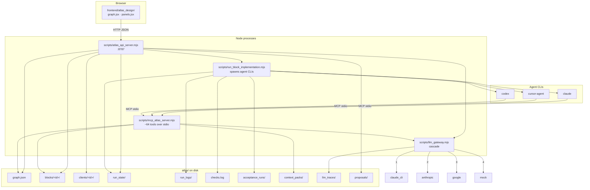
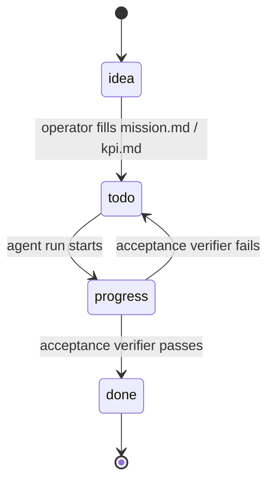
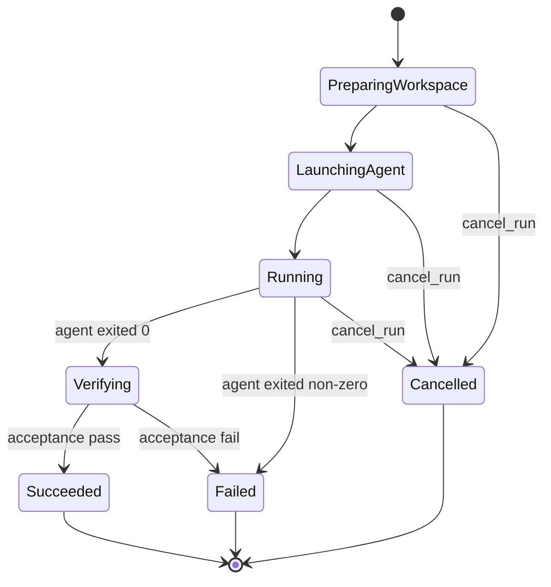

# Sima Atlas — Architecture

## 1. Overview

Sima Atlas is a contract-first visual control plane that sits between human developers and AI coding agents (Claude Code, Cursor, Codex). Every unit of work is a **block** — a directory of plain markdown files (`mission.md`, `kpi.md`, `acceptance.md`, `depends_on.md`, `provides.md`, `tasks.md`) that together form an executable contract. Agents consume these contracts as deterministic context packs; their output is verified against `acceptance.md`; the operator drives the whole loop from a graph UI in the browser.

The problem Sima Atlas solves is **contract drift** — the gap between what code does, what docs claim, and what an agent thinks it is supposed to build. By forcing every change to flow through a versioned block contract and a verifier, the system keeps code, agents, and documentation in lock-step. The visual layer exists because graphs of dependencies and KPIs are easier for humans to audit than nested folders or chat history.

---

## 2. System diagram



The browser talks **only** to the HTTP API. Agent CLIs talk **only** to the MCP server (stdio). Both backends share the same `atlas/` directory; the LLM gateway is a single funnel for every paid call so traces and cost caps are enforced in one place.

---

## 3. Data layout

The on-disk format is the source of truth. JSON and markdown only — no DB.

```text
atlas/
├── graph.json                       # root client graph: nodes (meta-blocks: ui-control, core-sync, …), edges, statuses
├── project.md                       # one-paragraph product brief
├── rules.md                         # operator-pinned coding rules
├── tech_stack.md                    # current stack inventory
├── blocks/<id>/                     # per-block contract dir — the unit of work
│   ├── mission.md                   #   why this block exists
│   ├── kpi.md                       #   measurable success criteria
│   ├── acceptance.md                #   YAML-front-matter assertions the verifier evaluates
│   ├── depends_on.md                #   upstream block ids
│   ├── provides.md                  #   downstream contracts
│   ├── tasks.md                     #   ordered subtasks
│   ├── files.md                     #   files this block owns (alive / dead)
│   ├── code_summary.md              #   LLM-generated code map
│   ├── checks.log                   #   append-only log of every validator/agent action
│   └── history/                     #   snapshots before destructive edits
├── clients/<id>/                    # separate product graphs — multi-tenant via ?client=<id>
│   └── (same shape as the root: graph.json + blocks/ + proposals/)
├── run_state/<run_id>.json          # agent run FSM state (one JSON per run)
├── run_logs/<run_id>.jsonl          # captured agent stdout/stderr, line-by-line
├── acceptance_runs/<block_id>/<ts>.json   # verifier output: per-assertion verdicts
├── context_packs/<block_id>.json    # pre-built deterministic LLM input for that block
├── llm_traces/                      # every LLM call: prompt, response, provider, cost
├── proposals/                       # pending UI proposals — Sima fill-from-chat plans, agent-run diffs
├── operator_profile/                # learned operator preferences + lessons
└── nightly_report.md                # output of nightly_consolidation
```

A block is fully described by the files in its directory. Anything not in `blocks/<id>/` is either runtime data (logs, traces, run state) or cross-cutting metadata (graph, profile, proposals).

---

## 4. Block lifecycle

Each block walks a status machine driven by operator decisions plus verifier verdicts. The states live in `graph.json`; transitions are logged to `checks.log`.



`idea` is the rough placeholder created from a chat (`sima_fill_from_chat`). `todo` means the contract is written but no agent has touched it yet. `progress` is held while a run is alive in `run_state/`. The verifier (`verify_block_acceptance`) decides whether the block ends in `done` or bounces back to `todo` with a fresh failure record in `acceptance_runs/`.

---

## 5. Run FSM

Per-run state lives in `atlas/run_state/<run_id>.json` and is mutated by `scripts/atlas_runs_api.mjs` plus `scripts/run_block_implementation.mjs` (via `fsm()` calls).



`Verifying` runs the acceptance verifier inside the workspace before any diff is offered to the operator — so a failing assertion blocks the diff proposal from ever appearing in the UI. Stalled runs (no events for `max_idle_ms`) are flipped to a terminal `Stalled` by `detect_stalled_runs`.

---

## 6. HTTP API surface

All routes are plain JSON over HTTP, served by `scripts/atlas_api_server.mjs` on `:8787`. The server delegates to focused modules.

### Atlas state & graph

| Route | Description | Backend |
|---|---|---|
| `GET /atlas/state` | Hash + summary of the atlas snapshot driving the UI; used for live-reload | `atlas_api_server.mjs` |
| `GET /atlas/design-payload?client=<id>` | SIMA_DATA payload for a specific client graph | `build_sima_design_payload.mjs` |
| `POST /atlas/meta/save` | Persist project.md / rules.md / tech_stack.md | `atlas_api_server.mjs` |
| `POST /atlas/blocks/create` `/patch` `/delete` | CRUD on blocks within the active client | `atlas_blocks_api.mjs` |
| `POST /atlas/edges/add` `/delete` | CRUD on graph edges | `atlas_blocks_api.mjs` |
| `POST /atlas/clients/create` `/reset` `GET /atlas/clients/list` | Multi-tenant client lifecycle | `atlas_api_server.mjs` |
| `POST /atlas/build-context-pack` | Rebuild `context_packs/<block_id>.json` | `build_context_pack.mjs` |
| `POST /atlas/sync-check` | Run all validators (contracts / dependencies / acceptance) | `atlas_api_server.mjs` |

### Agent runs

| Route | Description | Backend |
|---|---|---|
| `POST /runs/start` | Spawn `run_block_implementation.mjs` for a block | `atlas_runs_api.mjs` |
| `POST /runs/cancel` | Flip an active run to `Cancelled` | `atlas_runs_api.mjs` |
| `GET /runs/state` | Read full state of one run | `atlas_runs_api.mjs` |
| `GET /runs/by-block` | All runs for a given block | `atlas_runs_api.mjs` |

### LLM-assisted authoring

| Route | Description | Backend |
|---|---|---|
| `POST /llm/fill-field` | First-pass content for an empty contract field | `atlas_synthesis_api.mjs` |
| `POST /llm/rewrite-field` | Rewrite an existing field (operator-supplied tone) | `atlas_synthesis_api.mjs` |
| `POST /llm/expand-field` | Expand a sparse field into a fuller version | `atlas_synthesis_api.mjs` |
| `POST /llm/decompose-tasks` | Split a mission into ordered tasks | `atlas_synthesis_api.mjs` |
| `POST /llm/architecture-review` | Cross-block architecture critique | `atlas_synthesis_api.mjs` |
| `POST /llm/advice` | Free-form advice on the active selection | `atlas_synthesis_api.mjs` |
| `POST /llm/synthesize-block` | Generate an entire new block contract | `atlas_synthesis_api.mjs` |

### Sima orchestration

| Route | Description | Backend |
|---|---|---|
| `POST /atlas/sima/fill-from-chat` | Take a chat transcript, fill weak fields, propose 1-3 new blocks | `atlas_synthesis_api.mjs` → MCP `sima_fill_from_chat` |
| `POST /atlas/subagents/run` | Run a named subagent (schema-syncer / verifier / wiki-builder) | `atlas_api_server.mjs` |
| `POST /api/intake/extract` | Pull structured intake from a raw paste / voice transcript | `atlas_api_server.mjs` |
| `POST /user-docs/regenerate` | Rebuild end-user tutorials for one or all blocks | `generate_user_docs.mjs` |

The `?client=<id>` query parameter is honoured on every block / edge / run route — when present, the backend rewrites `atlas_root` to `atlas/clients/<id>/`.

---

## 7. MCP tool surface

`scripts/mcp_atlas_server.mjs` exposes ~64 tools over stdio. Coding-agent CLIs connect through their standard MCP config and talk to the same `atlas/` tree the HTTP API serves. The most-used entry points:

- `read_block` — return every markdown file for one block
- `update_block` — atomic update of title / status / depends / provides / tasks / mission
- `verify_block_acceptance` — parse `acceptance.md` and collect evidence per assertion
- `build_context_pack` — assemble the deterministic context pack for a block
- `sima_fill_from_chat` — orchestrate the full fill-from-chat pipeline (used by the UI ✦ button)
- `sima_watch_chats` — sweep `~/.claude/projects/*/` jsonl for new turns and propose updates
- `accept_proposal` / `reject_proposal` — apply or discard a pending proposal in `atlas/proposals/`
- `nightly_consolidation` — run validators + generators, write `nightly_report.md`
- `generate_full_bundle` — rebuild WIKI / auto_tz / roadmap from the canonical graph
- `run_block_implementation` — spawn the configured coding agent for a block

See `scripts/mcp_atlas_server.mjs` for the full list.

---

## 8. Context pack flow

Every agent run starts from a **deterministic context pack** so that swapping Claude for Cursor for Codex changes only the agent, never the input. `scripts/build_context_pack.mjs` reads the block contract plus the closure of `depends_on.md`, snapshots the relevant files referenced in `files.md`, pulls operator profile lessons + `dont_use` bans, and writes `atlas/context_packs/<block_id>.json`. The runner then injects that pack as the agent prompt prefix via `scripts/inject_context_pack.mjs`.

Because the pack is content-hashed and rebuilt only when its inputs change, two runs of the same block on the same atlas snapshot get bit-identical input — which is what makes A/B comparisons across agent CLIs and across LLM providers meaningful.

---

## 9. Multi-tenant model

A single Sima Atlas process can host many product graphs side-by-side. The browser passes `?client=<id>` on every request; the API server resolves `clientRoot = atlas/clients/<id>/` and routes block / edge / run / proposal operations into that subtree instead of the root `atlas/`. The root tree itself is treated as the "meta" client where the platform team plans Sima Atlas's own development.

This is why `atlas/clients/<id>/` mirrors the shape of the root (`graph.json` + `blocks/` + `proposals/`) — every tenant is a self-contained atlas, and the only thing they share is the running Node process, the LLM gateway, and the operator profile.

---

## 10. Where agent CLIs are dispatched

The three-way switch lives in `scripts/run_block_implementation.mjs:211-219`:

```js
if (agent === 'claude') {
  cmd = 'claude';
  args = ['--print', '--add-dir', blockDirRel, '--add-dir', atlasDirRel, ...extraFlags];
} else if (agent === 'codex') {
  cmd = 'codex';
  args = ['exec', '--add-dir', blockDirRel, ...extraFlags];
} else if (agent === 'cursor') {
  cmd = 'cursor-agent';
  args = ['--print', ...extraFlags];
}
```

If the selected CLI is missing from `PATH`, the runner falls back to **print-only mode** (around line 197): it writes the full prompt to `atlas/agent_invocations/`, walks the FSM straight to `Succeeded` with summary `"print-only — operator picks up the prompt"`, and lets the operator paste the prompt into whatever agent they prefer. This keeps the system useful on machines without any vendor CLI installed and makes the agent layer truly pluggable — adding a fourth backend is a fourth `else if`.
