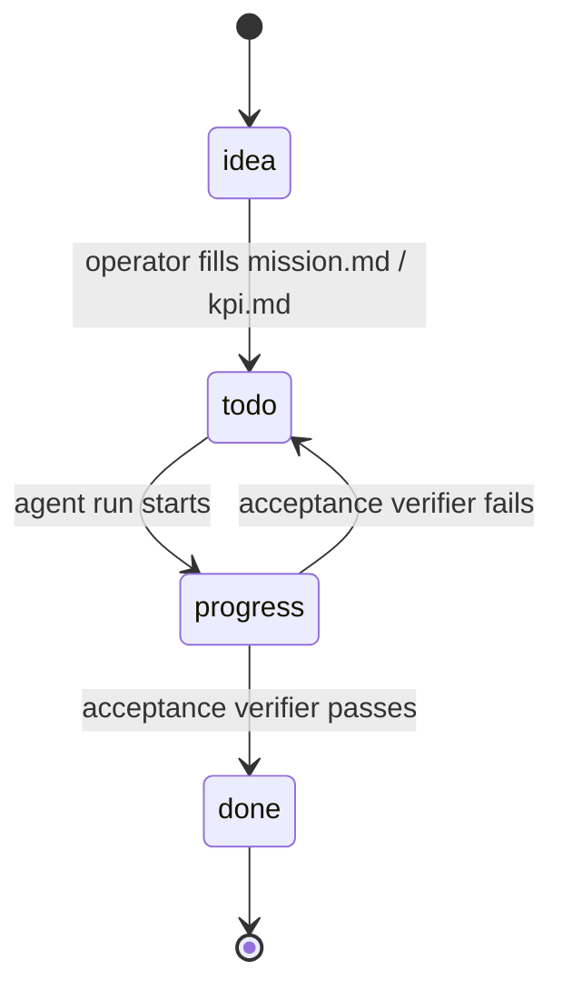
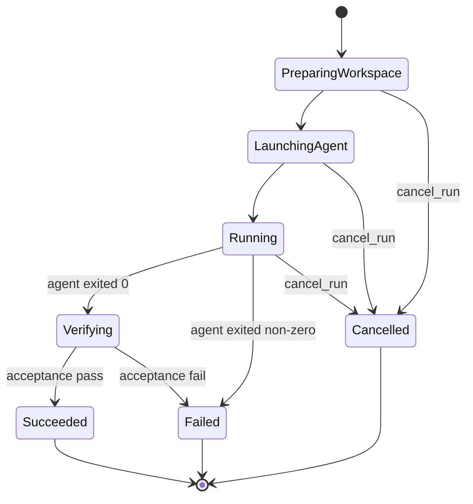

# Sima Atlas — Architecture

## 1. Overview

Sima Atlas is a contract-first visual control plane that sits between human developers and AI coding agents (Claude Code, Cursor, Codex). Every unit of work is a **block** — a directory of plain markdown files (`mission.md`, `kpi.md`, `acceptance.md`, `depends_on.md`, `provides.md`, `tasks.md`) that together form an executable contract. Agents consume these contracts as deterministic context packs; their output is verified against `acceptance.md`; the operator drives the whole loop from a graph UI in the browser.

The problem Sima Atlas solves is **contract drift** — the gap between what code does, what docs claim, and what an agent thinks it is supposed to build. By forcing every change to flow through a versioned block contract and a verifier, the system keeps code, agents, and documentation in lock-step. The visual layer exists because graphs of dependencies and KPIs are easier for humans to audit than nested folders or chat history.

---

## 2. System diagram


The browser talks **only** to the HTTP API. Agent CLIs talk **only** to the MCP server (stdio). Both backends share the same `atlas/` directory; the LLM gateway is a single funnel for every paid call so traces and cost caps are enforced in one place.

---

## 3. Data layout

The on-disk format is the source of truth. JSON and markdown only — no DB.

```text
atlas/
├── graph.json                       # root client graph: nodes (meta-blocks: ui-control, core-sync, …), edges, statuses
├── project.md                       # one-paragraph product brief
├── rules.md                         # operator-pinned coding rules
├── tech_stack.md                    # current stack inventory
├── architecture_decisions.md        # R-7.85 (S-6) — append-only project lock-in, auto-injected into every prompt
├── blocks/<id>/                     # per-block contract dir — the unit of work
│   ├── mission.md                   #   why this block exists
│   ├── kpi.md                       #   measurable success criteria
│   ├── acceptance.md                #   YAML-front-matter assertions the verifier evaluates
│   ├── depends_on.md                #   upstream block ids
│   ├── provides.md                  #   downstream contracts
│   ├── tasks.md                     #   ordered subtasks
│   ├── files.md                     #   files this block owns (alive / dead)
│   ├── code_summary.md              #   LLM-generated code map
│   ├── narrative.md                 #   R-7.76+ — append-only run history, auto-injected into next prompt
│   ├── decisions.log                #   R-7.76+ — structured TSV (timestamp · author · decision)
│   ├── checks.log                   #   append-only log of every validator/agent action
│   └── history/                     #   snapshots before destructive edits
├── clients/<id>/                    # separate product graphs — multi-tenant via ?client=<id>
│   └── (same shape as the root: graph.json + blocks/ + architecture_decisions.md + proposals/)
├── run_state/<run_id>.json          # agent run FSM state (one JSON per run)
├── run_logs/<run_id>.jsonl          # captured agent stdout/stderr, line-by-line
├── acceptance_runs/<block_id>/<ts>.json   # verifier output: per-assertion verdicts
├── context_packs/<block_id>[.<profile>].json  # R-7.86 (S-4) — deterministic LLM input; profile-suffixed for non-default profiles
├── llm_traces/                      # every LLM call: prompt, response, provider, cost (rolled up by token_economics.mjs)
├── proposals/                       # pending UI proposals — Sima fill-from-chat plans, agent-run diffs
├── operator_profile/                # learned operator preferences + lessons (auto-seeded at dev_server startup, R-7.81)
│   ├── lessons.json                 #   accumulated lessons-learned with evidence
│   ├── dont_use.json                #   operator-locked bans, severity:hard|soft (R-7.76+)
│   └── always_use.json              #   operator-locked positives, severity:hard|soft (R-7.76+)
└── nightly_report.md                # output of nightly_consolidation
```

A block is fully described by the files in its directory. Anything not in `blocks/<id>/` is either runtime data (logs, traces, run state) or cross-cutting metadata (graph, profile, proposals).

---

## 4. Block lifecycle

Each block walks a status machine driven by operator decisions plus verifier verdicts. The states live in `graph.json`; transitions are logged to `checks.log`.



`idea` is the rough placeholder created from a chat (`sima_fill_from_chat`). `todo` means the contract is written but no agent has touched it yet. `progress` is held while a run is alive in `run_state/`. The verifier (`verify_block_acceptance`) decides whether the block ends in `done` or bounces back to `todo` with a fresh failure record in `acceptance_runs/`.

---

## 5. Run FSM

Per-run state lives in `atlas/run_state/<run_id>.json` and is mutated by `scripts/atlas_runs_api.mjs` plus `scripts/run_block_implementation.mjs` (via `fsm()` calls).



`Verifying` runs the acceptance verifier inside the workspace before any diff is offered to the operator — so a failing assertion blocks the diff proposal from ever appearing in the UI. Stalled runs (no events for `max_idle_ms`) are flipped to a terminal `Stalled` by `detect_stalled_runs`.

---

## 6. HTTP API surface

All routes are plain JSON over HTTP, served by `scripts/atlas_api_server.mjs` on `:8787`. The server delegates to focused modules.

### Atlas state & graph

| Route | Description | Backend |
|---|---|---|
| `GET /atlas/state` | Hash + summary of the atlas snapshot driving the UI; used for live-reload | `atlas_api_server.mjs` |
| `GET /atlas/design-payload?client=<id>` | SIMA_DATA payload for a specific client graph | `build_sima_design_payload.mjs` |
| `POST /atlas/meta/save` | Persist project.md / rules.md / tech_stack.md | `atlas_api_server.mjs` |
| `POST /atlas/blocks/create` `/patch` `/delete` | CRUD on blocks within the active client | `atlas_blocks_api.mjs` |
| `POST /atlas/edges/add` `/delete` | CRUD on graph edges | `atlas_blocks_api.mjs` |
| `POST /atlas/clients/create` `/reset` `GET /atlas/clients/list` | Multi-tenant client lifecycle | `atlas_api_server.mjs` |
| `POST /atlas/build-context-pack` | Rebuild `context_packs/<block_id>.json` (or `.<profile>.json` for non-default profiles, R-7.86) | `build_context_pack.mjs` |
| `POST /atlas/sync-check` | Run all validators (contracts / dependencies / acceptance) | `atlas_api_server.mjs` |
| `GET /atlas/token-economics?days=&block=` | R-7.87 (S-9) — token-spend roll-up over `llm_traces/`. Returns `{totals, top_blocks, top_ops, by_provider, daily}` with `cost_usd_actual` + `cost_usd_equivalent` (Anthropic Haiku 4.5 shadow bill). | `token_economics.mjs` |
| `POST /atlas/architecture-decisions/add` | R-7.85 (S-6) — append a project-level architectural decision. Append-only — no edit/delete API by design. | `architecture_decisions_api.mjs` |
| `GET /atlas/blocks/<id>/file?name=narrative.md` | Read `narrative.md` (R-7.76+ — also: decisions.log, dont_use.json, always_use.json) for Memory tab + Implementation Status panel. Whitelist enforced server-side. | `atlas_api_server.mjs` |

### Agent runs

| Route | Description | Backend |
|---|---|---|
| `POST /runs/start` | Spawn `run_block_implementation.mjs` for a block | `atlas_runs_api.mjs` |
| `POST /runs/cancel` | Flip an active run to `Cancelled` | `atlas_runs_api.mjs` |
| `GET /runs/state` | Read full state of one run | `atlas_runs_api.mjs` |
| `GET /runs/by-block` | All runs for a given block | `atlas_runs_api.mjs` |

### LLM-assisted authoring

| Route | Description | Backend |
|---|---|---|
| `POST /llm/fill-field` | First-pass content for an empty contract field | `atlas_synthesis_api.mjs` |
| `POST /llm/rewrite-field` | Rewrite an existing field (operator-supplied tone) | `atlas_synthesis_api.mjs` |
| `POST /llm/expand-field` | Expand a sparse field into a fuller version | `atlas_synthesis_api.mjs` |
| `POST /llm/decompose-tasks` | Split a mission into ordered tasks | `atlas_synthesis_api.mjs` |
| `POST /llm/architecture-review` | Cross-block architecture critique | `atlas_synthesis_api.mjs` |
| `POST /llm/advice` | Free-form advice on the active selection | `atlas_synthesis_api.mjs` |
| `POST /llm/synthesize-block` | Generate an entire new block contract | `atlas_synthesis_api.mjs` |

### Sima orchestration

| Route | Description | Backend |
|---|---|---|
| `POST /atlas/sima/fill-from-chat` | Take a chat transcript, fill weak fields, propose 1-3 new blocks | `atlas_synthesis_api.mjs` → MCP `sima_fill_from_chat` |
| `POST /atlas/subagents/run` | Run a named subagent (schema-syncer / verifier / wiki-builder) | `atlas_api_server.mjs` |
| `POST /api/intake/extract` | Pull structured intake from a raw paste / voice transcript | `atlas_api_server.mjs` |
| `POST /user-docs/regenerate` | Rebuild end-user tutorials for one or all blocks | `generate_user_docs.mjs` |

The `?client=<id>` query parameter is honoured on every block / edge / run route — when present, the backend rewrites `atlas_root` to `atlas/clients/<id>/`.

---

## 7. MCP tool surface

`scripts/mcp_atlas_server.mjs` exposes ~70 tools over stdio. Coding-agent CLIs connect through their standard MCP config and talk to the same `atlas/` tree the HTTP API serves. The most-used entry points:

**Contracts**
- `read_block` — return every markdown file for one block
- `update_block` — atomic update of title / status / depends / provides / tasks / mission
- `list_dependencies` — single-hop graph walk

**Verification & breakage detection**
- `verify_block_acceptance` — parse `acceptance.md` and collect evidence per assertion
- `cascade_verify` — R-7.84 (S-8): after editing block X, re-run verifier on every block whose `depends_on` references X. Auto-flags broken dependents `status: desync`.
- `judge_assertion` — LLM-judge fallback for an individual assertion
- `read_acceptance_run` / `list_failed_acceptances` — read latest verifier output

**Context-pack & lock-in**
- `build_context_pack {block_id, profile?}` — R-7.86 (S-4): assemble the context pack with one of `design` / `backend-fix` / `ui-fix` / `acceptance-only` profiles. Architecture decisions always included.
- `add_architecture_decision` / `list_architecture_decisions` — R-7.85 (S-6): append-only project lock-in
- `add_lesson` / `set_dont_use` / `set_always_use` — operator-locked memory; respected by `build_context_pack` AND scanned post-run by `scan_run_for_drift.mjs`

**Token economics**
- `token_economics {days?, block?}` — R-7.87 (S-9): aggregate `llm_traces` into `{totals, top_blocks, top_ops, by_provider, daily}` with `cost_usd_actual` + `cost_usd_equivalent` (Anthropic Haiku 4.5 shadow bill)

**Orchestration & ingestion**
- `sima_fill_from_chat` — orchestrate the full fill-from-chat pipeline (used by the UI ✦ button)
- `sima_watch_chats` — sweep `~/.claude/projects/*/` jsonl for new turns and propose updates
- `accept_proposal` / `reject_proposal` — apply or discard a pending proposal in `atlas/proposals/`
- `run_block_implementation` — spawn the configured coding agent for a block

**Sweeps**
- `nightly_consolidation` — run validators + generators, write `nightly_report.md`
- `generate_full_bundle` — rebuild WIKI / auto_tz / roadmap from the canonical graph
- `sync_check` — drift report (orphan provides, dangling deps)

See `scripts/mcp_atlas_server.mjs` for the full list, and `docs/agent-navigation.md` for the canonical tool table with selection guidance.

---

## 8. Context pack flow

Every agent run starts from a **deterministic context pack** so that swapping Claude for Cursor for Codex changes only the agent, never the input. `scripts/build_context_pack.mjs` reads the block contract plus the closure of `depends_on.md`, snapshots the relevant files referenced in `files.md`, pulls operator profile lessons + `dont_use` bans + `architecture_decisions.md`, and writes `atlas/context_packs/<block_id>.json` (or `<block_id>.<profile>.json` for non-default profiles).

### Profiles (R-7.86, S-4)

One-size-fits-all packs wasted budget on UI fixes that don't need backend deps. Profiles cut waste; precision becomes the goal, size the derivative.

| profile | tokens (typical) | what's in |
|---|---|---|
| `design` *(default)* | ~5–15K | full pack — for new-block scoping & major refactors |
| `backend-fix` | ~2–4K | mission + acceptance + decisions + narrative + deps' provides only (no patterns, no kpi) |
| `ui-fix` | ~1.5–3K | frontend-focused — deps skipped entirely |
| `acceptance-only` | ~0.5–1.5K | verifier or "is this ready to ship" runs |

`architecture_decisions.md` is **always** included regardless of profile (S-6 lock-in must reach every prompt).

Profile selection: CLI flag `--profile`, env var `ATLAS_PACK_PROFILE`, or MCP arg `{profile}`.

Because the pack is content-hashed and rebuilt only when its inputs change, two runs of the same block on the same atlas snapshot get bit-identical input — which is what makes A/B comparisons across agent CLIs and across LLM providers meaningful.

---

## 9. Multi-tenant model

A single Sima Atlas process can host many product graphs side-by-side. The browser passes `?client=<id>` on every request; the API server resolves `clientRoot = atlas/clients/<id>/` and routes block / edge / run / proposal operations into that subtree instead of the root `atlas/`. The root tree itself is treated as the "meta" client where the platform team plans Sima Atlas's own development.

This is why `atlas/clients/<id>/` mirrors the shape of the root (`graph.json` + `blocks/` + `proposals/`) — every tenant is a self-contained atlas, and the only thing they share is the running Node process, the LLM gateway, and the operator profile.

---

## 10. Where agent CLIs are dispatched

The three-way switch lives in `scripts/run_block_implementation.mjs:211-219`:

```js
if (agent === 'claude') {
  cmd = 'claude';
  args = ['--print', '--add-dir', blockDirRel, '--add-dir', atlasDirRel, ...extraFlags];
} else if (agent === 'codex') {
  cmd = 'codex';
  args = ['exec', '--add-dir', blockDirRel, ...extraFlags];
} else if (agent === 'cursor') {
  cmd = 'cursor-agent';
  args = ['--print', ...extraFlags];
}
```

If the selected CLI is missing from `PATH`, the runner falls back to **print-only mode** (around line 197): it writes the full prompt to `atlas/agent_invocations/`, walks the FSM straight to `Succeeded` with summary `"print-only — operator picks up the prompt"`, and lets the operator paste the prompt into whatever agent they prefer. This keeps the system useful on machines without any vendor CLI installed and makes the agent layer truly pluggable — adding a fourth backend is a fourth `else if`.

---

## 11. Per-block memory layer (R-7.76 → R-7.81)

**Operator pain.** «Я говорю агенту что-то один раз, через сессию забывает.» Architectural intent and lessons-learned evaporated between conversations because there was no place to lock them.

**Files written by every successful run** (`scripts/run_block_implementation.mjs`):

| File | Format | Written by |
|---|---|---|
| `blocks/<id>/narrative.md` | Append-only Markdown. Sections per run: «### What I tried», «### What worked», «### What failed and why», «### Decisions made». | Agent during the run, using template injected into the prompt |
| `blocks/<id>/decisions.log` | Append-only TSV: `timestamp\tauthor\tdecision`. | Agent + automation (e.g. `cascade_verify` writes its findings) |
| `operator_profile/lessons.json` | `{lessons: [{id, lesson, evidence: [...], expires_at}]}`. | `add_lesson` MCP tool / `aggregate_operator_profile.mjs` |
| `operator_profile/dont_use.json` | `{entries: [{rule, reason, severity: 'hard'|'soft', block_id?}]}`. Hard rules **fail the run** when violated. | `set_dont_use` MCP tool |
| `operator_profile/always_use.json` | Same shape as `dont_use`, positive direction. | `set_always_use` MCP tool |

**Auto-injection.** `scripts/run_block_implementation.mjs` reads all of the above (filtered to the current block where applicable) and injects a «## ⚠ Block memory» section into the agent prompt — NEVER do / ALWAYS do / Past decisions / Lessons / Run history / Code summary / Recent run log. Plus a «How to update memory» template so the agent knows the contract for writing back.

**Auto-seed.** `scripts/dev_server.mjs` ensures the operator-profile JSONs and `architecture_decisions.md` exist on first launch (idempotent — only logs when newly created). New contributors hit zero manual setup.

---

## 12. Drift & cascade verification (R-7.82 / R-7.84)

**Two layers, both post-execution but at different boundaries.**

### Runtime content drift scanner — S-3 (`scripts/scan_run_for_drift.mjs`)

Runs after every agent execution. Reads `dont_use.json` (filtered to this block + global), enumerates files modified after run start, and grep-scans them for forbidden patterns.

- `severity: hard` — exit 1 → run state flips to `Failed`, verifier verdict overridden.
- `severity: soft` — log to `checks.log` + `narrative.md` entry, run continues.

This was the first defense layer that explicitly checked **what the agent actually wrote**, not just what the verifier reported.

### Cross-block break detection — S-8 (`scripts/cascade_verify.mjs`)

Runs after every successful agent run on block X. Walks `graph.json` reverse-deps (every block whose `depends_on` references X) and re-runs `verify_block_acceptance` on each.

For every dependent that fails:
- `graph.json`: `status: 'desync'`, `status_reason: 'cascade: parent X edit'`
- `blocks/<dependent>/checks.log`: append entry
- `blocks/<dependent>/narrative.md`: structured «### What failed and why» + «### Recommended action» entry

Operator sees the break inline on the canvas the moment the parent edit completes — not at the next nightly sweep.

---

## 13. Architecture decisions store (R-7.85, S-6)

**Operator pain.** «Я сказал агенту использовать LLM для sentiment analysis. Он написал regex. В следующей сессии вообще забыл указание.» — architectural intent leaks because there's no project-level place to lock it.

**Implementation.** `scripts/architecture_decisions_api.mjs` writes to `atlas/architecture_decisions.md` (or `atlas/clients/<id>/architecture_decisions.md`). API surface:

- `ensureArchitectureDecisionsFile({clientId})` — idempotent seed
- `addArchitectureDecision({clientId, decision, rationale, affects, reversible, ts})` — atomic tmp+rename. **No edit/delete API by design** — surface change requests through `narrative.md` instead.
- `listArchitectureDecisions({clientId})` — list current entries

The file is **always** included in every context-pack profile (S-4 lock-in must reach every prompt) and surfaced in the agent prompt under «## ⚖ Architecture decisions (project-level, append-only — DO NOT silently reverse)». Agents physically cannot silently reverse a past entry.

MCP tools: `add_architecture_decision`, `list_architecture_decisions`. HTTP: `POST /atlas/architecture-decisions/add`. CLI: `node scripts/architecture_decisions_api.mjs {ensure|add|list}`.

---

## 14. Token economics (R-7.87, S-9)

**Operator pain.** «Я гоняю агентов часами и не вижу куда уходят токены.» Per-call traces existed (`atlas/llm_traces/*.json`) but no roll-up was visualised.

**Aggregator** (`scripts/token_economics.mjs` — pure read, no side effects):

```js
import { aggregateTokenEconomics } from './scripts/token_economics.mjs';

aggregateTokenEconomics({ days: 30, blockFilter: 'b.docs', root: process.cwd() });
// → { totals, top_blocks, top_ops, by_provider, daily }
```

**Two cost dimensions:**

| dimension | meaning |
|---|---|
| `cost_usd_actual` | What was actually charged. `claude_cli` / `ollama` / `mock` = 0. |
| `cost_usd_equivalent` | What it WOULD cost on Anthropic Haiku 4.5 list price ($1/Mtok in, $5/Mtok out). Stable across providers — the **shadow bill** that's visible even when running on subscription. |

**Per-block attribution** via `run_state` time-window match — best-effort. Traces outside any window stay block-less and roll up only into totals; widget falls back to project-wide view when block has no recorded runs yet.

Surfaces:
- HTTP: `GET /atlas/token-economics?days=&block=`
- MCP: `token_economics {days?, block?}`
- UI: Token Spend widget in Overview tab (per-block) — totals + top-3 ops + by-provider mini-table + day-window selector (7/30/90)
- CLI: `node scripts/token_economics.mjs --days 30` (also `--block <id>`, `--json`)

---

## 15. Implementation Status panel (R-7.86)

**Operator pain.** «Я заполнил блок или только mission? Надо тыкать пять вкладок чтобы понять.»

Overview tab opens with an 8-row dashboard built client-side from the same `meta.blockFile` reads it already does (`mission.md`, `kpi.md`, `acceptance.md`, `tasks.md`, `narrative.md`, `decisions.log`):

| Row | Source | Marker logic |
|---|---|---|
| Mission | `mission.md` | `good` if non-placeholder, `empty` otherwise |
| KPIs | `kpi.md` | `good` if any rows defined, `empty` otherwise |
| Acceptance | `acceptance.md` | `good` if all checked, `warn` if partial, `empty` if none |
| Tasks | `tasks.md` | `good` if all checked, `warn` if partial, `empty` if none |
| Files alive | `block.contract.filled` count | `good` if > 0, `empty` otherwise |
| Decisions logged | `decisions.log` line count | `good` if > 0, `empty` otherwise |
| Run history | `narrative.md` `## ` heading count | `good` if > 0, `empty` otherwise |
| Block status | `block.status` | `good` if `done`, `bad` if `desync`/`fail`, `warn` otherwise |

The point isn't depth — it's that contract-vs-reality progress is visible **at a glance** without clicking through tabs. The drilldown into details still happens in Contract / Acceptance / Memory tabs.
